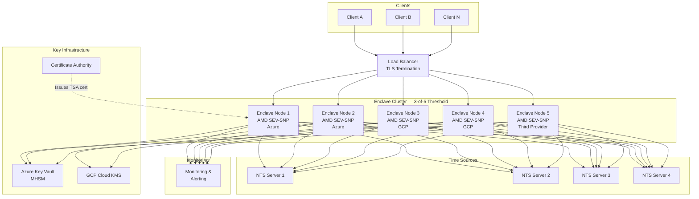

# Confidential Computing Timestamp Authority (CC-TSA)

A **quantum-safe, hardware-attested Timestamp Authority** built on distributed cryptographic proof. Every timestamp token is signed inside AMD SEV-SNP confidential VMs using threshold cryptography — the signing key never exists in any single location, the clock is hardware-protected, and the output is a standard RFC 3161 token with hybrid classical + post-quantum signatures.

## Why Replace Traditional TSAs?

Traditional Timestamp Authorities (RFC 3161) protect their signing keys and clocks using **certified HSMs** — for example, DigiStamp runs its entire timestamping function inside a FIPS 140-2 Level 4 IBM 4767 coprocessor, where the private key is generated in no-export mode, the clock is hardware-protected with drift adjustments limited to 120 seconds per 24-hour period, and any physical tampering destroys the key material. These are genuine hardware protections, not merely organizational policies.

CC-TSA takes a different architectural approach — replacing a single trusted HSM with **distributed cryptographic attestation** and **threshold signing across multiple independent enclaves**:

| Property | Traditional HSM-based TSA | CC-TSA |
|---|---|---|
| **Trust model** | Hardware (certified HSM) + organizational (audits, ceremonies) | Cryptographic (hardware attestation, threshold crypto) |
| **Key protection** | HSM with no-export keys; tamper-response destroys key material | 3-of-5 threshold shares, each in a separate enclave — key never reconstructed |
| **Clock integrity** | HSM-internal clock with hardware-enforced adjustment limits and cryptographic audit log | AMD SecureTSC + NTS-authenticated NTP + cross-node validation |
| **Quantum readiness** | None (RSA/ECDSA only) | Hybrid ML-DSA-65 + ECDSA P-384, backward compatible |
| **Failure tolerance** | Single HSM = SPOF | 3-of-5 threshold; survives 2 simultaneous node failures |
| **Verifiability** | Trust the HSM certification and audit report | Verify the attestation report yourself |
| **Multi-cloud** | Single datacenter | Nodes across Azure + GCP + third provider |

## System Architecture

## Key Properties

- **Threshold signing**: 3-of-5 ML-DSA-65 threshold scheme — any 3 enclave nodes can sign, but no 2 (or fewer) can
- **Trusted time**: AMD SecureTSC provides hardware-protected TSC, calibrated by the AMD Secure Processor and validated across nodes via TriHaRd protocol (<50μs drift tolerance)
- **Hybrid signatures**: Each token carries both ECDSA P-384 and ML-DSA-65 signatures — classical verifiers work today, quantum-safe verifiers are future-ready
- **Multi-cloud**: Nodes distributed so no single cloud provider hosts ≥3 (the threshold), eliminating single-provider compromise risk
- **Standard output**: RFC 3161-compliant timestamp tokens; drop-in replacement for existing TSA infrastructure

## Document Map

| Document | Description | Audience |
|---|---|---|
| [`docs/01-architecture-overview.md`](docs/01-architecture-overview.md) | System architecture, components, deployment topology | Architects, Engineers |
| [`docs/02-confidential-computing-and-time.md`](docs/02-confidential-computing-and-time.md) | AMD SEV-SNP, Intel TDX, SecureTSC, trusted time | Security Engineers, Architects |
| [`docs/03-quantum-safe-threshold-crypto.md`](docs/03-quantum-safe-threshold-crypto.md) | ML-DSA-65 threshold signing, DKG, key lifecycle | Cryptographers, Security Engineers |
| [`docs/04-failure-modes-and-recovery.md`](docs/04-failure-modes-and-recovery.md) | Failure scenarios, recovery procedures, resilience | Operations, SRE, Architects |
| [`docs/05-operations-and-deployment.md`](docs/05-operations-and-deployment.md) | Deployment guide, monitoring, incident response | Operations, SRE |
| [`docs/06-rfc3161-compliance.md`](docs/06-rfc3161-compliance.md) | RFC 3161 token format, hybrid signatures, compatibility | Protocol Engineers, Integrators |
| [`docs/07-threat-model.md`](docs/07-threat-model.md) | Threat model, STRIDE analysis, residual risks | Security Engineers, Auditors |

## Quick Answers

| Question | Answer |
|---|---|
| How many nodes needed to sign? | **Minimum 3** of 5 (threshold). Recommend **4+ online** for fault tolerance. |
| What if all nodes go offline? | Signing halts. Key shares survive in KMS-backed sealed storage. Boot → attest → unseal → resume in **5–15 minutes**. See [Failure Modes](docs/04-failure-modes-and-recovery.md). |
| Can the private key be lost? | **Not in normal operation** — KMS-backed persistence survives restarts. Only if ≥3 sealed shares are *permanently destroyed*, requiring new DKG + new certificate. Old timestamps remain valid. |
| Multi-cloud support? | Yes. Distribute nodes so no provider hosts ≥3 (e.g., 2 Azure + 2 GCP + 1 third provider). See [Architecture](docs/01-architecture-overview.md). |
| Quantum safe? | Hybrid ML-DSA-65 + ECDSA P-384. Classical verifiers work today; PQC verifiers ready when needed. Conservative SLH-DSA-128f backup available. |

## License

TBD
