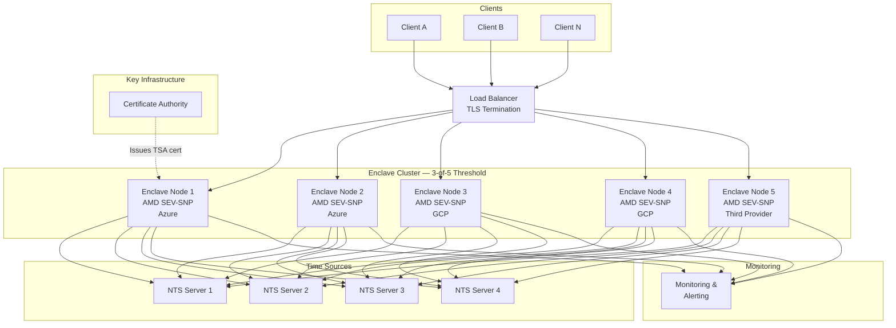

# Confidential Computing Timestamp Authority (CC-TSA)

A **quantum-safe, hardware-attested Timestamp Authority** built on distributed cryptographic proof.
Every timestamp token is signed inside AMD SEV-SNP confidential VMs using threshold cryptography —
the signing key never exists in any single location, the clock is hardware-protected,
and the output is a standard RFC 3161 token with hybrid classical + post-quantum signatures.

## Project Status

Current stage: **Proof of Concept**

The PoC demonstrates the core two-layer architecture running on real AMD SEV-SNP hardware:

| Component | Status |
|---|---|
| CVM core (signing oracle, ~670 LOC Rust) | Implemented — ECDSA P-384 single-signer, TSTInfo/signedAttrs construction, binary vsock protocol |
| Wrapper (RFC 3161 HTTP server, CMS assembly) | Implemented — request parsing, CMS SignedData assembly, TimeStampResp construction |
| Azure Confidential VM deployment | Working — Terraform IaC provisions SEV-SNP VM, CI deploys and validates end-to-end |
| Hardware attestation validation | Working — vTPM, SEV-SNP memory encryption, VCEK certificate retrieval verified in CI |
| CI pipeline | Working — fmt, clippy, 67 unit/integration tests, Docker build, Azure deploy with RFC 3161 validation |
| Threshold signing (3-of-5 ML-DSA-65) | Designed, not yet implemented (single-signer ECDSA P-384 MVP) |
| Multi-cloud deployment (Azure + GCP + third) | Designed, not yet implemented (single Azure CVM) |
| NTS time validation / TriHaRd consensus | Designed, not yet implemented (time stubs in CVM core) |
| Hybrid quantum-safe signatures (ML-DSA-65 + ECDSA) | Designed, not yet implemented (ECDSA P-384 only) |
| DKG ceremony | Designed, not yet implemented |

The [design documents](#document-map) describe the full production architecture. They are forward-looking specifications — see each document's implementation status note for what is currently built.

## Why Replace Traditional TSAs?

Traditional Timestamp Authorities (RFC 3161) protect their signing keys and clocks using **certified HSMs** —
for example, DigiStamp runs its entire timestamping function inside a FIPS 140-2 Level 4 IBM 4767 coprocessor,
where the private key is generated in no-export mode, the clock is hardware-protected with drift adjustments
limited to 120 seconds per 24-hour period, and any physical tampering destroys the key material.
These are genuine hardware protections, not merely organizational policies.

CC-TSA takes a different architectural approach — replacing a single trusted HSM with **distributed cryptographic attestation** and **threshold signing across multiple independent enclaves**:

| Property | Traditional HSM-based TSA | CC-TSA |
|---|---|---|
| **Trust model** | Hardware (certified HSM) + organizational (audits, ceremonies) | Cryptographic (hardware attestation, threshold crypto) |
| **Key protection** | HSM with no-export keys; tamper-response destroys key material | 3-of-5 threshold shares, each in a separate enclave — key never reconstructed. Keys are ephemeral (memory-only) and attestation measurement is bound to the certificate |
| **Clock integrity** | HSM-internal clock with hardware-enforced adjustment limits and cryptographic audit log | AMD SecureTSC + NTS-authenticated NTP + cross-node validation |
| **Quantum readiness** | None (RSA/ECDSA only) | Hybrid ML-DSA-65 + ECDSA P-384, backward compatible |
| **Failure tolerance** | Single HSM = SPOF | 3-of-5 threshold; survives 2 simultaneous node failures |
| **Verifiability** | Trust the HSM certification and audit report | Verify the attestation report yourself |
| **Multi-cloud** | Single datacenter | Nodes across Azure + GCP + third provider |

## System Architecture



## Key Properties

- **Threshold signing**: 3-of-5 ML-DSA-65 threshold scheme — any 3 enclave nodes can sign, but no 2 (or fewer) can
- **Trusted time**: AMD SecureTSC provides hardware-protected TSC, calibrated by the AMD Secure Processor and validated across nodes via TriHaRd protocol
- **Hybrid signatures**: Each token carries both ECDSA P-384 and ML-DSA-65 signatures — classical verifiers work today, quantum-safe verifiers are future-ready
- **Multi-cloud**: Nodes distributed so no single cloud provider hosts ≥3 (the threshold), eliminating single-provider compromise risk
- **Standard output**: RFC 3161-compliant timestamp tokens; drop-in replacement for existing TSA infrastructure

## Code Structure

CC-TSA uses a **two-layer architecture** that splits the system into an immutable signing oracle (CVM core) and an updatable protocol layer (wrapper):

```
├── cvm/                        # CVM Core — runs inside AMD SEV-SNP confidential VM
│   └── src/
│       ├── main.rs             # State machine (Booting → TimeSync → Ready → Signing)
│       ├── protocol.rs         # Binary vsock protocol parser/serializer
│       ├── tstinfo.rs          # TSTInfo DER encoder (RFC 3161)
│       ├── signed_attrs.rs     # CMS signedAttrs construction
│       ├── time.rs             # SecureTSC reader, NTS stubs, monotonic enforcement
│       ├── signing.rs          # ECDSA P-384 signing
│       └── attestation.rs      # AMD SEV-SNP attestation report generation
├── wrapper/                    # Wrapper — runs outside CVM, updatable without key rotation
│   └── src/
│       ├── main.rs             # HTTP server, RFC 3161 endpoint
│       ├── rfc3161.rs          # TimeStampReq parsing and validation
│       ├── cms.rs              # CMS SignedData assembly from CVM response
│       ├── response.rs         # TimeStampResp construction
│       ├── vsock_client.rs     # CVM communication via vsock
│       └── config.rs           # Certificate and environment configuration
├── infra/                      # Terraform IaC for Azure Confidential VM deployment
│   ├── main.tf, vm.tf, ...     # SEV-SNP VM provisioning
│   └── scripts/
│       ├── deploy-tsa.sh       # Binary deployment and readiness polling
│       └── test-tsa-application.sh  # E2E validation (health, RFC 3161, attestation)
├── Dockerfile                  # Multi-stage build: Rust compilation → minimal runtime
└── docs/                       # Design documents (see Document Map below)
```

The CVM core communicates with the wrapper over a binary vsock protocol (AF_VSOCK, port 5000).
No ASN.1 parsing occurs inside the CVM — the wrapper handles all protocol complexity.
See [`docs/09-enclave-interface.md`](docs/09-enclave-interface.md) for the full specification.

## Building and Testing

**Prerequisites**: Rust toolchain (1.70+)

```bash
# Build both crates
cargo build --workspace

# Run all tests (48 cvm-core + 19 tsa-wrapper)
cargo test --workspace

# Check formatting and lints
cargo fmt --check
cargo clippy -- -D warnings
```

**Docker build**:

```bash
docker build -t cc-tsa .
```

**Development environment**: Open in a [devcontainer](https://containers.dev/) — the `.devcontainer/` configuration includes the Rust toolchain and git hooks.

## Document Map

| Document | Description | Audience |
|---|---|---|
| [`docs/01-architecture-overview.md`](docs/01-architecture-overview.md) | System architecture, components, deployment topology | Architects, Engineers |
| [`docs/02-confidential-computing-and-time.md`](docs/02-confidential-computing-and-time.md) | AMD SEV-SNP, Intel TDX, SecureTSC, trusted time | Security Engineers, Architects |
| [`docs/03-quantum-safe-threshold-crypto.md`](docs/03-quantum-safe-threshold-crypto.md) | ML-DSA-65 threshold signing, DKG, key lifecycle | Cryptographers, Security Engineers |
| [`docs/04-failure-modes-and-recovery.md`](docs/04-failure-modes-and-recovery.md) | Failure scenarios, recovery procedures, resilience | Operations, SRE, Architects |
| [`docs/05-operations-and-deployment.md`](docs/05-operations-and-deployment.md) | Deployment guide, monitoring, incident response | Operations, SRE |
| [`docs/06-rfc3161-compliance.md`](docs/06-rfc3161-compliance.md) | RFC 3161 token format, hybrid signatures, compatibility | Protocol Engineers, Integrators |
| [`docs/07-threat-model.md`](docs/07-threat-model.md) | Threat model, STRIDE analysis, residual risks | Security Engineers, Auditors |
| [`docs/08-throughput-and-scaling.md`](docs/08-throughput-and-scaling.md) | Throughput analysis, scaling strategy, cost estimates | Architects, Product Managers |
| [`docs/09-enclave-interface.md`](docs/09-enclave-interface.md) | Binary vsock protocol, CVM state machine, testing strategy | Engineers, Security Reviewers |
| [`docs/10-platform-integrity-and-compliance.md`](docs/10-platform-integrity-and-compliance.md) | Platform integrity, FIPS 140-3, third-party attestation, audit key | Security Auditors, Compliance Officers |

## Quick Answers

| Question | Answer |
|---|---|
| How many nodes needed to sign? | **Minimum 3** of 5 (threshold). Recommend **4+ online** for fault tolerance. |
| What if all nodes go offline? | Signing halts. Key shares exist only in enclave memory — if all nodes go offline, the key is lost. A new DKG ceremony + new certificate is required to resume signing. Old timestamps remain valid. See [Failure Modes](docs/04-failure-modes-and-recovery.md). |
| Can the private key be lost? | **Yes, by design** — key shares exist only in enclave memory. If fewer than 3 nodes remain running, a new DKG ceremony + new certificate is required. Old timestamps remain valid. |
| Multi-cloud support? | Yes. Distribute nodes so no provider hosts ≥3 (e.g., 2 Azure + 2 GCP + 1 third provider). See [Architecture](docs/01-architecture-overview.md). |
| Quantum safe? | Hybrid ML-DSA-65 + ECDSA P-384. Classical verifiers work today; PQC verifiers ready when needed. Conservative SLH-DSA-128f backup available. |

## License

TBD
