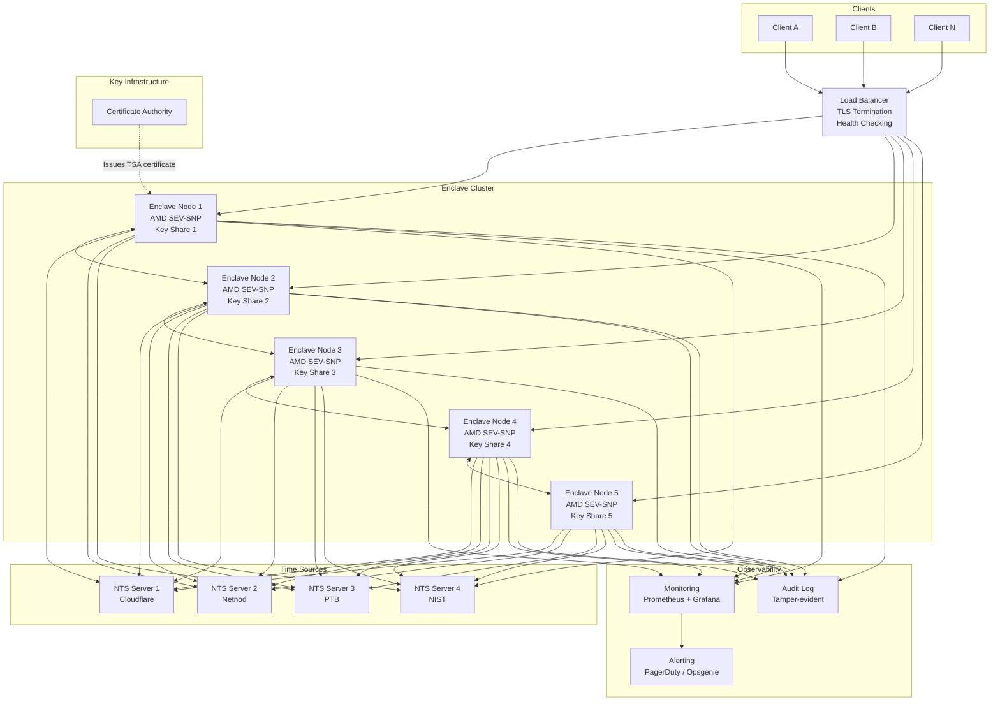
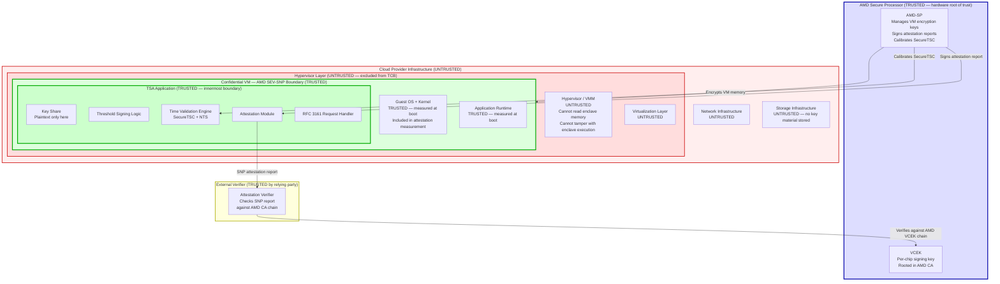
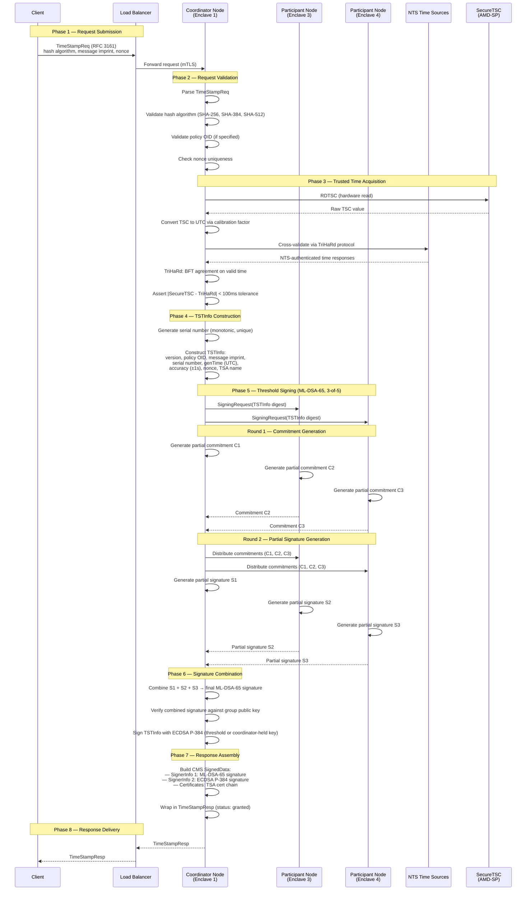
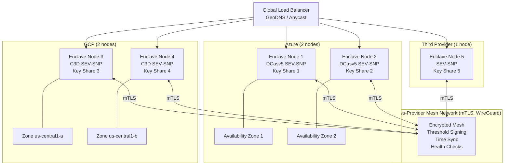

# Architecture Overview

> **CC-TSA Design Document 01** | Audience: Architects, Engineers, Security Reviewers

This document describes the system architecture of the Confidential Computing Timestamp Authority (CC-TSA) — a hardware-attested, quantum-safe, threshold-signing timestamp service that produces standard RFC 3161 tokens. It covers design goals, components, trust boundaries, platform selection, the timestamp request lifecycle, deployment topology, and operational thresholds.

For deeper treatment of specific topics, see the companion documents referenced throughout.

---

## Table of Contents

1. [Design Goals](#1-design-goals)
2. [System Components](#2-system-components)
3. [Trust Boundary Diagrams](#3-trust-boundary-diagrams)
4. [Platform Selection](#4-platform-selection)
5. [Timestamp Request Lifecycle](#5-timestamp-request-lifecycle)
6. [Deployment Topology](#6-deployment-topology)
7. [Minimum Nodes for Operation](#7-minimum-nodes-for-operation)
8. [Software Immutability and Measurement Identity](#8-software-immutability-and-measurement-identity)

---

## 1. Design Goals

CC-TSA is designed around five core principles that collectively provide a different trust architecture from traditional HSM-based Timestamp Authorities.

### 1.1 Verifiable Trust via Hardware Attestation

Traditional TSAs protect their signing keys and clocks inside certified HSMs (e.g., FIPS 140-2 Level 4 devices such as the IBM 4767), which provide genuine hardware protections: no-export keys, tamper-response mechanisms that destroy key material, and hardware-enforced clock adjustment limits with cryptographic audit logs. These are strong protections, but relying parties must trust the HSM certification process and the organizational procedures surrounding it — they cannot independently verify the HSM's state at the time a timestamp was issued.

CC-TSA takes a different approach with **remotely verifiable cryptographic attestation**: every enclave node produces an AMD SEV-SNP attestation report signed by the AMD Secure Processor. This report binds the node's identity (measurement of firmware, kernel, and application), its runtime state, and its platform configuration to a hardware root of trust. Any party can verify this report against AMD's published VCEK certificates without trusting the cloud provider or the CC-TSA operator.

See [Threat Model](07-threat-model.md) for a full analysis of what attestation does and does not protect against.

### 1.2 No Single Point of Compromise

The TSA signing key **never exists as a complete value in any single location**. It is generated via Distributed Key Generation (DKG) across 5 enclave nodes, each of which holds one key share. Signing requires a 3-of-5 threshold: at least 3 nodes must participate to produce a valid signature, but no subset of 2 or fewer nodes can sign or reconstruct the key.

This means:

- Compromise of 1 or 2 enclave nodes does not yield the signing key.
- Compromise of 1 or 2 cloud provider accounts does not yield the signing key (because no single provider hosts 3 or more nodes in the recommended multi-cloud deployment).
- A malicious insider at the operating organization cannot extract the key from any single node.

See [Quantum-Safe Threshold Cryptography](03-quantum-safe-threshold-crypto.md) for details on the DKG protocol and threshold signing scheme.

### 1.3 Quantum-Safe Signatures

Every timestamp token carries **dual signatures**:

- **ML-DSA-65** (FIPS 204, formerly Dilithium-3): A lattice-based post-quantum signature scheme, produced via threshold signing across the enclave cluster.
- **ECDSA P-384** (FIPS 186-5): A classical elliptic-curve signature for backward compatibility with existing verifiers.

Both signatures are embedded in the CMS SignedData structure as separate `SignerInfo` entries. Classical verifiers ignore the ML-DSA-65 signature and validate via ECDSA. Quantum-safe verifiers can validate via ML-DSA-65. This hybrid approach provides protection today while maintaining full backward compatibility.

See [Quantum-Safe Threshold Cryptography](03-quantum-safe-threshold-crypto.md) for algorithm selection rationale and [RFC 3161 Compliance](06-rfc3161-compliance.md) for the dual-signature CMS encoding.

### 1.4 Full RFC 3161 Compatibility

CC-TSA is a **drop-in replacement** for existing RFC 3161 Timestamp Authorities. The request/response protocol, token format (CMS SignedData containing TSTInfo), hash algorithm support, policy OID handling, and nonce semantics all conform to RFC 3161. Clients using standard libraries (e.g., OpenSSL, Bouncy Castle, Go `crypto/pkcs7`) require no modification.

See [RFC 3161 Compliance](06-rfc3161-compliance.md) for a detailed compliance matrix.

### 1.5 Multi-Cloud Deployment

The recommended deployment distributes enclave nodes across multiple cloud providers so that **no single provider hosts a threshold number of nodes** (3 or more). This ensures that a full compromise of one cloud provider's infrastructure — including hypothetical hypervisor-level attacks — cannot reach the signing threshold.

The primary deployment target is AMD SEV-SNP confidential VMs, available on Azure (DCasv5/ECasv5 series) and GCP (C3D series). A third provider hosts the fifth node to complete the distribution.

---

## 2. System Components

The CC-TSA system comprises five major component groups. The following diagram provides a high-level view; each component is described in detail below.

### 2.1 Enclave Nodes (5)

Each enclave node is an AMD SEV-SNP confidential VM running the CC-TSA application. The five nodes form a threshold-signing cluster with a 3-of-5 quorum.

**What runs inside each enclave:**

| Component | Responsibility |
|---|---|
| **Threshold Signing Participant** | Holds one key share (from DKG). Participates in 2-round threshold signing protocol when selected. Generates partial commitments and partial signatures. |
| **Time Validation Engine** | Reads the hardware TSC via SecureTSC for a tamper-resistant time source. Periodically cross-validates against NTS-authenticated NTP servers using the TriHaRd Byzantine fault-tolerant protocol. Rejects time if drift exceeds tolerance. |
| **Attestation Module** | Generates SNP attestation reports on demand (for verifiers) and during DKG (for mutual attestation). Binds the node's measurement, guest policy, and platform info to the AMD hardware root of trust. |
| **RFC 3161 Request Handler** | Parses `TimeStampReq`, validates hash algorithm and policy OID, constructs `TSTInfo`, orchestrates threshold signing, assembles `TimeStampResp`. |
| **Coordinator Logic** | When a node is selected as coordinator for a request, it drives the threshold signing rounds, collects partial signatures, and combines them into the final signature. Any node can serve as coordinator. |
| **Key Share Storage** | The key share exists only in enclave memory during operation. There is no at-rest persistence. If the node reboots, its key share is irrecoverably lost. Recovery requires a new DKG ceremony if quorum (≥3 shares) is no longer available. |

**Enclave properties enforced by AMD SEV-SNP:**

- Memory is encrypted with a per-VM AES-128-XEX key managed by the AMD Secure Processor. The hypervisor cannot read or tamper with enclave memory.
- Integrity protection prevents the hypervisor from replaying or reordering memory pages.
- The attestation report is signed by the AMD Secure Processor using a per-chip VCEK key, rooted in AMD's certificate chain.
- SecureTSC provides a hardware-protected time source calibrated by the AMD Secure Processor, inaccessible to the hypervisor.

See [Confidential Computing & Time](02-confidential-computing-and-time.md) for a deep dive on SEV-SNP and SecureTSC.

### 2.2 Load Balancer

The load balancer is the entry point for all RFC 3161 timestamp requests.

**Responsibilities:**

- **TLS termination**: Terminates client TLS connections. The connection between the load balancer and enclave nodes uses mTLS with certificates attested to the enclave identity.
- **Request routing**: Distributes `TimeStampReq` messages to enclave nodes. The routing strategy can be round-robin (any node can serve as coordinator) or sticky (route to a designated coordinator for a period).
- **Health checking**: Periodically probes each enclave node's health endpoint. Removes unhealthy nodes from the rotation. Health checks verify that the node is attested, time-synchronized, and able to participate in signing.
- **Rate limiting**: Protects the cluster from request floods.

The load balancer is **outside the trust boundary** — it does not have access to key shares or signing material. A compromised load balancer can deny service but cannot forge timestamps.

### 2.3 NTS Time Sources (4+)

CC-TSA uses a minimum of 4 NTS-authenticated NTP servers (RFC 8915) as external time references. NTS provides cryptographic authentication of NTP responses, preventing spoofing and man-in-the-middle attacks on time synchronization.

**Time sources in the default configuration:**

| Provider | Server | Stratum | Notes |
|---|---|---|---|
| Cloudflare | `time.cloudflare.com` | 1–2 | Global anycast |
| Netnod | `nts.netnod.se` | 1 | Swedish national time |
| PTB | `ptbtime1.ptb.de` | 1 | German national metrology institute |
| NIST | `time.nist.gov` | 1 | US national metrology institute |

**Time validation process:**

1. Each enclave node reads its local time from the hardware TSC via SecureTSC.
2. Periodically (configurable, default every 30 seconds), each node queries all 4 NTS servers.
3. The TriHaRd protocol (Byzantine fault-tolerant time agreement) selects a valid time from the NTS responses, tolerating up to 1 faulty or malicious source out of 4.
4. The node compares its SecureTSC time against the TriHaRd-validated NTS time. If drift exceeds the configured tolerance (default: 100 milliseconds), the node raises an alert and may halt signing.

This dual-source approach (hardware TSC + authenticated NTP) ensures that even if the hypervisor attempts to manipulate the software clock, the hardware TSC remains trustworthy, and even if the hardware TSC drifts, the NTS sources provide a cross-check.

See [Confidential Computing & Time](02-confidential-computing-and-time.md) for the full trusted time architecture.

### 2.4 Certificate Authority

A Certificate Authority (CA) issues the X.509 certificate that binds the TSA's public signing key to the TSA's identity. This certificate is included in every timestamp token so that verifiers can chain trust from the token back to a trusted root.

**Certificate issuance flow:**

1. DKG completes across the 5 enclave nodes, producing key shares (private) and the combined public key.
2. The combined public key is exported from the cluster (this is safe — it is the public key).
3. A Certificate Signing Request (CSR) is generated containing the public key, the TSA's distinguished name, and the `id-kp-timeStamping` extended key usage OID.
4. The CA validates the CSR (potentially including verification of the cluster's attestation status) and issues an X.509 certificate.
5. The certificate is distributed to all enclave nodes and included in every `TimeStampResp`.

The CA can be a public CA, a private enterprise CA, or a purpose-built CA for the CC-TSA deployment. The certificate must include:

- `extKeyUsage: id-kp-timeStamping` (OID 1.3.6.1.5.5.7.3.8)
- The TSA's policy OID in the certificate policies extension
- The combined public key (ML-DSA-65 and/or ECDSA P-384, depending on certificate encoding strategy)

### 2.5 Monitoring

The monitoring subsystem provides visibility into cluster health, performance, and security posture.

**Monitored dimensions:**

| Dimension | Metrics | Alert Threshold |
|---|---|---|
| **Cluster health** | Nodes online, nodes attested, quorum status | < 4 nodes online |
| **Time drift** | SecureTSC vs. NTS delta per node, inter-node clock skew | > 100 milliseconds drift |
| **Attestation status** | Attestation report validity, measurement changes, firmware versions | Any attestation failure |
| **Signing performance** | Threshold signing latency (p50, p95, p99), request throughput | p99 > 5s |
| **Key share status** | Key share present in memory, DKG ceremony status | Any key share loss |
| **NTS source health** | NTS server reachability, response validity, stratum changes | < 3 NTS sources reachable |

**Alerting tiers:**

- **Critical**: Quorum lost (< 3 nodes), attestation failure, time drift > 100ms. Pages on-call immediately.
- **Warning**: Degraded quorum (3 nodes), single NTS source unreachable, elevated signing latency. Notifies team.
- **Info**: Node restart, DKG ceremony triggered, NTS source stratum change. Logged for audit.

See [Operations and Deployment](05-operations-and-deployment.md) for monitoring setup and runbooks.

---

## 3. Trust Boundary Diagrams

Understanding what is trusted and what is untrusted is critical for evaluating the security properties of CC-TSA. The following diagram shows the nested trust boundaries for a single enclave node.

### 3.1 Single Node Trust Boundaries

### 3.2 Trust Classification Summary

| Component | Trust Status | Rationale |
|---|---|---|
| **AMD Secure Processor** | Trusted (hardware root) | Manages encryption keys, signs attestation reports, calibrates SecureTSC. Silicon-level trust anchor manufactured by AMD. |
| **Guest OS + Kernel** (inside CVM) | Trusted (measured) | Measured at boot and included in the attestation report. Any change to the OS or kernel changes the measurement, which invalidates the attestation and requires a new DKG ceremony with a new certificate. |
| **TSA Application** (inside CVM) | Trusted (measured) | Same as above — the application binary is measured at boot. |
| **Hypervisor / VMM** | **Untrusted** | Explicitly excluded from the Trusted Computing Base. SEV-SNP is designed so that a compromised hypervisor cannot read enclave memory, tamper with execution, or forge attestation reports. |
| **Cloud provider infrastructure** | **Untrusted** | Network, storage, and management plane are outside the trust boundary. Key shares exist only in enclave memory — no key material is persisted to provider storage. Network traffic is encrypted via mTLS. |
| **External verifier** | Trusted (by relying party) | The relying party chooses to trust the attestation verification result. The verification itself is purely cryptographic — checking the SNP report signature against AMD's certificate chain. |

### 3.3 What the Hypervisor Cannot Do

AMD SEV-SNP provides the following guarantees even against a fully compromised hypervisor:

- **Cannot read enclave memory**: VM memory is encrypted with a per-VM key managed by the AMD-SP. The hypervisor does not have this key.
- **Cannot modify enclave memory**: Integrity protection (Reverse Map Table) prevents the hypervisor from injecting, replaying, or reordering memory pages.
- **Cannot forge attestation reports**: Attestation reports are signed by the AMD-SP using the VCEK key. The hypervisor cannot access this key.
- **Cannot manipulate SecureTSC**: The TSC is calibrated by the AMD-SP and the hypervisor's `RDTSC`/`RDTSCP` interception is disabled when SecureTSC is enabled.
- **Cannot observe key material**: The signing key shares exist only in encrypted memory. Even a memory dump from the hypervisor yields only ciphertext.

See [Confidential Computing & Time](02-confidential-computing-and-time.md) for a detailed explanation of SEV-SNP's isolation guarantees.

---

## 4. Platform Selection

CC-TSA targets AMD SEV-SNP as its primary confidential computing platform. This section explains the selection rationale by comparing the three major platform options.

### 4.1 Platform Comparison

| Feature | AMD SEV-SNP | Intel TDX | AWS Nitro Enclaves |
|---|---|---|---|
| **Memory encryption** | AES-128-XEX per-VM, managed by AMD Secure Processor | AES-128-XTS per-TD, managed by Intel TDX Module | Separate physical memory allocation (no cryptographic isolation from parent instance) |
| **Trusted time (SecureTSC)** | Yes — SecureTSC calibrated by AMD-SP, hypervisor cannot intercept `RDTSC` | Virtualized TSC — less isolated, hypervisor can influence TSC offsetting | No hardware TSC guarantee — enclave has no direct hardware clock |
| **Attestation** | SNP attestation report signed by AMD-SP (VCEK), rooted in AMD CA | TD Quote signed by Intel Quoting Enclave (QE), rooted in Intel CA | Nitro attestation document signed by Nitro Security Module (NSM) |
| **Cloud availability** | Azure (DCasv5, ECasv5), GCP (C3D confidential VMs), potentially others | Azure (DCesv5 — preview), GCP (preview) | AWS only |
| **Multi-cloud** | Azure + GCP + additional providers | Limited availability — preview status limits production multi-cloud | AWS only — single-cloud lock-in |
| **Nested paging security** | SEV-SNP Reverse Map Table (RMP) prevents page remapping attacks | Secure EPT (S-EPT) managed by TDX Module | Not applicable (process-based isolation) |
| **Recommendation** | **Primary platform** | **Alternative** (when GA on multiple clouds) | **Not recommended** (single-cloud, no SecureTSC) |

### 4.2 Why AMD SEV-SNP with SecureTSC

The selection of AMD SEV-SNP as the primary platform is driven by three factors:

**1. SecureTSC is critical for trusted time.**

A Timestamp Authority's core guarantee is the accuracy of its clock. SecureTSC provides a hardware-protected time source that the hypervisor cannot manipulate. The AMD Secure Processor calibrates the TSC at VM boot and the guest reads it directly via `RDTSC` without hypervisor interception. This is a qualitative improvement over software-only time sources.

Intel TDX provides a virtualized TSC that, while protected from direct manipulation, offers weaker isolation guarantees. AWS Nitro Enclaves have no hardware TSC mechanism at all — the enclave must rely on the parent instance for time, which defeats the purpose for a TSA.

See [Confidential Computing & Time](02-confidential-computing-and-time.md) for the full SecureTSC analysis.

**2. Multi-cloud availability is essential for threshold distribution.**

The CC-TSA security model requires distributing nodes so that no single cloud provider hosts a threshold number (3 or more). AMD SEV-SNP is generally available on both Azure and GCP, enabling a 2+2+1 node distribution across three providers. Intel TDX, while promising, is still in preview on most providers and not yet suitable for production multi-cloud deployments. AWS Nitro is inherently single-cloud.

**3. Mature attestation ecosystem.**

AMD SEV-SNP attestation is well-supported by Azure (Microsoft Azure Attestation service) and GCP (Confidential Computing attestation API). Both providers support attestation verification, which CC-TSA uses for mutual attestation during DKG ceremonies.

### 4.3 Intel TDX as an Alternative

Intel TDX is a viable alternative platform and may become preferred for certain deployments as it reaches general availability on multiple clouds. The CC-TSA application logic is designed to be platform-agnostic where possible, with a platform abstraction layer for attestation report generation and time source access. Porting to TDX would require:

- Replacing SNP attestation report generation with TD Quote generation.
- Replacing SecureTSC time reads with TDX-specific TSC access (or relying more heavily on NTS).

---

## 5. Timestamp Request Lifecycle

This section traces a single RFC 3161 timestamp request from client to response, showing every step including threshold signing coordination.

### 5.1 Sequence Diagram

### 5.2 Phase Descriptions

**Phase 1 — Request Submission.** The client constructs an RFC 3161 `TimeStampReq` containing the message imprint (hash algorithm OID + hash value of the data to be timestamped), an optional nonce for replay protection, and an optional policy OID. The client sends this to the load balancer over HTTPS. The load balancer selects a coordinator node (round-robin or based on affinity) and forwards the request over mTLS.

**Phase 2 — Request Validation.** The coordinator node parses the `TimeStampReq` and validates:
- The hash algorithm OID is in the set of accepted algorithms (SHA-256, SHA-384, SHA-512; SHA-1 is rejected).
- If a policy OID is specified, it is in the set of policies the TSA supports.
- If a nonce is present, it is recorded for inclusion in the response (the TSA does not check nonce uniqueness across requests — that is the client's responsibility per RFC 3161).
- The message imprint length matches the expected length for the specified hash algorithm.

If validation fails, the coordinator returns a `TimeStampResp` with an appropriate error status (e.g., `badAlg`, `badRequest`).

**Phase 3 — Trusted Time Acquisition.** The coordinator obtains a trusted timestamp by reading the hardware TSC via SecureTSC and cross-validating against NTS-authenticated NTP sources using the TriHaRd Byzantine fault-tolerant protocol. If the SecureTSC and TriHaRd times diverge beyond the configured tolerance (default 100 milliseconds), the node halts signing and raises an alert. The validated time is used as `genTime` in the TSTInfo.

See [Confidential Computing & Time](02-confidential-computing-and-time.md) for the TriHaRd protocol specification.

**Phase 4 — TSTInfo Construction.** The coordinator constructs the `TSTInfo` structure per RFC 3161 Section 2.4.2:

| Field | Value |
|---|---|
| `version` | 1 |
| `policy` | CC-TSA policy OID (or client-requested policy if supported) |
| `messageImprint` | Copied from the request |
| `serialNumber` | Monotonically increasing, unique across the cluster |
| `genTime` | UTC time from Phase 3 (GeneralizedTime, sub-second precision) |
| `accuracy` | ±1 second (conservative; reflects that timestamping is not latency-sensitive work) |
| `ordering` | FALSE (serial numbers provide ordering within the same genTime) |
| `nonce` | Copied from the request (if present) |
| `tsa` | TSA GeneralName (from TSA certificate) |

**Phase 5 — Threshold Signing.** The coordinator selects 2 additional participant nodes (for a total of 3, the threshold) and initiates the two-round threshold signing protocol:

- **Round 1 (Commitment)**: Each of the 3 participants generates a partial commitment from their key share and the TSTInfo digest. All commitments are sent to the coordinator.
- **Round 2 (Partial Signature)**: The coordinator distributes all 3 commitments to each participant. Each participant generates a partial signature using their key share, the TSTInfo digest, and the full commitment set. Partial signatures are sent to the coordinator.

This two-round structure prevents rogue-key attacks and ensures that no participant can bias the final signature.

See [Quantum-Safe Threshold Cryptography](03-quantum-safe-threshold-crypto.md) for the full protocol specification.

**Phase 6 — Signature Combination.** The coordinator combines the 3 partial signatures into a single ML-DSA-65 signature and verifies it against the group public key. If verification fails (indicating a faulty or malicious participant), the coordinator retries with a different participant set. The coordinator also produces an ECDSA P-384 signature (either via a parallel threshold signing round or using a coordinator-held ECDSA key, depending on deployment configuration).

**Phase 7 — Response Assembly.** The coordinator constructs the CMS `SignedData` structure:
- `encapContentInfo` contains the DER-encoded `TSTInfo`.
- `signerInfos` contains two `SignerInfo` entries: one for ML-DSA-65 and one for ECDSA P-384.
- `certificates` contains the TSA certificate chain.

This is wrapped in a `TimeStampResp` with status `granted` (0).

See [RFC 3161 Compliance](06-rfc3161-compliance.md) for the exact CMS encoding of dual signatures.

**Phase 8 — Response Delivery.** The coordinator sends the `TimeStampResp` back to the load balancer, which forwards it to the client. The client can verify the token using the TSA's public certificate and standard CMS verification libraries.

### 5.3 Latency Budget

Timestamping is not latency-sensitive work. The system is designed for a **< 1 second end-to-end** round-trip budget, which comfortably accommodates cross-provider network round-trips and threshold signing coordination without requiring latency optimization.

| Phase | Expected Latency | Notes |
|---|---|---|
| Request parsing + validation | < 1 ms | Local computation |
| Trusted time acquisition | < 1 ms | NTS cross-validation is periodic, not per-request |
| TSTInfo construction | < 1 ms | Local computation |
| Threshold signing (2 rounds) | Tens to hundreds of ms | Dominated by network round-trips between enclave nodes; varies by deployment topology |
| Signature combination + verification | < 5 ms | Local computation |
| Response assembly | < 1 ms | Local computation |
| **Total (end-to-end)** | **< 1 second** | Excludes network latency to/from client |

Throughput comes from pipelining concurrent signing sessions, not from optimizing individual request latency. See [Throughput & Scaling](08-throughput-and-scaling.md) for capacity analysis.

---

## 6. Deployment Topology

CC-TSA supports two deployment topologies: single-provider and multi-provider. The multi-provider topology is **recommended** because it ensures that no single cloud provider compromise can reach the signing threshold.

### 6.1 Single-Provider (Azure)

In a single-provider deployment, all 5 enclave nodes run on Azure DCasv5 (or ECasv5) confidential VMs with AMD SEV-SNP. Nodes are distributed across Availability Zones and regions for fault tolerance.

**Layout:**

| Location | Nodes | Availability Zones |
|---|---|---|
| **Region 1 (Primary)** — e.g., East US | 3 nodes (Enclave 1, 2, 3) | Spread across AZ 1 and AZ 2 |
| **Region 2 (DR)** — e.g., West Europe | 2 nodes (Enclave 4, 5) | Spread across AZ 1 and AZ 2 |

**Properties:**

- Tolerates loss of any single AZ (at most 2 nodes affected, 3 remain).
- Tolerates loss of Region 2 entirely (3 nodes remain in Region 1).
- Does NOT protect against Azure-wide compromise or Azure-level hypervisor vulnerability — all nodes share the same provider trust domain.

**When to use:** Development, testing, or deployments where multi-cloud complexity is not justified and the threat model accepts single-provider risk.

### 6.2 Multi-Provider (Recommended)

In the multi-provider deployment, nodes are distributed across cloud providers so that no single provider hosts 3 or more nodes (the signing threshold).

**Layout:**

| Provider | Nodes | VM Type |
|---|---|---|
| **Azure** | 2 nodes (Enclave 1, 2) | DCasv5 (SEV-SNP) |
| **GCP** | 2 nodes (Enclave 3, 4) | C3D Confidential VM (SEV-SNP) |
| **Third Provider** | 1 node (Enclave 5) | SEV-SNP capable VM |

**Security property:** Compromise of any single provider yields at most 2 key shares — below the threshold of 3. An attacker must compromise nodes across at least 2 providers to reach the signing threshold.

**Topology Diagram:**

**Cross-provider networking:**

The enclave nodes communicate over a cross-provider mesh network for:
- Threshold signing rounds.
- Periodic time synchronization cross-checks.
- Health checks and quorum status broadcasts.

The mesh uses mTLS with certificates attested to each node's enclave identity. An optional WireGuard tunnel provides an additional encryption layer. Cross-provider latency (e.g., Azure East US to GCP us-central1) is typically 10–30 ms, which is negligible within the 1-second round-trip budget.

### 6.3 Topology Selection Guidance

| Requirement | Single-Provider (Azure) | Multi-Provider |
|---|---|---|
| Protection against single-node compromise | Yes (threshold) | Yes (threshold) |
| Protection against single-AZ failure | Yes (cross-AZ) | Yes (cross-zone) |
| Protection against single-region failure | Yes (cross-region) | Yes (cross-provider) |
| Protection against single-provider compromise | **No** | **Yes** |
| Operational complexity | Lower | Higher (multi-cloud networking, cross-provider DKG coordination) |
| Latency (threshold signing) | Lower (intra-provider) | Higher (cross-provider); negligible within 1-second budget |

For production deployments handling high-value timestamps, the multi-provider topology is recommended.

---

## 7. Minimum Nodes for Operation

The CC-TSA cluster operates with a **3-of-5 threshold**: at least 3 enclave nodes must be online and participating to produce a valid threshold signature.

### 7.1 Operational Status Table

| Nodes Online | Status | Signing Capability | Fault Tolerance |
|---|---|---|---|
| **5** | Healthy | Yes | Can lose 2 nodes |
| **4** | Degraded | Yes | Can lose 1 node |
| **3** | Critical | Yes | Zero margin — any further failure halts signing |
| **2** | Unavailable | **No** | Below threshold |
| **1** | Unavailable | **No** | Below threshold |
| **0** | Unavailable | **No** | All nodes offline |

### 7.2 Operational Guidelines

- **Healthy (5 nodes):** All nodes online and attested. Full fault tolerance. This is the normal operating state.

- **Degraded (4 nodes):** One node is offline (planned maintenance, hardware failure, attestation failure). Signing continues with any 3 of the remaining 4. The offline node should be restored promptly. An alert is raised but no immediate action is required.

- **Critical (3 nodes):** Two nodes are offline. Signing continues but there is **zero fault tolerance margin** — if any one of the remaining 3 nodes fails, signing halts. This state requires **immediate action** to restore at least one offline node. An on-call page is triggered.

- **Unavailable (< 3 nodes):** Signing is halted. The cluster cannot produce valid threshold signatures. The load balancer returns HTTP 503 to all timestamp requests. This is a **P1 incident** requiring immediate response. Since key shares exist only in enclave memory, recovery requires a new DKG ceremony and new certificate issuance once sufficient nodes are online.

See [Failure Modes and Recovery](04-failure-modes-and-recovery.md) for detailed recovery procedures for each failure scenario.

### 7.3 Why 3-of-5?

The threshold parameters (t=3, n=5) balance security and availability:

- **Security**: An attacker must compromise 3 nodes to forge a signature. In the multi-provider topology, this requires compromising nodes across at least 2 cloud providers.
- **Availability**: The system tolerates 2 simultaneous node failures while maintaining signing capability. This allows for AZ failures and individual node issues without downtime.
- **Efficiency**: The threshold signing protocol requires only 3 nodes to participate per signature. The coordinator selects 2 participants from the available pool.

A 2-of-5 threshold would improve availability (tolerates 3 failures) but weakens security (only 2 nodes needed to forge). A 4-of-5 threshold would improve security but makes the system fragile (any single node failure blocks signing). The 3-of-5 configuration is the standard recommendation for Byzantine fault-tolerant systems with 5 nodes.

---

## 8. Software Immutability and Measurement Identity

CC-TSA software is **immutable for the lifetime of a signing key**. Once a DKG ceremony produces key shares and a corresponding TSA certificate is issued, the software running in the enclave nodes does not change. This design binds the software identity to the cryptographic identity of the TSA.

### Attestation Measurement as Cryptographic Identity

When the DKG ceremony completes, the attestation measurement (the hash of the firmware, kernel, and application running in each enclave) is recorded and published alongside the TSA certificate. This measurement serves as a permanent record of exactly what software produced the key shares and will sign all timestamps under this certificate.

Relying parties can:

1. Obtain the TSA certificate and its associated attestation measurement.
2. Request a live attestation report from any enclave node.
3. Verify that the live measurement matches the published measurement — confirming the node is running the exact same software that participated in the DKG ceremony.

This provides a property that traditional TSAs cannot offer: **cryptographic proof of what code produced a given timestamp**, not just trust in an organization's deployment practices.

### Software Change Procedure

Because the software is immutable for the lifetime of a signing key, any software change (security patches, feature updates, configuration changes that affect the measurement) follows a key rotation procedure:

1. **Retire the current key**: Announce end-of-life for the current TSA certificate. Continue signing with the existing key until the new deployment is ready.
2. **Deploy new software**: Launch new enclave nodes running the updated software. The new nodes will have a different attestation measurement.
3. **New DKG ceremony**: The new enclave nodes perform a fresh DKG, generating new key shares and a new public key.
4. **New certificate issuance**: A new TSA certificate is issued for the new public key, with the new attestation measurement published alongside it.
5. **Cutover**: Transition signing to the new cluster. The old certificate can be revoked or allowed to expire.

This procedure ensures there is never ambiguity about which software version signed a given timestamp. Each certificate corresponds to exactly one software measurement.

---

## Cross-Reference Index

| Topic | Document |
|---|---|
| AMD SEV-SNP, SecureTSC, Intel TDX, trusted time | [Confidential Computing & Time](02-confidential-computing-and-time.md) |
| ML-DSA-65 threshold signing, DKG, key lifecycle | [Quantum-Safe Threshold Cryptography](03-quantum-safe-threshold-crypto.md) |
| Failure scenarios, recovery procedures, resilience | [Failure Modes and Recovery](04-failure-modes-and-recovery.md) |
| Deployment guide, monitoring, incident response | [Operations and Deployment](05-operations-and-deployment.md) |
| RFC 3161 token format, hybrid signatures, compatibility | [RFC 3161 Compliance](06-rfc3161-compliance.md) |
| Threat model, STRIDE analysis, residual risks | [Threat Model](07-threat-model.md) |
| Throughput analysis, scaling strategy, cost estimates | [Throughput & Scaling](08-throughput-and-scaling.md) |
