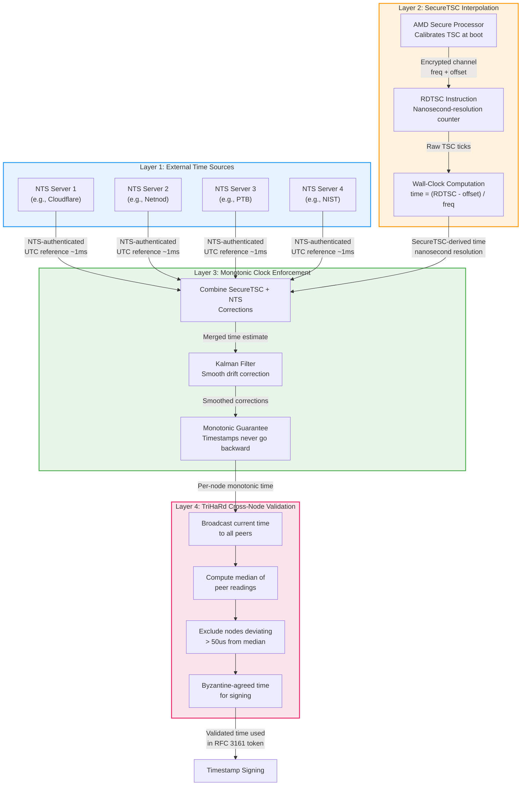
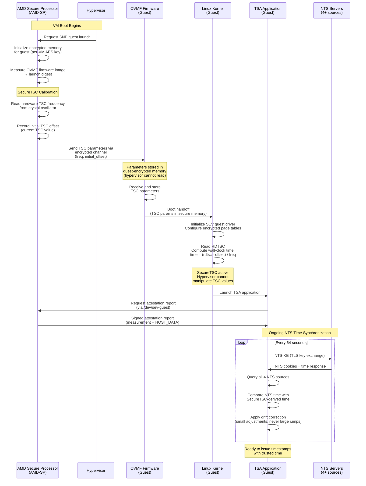
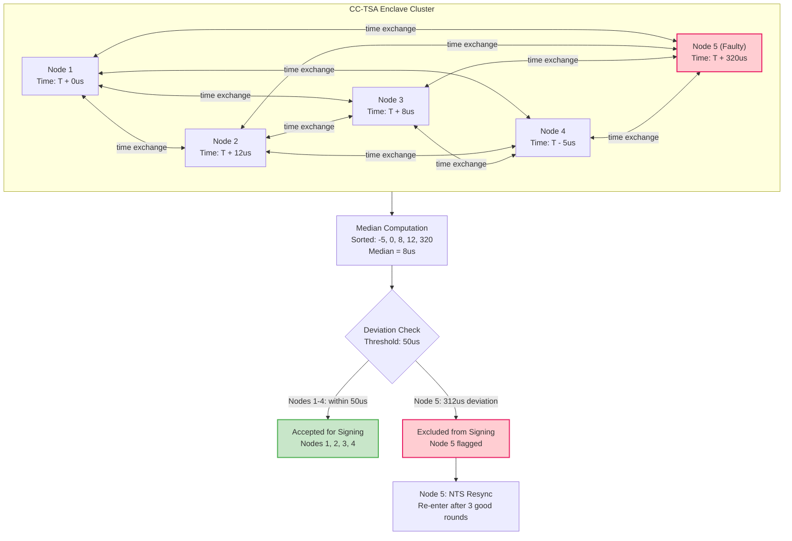
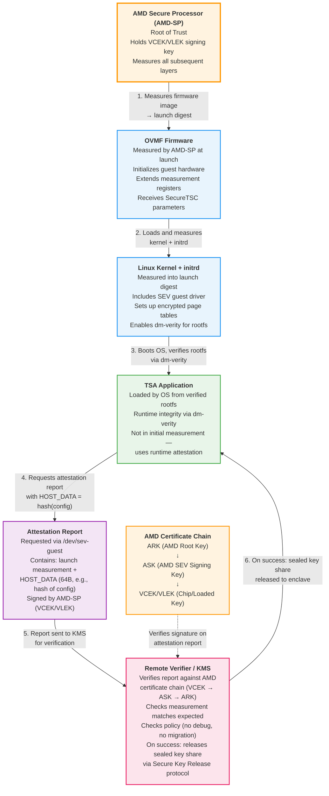

# Confidential Computing & Trusted Time

This document provides a deep technical treatment of the confidential computing technologies and trusted time mechanisms that underpin the CC-TSA system. It covers AMD SEV-SNP (the primary platform), Intel TDX (the alternative), the time trust chain from external NTS sources through SecureTSC to cross-node validation, and the attestation boot chain that establishes trust before any signing key is released.

For the overall system architecture and component interactions, see [Architecture Overview](01-architecture-overview.md). For how the signing key is generated and used within these enclaves, see [Quantum-Safe Threshold Cryptography](03-quantum-safe-threshold-crypto.md).

---

## 1. AMD SEV-SNP Deep Dive

AMD SEV-SNP (Secure Encrypted Virtualization - Secure Nested Paging) is the primary confidential computing platform for CC-TSA. It provides hardware-enforced memory isolation, integrity protection, and attestation for virtual machines, removing the hypervisor and cloud provider from the Trusted Computing Base (TCB).

### Memory Encryption

AMD's confidential computing stack builds on two foundational technologies:

- **Secure Memory Encryption (SME)**: Encrypts all of DRAM using a single ephemeral key managed by the AMD Secure Processor (AMD-SP). SME is transparent to software and protects against physical memory snooping (cold boot attacks, DRAM interposers).

- **Secure Encrypted Virtualization (SEV)**: Extends SME by assigning a unique AES-128-XEX encryption key to each virtual machine. Each VM's memory is encrypted with its own key, so neither the hypervisor nor other VMs can read its contents.

SEV-SNP adds **Secure Nested Paging**, which introduces the **Reverse Map Table (RMP)**. The RMP is a hardware-enforced data structure that records the ownership of every 4KB physical page. Each page is assigned to exactly one VM (or the hypervisor), and the hardware enforces that only the owner can read or write that page. This prevents the following attacks that earlier SEV generations were vulnerable to:

- **Replay attacks**: The hypervisor cannot swap an old encrypted page back in; the RMP tracks the current valid mapping.
- **Remapping attacks**: The hypervisor cannot map the same encrypted page at two different guest-physical addresses.
- **Memory aliasing**: The hardware ensures a 1:1 mapping between guest-physical and host-physical pages.

The encryption uses **AES-128-XEX** mode with a per-VM key that is generated and managed entirely by the AMD-SP. The key never leaves the AMD-SP and is not accessible to any software, including the hypervisor. This means that even a fully compromised hypervisor cannot decrypt guest memory.

For CC-TSA, this means that the threshold key share held by each enclave node is protected by hardware encryption. The cloud provider's administrators, the hypervisor, and co-tenant VMs cannot access the key share or any intermediate signing state.

### Virtual Machine Privilege Levels (VMPL)

SEV-SNP introduces four **Virtual Machine Privilege Levels** (VMPL0 through VMPL3), where VMPL0 is the most privileged and VMPL3 is the least. This provides in-guest privilege separation without any reliance on the hypervisor:

- **VMPL0**: Reserved for the **Secure VM Service Module (SVSM)**, a small trusted component that provides services like vTPM emulation and attestation to higher VMPLs. The SVSM is measured at launch and runs with full access to guest memory.
- **VMPL1-2**: The guest operating system and kernel. The guest kernel at VMPL1 can restrict what VMPL2 can access.
- **VMPL3**: Least privileged. Suitable for untrusted or minimally trusted guest components.

The RMP enforces VMPL permissions per-page: a page can be configured so that only VMPL0 can write it but VMPL1 can read it, for example. This allows the SVSM to maintain integrity of critical data structures (like the vTPM state or attestation parameters) even if the guest OS is partially compromised.

For CC-TSA, the SVSM at VMPL0 can protect the SecureTSC parameters and attestation state from tampering by higher-level guest software, adding an additional layer of defense in depth.

### Attestation

AMD SEV-SNP attestation is the mechanism by which a remote party can verify that a VM is running the expected code on genuine AMD hardware with the correct security configuration. This is the foundation of the CC-TSA trust model.

**Launch measurement**: When the hypervisor requests the AMD-SP to launch an SEV-SNP guest, the AMD-SP measures the initial guest state:
- The OVMF (Open Virtual Machine Firmware) image
- Initial register state
- VM policy (e.g., minimum firmware version, whether migration is allowed, whether debugging is disabled)

This measurement is recorded in the guest's launch digest, analogous to TPM PCR values.

**Runtime attestation reports**: At any point after launch, the guest can request an attestation report from the AMD-SP via the `SNP_GUEST_REQUEST` interface (exposed as `/dev/sev-guest` in Linux). The attestation report contains:

| Field | Description |
|---|---|
| `MEASUREMENT` | Launch digest (hash of initial guest state) |
| `HOST_DATA` | 64 bytes of application-provided data (e.g., hash of application config or public key) |
| `REPORT_DATA` | 64 bytes of data provided at report request time (e.g., a nonce for freshness) |
| `VMPL` | The VMPL at which the report was requested |
| `POLICY` | VM policy flags (debug disabled, migration disabled, etc.) |
| `PLATFORM_INFO` | Platform version, TCB version, microcode version |
| `SIGNATURE` | ECDSA signature by AMD-SP using a key chaining to AMD's root of trust |

**Certificate chain verification**: The attestation report signature can be verified against AMD's published certificate chain:
- **VCEK (Versioned Chip Endorsement Key)**: Unique per-chip, per-TCB-version. Derived from a chip-specific secret fused at manufacturing.
- **VLEK (Versioned Loaded Endorsement Key)**: Alternative to VCEK, provisioned by AMD to cloud providers. Allows attestation without revealing which specific chip is in use (privacy enhancement).
- The VCEK/VLEK chains up to AMD's **ASK (AMD SEV Signing Key)** and then to the **ARK (AMD Root Key)**.

For CC-TSA, remote attestation is the gating mechanism for key release. The KMS (Azure Key Vault MHSM or GCP Cloud KMS) verifies the attestation report before releasing a sealed key share. If the measurement does not match the expected value, or if the policy flags indicate debugging is enabled, the key share is withheld. See [Architecture Overview](01-architecture-overview.md) for how this fits into the deployment flow.

### SecureTSC

SecureTSC is the critical AMD feature that makes CC-TSA's trusted time model possible.

**The problem with traditional TSC**: The x86 Time Stamp Counter (TSC) is a hardware counter that increments at a fixed rate. In a virtualized environment, the hypervisor controls the TSC offset and scaling factor that the guest sees. A malicious or compromised hypervisor could manipulate these parameters to make the guest perceive a different time than reality. For a Timestamp Authority, this is a fundamental threat: if the hypervisor controls the clock, the hypervisor can forge timestamps.

**How SecureTSC works**: SecureTSC removes the hypervisor from the TSC trust chain:

1. At VM launch, the **AMD-SP** determines the TSC parameters:
   - **TSC frequency**: The actual frequency of the hardware TSC oscillator.
   - **Initial TSC offset**: The TSC value at the time of guest initialization.
2. These parameters are communicated to the guest through a **secure, encrypted channel** — specifically, they are placed in the guest's encrypted memory region that only the AMD-SP and the guest can access. The hypervisor cannot read or modify these values.
3. When the guest executes `RDTSC` or `RDTSCP`, the hardware returns the actual TSC value. The guest uses the AMD-SP-provided parameters to convert this to wall-clock time.
4. The hypervisor **cannot intercept, modify, or inject** TSC values seen by the guest because the TSC is read directly from hardware and the calibration parameters are in encrypted memory.

**Availability**: SecureTSC is available on AMD EPYC 9004 series (Genoa) and later processors. Azure Confidential VMs on DCasv5/ECasv5 series and GCP Confidential VMs on C3D series support SecureTSC.

**Precision characteristics**:
- TSC resolution: sub-nanosecond (multi-GHz counter)
- Crystal oscillator drift: typically <1 ppm (parts per million), which equates to approximately 86 microseconds per day
- Between NTS calibration queries (e.g., every 64 seconds), drift accumulates to <64 microseconds

For CC-TSA, SecureTSC is the foundation of the time trust chain. It provides a tamper-resistant, high-resolution time source inside the enclave that the cloud provider cannot manipulate. Combined with NTS-authenticated external time sources and cross-node validation, it delivers the trusted time guarantees required by a Timestamp Authority. See Section 3 (Time Trust Chain) for the full picture.

---

## 2. Intel TDX Alternative

Intel Trust Domain Extensions (TDX) is the alternative confidential computing platform supported by CC-TSA. While AMD SEV-SNP is the primary recommendation due to SecureTSC, TDX provides a viable alternative for deployments where AMD hardware is unavailable or where Intel-specific features are required.

### Architecture

TDX provides hardware-isolated virtual machines called **Trust Domains (TDs)**:

- **TDX Module**: A software module loaded as an Intel **Authenticated Code Module (ACM)** that runs in a new CPU mode called **SEAM (Secure Arbitration Mode)**. The TDX Module mediates all interactions between a TD and the Virtual Machine Monitor (VMM). It is measured and authenticated by the CPU microcode at load time.

- **Memory encryption**: Each TD's memory is encrypted with **AES-128-XTS** using a per-TD key managed by the TDX Module and the CPU's memory encryption engine. The VMM cannot read TD-private memory.

- **Integrity protection**: TDX maintains an **integrity directory** for TD-owned pages. This protects against replay and remapping attacks, similar in purpose to AMD's RMP but implemented differently (using a MAC-based integrity tree rather than an ownership table).

- **Attestation**: TDs can generate attestation quotes via the **Intel Quoting Enclave (QE)**. The quote contains the TD's measurement (MRTD, RTMR values) and is signed with an Intel-provisioned attestation key. Verification chains to Intel's provisioning infrastructure.

### Virtualized TSC

TDX virtualizes the TSC, but with a different trust model than SecureTSC:

- The **TDX Module** provides a TSC offset to the TD, ensuring that the VMM cannot arbitrarily shift the TD's perception of time.
- However, the **VMM still configures some TSC parameters**, notably the frequency multiplier. The TDX Module does not independently calibrate the TSC frequency from a hardware root of trust the way AMD-SP does with SecureTSC.
- This means that while the VMM cannot make arbitrary TSC jumps, it has more influence over the TD's time perception compared to AMD SEV-SNP with SecureTSC.
- Intel has indicated plans for **hardware-backed TSC** in future TDX generations, which would close this gap.

For CC-TSA on TDX, the time trust chain relies more heavily on NTS-authenticated NTP for absolute time accuracy, with the virtualized TSC providing interpolation between queries. The TriHaRd cross-node validation protocol (Section 6) provides an additional safeguard against TSC manipulation.

### Comparison Table

| Feature | AMD SEV-SNP | Intel TDX |
|---|---|---|
| Memory encryption | AES-128-XEX, per-VM key | AES-128-XTS, per-TD key |
| Integrity protection | RMP (Reverse Map Table) | Integrity directory (TD-owned pages) |
| Trusted time | SecureTSC (AMD-SP calibrated) | Virtualized TSC (VMM-configured offset) |
| Privilege separation | VMPL (4 levels) | Single TD privilege level |
| Attestation root | AMD-SP → VCEK/VLEK chain | Intel QE → Intel provisioned key |
| TCB | AMD-SP firmware | TDX Module (Intel ACM) |
| Maturity | GA (Azure, GCP) | Preview (Azure, GCP) |
| **CC-TSA recommendation** | **Primary** (SecureTSC advantage) | **Alternative** (viable when SecureTSC not needed) |

The key differentiator for CC-TSA is **SecureTSC**: AMD's hardware-rooted time source provides stronger guarantees than TDX's VMM-configured TSC. If Intel delivers hardware-backed TSC in a future TDX generation, the two platforms would be on more equal footing for TSA use cases.

---

## 3. Time Trust Chain

The CC-TSA time trust chain consists of four layers, each providing a specific guarantee. Together, they deliver accurate, tamper-resistant, and Byzantine-fault-tolerant time to the signing process.



### Layer 1: External Time Sources

Four or more NTS-authenticated NTP servers (RFC 8915) provide the UTC reference. These are Stratum-1 sources with GPS or atomic clock references, offering approximately 1ms accuracy over the network. Using four sources enables Byzantine fault tolerance: the system can tolerate one malicious or faulty source out of four. See Section 5 for NTS details.

### Layer 2: SecureTSC Interpolation

Between NTS queries, the AMD Secure Processor's calibrated TSC provides nanosecond-resolution time interpolation. The AMD-SP communicates the TSC frequency and initial offset to the guest via an encrypted channel at boot. The guest reads `RDTSC` and converts ticks to wall-clock time using these parameters. Crystal drift is typically less than 1 ppm, meaning less than 64 microseconds of drift between NTS queries at a 64-second polling interval. See Section 4 for the calibration sequence.

### Layer 3: Monotonic Clock Enforcement

A software layer combines the absolute UTC reference from NTS with the high-resolution SecureTSC interpolation. A Kalman filter (or similar estimation algorithm) smooths corrections from NTS, applying small adjustments to the SecureTSC-derived time rather than large jumps. The critical invariant is **monotonicity**: timestamps never go backward. If an NTS correction would move time backward, the correction is applied gradually by slowing the clock rate until the discrepancy is absorbed.

### Layer 4: TriHaRd Cross-Node Validation

Each enclave node broadcasts its current time to all peers. The median of all readings is computed, and any node deviating by more than 50 microseconds from the median is flagged and excluded from signing. This provides Byzantine fault tolerance at the clock level: even if one node's hardware clock is compromised or faulty, it cannot issue timestamps with incorrect time. See Section 6 for the full TriHaRd protocol.

---

## 4. SecureTSC Calibration Sequence

The following sequence diagram shows how SecureTSC parameters flow from the AMD Secure Processor to the running TSA application, and how NTS provides ongoing corrections.



### Calibration Details

The calibration process is critical because it establishes the relationship between raw TSC ticks and wall-clock time:

1. **Frequency determination**: The AMD-SP reads the TSC frequency from the hardware crystal oscillator. This is a fixed property of the physical CPU and cannot be influenced by the hypervisor. Typical frequencies are in the range of 2-4 GHz.

2. **Offset recording**: The AMD-SP records the TSC value at the moment of guest initialization. This provides the reference point for all subsequent time calculations.

3. **Secure delivery**: The frequency and offset are placed in the guest's encrypted memory region. The hypervisor never sees these values in plaintext. The guest firmware (OVMF) reads them from this protected region.

4. **Wall-clock computation**: The guest computes wall-clock time as:
   ```
   wall_clock_time = (current_rdtsc_value - initial_offset) / frequency
   ```
   This gives a monotonically increasing time value with sub-nanosecond resolution.

5. **NTS correction**: Over hours and days, the crystal oscillator drifts slightly (less than 1 ppm). NTS-authenticated NTP queries provide the absolute UTC reference to correct this drift. Corrections are applied gradually to maintain monotonicity.

---

## 5. NTS-Authenticated NTP (RFC 8915)

### Why NTS?

Traditional NTP (Network Time Protocol, RFC 5905) transmits time information in unauthenticated UDP packets. This makes it vulnerable to several attacks:

- **Spoofing**: An attacker on the network path can inject forged NTP responses with incorrect time.
- **Man-in-the-middle**: An attacker can modify NTP packets in transit, shifting the victim's clock.
- **Replay**: An attacker can replay old NTP responses to revert the victim's clock to a previous time.
- **Denial of service**: An attacker can drop or corrupt NTP packets, preventing time synchronization.

For a Timestamp Authority, any of these attacks could result in timestamps with incorrect time, undermining the entire purpose of the service.

**Network Time Security (NTS)**, defined in RFC 8915, addresses these vulnerabilities by adding cryptographic authentication to NTP:

1. **NTS Key Exchange (NTS-KE)**: The client and server perform a TLS 1.3 handshake to establish shared key material. This authenticates the server (via its TLS certificate) and provides the keys used to protect subsequent NTP packets.

2. **AEAD-protected NTP packets**: After key exchange, NTP request and response packets are protected with AEAD (Authenticated Encryption with Associated Data), specifically AES-SIV. This ensures that time responses are authentic (from the expected server) and untampered (no modification in transit).

3. **NTS cookies**: The server provides encrypted cookies that the client includes in subsequent requests. This allows the server to be stateless while still maintaining the association. Cookies are refreshed with each exchange.

NTS adds negligible overhead compared to plain NTP: the key exchange is a one-time TLS handshake, and the per-packet AEAD adds only a few hundred bytes. There is no measurable impact on time accuracy.

### Configuration

CC-TSA nodes are configured with four or more NTS-authenticated time sources from diverse providers:

| Provider | Hostname | Stratum | Reference |
|---|---|---|---|
| Cloudflare | `time.cloudflare.com` | 1 | GPS + atomic |
| Netnod | `nts.netnod.se` | 1 | Atomic (Cesium) |
| PTB | `ptbtime1.ptb.de` | 1 | Atomic (PTB national lab) |
| NIST | `ntp.nist.gov` (NTS when available) | 1 | Atomic (NIST national lab) |

**Byzantine fault tolerance**: With four sources, the system can tolerate one malicious or faulty source. The BFT requirement is `n >= 3f + 1` where `f` is the number of faulty sources. With `n=4` and `f=1`, this condition is satisfied. The CC-TSA time logic uses a Byzantine-tolerant median selection algorithm: it discards the highest and lowest readings and averages the middle two.

**Independence**: Each enclave node independently queries all NTS sources. There is no shared NTP client or proxy that could be a single point of compromise. If one node's NTS connectivity is disrupted, other nodes continue with their own NTS data.

### Integration with SecureTSC

NTS and SecureTSC serve complementary roles in the time trust chain:

| Property | NTS | SecureTSC |
|---|---|---|
| **What it provides** | Absolute UTC reference | High-resolution interpolation |
| **Accuracy** | ~1ms (network-limited) | Sub-nanosecond resolution, <1 ppm drift |
| **Update frequency** | Every 64 seconds | Continuous (hardware counter) |
| **Trust model** | Cryptographic (TLS/AEAD) | Hardware (AMD-SP) |
| **Failure mode** | Network outage → stale reference | Hardware failure → no time source |

**Combined operation**: NTS provides the "where are we in UTC" answer with millisecond accuracy. SecureTSC provides the "how much time has passed since the last NTS query" answer with nanosecond precision. The Kalman filter in Layer 3 of the time trust chain fuses these two sources into a single, accurate, monotonic time estimate.

If NTS connectivity is lost, the system can continue issuing timestamps using SecureTSC alone for a bounded period (configurable, e.g., 10 minutes). After this period, the node self-isolates from signing until NTS connectivity is restored, because the accumulated crystal drift may exceed the acceptable accuracy bound. See [Failure Modes and Recovery](04-failure-modes-and-recovery.md) for details.

---

## 6. TriHaRd Cross-Node Validation

TriHaRd (Triple Hardware Redundancy) is the CC-TSA protocol for cross-validating time readings across enclave nodes. It provides the final layer of defense against clock manipulation or hardware failure.

### Protocol

The TriHaRd protocol operates continuously while the CC-TSA cluster is active:

1. **Broadcast**: Every 100ms, each node broadcasts a signed time-reading message to all peer nodes. The message contains:
   - The node's current monotonic time (from Layer 3 of the trust chain)
   - The node's latest NTS synchronization status
   - A sequence number (to detect message loss)
   - A signature (using the node's enclave-attested identity key)

2. **Collection**: Each node collects time readings from all peers within a 50ms window.

3. **Median computation**: Each node computes the median of all collected readings (including its own), after adjusting for estimated network latency between nodes.

4. **Deviation check**: If a node's own time reading deviates by more than 50 microseconds from the computed median, it flags itself as potentially drifted.

5. **Exclusion**: A flagged node withdraws from the threshold signing protocol until its time is corrected. Other nodes also exclude the flagged node from signing quorums.

6. **Recovery**: A flagged node attempts to resynchronize via NTS and re-enters the signing pool once its time reading is within the 50-microsecond threshold for three consecutive broadcast rounds.



### Properties

**Byzantine fault tolerance**: TriHaRd tolerates `f < n/3` Byzantine (arbitrarily faulty) nodes. With the standard CC-TSA deployment of 5 nodes, this means it tolerates 1 faulty time source (`f=1`, since `1 < 5/3 ~ 1.67`). This aligns with the threshold signing requirement where 3-of-5 nodes must agree.

**Network latency compensation**: Nodes in the same cloud region typically have less than 1ms network latency between them. The protocol accounts for this by:
- Measuring round-trip time (RTT) between each pair of nodes and estimating one-way delay as RTT/2.
- Subtracting the estimated one-way delay from received time readings.
- Using a sliding window average of RTT measurements to smooth out jitter.

For multi-cloud deployments (e.g., nodes in Azure West US and GCP us-west1), inter-cloud latency is typically 1-5ms. The 50-microsecond deviation threshold applies after latency compensation. If the latency estimation itself has high variance (e.g., >20 microseconds jitter), the threshold can be relaxed for cross-cloud pairs, though this reduces the detection sensitivity.

**Drift threshold configuration**: The 50-microsecond default threshold is chosen to be:
- Tight enough to detect meaningful clock manipulation (a 50-microsecond error is far below the TSA's stated accuracy of 50ms).
- Loose enough to accommodate normal crystal oscillator variation and network jitter.
- Configurable per deployment via the CC-TSA configuration file.

**Relationship to threshold signing**: TriHaRd is integrated with the threshold signing protocol (see [Quantum-Safe Threshold Cryptography](03-quantum-safe-threshold-crypto.md)). Before a node participates in a threshold signing round, it must have a valid (non-flagged) time status. The signing coordinator checks each participant's TriHaRd status before including them in the signing quorum.

---

## 7. Attestation Boot Chain

The attestation boot chain establishes trust from the hardware root (AMD-SP) through the firmware, operating system, and application layers, culminating in a remote attestation report that gates key release.



### Boot Sequence Details

**Step 1 -- AMD-SP measures OVMF firmware**: Before the guest VM executes its first instruction, the AMD-SP computes a cryptographic hash of the OVMF firmware image loaded into the guest's encrypted memory. This hash becomes the initial value of the launch digest. The AMD-SP also records the VM policy (no debugging, no migration, minimum firmware version) and the initial CPU register state.

**Step 2 -- OVMF loads and measures kernel**: The OVMF firmware initializes the guest hardware, receives SecureTSC parameters from the AMD-SP, and loads the Linux kernel and initrd from the virtual disk. The kernel and initrd are included in the launch measurement (they are loaded into memory before the guest starts executing, so the AMD-SP can measure them as part of the initial state).

**Step 3 -- Kernel boots and verifies rootfs**: The Linux kernel boots, initializes the SEV guest driver (`/dev/sev-guest`), sets up encrypted page tables, and mounts the root filesystem. The root filesystem is protected by **dm-verity**, which provides block-level integrity verification using a Merkle tree. Any attempt to tamper with the rootfs (including the TSA application binary) is detected and causes a read error.

**Step 4 -- TSA application requests attestation**: The TSA application starts and immediately requests an attestation report from the AMD-SP via `/dev/sev-guest`. It provides 64 bytes of `HOST_DATA`, which typically contains a hash of the application configuration (e.g., the expected NTS servers, threshold parameters, node identity). It also provides 64 bytes of `REPORT_DATA`, which contains a freshness nonce (e.g., a challenge from the KMS).

**Step 5 -- Report sent to KMS for verification**: The attestation report, signed by the AMD-SP using the VCEK (or VLEK), is sent to the KMS (Azure Key Vault MHSM or GCP Cloud KMS). The KMS has been pre-configured with the expected launch measurement, VM policy, and HOST_DATA hash.

**Step 6 -- KMS releases sealed key share**: The KMS verifies:
- The report signature chains to AMD's root of trust (ARK → ASK → VCEK/VLEK).
- The launch measurement matches the expected value (correct firmware, kernel, and initrd).
- The VM policy flags are correct (debugging disabled, migration disabled).
- The HOST_DATA matches the expected application configuration hash.
- The REPORT_DATA contains a valid nonce (freshness).
- The platform TCB version is at or above the minimum required version.

If all checks pass, the KMS releases the node's sealed key share via the **Secure Key Release** protocol. The key share is encrypted to the enclave's public key (derived from the attestation) and can only be decrypted inside the enclave. See [Architecture Overview](01-architecture-overview.md) for how key shares are combined for threshold signing.

---

## 8. Precision Budget

The following table provides a conservative end-to-end precision budget for a CC-TSA timestamp, accounting for all sources of uncertainty in the time trust chain.

| Source | Uncertainty | Notes |
|---|---|---|
| NTS/NTP network latency | +/-500us to 1ms | Depends on network path; NTS adds ~0 overhead vs NTP |
| NTS source accuracy | +/-100us | Stratum-1 sources with GPS/atomic reference |
| SecureTSC crystal drift | <1 ppm (~86us/day) | Between NTS queries (query every 64s yields <64us drift) |
| SecureTSC interpolation | <10ns | RDTSC resolution at multi-GHz frequency |
| TriHaRd cross-validation | +/-50us | Consensus threshold; nodes exceeding this are excluded |
| Software processing | <10us | Signing, serialization, kernel-to-userspace latency |
| **Total (conservative)** | **+/-1.2ms** | **Dominated by NTP network latency** |

The RFC 3161 `accuracy` field in CC-TSA timestamp tokens is set to **50ms** to provide a generous margin. This conservative value accounts for degraded conditions (e.g., NTS source temporarily unavailable, cross-cloud latency spikes). Under normal operating conditions, actual precision is approximately 40x better than the stated accuracy.

### Improving Precision

Several strategies can further improve the precision budget:

**Deploy NTS sources in the same datacenter**: If NTS servers are co-located in the same datacenter or availability zone as the CC-TSA nodes, NTP network latency drops from 500us-1ms to less than 100us. This alone brings the total uncertainty below 300us.

**Use PTP (IEEE 1588) instead of NTP**: Precision Time Protocol provides sub-microsecond accuracy using hardware timestamping at the NIC level. Cloud providers are beginning to offer PTP-compatible time sources (e.g., Google Cloud's VM-internal PTP). Replacing NTP with PTP would reduce the dominant uncertainty source by three orders of magnitude. However, PTP does not yet have a standardized security mechanism equivalent to NTS, so this introduces a different trust consideration.

**Multiple NTS queries with Kalman filtering**: By querying NTS sources more frequently (e.g., every 16 seconds instead of 64) and applying a Kalman filter to the responses, the effective NTS uncertainty can be reduced through statistical averaging. The Kalman filter also provides optimal fusion of the NTS and SecureTSC measurements, weighting each according to its estimated uncertainty.

**Hardware PPS (Pulse Per Second) input**: For the highest precision deployments, a GPS receiver with PPS output can be connected directly to the host server. The PPS signal provides a once-per-second timing pulse accurate to within nanoseconds of UTC. However, this requires physical hardware access and is not available in standard cloud environments.

For most CC-TSA deployments, the standard configuration (NTS over the network + SecureTSC + TriHaRd) provides precision that far exceeds the requirements of RFC 3161 timestamp tokens. See [RFC 3161 Compliance](06-rfc3161-compliance.md) for how the precision budget maps to the token's `accuracy` field.

---

## References

- AMD SEV-SNP ABI Specification (Rev 1.55): [https://www.amd.com/content/dam/amd/en/documents/epyc-technical-docs/specifications/56860.pdf](https://www.amd.com/content/dam/amd/en/documents/epyc-technical-docs/specifications/56860.pdf)
- AMD SEV-SNP Firmware ABI Specification: [https://www.amd.com/content/dam/amd/en/documents/epyc-technical-docs/specifications/58019.pdf](https://www.amd.com/content/dam/amd/en/documents/epyc-technical-docs/specifications/58019.pdf)
- Intel TDX Module Specification: [https://www.intel.com/content/www/us/en/developer/tools/trust-domain-extensions/documentation.html](https://www.intel.com/content/www/us/en/developer/tools/trust-domain-extensions/documentation.html)
- RFC 8915 -- Network Time Security for the Network Time Protocol: [https://www.rfc-editor.org/rfc/rfc8915](https://www.rfc-editor.org/rfc/rfc8915)
- RFC 5905 -- Network Time Protocol Version 4: [https://www.rfc-editor.org/rfc/rfc5905](https://www.rfc-editor.org/rfc/rfc5905)
- RFC 3161 -- Internet X.509 PKI Time-Stamp Protocol (TSP): [https://www.rfc-editor.org/rfc/rfc3161](https://www.rfc-editor.org/rfc/rfc3161)
