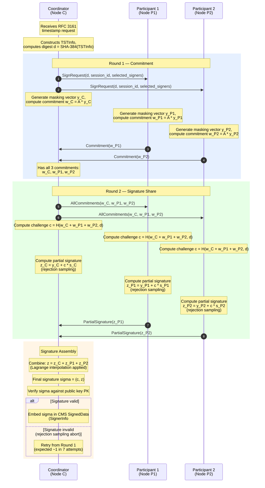
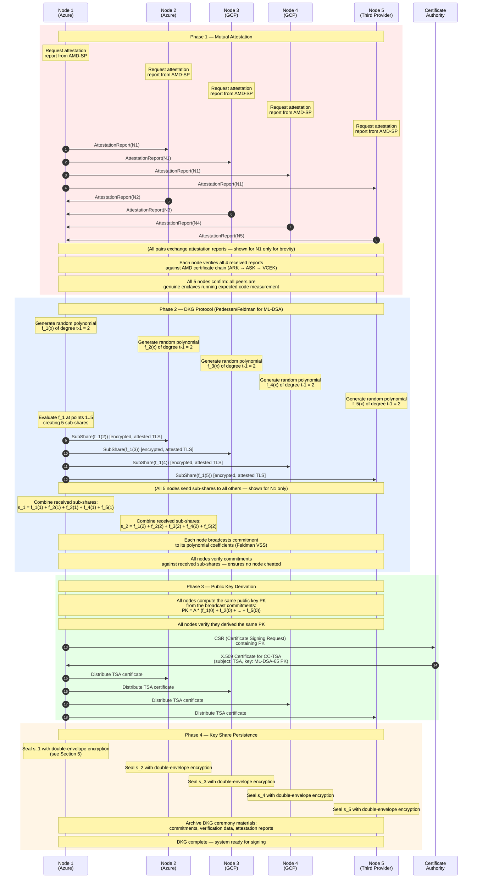
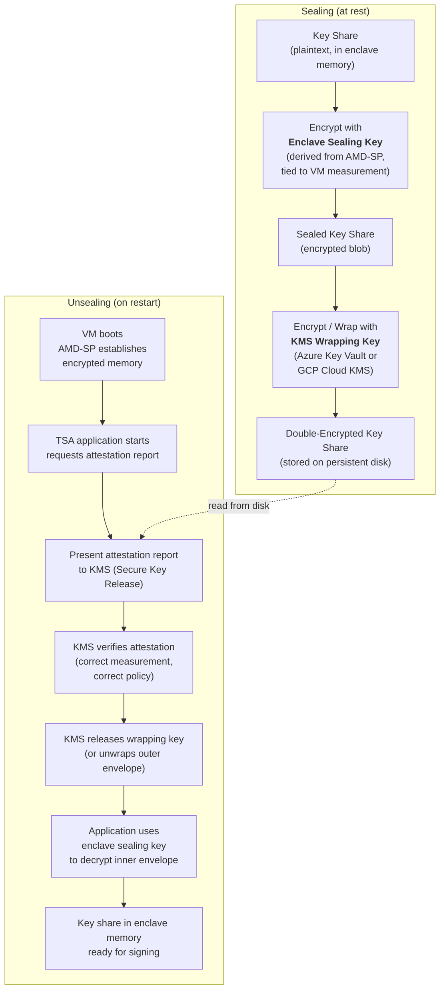
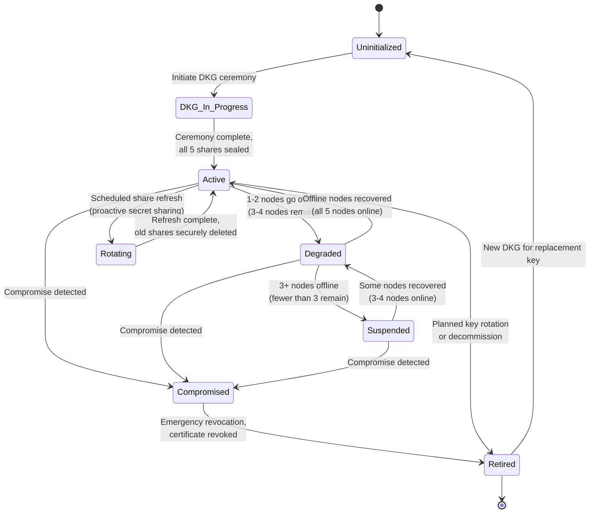
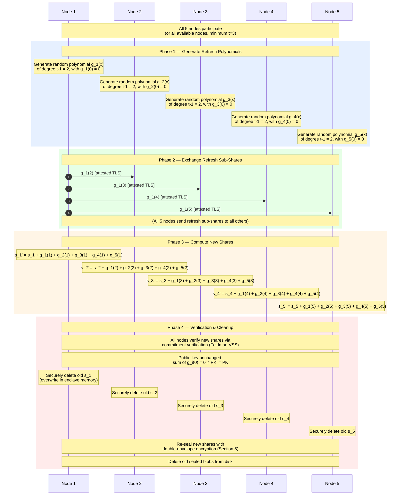

# Quantum-Safe Threshold Cryptography & Key Management

This document describes the cryptographic algorithms, threshold signing protocol, distributed key generation ceremony, and key lifecycle management used by the Confidential Computing Timestamp Authority (CC-TSA). For system architecture and deployment topology, see [Architecture Overview](01-architecture-overview.md). For the hardware-attested execution environment that protects key shares at runtime, see [Confidential Computing and Time](02-confidential-computing-and-time.md).

---

## Table of Contents

1. [Algorithm Selection](#1-algorithm-selection)
2. [Hybrid Token Structure](#2-hybrid-token-structure)
3. [Threshold ML-DSA](#3-threshold-ml-dsa)
4. [Distributed Key Generation (DKG)](#4-distributed-key-generation-dkg)
5. [Key Share Persistence — Double-Envelope Encryption](#5-key-share-persistence--double-envelope-encryption)
6. [Key Lifecycle State Diagram](#6-key-lifecycle-state-diagram)
7. [Proactive Secret Sharing](#7-proactive-secret-sharing)

---

## 1. Algorithm Selection

CC-TSA uses a deliberate three-algorithm strategy: a primary post-quantum signature, a classical companion for backward compatibility, and a conservative hash-based backup for catastrophic lattice breaks. Every timestamp token carries the first two signatures simultaneously; the third is held in reserve.

### Primary: ML-DSA-65 (FIPS 204)

ML-DSA-65 is the NIST post-quantum digital signature standard, formerly known as CRYSTALS-Dilithium. It provides Security Level 3 (~143-bit classical security, ~128-bit quantum security) based on the hardness of the Module Learning With Errors (Module-LWE) problem.

Key characteristics:

- **Signature size**: ~3,309 bytes
- **Public key size**: ~1,952 bytes
- **Signing performance**: ~100,000 signatures/sec on modern hardware — more than sufficient for TSA workloads
- **Verification performance**: ~100,000 verifications/sec

**Why ML-DSA-65 and not ML-DSA-44 or ML-DSA-87?** Security Level 3 strikes the right balance between security margin and operational efficiency. ML-DSA-44 (Level 2) provides ~107-bit classical / ~99-bit quantum security, which falls below conservative recommendations for timestamps that may need to remain valid for decades. ML-DSA-87 (Level 5) roughly doubles the signature size to ~4,627 bytes with diminishing security returns — the jump from 128-bit to 192-bit quantum security does not justify the bandwidth and storage cost for every timestamp token.

### Classical Companion: ECDSA P-384

ECDSA over the NIST P-384 curve provides backward compatibility with existing timestamp verifiers that do not yet support post-quantum algorithms. P-384 offers 192-bit classical security.

Key characteristics:

- **Signature size**: ~96 bytes
- **Public key size**: ~97 bytes
- **Signing performance**: ~50,000 signatures/sec
- **Verification performance**: ~20,000 verifications/sec

Every CC-TSA timestamp token carries **both** an ECDSA P-384 signature and an ML-DSA-65 signature. Classical verifiers process the ECDSA signature and ignore the ML-DSA `SignerInfo`; quantum-aware verifiers can validate both. This hybrid approach ensures that tokens are verifiable today and remain secure against future quantum attacks. See [RFC 3161 Compliance](06-rfc3161-compliance.md) for details on the dual-`SignerInfo` CMS structure.

### Conservative Backup: SLH-DSA-128f (FIPS 205)

SLH-DSA-128f (formerly SPHINCS+) is a stateless hash-based signature scheme. Its security relies exclusively on the collision resistance of the underlying hash function — it would survive even a complete break of lattice-based cryptography.

Key characteristics:

- **Signature size**: ~17,088 bytes (much larger than ML-DSA-65)
- **Public key size**: ~64 bytes
- **Signing performance**: ~100 signatures/sec (much slower than ML-DSA-65)
- **Verification performance**: ~1,000 verifications/sec

SLH-DSA-128f is **not used in normal operation**. It serves as an emergency fallback: a pre-generated SLH-DSA backup key is stored, certified by the CA, and held in sealed storage. If ML-DSA is cryptanalytically broken, CC-TSA can activate the SLH-DSA key and resume signing within minutes — at reduced throughput, but with uncompromised security. See [Failure Modes and Recovery](04-failure-modes-and-recovery.md) for the activation procedure.

### Algorithm Comparison Table

| Property | ML-DSA-65 | ECDSA P-384 | SLH-DSA-128f |
|---|---|---|---|
| **Security basis** | Lattice (Module-LWE) | Elliptic curve DLP | Hash functions |
| **Quantum safe** | Yes | No | Yes |
| **Signature size** | 3,309 B | 96 B | 17,088 B |
| **Public key size** | 1,952 B | 97 B | 64 B |
| **Sign performance** | ~100K/sec | ~50K/sec | ~100/sec |
| **Verify performance** | ~100K/sec | ~20K/sec | ~1K/sec |
| **Threshold friendly** | Yes (recent research) | Yes (well-studied) | No (stateless = hard to threshold) |
| **FIPS standard** | FIPS 204 | FIPS 186-5 | FIPS 205 |
| **Role in CC-TSA** | **Primary PQC** | **Classical companion** | **Emergency backup** |

---

## 2. Hybrid Token Structure

Each CC-TSA timestamp token is a standard CMS `SignedData` structure (RFC 5652) containing RFC 3161 `TSTInfo` content, signed by **two** `SignerInfo` entries — one classical (ECDSA P-384) and one post-quantum (ML-DSA-65). Both signatures cover the identical `TSTInfo` payload.

**Verification modes:**

- **Classical-only verifier**: Validates `SignerInfo #1` (ECDSA P-384), ignores `SignerInfo #2`. Uses the ECDSA TSA certificate from the `certificates` field. This is the standard RFC 3161 verification path and works with all existing tooling.
- **Quantum-aware verifier**: Validates `SignerInfo #2` (ML-DSA-65), optionally also validates `SignerInfo #1`. Uses the ML-DSA TSA certificate. Provides quantum-safe assurance.
- **Belt-and-suspenders verifier**: Validates both `SignerInfo` entries and requires both to pass. Highest assurance — detects compromise of either algorithm.

For full details on the CMS encoding, OID assignments, and backward compatibility considerations, see [RFC 3161 Compliance](06-rfc3161-compliance.md).

---

## 3. Threshold ML-DSA

### Background

Traditional threshold signatures split a signing key into **shares** distributed across multiple parties. Any subset of **t** shares (from a total of **n**) can collaborate to produce a valid signature, but fewer than **t** shares reveal nothing about the key. The resulting signature is **indistinguishable** from a single-signer signature — verifiers do not need to know that a threshold scheme was used.

For ML-DSA, threshold protocols are based on recent cryptographic research. The CC-TSA design draws on the framework described in Cozzo & Smart ("Sharing the LUOV and ML-DSA", USENIX Security '26 research track), which adapts Shamir-style secret sharing and verifiable secret sharing to the lattice-based structure of ML-DSA. The key insight is that ML-DSA's signing operation — which involves sampling a masking vector, computing a commitment, and then a response — can be distributed across parties such that the masking and response are computed in shares, while the final combination yields a valid single-signer signature.

### Protocol Overview

CC-TSA uses a **3-of-5** threshold scheme:

- **5 enclave nodes** each hold a distinct key share
- **Any 3 nodes** can collaborate to produce a valid ML-DSA-65 signature
- The signing key is **never reconstructed** at any point — not during DKG, not during signing, not during key share refresh
- The output signature is a standard ML-DSA-65 signature; verifiers cannot distinguish it from a single-signer signature

### Threshold Signing Protocol (2 Rounds)

The following diagram illustrates the two-round threshold signing protocol. The **Coordinator** is the enclave node that received the incoming timestamp request (via the load balancer); it also serves as one of the three signing participants.

**Performance characteristics:**

- The 2-round protocol adds approximately **1-2ms latency** over single-signer ML-DSA signing.
- With intra-region networking (< 1ms RTT between enclave nodes), total threshold signing completes in **< 5ms**.
- The ECDSA threshold signing (for `SignerInfo #1`) runs in parallel using a similar 2-round protocol, well-studied for elliptic curves.
- Rejection sampling in ML-DSA means that approximately 1 in 7 attempts will abort and require a retry from Round 1. This is inherent to the ML-DSA design and does not indicate an error. The expected number of rounds to produce a valid signature is approximately 7/6 (~1.17 attempts), contributing negligible overhead.

**Security properties:**

- **No key reconstruction**: The signing key `s` is never assembled in any single location. Each node only ever holds its share `s_i`.
- **Abort security**: If any participant sends an invalid partial signature, the coordinator detects this during final verification and aborts — no partial information about honest shares is leaked.
- **Replay protection**: Each signing session uses a fresh `session_id` and fresh randomness; replayed messages from previous sessions are rejected.

For the full failure-mode analysis of threshold signing (e.g., a participant going offline mid-protocol), see [Failure Modes and Recovery](04-failure-modes-and-recovery.md).

---

## 4. Distributed Key Generation (DKG)

### Overview

Distributed Key Generation is a one-time cryptographic ceremony that creates the 3-of-5 threshold key shares without any single party — or any coalition of fewer than 3 parties — ever seeing the full private key. The protocol is based on Pedersen/Feldman verifiable secret sharing, adapted for the algebraic structure of ML-DSA over module lattices.

**DKG outputs:**

- Each of the 5 enclave nodes receives a unique **key share** `s_i`
- All nodes agree on a common **public key** `PK`
- The public key is embedded in an X.509 certificate issued by the Certificate Authority

**DKG requirements:**

- All 5 nodes must participate (the ceremony cannot proceed with fewer)
- All nodes must pass mutual attestation before any key material is generated
- The ceremony is deterministic once randomness is committed — no node can bias the outcome

### DKG Ceremony Protocol

**Security properties of DKG:**

- **Verifiability**: Feldman's VSS commitments allow every node to verify that the sub-shares it received are consistent with the committed polynomial. A cheating node is detected and the ceremony aborts.
- **No trusted dealer**: There is no single party that generates and distributes shares. Each of the 5 nodes contributes equally to the key generation.
- **Confidentiality**: Sub-shares are transmitted over attested TLS channels — encrypted point-to-point between mutually verified enclaves. No party outside the enclave cluster can observe the sub-shares.
- **Robustness**: If any node fails during DKG (crash, attestation failure, commitment mismatch), the entire ceremony aborts and must be restarted from scratch. This is acceptable because DKG is a one-time event.

A parallel DKG ceremony is run for the ECDSA P-384 threshold key, using the well-established Gennaro et al. protocol for elliptic curve threshold signatures. The same mutual attestation phase is shared between both ceremonies.

For the operational procedures surrounding the DKG ceremony (scheduling, personnel, audit trail), see [Operations and Deployment](05-operations-and-deployment.md).

---

## 5. Key Share Persistence — Double-Envelope Encryption

### Problem

Key shares must survive node restarts, VM migrations, and enclave reboots. However, persisting cryptographic key material to disk introduces a critical risk: the sealed key share must only be recoverable inside a genuine, attested enclave running the correct CC-TSA code. A compromised host OS, a modified VM image, or a rogue operator must not be able to decrypt the key share.

### Solution: Double-Envelope Encryption

CC-TSA protects each key share with two independent layers of encryption. Both layers must be unwrapped to recover the plaintext key share, and each layer is bound to a different trust anchor.

### Unsealing Procedure (on restart)

1. **VM boots**: AMD SEV-SNP Secure Processor establishes encrypted memory for the confidential VM. The host OS and hypervisor cannot read guest memory.
2. **Application starts**: The CC-TSA application initializes inside the enclave and requests an attestation report from the AMD Secure Processor. This report binds the VM's launch measurement, guest policy, and platform identity.
3. **Attestation to KMS**: The application presents the attestation report to the cloud KMS (Azure Key Vault with Managed HSM or GCP Cloud KMS) via a Secure Key Release / Confidential Key Release API.
4. **KMS verification**: The KMS verifies the attestation report against a pre-configured policy — checking that the launch measurement matches the expected CC-TSA build, that the guest policy enforces the required security settings, and that the platform certificate chains to AMD's root of trust.
5. **Wrapping key release**: Upon successful verification, the KMS releases the wrapping key (or directly unwraps the outer encryption layer of the sealed blob).
6. **Inner envelope decryption**: The application uses the enclave sealing key (derived from AMD-SP hardware, tied to the specific VM measurement) to decrypt the inner envelope.
7. **Key share ready**: The plaintext key share is now in encrypted enclave memory — accessible only to the CC-TSA process, protected by hardware-enforced memory encryption.

### Why Double Envelope?

| Approach | Weakness | Risk |
|---|---|---|
| **Sealing key alone** | Tied to hardware and VM measurement. If the VM image is updated (e.g., security patch), the sealing key changes and old sealed blobs cannot be decrypted. Additionally, AMD VCEK may rotate during platform maintenance. | Key share becomes permanently inaccessible after routine updates. |
| **KMS alone** | The KMS cannot independently verify that the requesting process runs inside a genuine enclave. A compromised host OS could impersonate the application. Additionally, the cloud provider has theoretical access to KMS-managed keys. | Key share exposed to compromised host or rogue cloud operator. |
| **Both together** | Neither weakness applies in isolation. KMS verifies attestation before releasing the wrapping key (ensures genuine enclave). Sealing key ensures only the correct enclave measurement can decrypt the inner layer (ensures correct code). | Defense in depth — both layers must be defeated simultaneously. |

This double-envelope design is essential for the multi-cloud deployment model described in [Architecture Overview](01-architecture-overview.md). Azure nodes use Azure Key Vault with Managed HSM; GCP nodes use GCP Cloud KMS with Confidential Key Release. The inner sealing layer is cloud-agnostic (AMD SEV-SNP on both platforms). See [Confidential Computing and Time](02-confidential-computing-and-time.md) for details on the AMD SEV-SNP attestation model.

---

## 6. Key Lifecycle State Diagram

The threshold signing key progresses through a well-defined set of states from initial generation to eventual retirement. The following state diagram captures all valid states and transitions.

### State Descriptions

| State | Description | Signing Capability |
|---|---|---|
| **Uninitialized** | No key material exists. The system is awaiting a DKG ceremony. | None |
| **DKG In Progress** | The distributed key generation ceremony is running. All 5 nodes must be online and mutually attested. | None (ceremony in progress) |
| **Active** | All 5 key shares are distributed and sealed. The system is fully operational. | Full — any 3 of 5 nodes can sign |
| **Degraded** | 1-2 nodes are offline (3-4 nodes remain). Signing continues but fault tolerance is reduced. | Reduced margin — still operational |
| **Suspended** | Fewer than 3 nodes are online. Signing is halted because the threshold cannot be met. | None — halted |
| **Rotating** | Proactive share refresh is in progress (see Section 7). The public key does not change. Signing may be briefly paused during the refresh. | Paused during refresh (~seconds) |
| **Compromised** | A key compromise has been detected (e.g., a share leaked, anomalous signing behavior). Emergency procedures are activated. | Halted immediately |
| **Retired** | The key has been decommissioned. The corresponding certificate is revoked or expired. Existing timestamps signed by this key remain valid (certificate was valid at signing time). | None — permanently decommissioned |

### Monitoring and Alerts

State transitions generate alerts through the monitoring infrastructure described in [Operations and Deployment](05-operations-and-deployment.md):

- **Active to Degraded**: Warning — reduced fault tolerance. Operations team investigates and recovers the offline node(s).
- **Degraded to Suspended**: Critical — signing halted. Immediate response required.
- **Any state to Compromised**: Critical — emergency revocation procedure initiated. See [Failure Modes and Recovery](04-failure-modes-and-recovery.md) for the compromise response playbook.

---

## 7. Proactive Secret Sharing

### Why Refresh Shares?

Even without a confirmed compromise, periodic share refresh (proactive secret sharing) limits the window during which a stolen share is useful. Consider the following attack scenario:

1. An attacker exfiltrates a single key share `s_i` at time T.
2. The attacker now needs to steal 2 more shares to meet the 3-of-5 threshold.
3. If shares are refreshed at time T + 30 days, the stolen share `s_i` becomes mathematically unrelated to the new share `s_i'` held by node `i`.
4. The attacker must start over — their stolen share is worthless.

Share refresh also enables **node replacement**: when a node is decommissioned and replaced, the new node receives a fresh share during the refresh, and the old node's share is invalidated. No trust in the decommissioned node is required after the refresh.

### Protocol

The share refresh protocol uses the same communication pattern as DKG, with one critical difference: the random polynomials have a **zero constant term**, ensuring that the public key does not change.

### Key Properties of Share Refresh

- **Public key invariance**: Because all refresh polynomials have a zero constant term, `g_i(0) = 0` for all `i`. The sum of all `g_i(0)` values is zero, so the secret (the sum of all `f_i(0)` values from the original DKG) is unchanged. Since the public key is derived from the secret, it does not change. The X.509 certificate remains valid.
- **Forward security**: After the refresh, old shares are securely deleted. An attacker who steals a share before the refresh cannot combine it with shares stolen after the refresh — the mathematical relationship between old and new shares is destroyed by the random refresh polynomials.
- **No downtime**: The refresh protocol can be executed while the system is operational. Signing is briefly paused (on the order of seconds) during the transition from old shares to new shares to ensure consistency.

### Schedule

| Trigger | Action |
|---|---|
| **Scheduled (every 30 days)** | Routine proactive refresh. Limits the exposure window for any potentially compromised share. |
| **Node replacement** | When a node is decommissioned and a replacement node is introduced, a share refresh ensures the new node gets a valid share and the old node's share is invalidated. |
| **Suspected share compromise** | If monitoring detects anomalous behavior suggesting a share may have been exposed (see [Threat Model](07-threat-model.md)), an immediate refresh is triggered. |
| **Policy change** | Changes to the threshold parameters (e.g., moving from 3-of-5 to 4-of-7) require a fresh DKG, not just a refresh. |

For the operational procedures surrounding share refresh (automation, monitoring, rollback), see [Operations and Deployment](05-operations-and-deployment.md).

---

## References

1. NIST FIPS 204 — Module-Lattice-Based Digital Signature Standard (ML-DSA)
2. NIST FIPS 205 — Stateless Hash-Based Digital Signature Standard (SLH-DSA)
3. NIST FIPS 186-5 — Digital Signature Standard (DSS), including ECDSA
4. RFC 3161 — Internet X.509 Public Key Infrastructure Time-Stamp Protocol (TSP)
5. RFC 5652 — Cryptographic Message Syntax (CMS)
6. Cozzo, D. & Smart, N.P. — "Sharing the LUOV and ML-DSA" (USENIX Security '26 Research Track)
7. Pedersen, T.P. — "Non-Interactive and Information-Theoretic Secure Verifiable Secret Sharing" (CRYPTO '91)
8. Feldman, P. — "A Practical Scheme for Non-Interactive Verifiable Secret Sharing" (FOCS '87)
9. Herzberg, A., Jarecki, S., Krawczyk, H., Yung, M. — "Proactive Secret Sharing, Or: How to Cope with Perpetual Leakage" (CRYPTO '95)
10. AMD SEV-SNP — Strengthening VM Isolation with Integrity Protection and More (AMD White Paper)
