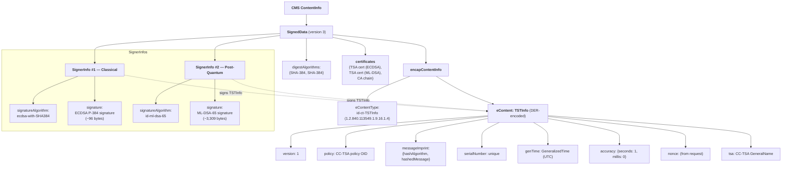
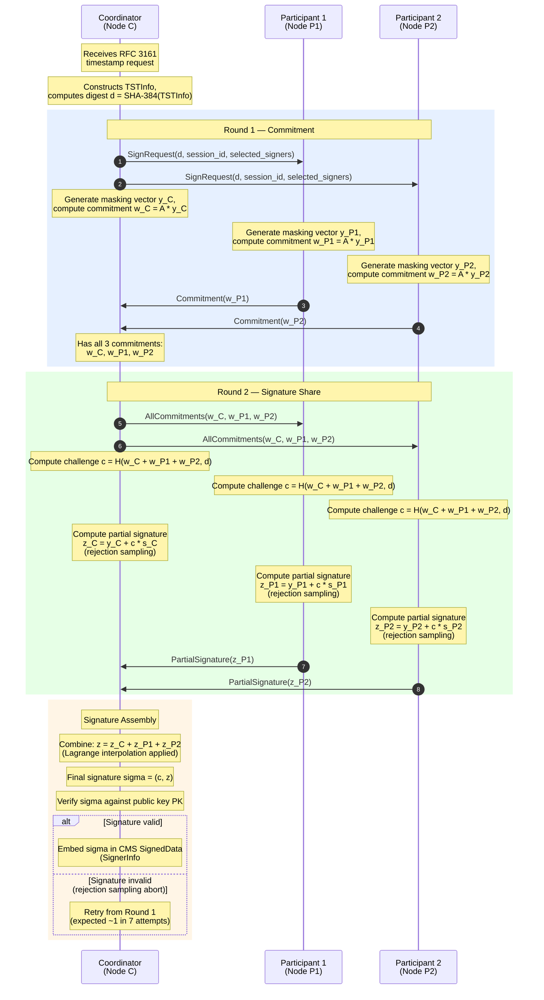
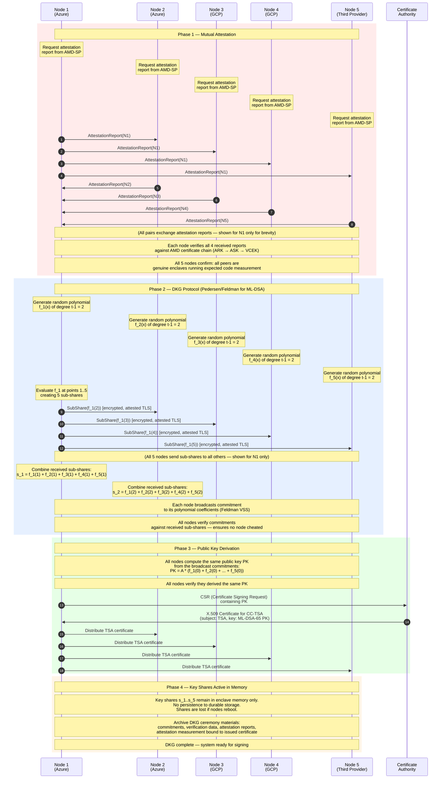
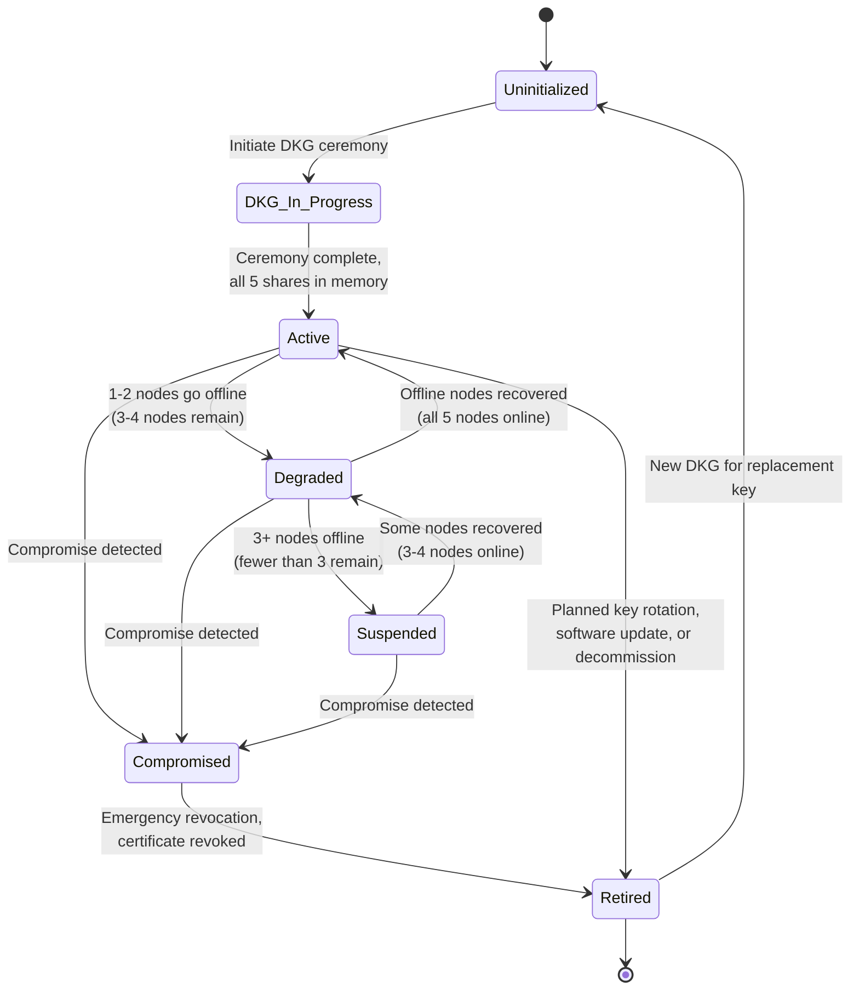

# Quantum-Safe Threshold Cryptography & Key Management

This document describes the cryptographic algorithms, threshold signing protocol, distributed key generation ceremony, and key lifecycle management
used by the Confidential Computing Timestamp Authority (CC-TSA). For system architecture and deployment topology,
see [Architecture Overview](01-architecture-overview.md). For the hardware-attested execution environment that protects key shares at runtime,
see [Confidential Computing and Time](02-confidential-computing-and-time.md).

> **Implementation status**: The PoC implements single-signer ECDSA P-384 signing inside the CVM core.
> The threshold ML-DSA-65 protocol, DKG ceremony, hybrid dual-signature tokens, and key lifecycle
> management described in this document are design targets not yet implemented.

---

## Table of Contents

1. [Algorithm Selection](#1-algorithm-selection)
2. [Hybrid Token Structure](#2-hybrid-token-structure)
3. [Threshold ML-DSA](#3-threshold-ml-dsa)
4. [Distributed Key Generation (DKG)](#4-distributed-key-generation-dkg)
5. [Key Share Storage](#5-key-share-storage)
6. [Key Lifecycle State Diagram](#6-key-lifecycle-state-diagram)

---

## 1. Algorithm Selection

CC-TSA uses a deliberate three-algorithm strategy: a primary post-quantum signature, a classical companion for backward compatibility,
and a conservative hash-based backup for catastrophic lattice breaks. Every timestamp token carries the first two signatures simultaneously;
the third is held in reserve.

### Primary: ML-DSA-65 (FIPS 204)

ML-DSA-65 is the NIST post-quantum digital signature standard, formerly known as CRYSTALS-Dilithium.
It provides Security Level 3 (~143-bit classical security, ~128-bit quantum security) based on the hardness of the Module Learning With Errors (Module-LWE) problem.

Key characteristics:

- **Signature size**: ~3,309 bytes
- **Public key size**: ~1,952 bytes
- **Signing performance**: ~100,000 signatures/sec on modern hardware — more than sufficient for TSA workloads
- **Verification performance**: ~100,000 verifications/sec

**Why ML-DSA-65 and not ML-DSA-44 or ML-DSA-87?** Security Level 3 strikes the right balance between security margin and operational efficiency.
ML-DSA-44 (Level 2) provides ~107-bit classical / ~99-bit quantum security, which falls below conservative recommendations for timestamps
that may need to remain valid for decades. ML-DSA-87 (Level 5) roughly doubles the signature size to ~4,627 bytes with diminishing security returns —
the jump from 128-bit to 192-bit quantum security does not justify the bandwidth and storage cost for every timestamp token.

### Classical Companion: ECDSA P-384

ECDSA over the NIST P-384 curve provides backward compatibility with existing timestamp verifiers that do not yet support post-quantum algorithms. P-384 offers 192-bit classical security.

Key characteristics:

- **Signature size**: ~96 bytes
- **Public key size**: ~97 bytes
- **Signing performance**: ~50,000 signatures/sec
- **Verification performance**: ~20,000 verifications/sec

Every CC-TSA timestamp token carries **both** an ECDSA P-384 signature and an ML-DSA-65 signature.
Classical verifiers process the ECDSA signature and ignore the ML-DSA `SignerInfo`; quantum-aware verifiers can validate both.
This hybrid approach ensures that tokens are verifiable today and remain secure against future quantum attacks.
See [RFC 3161 Compliance](06-rfc3161-compliance.md) for details on the dual-`SignerInfo` CMS structure.

### Conservative Backup: SLH-DSA-128f (FIPS 205)

SLH-DSA-128f (formerly SPHINCS+) is a stateless hash-based signature scheme. Its security relies exclusively on the collision resistance
of the underlying hash function — it would survive even a complete break of lattice-based cryptography.

Key characteristics:

- **Signature size**: ~17,088 bytes (much larger than ML-DSA-65)
- **Public key size**: ~64 bytes
- **Signing performance**: ~100 signatures/sec (much slower than ML-DSA-65)
- **Verification performance**: ~1,000 verifications/sec

SLH-DSA-128f is **not used in normal operation**. It serves as an emergency fallback: if ML-DSA is cryptanalytically broken,
CC-TSA can perform a new DKG ceremony using SLH-DSA and resume signing with a new certificate — at reduced throughput, but with uncompromised security.
See [Failure Modes and Recovery](04-failure-modes-and-recovery.md) for the activation procedure.

### Algorithm Comparison Table

| Property | ML-DSA-65 | ECDSA P-384 | SLH-DSA-128f |
|---|---|---|---|
| **Security basis** | Lattice (Module-LWE) | Elliptic curve DLP | Hash functions |
| **Quantum safe** | Yes | No | Yes |
| **Signature size** | 3,309 B | 96 B | 17,088 B |
| **Public key size** | 1,952 B | 97 B | 64 B |
| **Sign performance** | ~100K/sec | ~50K/sec | ~100/sec |
| **Verify performance** | ~100K/sec | ~20K/sec | ~1K/sec |
| **Threshold friendly** | Yes (recent research) | Yes (well-studied) | No (stateless = hard to threshold) |
| **FIPS standard** | FIPS 204 | FIPS 186-5 | FIPS 205 |
| **Role in CC-TSA** | **Primary PQC** | **Classical companion** | **Emergency backup** |

---

## 2. Hybrid Token Structure

Each CC-TSA timestamp token is a standard CMS `SignedData` structure (RFC 5652) containing RFC 3161 `TSTInfo` content,
signed by **two** `SignerInfo` entries — one classical (ECDSA P-384) and one post-quantum (ML-DSA-65).
Both signatures cover the identical `TSTInfo` payload.

**Verification modes:**

- **Classical-only verifier**: Validates `SignerInfo #1` (ECDSA P-384), ignores `SignerInfo #2`. Uses the ECDSA TSA certificate from the `certificates` field.
This is the standard RFC 3161 verification path and works with all existing tooling.
- **Quantum-aware verifier**: Validates `SignerInfo #2` (ML-DSA-65), optionally also validates `SignerInfo #1`. Uses the ML-DSA TSA certificate. Provides quantum-safe assurance.
- **Belt-and-suspenders verifier**: Validates both `SignerInfo` entries and requires both to pass. Highest assurance — detects compromise of either algorithm.

For full details on the CMS encoding, OID assignments, and backward compatibility considerations, see [RFC 3161 Compliance](06-rfc3161-compliance.md).

---

## 3. Threshold ML-DSA

### Background

Traditional threshold signatures split a signing key into **shares** distributed across multiple parties.
Any subset of **t** shares (from a total of **n**) can collaborate to produce a valid signature,
but fewer than **t** shares reveal nothing about the key. The resulting signature is **indistinguishable** from a single-signer signature —
verifiers do not need to know that a threshold scheme was used.

For ML-DSA, threshold protocols are based on recent cryptographic research. The CC-TSA design draws on the framework described in
Cozzo & Smart ("Sharing the LUOV and ML-DSA", USENIX Security '26 research track), which adapts Shamir-style secret sharing
and verifiable secret sharing to the lattice-based structure of ML-DSA. The key insight is that ML-DSA's signing operation —
which involves sampling a masking vector, computing a commitment, and then a response — can be distributed across parties
such that the masking and response are computed in shares, while the final combination yields a valid single-signer signature.

### Protocol Overview

CC-TSA uses a **3-of-5** threshold scheme:

- **5 enclave nodes** each hold a distinct key share
- **Any 3 nodes** can collaborate to produce a valid ML-DSA-65 signature
- The signing key is **never reconstructed** at any point — not during DKG, not during signing
- The output signature is a standard ML-DSA-65 signature; verifiers cannot distinguish it from a single-signer signature

### Threshold Signing Protocol (2 Rounds)

The following diagram illustrates the two-round threshold signing protocol. The **Coordinator** is the enclave node that received
the incoming timestamp request (via the load balancer); it also serves as one of the three signing participants.

**Performance characteristics:**

- The 2-round protocol requires two network round-trips between the coordinator and participants. Latency is dominated by network distance, not cryptographic computation.
- The ECDSA threshold signing (for `SignerInfo #1`) runs in parallel using a similar 2-round protocol, well-studied for elliptic curves.
- Rejection sampling in ML-DSA means that approximately 1 in 7 attempts will abort and require a retry from Round 1.
This is inherent to the ML-DSA design and does not indicate an error. The expected number of rounds to produce a valid signature
is approximately 7/6 (~1.17 attempts), contributing negligible overhead.
- The overall signing latency is well within the 1-second end-to-end round-trip budget for all deployment topologies, including multi-provider configurations.

**Security properties:**

- **No key reconstruction**: The signing key `s` is never assembled in any single location. Each node only ever holds its share `s_i`.
- **Abort security**: If any participant sends an invalid partial signature, the coordinator detects this during final verification and aborts — no partial information about honest shares is leaked.
- **Replay protection**: Each signing session uses a fresh `session_id` and fresh randomness; replayed messages from previous sessions are rejected.

For the full failure-mode analysis of threshold signing (e.g., a participant going offline mid-protocol), see [Failure Modes and Recovery](04-failure-modes-and-recovery.md).

---

## 4. Distributed Key Generation (DKG)

### Overview

Distributed Key Generation (DKG) is the cryptographic ceremony that creates the 3-of-5 threshold key shares without any single party —
or any coalition of fewer than 3 parties — ever seeing the full private key. DKG runs on first boot when no key material exists,
and again whenever the cluster must be reconstituted (e.g., after quorum loss or a software update requiring new key material).
The protocol is based on Pedersen/Feldman verifiable secret sharing, adapted for the algebraic structure of ML-DSA over module lattices.

**DKG outputs:**

- Each of the 5 enclave nodes receives a unique **key share** `s_i`
- All nodes agree on a common **public key** `PK`
- The public key is embedded in an X.509 certificate issued by the Certificate Authority

**DKG requirements:**

- All 5 nodes must participate (the ceremony cannot proceed with fewer)
- All nodes must pass mutual attestation before any key material is generated
- The ceremony is deterministic once randomness is committed — no node can bias the outcome

### DKG Ceremony Protocol

**Security properties of DKG:**

- **Verifiability**: Feldman's VSS commitments allow every node to verify that the sub-shares it received are consistent
with the committed polynomial. A cheating node is detected and the ceremony aborts.
- **No trusted dealer**: There is no single party that generates and distributes shares. Each of the 5 nodes contributes equally to the key generation.
- **Confidentiality**: Sub-shares are transmitted over attested TLS channels — encrypted point-to-point between mutually verified enclaves.
No party outside the enclave cluster can observe the sub-shares.
- **Robustness**: If any node fails during DKG (crash, attestation failure, commitment mismatch), the entire ceremony aborts
and must be restarted from scratch. This is acceptable because the ceremony is automated and can be retried immediately.

A parallel DKG ceremony is run for the ECDSA P-384 threshold key, using the well-established Gennaro et al. protocol
for elliptic curve threshold signatures. The same mutual attestation phase is shared between both ceremonies.

For the operational procedures surrounding the DKG ceremony (scheduling, personnel, audit trail), see [Operations and Deployment](05-operations-and-deployment.md).

---

## 5. Key Share Storage

Key shares exist **only in enclave memory**. They are not persisted to durable storage in any form — no disk encryption, no KMS wrapping, no sealed blobs.

### Design Properties

- **No at-rest key material**: Key shares are never written to disk, cloud storage, or any medium outside the enclave's hardware-encrypted memory.
If a node shuts down, reboots, or crashes, its key share is irrecoverably lost. This is by design.
- **Eliminated attack surface**: There is no sealed key share to steal, no wrapping key to compromise, and no KMS policy to subvert.
The only way to obtain a key share is to read it from a running enclave's memory — which AMD SEV-SNP is specifically designed to prevent.
- **Simplified trust model**: The trust model does not depend on cloud KMS services or their attestation policy configurations.
Trust is rooted entirely in the hardware attestation of the running enclave and the software measurement bound to the TSA certificate.
- **Recovery by reconstitution**: If the cluster loses quorum (fewer than 3 nodes remain running), a new DKG ceremony is required.
This produces new key shares, a new public key, and requires a new TSA certificate.
Old timestamps signed under the previous certificate remain valid.

### Trade-offs

The ephemeral key model trades persistence for simplicity and security:

| Property | Ephemeral (memory-only) | Persistent (at-rest encryption) |
|---|---|---|
| **Survives node reboot** | No — share is lost | Yes — share can be unsealed |
| **Attack surface** | Memory only (hardware-protected) | Memory + disk + KMS + attestation policy |
| **Operator influence** | Cannot change running software without new DKG | Can update KMS attestation policy to accept new measurements |
| **Recovery from quorum loss** | New DKG + new certificate | Unseal existing shares from storage |
| **Trust dependencies** | AMD SEV-SNP hardware only | AMD SEV-SNP + cloud KMS + attestation policy management |

The ephemeral model is preferred because it eliminates the trust contradiction inherent in operator-managed KMS attestation policies.
See [Architecture Overview](01-architecture-overview.md) Section 8 for the full rationale.

---

## 6. Key Lifecycle State Diagram

The threshold signing key progresses through a well-defined set of states from initial generation to eventual retirement. The following state diagram captures all valid states and transitions.

### State Descriptions

| State | Description | Signing Capability |
|---|---|---|
| **Uninitialized** | No key material exists. The system is awaiting a DKG ceremony. This is the initial state and also the state after key retirement when new key material is needed. | None |
| **DKG In Progress** | The distributed key generation ceremony is running. All 5 nodes must be online and mutually attested. This occurs on initial setup and whenever the cluster is reconstituted (e.g., after quorum loss or software update). | None (ceremony in progress) |
| **Active** | All 5 key shares are distributed and held in enclave memory. The system is fully operational. | Full — any 3 of 5 nodes can sign |
| **Degraded** | 1-2 nodes are offline (3-4 nodes remain). Signing continues but fault tolerance is reduced. Lost shares cannot be recovered — if quorum is lost, a new DKG is required. | Reduced margin — still operational |
| **Suspended** | Fewer than 3 nodes are online. Signing is halted because the threshold cannot be met. Recovery requires a new DKG ceremony and new certificate. | None — halted |
| **Compromised** | A key compromise has been detected (e.g., a share leaked, anomalous signing behavior). Emergency procedures are activated. | Halted immediately |
| **Retired** | The key has been decommissioned. The corresponding certificate is revoked or expired. Existing timestamps signed by this key remain valid (certificate was valid at signing time). | None — permanently decommissioned |

### Monitoring and Alerts

State transitions generate alerts through the monitoring infrastructure described in [Operations and Deployment](05-operations-and-deployment.md):

- **Active to Degraded**: Warning — reduced fault tolerance. Operations team investigates and recovers the offline node(s).
- **Degraded to Suspended**: Critical — signing halted. Immediate response required.
- **Any state to Compromised**: Critical — emergency revocation procedure initiated. See [Failure Modes and Recovery](04-failure-modes-and-recovery.md) for the compromise response playbook.

---

## References

1. NIST FIPS 204 — Module-Lattice-Based Digital Signature Standard (ML-DSA)
2. NIST FIPS 205 — Stateless Hash-Based Digital Signature Standard (SLH-DSA)
3. NIST FIPS 186-5 — Digital Signature Standard (DSS), including ECDSA
4. RFC 3161 — Internet X.509 Public Key Infrastructure Time-Stamp Protocol (TSP)
5. RFC 5652 — Cryptographic Message Syntax (CMS)
6. Cozzo, D. & Smart, N.P. — "Sharing the LUOV and ML-DSA" (USENIX Security '26 Research Track)
7. Pedersen, T.P. — "Non-Interactive and Information-Theoretic Secure Verifiable Secret Sharing" (CRYPTO '91)
8. Feldman, P. — "A Practical Scheme for Non-Interactive Verifiable Secret Sharing" (FOCS '87)
9. AMD SEV-SNP — Strengthening VM Isolation with Integrity Protection and More (AMD White Paper)
