# Failure Modes & Recovery

> **Audience**: Operations, SRE, Architects, Security Engineers
>
> **Related documents**:
> - [Architecture Overview](01-architecture-overview.md) — system topology and component roles
> - [Confidential Computing and Time](02-confidential-computing-and-time.md) — AMD SEV-SNP, SecureTSC, attestation
> - [Quantum-Safe Threshold Crypto](03-quantum-safe-threshold-crypto.md) — DKG, proactive share refresh, key lifecycle
> - [Operations and Deployment](05-operations-and-deployment.md) — deployment procedures, monitoring, alerting
> - [Threat Model](07-threat-model.md) — adversarial scenarios and mitigations

This document defines every failure scenario the CC-TSA system can encounter, the impact of each, and the exact recovery procedures to follow. The CC-TSA uses a **3-of-5 threshold signing** configuration: 5 AMD SEV-SNP enclave nodes each hold one key share, and a minimum of 3 nodes must be online to produce a valid timestamp signature. Key shares are persisted using **double-envelope encryption** (enclave sealing key + KMS wrapping key), meaning key material survives node restarts and even complete cluster outages.

---

## 1. Failure Mode Decision Tree

Use this decision tree as the first step in any incident. Count how many nodes are offline and follow the corresponding path.

```mermaid
flowchart TD
    START["🔍 How many nodes are offline?"]

    START -->|0 offline<br/>5 online| H["✅ HEALTHY<br/>Full redundancy<br/>No action needed"]
    START -->|1 offline<br/>4 online| D["⚠️ DEGRADED<br/>Signing continues<br/>Alert on-call<br/>Recover failed node"]
    START -->|2 offline<br/>3 online| C["🔶 CRITICAL<br/>Signing continues but ZERO margin<br/>Page on-call immediately<br/>Recover nodes urgently"]
    START -->|3 offline<br/>2 online| U1["🔴 UNAVAILABLE<br/>Signing HALTED — below threshold<br/>Key material preserved<br/>Recover ≥1 node to resume"]
    START -->|4 offline<br/>1 online| U2["🔴 UNAVAILABLE<br/>Signing HALTED<br/>Recover ≥2 nodes to resume"]
    START -->|5 offline<br/>0 online| FO["🔴 FULL OUTAGE<br/>Signing HALTED<br/>All key shares in sealed storage<br/>Execute full recovery procedure<br/>See Section 5"]

    H --> KS1["Key material safe? YES<br/>All shares active in enclaves"]
    D --> KS2["Key material safe? YES<br/>Failed node's share sealed<br/>in KMS-backed storage"]
    C --> KS3["Key material safe? YES<br/>Failed nodes' shares sealed<br/>in KMS-backed storage"]
    U1 --> KS4["Key material safe? YES<br/>All shares sealed<br/>in KMS-backed storage"]
    U2 --> KS5["Key material safe? YES<br/>All shares sealed<br/>in KMS-backed storage"]
    FO --> KS6["Key material safe? YES<br/>All shares sealed<br/>in KMS-backed storage"]

    style H fill:#2d6a2d,color:#fff
    style D fill:#b8860b,color:#fff
    style C fill:#cc6600,color:#fff
    style U1 fill:#8b0000,color:#fff
    style U2 fill:#8b0000,color:#fff
    style FO fill:#8b0000,color:#fff
    style KS1 fill:#1a4d1a,color:#fff
    style KS2 fill:#1a4d1a,color:#fff
    style KS3 fill:#1a4d1a,color:#fff
    style KS4 fill:#1a4d1a,color:#fff
    style KS5 fill:#1a4d1a,color:#fff
    style KS6 fill:#1a4d1a,color:#fff
```

**Key takeaway**: In every failure scenario, key material remains safe. The double-envelope encryption (described in [Quantum-Safe Threshold Crypto](03-quantum-safe-threshold-crypto.md)) ensures that sealed shares survive indefinitely in persistent storage, protected by both the enclave sealing key and the KMS wrapping key.

---

## 2. Single Node Failure

A single node failure is the most common failure mode. The system is explicitly designed to tolerate it without any impact on availability or timestamp quality.

### Causes

| Cause | Likelihood | Detection |
|---|---|---|
| VM crash / OOM | Common | Health check failure, monitoring alert |
| Cloud provider host maintenance | Common | Scheduled maintenance notification, health check |
| Availability zone failure | Uncommon | Provider status page, multiple health check failures |
| Application bug / panic | Uncommon | Process exit, crash logs, health check failure |
| Attestation failure (AMD-SP) | Rare | Attestation error logs, node fails to unseal |
| Hardware failure | Rare | Provider-reported hardware event |

### Impact

- **Signing continues** with 4 remaining nodes (threshold = 3, so **1 node of margin** remains)
- **No impact** on timestamp quality — the threshold signature is cryptographically identical whether produced by 3, 4, or 5 nodes
- **No impact** on clock accuracy — the TriHaRd protocol (see [Confidential Computing and Time](02-confidential-computing-and-time.md)) continues to cross-validate time across the 4 remaining nodes
- The failed node's key share remains sealed in double-envelope encryption on persistent disk

### Recovery Procedures

Recovery follows a tiered approach, escalating only if the simpler option fails:

```mermaid
flowchart TD
    FAIL["Single Node Failure Detected"]
    FAIL --> AUTO["Tier 1: Automatic Restart<br/>⏱️ 2–5 minutes"]
    AUTO -->|VM restarts in<br/>same environment| BOOT["Boot → Attest → Unseal → Rejoin"]
    BOOT --> DONE["✅ Node recovered<br/>Cluster returns to HEALTHY"]

    AUTO -->|VM cannot restart<br/>or restart fails| COLD["Tier 2: Cold Standby Activation<br/>⏱️ 5–10 minutes"]
    COLD --> COLDBOOT["Activate pre-provisioned cold standby<br/>in same AZ"]
    COLDBOOT --> COLDATTEST["Boot → Attest → Transfer sealed share<br/>→ Unseal → Rejoin"]
    COLDATTEST --> DONE

    COLD -->|No cold standby<br/>available| NEW["Tier 3: New Node Provisioning<br/>⏱️ 15–30 minutes"]
    NEW --> PROVISION["Provision new AMD SEV-SNP CVM"]
    PROVISION --> DEPLOY["Deploy TSA application"]
    DEPLOY --> ATTEST["Attest → Join cluster"]
    ATTEST --> REFRESH["Run proactive share refresh<br/>to issue new share"]
    REFRESH --> DONE

    style FAIL fill:#b8860b,color:#fff
    style DONE fill:#2d6a2d,color:#fff
    style AUTO fill:#2a5a8a,color:#fff
    style COLD fill:#2a5a8a,color:#fff
    style NEW fill:#2a5a8a,color:#fff
```

**Tier 1 — Automatic Restart** (2-5 minutes):
1. The VM restarts in the same environment (same host or same AZ).
2. On boot, the application automatically runs the **boot → attest → unseal** sequence:
   - The AMD Secure Processor generates a fresh attestation report.
   - The attestation report is presented to the KMS (Azure Key Vault or GCP Cloud KMS).
   - The KMS verifies the attestation and releases the wrapping key.
   - The application unwraps the outer envelope, then uses the enclave sealing key to decrypt the inner envelope, recovering the key share.
3. The node rejoins the cluster and resumes participating in threshold signing.

**Tier 2 — Cold Standby Activation** (5-10 minutes):
1. If the original VM cannot restart (e.g., host hardware failure), activate a pre-provisioned cold standby CVM in the same availability zone.
2. The cold standby has the TSA application pre-installed but no key material.
3. Transfer the sealed share blob from persistent storage to the new VM.
4. The new VM runs the same boot → attest → unseal sequence.
5. The node rejoins the cluster.

**Tier 3 — New Node Provisioning** (15-30 minutes):
1. If no cold standby is available, provision a completely new AMD SEV-SNP confidential VM.
2. Deploy the exact TSA application image (the binary measurement must match the KMS attestation policy).
3. The new node attests and joins the cluster.
4. Run **proactive share refresh** (see [Quantum-Safe Threshold Crypto](03-quantum-safe-threshold-crypto.md)) to generate a new set of key shares that includes the new node. This invalidates the old share that belonged to the failed node.

### Recovery Time Summary

| Tier | Method | Time | Requires |
|---|---|---|---|
| 1 | Automatic restart | 2–5 min | VM environment intact |
| 2 | Cold standby activation | 5–10 min | Pre-provisioned standby VM |
| 3 | New node + share refresh | 15–30 min | Available cloud capacity, ≥3 nodes online for refresh |

---

## 3. Two Node Failure

### Impact

- **Signing continues** — 3 nodes remain, which meets the threshold (t = 3)
- **ZERO fault tolerance margin** — any additional node failure will halt signing
- This is a **CRITICAL** alert — requires immediate human response

### Cause Analysis

When two nodes fail simultaneously, determine whether the failures are correlated:

| Pattern | Likely Cause | Action |
|---|---|---|
| Both nodes in same AZ | AZ failure | Activate DR nodes in other AZs |
| Both nodes on same provider | Provider incident | Activate nodes on other providers |
| Both nodes failed independently | Coincidence or application bug | Investigate root cause, recover both |
| Both nodes failed after update | Deployment issue | Rollback, recover both |

### Recovery

Recovery follows the same tiered procedures as single node failure (Section 2), applied to both failed nodes:

1. **Priority**: Recover at least **1 node** as fast as possible to restore fault tolerance margin (moving from CRITICAL to DEGRADED).
2. **Parallel recovery**: If possible, initiate recovery for both nodes simultaneously.
3. **Regional failure**: If both nodes are in the same AZ or region, this indicates a regional failure. Activate cold standby nodes in a **different** AZ or region rather than waiting for the failed region to recover.
4. After at least 1 node is recovered (cluster returns to DEGRADED), continue recovering the second node at normal priority.

### Monitoring Escalation

| Online Nodes | Status | Alert Level | Response |
|---|---|---|---|
| 5/5 | Healthy | Info | None |
| 4/5 | Degraded | Warning | On-call alert |
| 3/5 | Critical | Critical | Page on-call, incident channel |
| < 3/5 | Unavailable | Emergency | Page all, incident commander |

See [Operations and Deployment](05-operations-and-deployment.md) for detailed alerting configuration and escalation policies.

---

## 4. Three or More Node Failure

### Impact

- **Signing is HALTED** — the cluster is below the threshold (t = 3)
- **No timestamps can be issued** until at least 3 nodes are online
- **Key material is preserved** — every node's share remains sealed in double-envelope encryption (enclave sealing key + KMS wrapping key) on persistent storage

This is a service outage. Clients submitting timestamp requests will receive errors. Upstream systems that depend on timestamping should have retry logic or queue requests for later processing.

### Key Material Safety

Even with all nodes offline, key shares are **never lost** in normal circumstances:

- Each share is encrypted with two layers (see [Quantum-Safe Threshold Crypto](03-quantum-safe-threshold-crypto.md)):
  - **Inner envelope**: Encrypted with the enclave sealing key (derived from the platform's hardware root of trust)
  - **Outer envelope**: Encrypted with a KMS wrapping key (Azure Key Vault or GCP Cloud KMS)
- The sealed share blobs persist on disk (or in cloud storage) independent of VM lifecycle.
- The KMS services are separate highly-available systems that survive CC-TSA node failures.

### Recovery

1. **Recover any 1 node** to reach 3 online — this restores signing capability.
2. Each recovered node follows the standard sequence:
   - **Boot** the CVM (restart existing or provision new)
   - **Attest** — AMD-SP generates attestation report
   - **KMS releases wrapping key** — KMS verifies attestation, releases the outer envelope key
   - **Unseal share** — Application decrypts inner envelope with enclave sealing key
   - **Rejoin cluster** — Node announces itself, mutual attestation with peers
3. If nodes cannot be recovered in their original locations:
   - **Option A**: If the sealed share blob is accessible (persistent disk or cloud storage), transfer it to a new CVM in a different location. The new CVM attests, obtains the KMS wrapping key, and unseals the share.
   - **Option B**: If sealed share blobs are inaccessible for some nodes, recover the nodes whose shares ARE accessible. Once you reach threshold (3 nodes), run **proactive share refresh** to generate new shares for the remaining nodes.

---

## 5. All-Node Failure (Complete Outage)

### Scenario

All 5 nodes are simultaneously offline. With nodes distributed across Azure, GCP, and a third provider (see Section 7), this requires simultaneous failures at multiple independent cloud providers. While extremely unlikely, the system is designed for full recovery from this scenario.

### Key Material Status

**Key shares are NOT lost.** This is the most important fact in this section.

- Each of the 5 key shares is double-encrypted and stored on persistent disk or in cloud storage.
- The KMS services (Azure Key Vault, GCP Cloud KMS) are **separate, highly-available services** with their own redundancy, replication, and disaster recovery. They survive even if every CC-TSA node is destroyed.
- The KMS wrapping keys have soft-delete and purge protection enabled, preventing accidental permanent deletion.

### 9-Step Recovery Procedure

**Step-by-step detail**:

1. **Assess**: Determine the root cause of the complete outage. Is it a multi-provider outage? A coordinated attack? An operational error (e.g., bad deployment rolled out to all nodes)? The root cause determines which providers and regions to use for recovery.

2. **Provision CVMs**: Boot at least 3 (preferably all 5) new AMD SEV-SNP confidential VMs. These can be in the original locations or in new locations, as long as the cloud provider supports AMD SEV-SNP. Distribute across providers per the multi-provider strategy (Section 7).

3. **Deploy TSA application**: Install the **exact same application image** on each CVM. The binary measurement of this image must match the expected measurement configured in the KMS attestation policy. A mismatched image will cause attestation verification to fail in step 5.

4. **Attestation**: Each CVM's AMD Secure Processor generates a fresh attestation report. This report contains the launch measurement (hash of the initial VM memory contents), the VM's security policy, and is signed by the AMD-SP using a key chaining back to AMD's root of trust.

5. **KMS Secure Key Release — Verification**: Each CVM presents its attestation report to the appropriate KMS (Azure Key Vault for Azure-hosted nodes, GCP Cloud KMS for GCP-hosted nodes). The KMS performs three critical checks:
   - **Launch measurement** matches the expected value (confirming the correct, unmodified application is running)
   - **VM policy** matches the expected configuration (confirming security features like debugging are disabled)
   - **Platform authenticity** is confirmed as genuine AMD SEV-SNP (via AMD's certificate chain)

6. **KMS releases wrapping key**: Upon successful verification, the KMS releases the wrapping key (or directly unwraps the outer envelope of the sealed share blob). This key is transmitted over a secure channel established during the attestation handshake.

7. **Unseal inner envelope**: The application uses the enclave sealing key (derived from the platform's hardware root of trust) to decrypt the inner envelope, recovering the plaintext key share into enclave-protected memory.

8. **Mutual attestation**: The recovered nodes attest each other to confirm they are genuine peers running the expected software. This prevents a compromised node from joining the cluster. See [Confidential Computing and Time](02-confidential-computing-and-time.md) for the mutual attestation protocol.

9. **Resume signing**: With 3 or more nodes holding valid key shares, the threshold signing protocol resumes. The cluster begins accepting and signing timestamp requests.

### Recovery Time

| Scenario | Expected Time | Bottleneck |
|---|---|---|
| Pre-provisioned cold standby VMs | 2–5 minutes | Attestation + unsealing |
| New VMs, existing provider capacity | 5–15 minutes | VM provisioning + boot |
| New VMs, provider under load | 15–30 minutes | VM provisioning wait time |

### Post-Recovery Verification

After recovery, verify:
- [ ] Threshold signing produces valid timestamps
- [ ] All recovered nodes pass mutual attestation
- [ ] TriHaRd clock validation passes across all nodes (see [Confidential Computing and Time](02-confidential-computing-and-time.md))
- [ ] Monitoring confirms all nodes are reporting healthy
- [ ] Run a test timestamp request and verify the response

---

## 6. Irrecoverable Key Loss

### When Does This Happen?

Irrecoverable key loss occurs **ONLY** when 3 or more (the threshold) sealed key shares are **permanently destroyed**. "Permanently destroyed" means ALL of the following for each lost share:

- The encrypted share blob is deleted from persistent disk **AND**
- The encrypted share blob backup (if any) is deleted from geo-redundant storage **AND**
- The KMS wrapping key for that share is permanently purged (past the soft-delete retention period) **AND**
- There are no other copies or backups of any of the above

This is **extremely unlikely** because:

1. **KMS services have built-in protections**: Azure Key Vault and GCP Cloud KMS both support soft-delete with configurable retention periods (7-90 days) and purge protection. Accidentally deleting a KMS key does not immediately destroy it.
2. **Sealed share blobs can be backed up**: The double-encrypted share blobs are just data — they can be replicated to geo-redundant cloud storage across multiple regions and providers.
3. **Shares are distributed across multiple providers**: An attacker or failure would need to destroy shares at Azure, GCP, and the third provider simultaneously.
4. **KMS keys and share blobs are independent**: Destroying a VM does not destroy its KMS key. Destroying a KMS key does not destroy the share blob (though it becomes undecryptable without the wrapping key).

### Recovery from Irrecoverable Key Loss

If key loss is confirmed (fewer than 3 shares can ever be recovered):

1. **Accept**: The old signing key is permanently lost. No further timestamps can be produced with it.
2. **New DKG**: Initiate a new Distributed Key Generation ceremony (see [Quantum-Safe Threshold Crypto](03-quantum-safe-threshold-crypto.md)) to produce a new threshold signing key with new shares distributed to all nodes.
3. **New certificate**: Obtain a new X.509 TSA certificate from the Certificate Authority for the new public key.
4. **Resume signing**: Begin issuing timestamps with the new key and new certificate.
5. **Old timestamps remain valid**: Timestamps signed with the old key remain valid. They were signed during the old certificate's validity period, and the old certificate (and its chain) still verifies them. Relying parties can continue to validate old timestamps using the old certificate.

### Key Loss vs. Key Compromise Response

These two scenarios have fundamentally different response procedures:

**Key differences between loss and compromise**:

| Aspect | Key Loss | Key Compromise |
|---|---|---|
| Threat | Availability (can't sign) | Integrity (adversary could forge) |
| Urgency | High (service is down) | Critical (active security threat) |
| Certificate action | No revocation needed | Revoke immediately (if ≥ t shares) |
| Old timestamps | Remain valid | Must evaluate against compromise timeline |
| Sub-threshold response | Recover shares if possible | Proactive share refresh (same key, new shares) |

**Proactive share refresh** (for sub-threshold compromise) is a powerful tool: it generates an entirely new set of shares for the **same** signing key. The old shares — including the compromised ones — become mathematically useless. The public key and certificate remain unchanged. See [Quantum-Safe Threshold Crypto](03-quantum-safe-threshold-crypto.md) for the share refresh protocol.

---

## 7. Multi-Provider Resilience

### Distribution Strategy

The CC-TSA distributes its 5 nodes across 3 cloud providers such that **no single provider hosts a threshold number (3) of nodes**. This means a complete outage of any single cloud provider cannot halt signing.

| Provider | Nodes Hosted | Max Simultaneous Loss | Cluster Impact |
|---|---|---|---|
| Azure | 2 (N1, N2) | 2 (full Azure outage) | **Degraded** — 3 nodes remain, signing continues |
| GCP | 2 (N3, N4) | 2 (full GCP outage) | **Degraded** — 3 nodes remain, signing continues |
| Third Provider | 1 (N5) | 1 (full provider outage) | **Degraded** — 4 nodes remain, signing continues |
| Azure + Third | 3 (N1, N2, N5) | Unlikely — requires 2 provider outages | **Unavailable** — 2 nodes remain, below threshold |
| GCP + Third | 3 (N3, N4, N5) | Unlikely — requires 2 provider outages | **Unavailable** — 2 nodes remain, below threshold |
| Azure + GCP | 4 (N1–N4) | Very unlikely — 2 major providers | **Unavailable** — 1 node remains, below threshold |
| All three | 5 (N1–N5) | Extremely unlikely | **Full outage** — see Section 5 |

### Multi-Provider Failure Scenarios

**Scenario C** (Azure + GCP simultaneous outage) is the only single-point-of-failure concern, and it requires the **simultaneous failure of two major, independent cloud providers**. In practice, major cloud provider outages are:
- **Rare**: Each provider has multiple nines of availability.
- **Independent**: Azure and GCP run on entirely separate infrastructure, networks, and operational teams.
- **Regional, not global**: Most outages affect specific regions, not the entire provider. Distributing nodes across regions within each provider further reduces correlation.

### KMS Distribution

Each provider's KMS holds the wrapping keys for the nodes hosted on that provider:

| Node | Provider | KMS Service | KMS Key |
|---|---|---|---|
| N1, N2 | Azure | Azure Key Vault (Managed HSM) | Azure wrapping key |
| N3, N4 | GCP | GCP Cloud KMS | GCP wrapping key |
| N5 | Third Provider | Azure Key Vault* | Azure wrapping key |

*N5 uses Azure Key Vault for its KMS wrapping key because the third provider may not have a comparable KMS offering. This is configurable. See [Architecture Overview](01-architecture-overview.md) for the full KMS topology.

---

## 8. Cluster Health State Machine

The cluster transitions between health states as nodes come online and offline. Monitoring and alerting policies are tied to these states.

### State Definitions and Response Policies

| State | Online Nodes | Signing | Fault Tolerance | Alert Level | Response |
|---|---|---|---|---|---|
| **Healthy** | 5/5 | Active | Can lose 2 nodes | None | Normal operations |
| **Degraded** | 4/5 | Active | Can lose 1 more node | Warning | On-call notified; recover failed node |
| **Critical** | 3/5 | Active | **Zero** — any failure halts signing | Critical | Page on-call; immediate recovery |
| **Unavailable** | 0–2/5 | **Halted** | N/A | Emergency | All hands; incident commander assigned |
| **Recovering** | Transitioning | Depends on count | Depends on count | Info | Monitor recovery progress |

### Monitoring Integration

Each state transition emits a metric and event that should trigger the appropriate alert:

- **Healthy → Degraded**: `cluster.state = degraded` — PagerDuty warning, Slack notification
- **Degraded → Critical**: `cluster.state = critical` — PagerDuty critical page, incident channel created
- **Critical → Unavailable**: `cluster.state = unavailable` — PagerDuty emergency, all on-call paged, incident commander assigned
- **Any → Recovering**: `cluster.state = recovering` — informational, monitored
- **Recovering → Healthy**: `cluster.state = healthy` — incident resolved

See [Operations and Deployment](05-operations-and-deployment.md) for complete monitoring and alerting configuration.

---

## 9. Clock Drift Failure

Trusted time is a core property of the CC-TSA. Clock drift can occur when a node's time diverges from the consensus of its peers.

### Detection

The CC-TSA uses two complementary mechanisms to detect clock drift (see [Confidential Computing and Time](02-confidential-computing-and-time.md) for full details):

1. **TriHaRd protocol**: Each node continuously compares its clock against the **peer median** of all other nodes. The tolerance threshold is **50 microseconds**. A node whose clock deviates by more than 50us from the peer median is flagged as drifting.

2. **NTS cross-validation**: Each node independently validates its AMD SecureTSC hardware clock against multiple NTS-authenticated NTP time sources. If the hardware clock and the NTS sources disagree beyond a configurable threshold, the node flags itself.

### Impact

- A drifting node is **excluded from signing** — it will not participate in threshold signature generation until its clock is validated
- The drifting node's **key share remains valid** — clock drift does not affect key material
- The cluster treats the drifting node as functionally offline:
  - 1 drifting node: Degraded (4 signing nodes)
  - 2 drifting nodes: Critical (3 signing nodes)
  - 3+ drifting nodes: Unavailable (< 3 signing nodes)

### Recovery

| Cause | Recovery | Time | Automatic? |
|---|---|---|---|
| Transient NTS jitter | NTS resync corrects drift; node passes TriHaRd validation and rejoins | Seconds to minutes | Yes |
| SecureTSC drift (firmware issue) | NTS resync calibrates SecureTSC; node passes TriHaRd and rejoins | Minutes | Yes |
| Persistent SecureTSC error (hardware) | Node cannot maintain accurate time; must be replaced | 15–30 minutes | No — requires node replacement |
| Multiple nodes drifting (NTS source issue) | Investigate NTS sources; TriHaRd peer median detects outlier NTS servers | Minutes | Partially — may require NTS source reconfiguration |

### Clock Drift vs. Node Failure

Clock drift is distinct from a node failure in an important way: the node is still running and communicating, but it cannot be trusted for timestamping. The node's key share is still valid and can be used once the clock is corrected. This means:

- Clock drift does **not** trigger the node replacement or share refresh procedures.
- Recovery is typically automatic — the TriHaRd protocol and NTS resync handle it.
- If the hardware clock is permanently broken, the node must be replaced (same as a hardware failure — see Section 2, Tier 3).

---

## 10. Attestation Failure

Attestation is the mechanism by which a node proves to the KMS (and to its peers) that it is running the correct software in a genuine AMD SEV-SNP confidential VM. An attestation failure means the node **cannot unseal its key share** and **cannot participate in signing**.

### Causes

| Cause | Scenario | Frequency |
|---|---|---|
| **AMD-SP firmware update** | The cloud provider updates the AMD Secure Processor firmware, changing the platform measurement. The KMS attestation policy expects the old measurement. | Uncommon — providers give advance notice |
| **Application update mismatch** | A new version of the TSA application is deployed, but the KMS attestation policy was not updated to expect the new launch measurement. | Operational error — should be caught in staging |
| **KMS policy misconfiguration** | The attestation policy in the KMS is incorrect (e.g., wrong measurement value, wrong policy flags). | Operational error |
| **AMD-SP hardware failure** | The AMD Secure Processor on the host is malfunctioning and cannot produce valid attestation reports. | Rare |
| **Debugging flags enabled** | The VM was launched with debugging enabled, which the KMS policy correctly rejects (debugging allows memory inspection). | Should not happen in production |

### Impact

- The node **cannot obtain the KMS wrapping key** — the KMS rejects the attestation report
- Without the wrapping key, the outer envelope of the sealed share cannot be decrypted
- The node **cannot participate in signing**
- The cluster treats it as an offline node (Degraded, Critical, or Unavailable depending on how many nodes are affected)

### Recovery

**For firmware/application updates** (most common):

1. **Before** deploying any update that changes measurements, update the KMS attestation policy to accept the new measurement.
2. Recommended procedure: update KMS policy → deploy to 1 node → verify attestation succeeds → roll out to remaining nodes one at a time.
3. If the policy was not updated before deployment: update the KMS policy to match the new measurement. The node will re-attest on the next attempt and succeed.

**For KMS policy misconfiguration**:

1. Compare the node's actual attestation report (available in application logs) with the KMS policy.
2. Identify the mismatch (measurement, policy flags, or platform version).
3. Correct the KMS policy.
4. The node re-attests and unseals.

**For AMD-SP hardware failure**:

1. The node cannot produce valid attestation reports regardless of policy.
2. Replace the node — provision a new CVM on a different host.
3. Follow the Tier 2 or Tier 3 recovery from Section 2.

### Rolling Update Procedure

To avoid attestation failures during application updates, always follow this sequence:

During the rolling update, the KMS policy accepts **both** the old and new measurements. This ensures that already-updated nodes and not-yet-updated nodes can both attest successfully. After all nodes are updated, the old measurement is removed from the policy. See [Operations and Deployment](05-operations-and-deployment.md) for the detailed deployment runbook.

---

## 11. Network Partition

### Scenario

A network partition splits the 5 nodes into two or more groups that cannot communicate with each other, even though the nodes themselves are still running.

### Impact Analysis

The impact depends on how the partition divides the nodes:

| Partition Split | Group A | Group B | Signing? | Risk |
|---|---|---|---|---|
| 2 / 3 | 2 nodes (< threshold) | 3 nodes (= threshold) | **Group B only** | No split-brain — only one group meets threshold |
| 1 / 4 | 1 node (< threshold) | 4 nodes (> threshold) | **Group B only** | No split-brain — only one group meets threshold |
| 3 / 2 | 3 nodes (= threshold) | 2 nodes (< threshold) | **Group A only** | No split-brain — only one group meets threshold |

With a 3-of-5 threshold, a **split-brain** (two partitions both signing independently) is **impossible** in a two-way partition. This is because 3 + 3 = 6 > 5; you cannot split 5 nodes into two groups that both have 3 or more. This is a fundamental property of the threshold scheme.

### CC-TSA Partition Handling

The CC-TSA includes additional safeguards beyond the threshold arithmetic:

1. **Coordinator election**: Before signing, nodes elect a coordinator. The coordinator confirms it can communicate with at least t-1 (2) other attested peers before initiating a signing round.

2. **Mutual attestation check**: Each signing round requires mutual attestation between participating nodes. A partitioned node cannot attest peers it cannot reach.

3. **TriHaRd time validation**: Even if a partition theoretically has enough nodes, the TriHaRd protocol cross-validates time across participating nodes. A partition with skewed clocks (due to loss of NTS connectivity during the partition) will self-exclude until time is validated.

### Recovery

1. **Resolve the network partition**: This is typically a network infrastructure issue. Work with the cloud provider(s) or network team to restore connectivity.
2. **Automatic reconnection**: Once connectivity is restored, nodes automatically discover each other and rejoin the cluster. No manual intervention is needed.
3. **TriHaRd re-validation**: After reconnection, the TriHaRd protocol re-validates time across all nodes. Nodes whose clocks drifted during the partition must resync before rejoining the signing pool.
4. **Cluster returns to Healthy**: Once all 5 nodes are communicating and time-validated, the cluster transitions back to the Healthy state.

### Three-Way Partition

In the unlikely event of a three-way partition (e.g., each provider's nodes isolated from all others):

| Group | Nodes | Above Threshold? |
|---|---|---|
| Azure | N1, N2 | No (2 < 3) |
| GCP | N3, N4 | No (2 < 3) |
| Third | N5 | No (1 < 3) |

**Result**: No partition meets the threshold. Signing halts. This is the safe and correct behavior — it prevents any isolated group from producing timestamps without proper cross-node validation.

---

## Summary: Quick Reference

| Failure Mode | Section | Signing Impact | Key Material | Recovery Time |
|---|---|---|---|---|
| 1 node down | [Section 2](#2-single-node-failure) | None — continues | Safe | 2–30 min |
| 2 nodes down | [Section 3](#3-two-node-failure) | None — continues (zero margin) | Safe | 2–30 min |
| 3+ nodes down | [Section 4](#4-three-or-more-node-failure) | **Halted** | Safe | 5–30 min |
| All nodes down | [Section 5](#5-all-node-failure-complete-outage) | **Halted** | Safe | 5–30 min |
| Key loss (≥3 shares) | [Section 6](#6-irrecoverable-key-loss) | **Halted** — new key needed | **Lost** | Hours (new DKG + cert) |
| Key compromise (< t shares) | [Section 6](#6-irrecoverable-key-loss) | None — share refresh | Safe (after refresh) | Minutes |
| Key compromise (≥ t shares) | [Section 6](#6-irrecoverable-key-loss) | **Halted** — revoke + new key | **Compromised** | Hours (new DKG + cert) |
| Single provider outage | [Section 7](#7-multi-provider-resilience) | None — continues | Safe | N/A (automatic) |
| Two provider outage | [Section 7](#7-multi-provider-resilience) | **Halted** | Safe | Depends on providers |
| Clock drift | [Section 9](#9-clock-drift-failure) | Degraded (node excluded) | Safe | Seconds–minutes |
| Attestation failure | [Section 10](#10-attestation-failure) | Degraded (node excluded) | Safe (sealed) | Minutes |
| Network partition | [Section 11](#11-network-partition) | Depends on partition | Safe | Automatic on resolution |

---

*This document is part of the CC-TSA documentation suite. For the complete list of documents, see the [Document Map](../README.md#document-map) in the project README.*
