# Failure Modes & Recovery

> **Audience**: Operations, SRE, Architects, Security Engineers
>
> **Related documents**:
> - [Architecture Overview](01-architecture-overview.md) — system topology and component roles
> - [Confidential Computing and Time](02-confidential-computing-and-time.md) — AMD SEV-SNP, SecureTSC, attestation
> - [Quantum-Safe Threshold Crypto](03-quantum-safe-threshold-crypto.md) — DKG, proactive share refresh, key lifecycle
> - [Operations and Deployment](05-operations-and-deployment.md) — deployment procedures, monitoring, alerting
> - [Threat Model](07-threat-model.md) — adversarial scenarios and mitigations

This document defines every failure scenario the CC-TSA system can encounter, the impact of each, and the exact recovery procedures to follow. The CC-TSA uses a **3-of-5 threshold signing** configuration: 5 AMD SEV-SNP enclave nodes each hold one key share, and a minimum of 3 nodes must be online to produce a valid timestamp signature. Key shares are **ephemeral** — they exist only in enclave memory and are never persisted to disk or sealed in external storage. If a node is lost, its key share is gone. Recovery depends entirely on how many nodes still hold shares in memory: if the threshold is maintained, the cluster continues signing; if quorum is lost, a new Distributed Key Generation (DKG) ceremony produces a new signing key.

---

## 1. Failure Mode Decision Tree

Use this decision tree as the first step in any incident. Count how many nodes are offline and follow the corresponding path.

**Key takeaway**: Key shares exist **only in enclave memory** — they are never persisted to disk. When a node is lost, its share is gone. The critical question is always: **how many nodes still hold shares?** If ≥3 nodes retain their shares, signing continues and new nodes can receive shares via redistribution. If <3 nodes retain shares, the signing key is effectively lost and a new DKG ceremony is required. This is a designed-in property of the ephemeral key model: stronger trust guarantees (no persistent key material to attack) in exchange for key regeneration when quorum is lost.

---

## 2. Single Node Failure

A single node failure is the most common failure mode. The system is explicitly designed to tolerate it without any impact on availability or timestamp quality.

### Causes

| Cause | Likelihood | Detection |
|---|---|---|
| VM crash / OOM | Common | Health check failure, monitoring alert |
| Cloud provider host maintenance | Common | Scheduled maintenance notification, health check |
| Availability zone failure | Uncommon | Provider status page, multiple health check failures |
| Application bug / panic | Uncommon | Process exit, crash logs, health check failure |
| Attestation failure (AMD-SP) | Rare | Attestation error logs, node fails mutual attestation |
| Hardware failure | Rare | Provider-reported hardware event |

### Impact

- **Signing continues** with 4 remaining nodes (threshold = 3, so **1 node of margin** remains)
- **No impact** on timestamp quality — the threshold signature is cryptographically identical whether produced by 3, 4, or 5 nodes
- **No impact** on clock accuracy — the TriHaRd protocol (see [Confidential Computing and Time](02-confidential-computing-and-time.md)) continues to cross-validate time across the 4 remaining nodes
- The failed node's key share is **lost** — it existed only in that node's enclave memory and is gone when the node goes down

### Recovery Procedure

Since key shares are ephemeral (in-memory only), a failed node's share is permanently lost. Recovery means provisioning a replacement node and redistributing a new share to it from the remaining cluster.

```mermaid
flowchart TD
    FAIL["Single Node Failure Detected<br/>4 nodes remain with shares"]
    FAIL --> SIGNING["✅ Signing continues<br/>at reduced fault tolerance"]
    SIGNING --> PROVISION["Provision replacement node<br/>⏱️ 5–15 minutes"]
    PROVISION --> DEPLOY["Deploy same immutable<br/>software image"]
    DEPLOY --> ATTEST["New node attests to peers<br/>(mutual attestation)"]
    ATTEST --> REDIST["Redistribute share to new node<br/>via threshold protocol"]
    REDIST --> DONE["✅ Cluster returns to HEALTHY<br/>5 nodes with shares"]

    style FAIL fill:#b8860b,color:#fff
    style SIGNING fill:#2d6a2d,color:#fff
    style DONE fill:#2d6a2d,color:#fff
    style PROVISION fill:#2a5a8a,color:#fff
    style DEPLOY fill:#2a5a8a,color:#fff
    style ATTEST fill:#2a5a8a,color:#fff
    style REDIST fill:#2a5a8a,color:#fff
```

**Step-by-step recovery**:

1. **Signing continues** — With 4 nodes holding shares, the cluster remains above threshold (t = 3). No immediate action is required to maintain signing, but fault tolerance is reduced.
2. **Provision replacement node** — Boot a new AMD SEV-SNP confidential VM. This can be in the same AZ, a different AZ, or even a different provider, as long as AMD SEV-SNP is supported.
3. **Deploy immutable software image** — Install the **exact same application image** that all other nodes are running. The launch measurement must match the measurement bound to the current TSA certificate.
4. **Mutual attestation** — The new node and the existing cluster nodes exchange attestation reports, verifying they are all running the same software in genuine AMD SEV-SNP enclaves.
5. **Share redistribution** — The existing 4 nodes collaborate to issue a new key share to the replacement node via the threshold redistribution protocol (see [Quantum-Safe Threshold Crypto](03-quantum-safe-threshold-crypto.md)). This requires ≥3 of the 4 remaining nodes to participate. The new share is generated without ever reconstructing the full signing key.
6. **Cluster returns to Healthy** — The replacement node now holds a valid share in enclave memory. The cluster is back to 5/5 nodes with full fault tolerance.

### Recovery Time

| Step | Time | Bottleneck |
|---|---|---|
| Provision new CVM | 5–10 min | Cloud provider VM provisioning |
| Deploy + attest | 1–3 min | Boot, attestation exchange |
| Share redistribution | 1–2 min | Threshold protocol execution |
| **Total** | **7–15 min** | VM provisioning is the bottleneck |

---

## 3. Two Node Failure

### Impact

- **Signing continues** — 3 nodes remain, which meets the threshold (t = 3)
- **ZERO fault tolerance margin** — any additional node failure will halt signing
- This is a **CRITICAL** alert — requires immediate human response

### Cause Analysis

When two nodes fail simultaneously, determine whether the failures are correlated:

| Pattern | Likely Cause | Action |
|---|---|---|
| Both nodes in same AZ | AZ failure | Activate DR nodes in other AZs |
| Both nodes on same provider | Provider incident | Activate nodes on other providers |
| Both nodes failed independently | Coincidence or application bug | Investigate root cause, recover both |
| Both nodes failed after deployment | Deployment issue (wrong image) | Deploy correct image, recover both |

### Recovery

Recovery follows the same tiered procedures as single node failure (Section 2), applied to both failed nodes:

1. **Priority**: Recover at least **1 node** as fast as possible to restore fault tolerance margin (moving from CRITICAL to DEGRADED).
2. **Parallel recovery**: If possible, initiate recovery for both nodes simultaneously.
3. **Regional failure**: If both nodes are in the same AZ or region, this indicates a regional failure. Activate cold standby nodes in a **different** AZ or region rather than waiting for the failed region to recover.
4. After at least 1 node is recovered (cluster returns to DEGRADED), continue recovering the second node at normal priority.

### Monitoring Escalation

| Online Nodes | Status | Alert Level | Response |
|---|---|---|---|
| 5/5 | Healthy | Info | None |
| 4/5 | Degraded | Warning | On-call alert |
| 3/5 | Critical | Critical | Page on-call, incident channel |
| < 3/5 | Unavailable | Emergency | Page all, incident commander |

See [Operations and Deployment](05-operations-and-deployment.md) for detailed alerting configuration and escalation policies.

---

## 4. Three or More Node Failure

### Impact

- **Signing is HALTED** — the cluster is below the threshold (t = 3)
- **No timestamps can be issued** until a new signing key is generated
- **The signing key is effectively lost** — with fewer than 3 nodes holding shares in memory, no quorum can be formed and the remaining shares cannot produce signatures

This is a service outage, but it is the **expected cost of the ephemeral key model**. The tradeoff is explicit: stronger trust guarantees (no persistent key material that could be attacked at rest) in exchange for key regeneration when quorum is lost. Clients submitting timestamp requests will receive errors. Upstream systems that depend on timestamping should have retry logic or queue requests for later processing.

### Key Material Status

The signing key is **irrecoverably lost** when fewer than 3 nodes retain their shares. This is by design:

- Key shares exist only in enclave memory — there are no sealed blobs, no KMS-backed backups, no persistent copies
- When a node goes down, its share is gone permanently
- With <3 shares remaining, the threshold signing protocol cannot produce a valid signature
- The remaining 1–2 shares are mathematically insufficient to reconstruct or use the key

**This is not a catastrophe — it is the designed-in consequence of the ephemeral model.** The system eliminates the entire attack surface of persistent key storage in exchange for accepting that quorum loss requires key regeneration.

### Recovery

Recovery requires a **new DKG ceremony** to generate a fresh signing key, followed by obtaining a new certificate.

1. **Provision or recover nodes** — Ensure at least 5 AMD SEV-SNP nodes are available (all running the same immutable software image).
2. **Mutual attestation** — All nodes verify each other's attestation reports, confirming they run the same software in genuine SEV-SNP enclaves.
3. **New DKG ceremony** — Run Distributed Key Generation across all 5 nodes (see [Quantum-Safe Threshold Crypto](03-quantum-safe-threshold-crypto.md)). This produces a new threshold signing key with fresh shares distributed to each node.
4. **Obtain new certificate** — Request a new X.509 TSA certificate from the Certificate Authority for the new public key. The new certificate binds the same software measurement to the new key.
5. **Resume signing** — The cluster begins issuing timestamps with the new key and new certificate.
6. **Old timestamps remain valid** — Timestamps signed with the old key remain valid. They were signed during the old certificate's validity period, and the old certificate (and its chain) still verifies them.

### Recovery Time

| Step | Time | Bottleneck |
|---|---|---|
| Provision/recover nodes | 5–15 min | Cloud provider VM provisioning |
| Mutual attestation | 1–2 min | Attestation exchange |
| DKG ceremony | 5–15 min | Distributed protocol across 5 nodes |
| Certificate issuance | 1–5 min | CA processing time |
| **Total** | **12–37 min** | DKG ceremony and VM provisioning |

---

## 5. All-Node Failure (Complete Outage)

### Scenario

All 5 nodes are simultaneously offline. With nodes distributed across Azure, GCP, and a third provider (see Section 7), this requires simultaneous failures at multiple independent cloud providers. While extremely unlikely, the system is designed for recovery from this scenario.

### Key Material Status

**All key shares are lost.** This is expected under the ephemeral key model.

- Key shares existed only in enclave memory — when all nodes go down, all shares are gone
- There are no sealed blobs, no KMS backups, no persistent copies to recover
- The signing key is irrecoverably lost (by design)
- Recovery requires generating a **new signing key** via DKG and obtaining a **new certificate**

This is the designed-in cost of the ephemeral model. The benefit is clear: there is no persistent key material anywhere that could be attacked, stolen, or manipulated by operators, cloud providers, or other adversaries.

### 5-Step Recovery Procedure

```mermaid
sequenceDiagram
    participant Op as Operator
    participant CP as Cloud Provider
    participant AMD as AMD Secure<br/>Processor
    participant CVM as CVM (New)
    participant Peers as Peer Nodes
    participant CA as Certificate<br/>Authority

    Note over Op,CA: STEP 1 — Assess root cause
    Op->>Op: Determine cause: provider outage,<br/>coordinated attack, or operational error

    Note over Op,CA: STEP 2 — Boot all 5 nodes with immutable software image
    Op->>CP: Request 5 AMD SEV-SNP<br/>confidential VMs
    CP-->>CVM: Provision VMs with<br/>SEV-SNP enabled
    Op->>CVM: Deploy same immutable<br/>software image to all nodes

    Note over Op,CA: STEP 3 — Mutual attestation
    CVM->>AMD: Request attestation report
    AMD-->>CVM: Signed attestation report<br/>(measurement, policy, platform cert)
    CVM->>Peers: Exchange attestation reports
    Peers->>CVM: Verify peer attestation<br/>(same measurement as before)
    Peers-->>CVM: Mutual attestation confirmed

    Note over Op,CA: STEP 4 — Run DKG ceremony
    CVM->>Peers: Initiate Distributed Key Generation
    Note over CVM,Peers: DKG produces new threshold<br/>signing key with fresh shares<br/>distributed to all 5 nodes

    Note over Op,CA: STEP 5 — Obtain new certificate and resume
    CVM->>CA: Submit CSR for new public key
    CA-->>CVM: Issue new X.509 TSA certificate<br/>(binds measurement to new key)
    Note over CVM,Peers: Resume signing with<br/>new key + new certificate

    Op->>Op: Verify: signing operational,<br/>timestamps being issued
```

**Step-by-step detail**:

1. **Assess**: Determine the root cause of the complete outage. Is it a multi-provider outage? A coordinated attack? An operational error? The root cause determines which providers and regions to use for recovery and whether the same software image should be used (if the outage was caused by a software bug, a new image with a fix may be needed — which means a new measurement and a fresh identity).

2. **Boot all 5 nodes with the same immutable software image**: Provision 5 new AMD SEV-SNP confidential VMs, distributed across providers per the multi-provider strategy (Section 7). Deploy the **same immutable application image** to all nodes. If reusing the previous image, the launch measurement will be identical to the previous deployment.

3. **Mutual attestation**: Each node's AMD Secure Processor generates a fresh attestation report. Nodes exchange attestation reports and verify that all peers are running the same software (same launch measurement) in genuine AMD SEV-SNP enclaves. This ensures no compromised or incorrect node can participate in the DKG.

4. **Run DKG ceremony**: Execute a new Distributed Key Generation ceremony across all 5 nodes (see [Quantum-Safe Threshold Crypto](03-quantum-safe-threshold-crypto.md)). This produces a new threshold signing key with fresh shares distributed to each node in enclave memory. The old signing key is unrelated to the new one — this is a completely fresh key.

5. **Obtain new certificate and resume signing**: Submit a Certificate Signing Request (CSR) for the new public key to the Certificate Authority. The CA issues a new X.509 TSA certificate that binds the software measurement to the new key. Once the certificate is installed, the cluster begins issuing timestamps.

### Recovery Time

| Step | Time | Bottleneck |
|---|---|---|
| Provision 5 CVMs | 5–15 min | Cloud provider VM provisioning |
| Mutual attestation | 1–2 min | Attestation exchange |
| DKG ceremony | 5–15 min | Distributed protocol across 5 nodes |
| Certificate issuance | 1–5 min | CA processing time |
| **Total** | **12–37 min** | DKG ceremony and VM provisioning |

### Post-Recovery Verification

After recovery, verify:
- [ ] New DKG ceremony completed successfully — all 5 nodes hold shares
- [ ] New X.509 certificate is issued and installed
- [ ] Threshold signing produces valid timestamps with the new key
- [ ] All nodes pass mutual attestation
- [ ] TriHaRd clock validation passes across all nodes (see [Confidential Computing and Time](02-confidential-computing-and-time.md))
- [ ] Monitoring confirms all nodes are reporting healthy
- [ ] Run a test timestamp request and verify the response
- [ ] Old timestamps remain verifiable with the old certificate

---

## 6. Key Regeneration After Quorum Loss

### When Does This Happen?

Key regeneration is required whenever **fewer than 3 nodes retain their key shares in memory**. Since shares are ephemeral (in-memory only), any node failure permanently destroys that node's share. Key regeneration is triggered when cumulative node losses cross the threshold boundary:

- **1–2 nodes lost**: Signing continues. Shares can be redistributed to replacement nodes (see Section 2).
- **3+ nodes lost**: Quorum is lost. The signing key is effectively gone. A new DKG ceremony is required.

This is a **designed-in property** of the ephemeral key model, not a rare disaster. The system trades persistent key availability for a fundamentally stronger security posture: there is no stored key material that operators, cloud providers, or attackers could access at rest.

### What Triggers Key Regeneration

| Scenario | Nodes with shares | Action |
|---|---|---|
| 1 node lost, 4 remain | 4 (above threshold) | Redistribute share to replacement — **no key regeneration needed** |
| 2 nodes lost, 3 remain | 3 (at threshold) | Redistribute shares to replacements — **no key regeneration needed** |
| 3 nodes lost, 2 remain | 2 (below threshold) | **Key regeneration required** — new DKG + new certificate |
| 4 nodes lost, 1 remains | 1 (below threshold) | **Key regeneration required** — new DKG + new certificate |
| All 5 nodes lost | 0 | **Key regeneration required** — new DKG + new certificate (see Section 5) |

### Recovery via Key Regeneration

1. **Ensure ≥5 nodes are available** — Provision replacement nodes as needed, all running the same immutable software image.
2. **Mutual attestation** — All nodes verify each other's attestation (same measurement, genuine AMD SEV-SNP).
3. **New DKG ceremony** — Generate a new threshold signing key with fresh shares (see [Quantum-Safe Threshold Crypto](03-quantum-safe-threshold-crypto.md)).
4. **New certificate** — Obtain a new X.509 TSA certificate from the CA for the new public key.
5. **Resume signing** — Begin issuing timestamps with the new key and certificate.
6. **Old timestamps remain valid** — Timestamps signed with the old key remain valid. They were signed during the old certificate's validity period, and the old certificate (and its chain) still verifies them. Relying parties can continue to validate old timestamps using the old certificate.

### Key Loss vs. Key Compromise

These two scenarios have fundamentally different response procedures. The distinction is critical:

- **Key loss** (quorum lost): The signing key is gone because too many nodes went down. This is a service availability issue. No adversary has the key.
- **Key compromise**: An adversary may have extracted key shares from enclave memory during operation. This is a security emergency.

**Key differences between loss and compromise**:

| Aspect | Key Loss (Quorum Lost) | Key Compromise |
|---|---|---|
| Threat | Availability (can't sign) | Integrity (adversary could forge) |
| Urgency | High (service is down) | Critical (active security threat) |
| Certificate action | No revocation needed | Revoke immediately (if ≥ t shares) |
| Old timestamps | Remain valid | Must evaluate against compromise timeline |
| Above-threshold response | Redistribute shares to replacement nodes | Proactive share refresh (same key, new shares) |
| Below-threshold response | New DKG + new certificate | Revoke + new DKG + new certificate + forensic investigation |

**Proactive share refresh** (for sub-threshold compromise) is a powerful tool: it generates an entirely new set of shares for the **same** signing key. The old shares — including the compromised ones — become mathematically useless. The public key and certificate remain unchanged. See [Quantum-Safe Threshold Crypto](03-quantum-safe-threshold-crypto.md) for the share refresh protocol.

**Note on the ephemeral model and compromise risk**: Because key shares exist only in enclave memory (protected by AMD SEV-SNP hardware encryption), the attack surface for key compromise is limited to runtime extraction from hardware-encrypted enclave memory. There are no sealed blobs on disk, no KMS-wrapped copies, and no backups that could be targeted at rest. This significantly narrows the compromise scenarios compared to a model with persistent key storage.

---

## 7. Multi-Provider Resilience

### Distribution Strategy

The CC-TSA distributes its 5 nodes across 3 cloud providers such that **no single provider hosts a threshold number (3) of nodes**. This means a complete outage of any single cloud provider cannot halt signing.

| Provider | Nodes Hosted | Max Simultaneous Loss | Cluster Impact |
|---|---|---|---|
| Azure | 2 (N1, N2) | 2 (full Azure outage) | **Degraded** — 3 nodes remain, signing continues |
| GCP | 2 (N3, N4) | 2 (full GCP outage) | **Degraded** — 3 nodes remain, signing continues |
| Third Provider | 1 (N5) | 1 (full provider outage) | **Degraded** — 4 nodes remain, signing continues |
| Azure + Third | 3 (N1, N2, N5) | Unlikely — requires 2 provider outages | **Unavailable** — 2 nodes remain, below threshold |
| GCP + Third | 3 (N3, N4, N5) | Unlikely — requires 2 provider outages | **Unavailable** — 2 nodes remain, below threshold |
| Azure + GCP | 4 (N1–N4) | Very unlikely — 2 major providers | **Unavailable** — 1 node remains, below threshold |
| All three | 5 (N1–N5) | Extremely unlikely | **Full outage** — see Section 5 |

### Multi-Provider Failure Scenarios

**Scenario C** (Azure + GCP simultaneous outage) is the only single-point-of-failure concern, and it requires the **simultaneous failure of two major, independent cloud providers**. In practice, major cloud provider outages are:
- **Rare**: Each provider has multiple nines of availability.
- **Independent**: Azure and GCP run on entirely separate infrastructure, networks, and operational teams.
- **Regional, not global**: Most outages affect specific regions, not the entire provider. Distributing nodes across regions within each provider further reduces correlation.

---

## 8. Cluster Health State Machine

The cluster transitions between health states as nodes come online and offline. Monitoring and alerting policies are tied to these states.

### State Definitions and Response Policies

| State | Online Nodes | Signing | Fault Tolerance | Alert Level | Response |
|---|---|---|---|---|---|
| **Healthy** | 5/5 | Active | Can lose 2 nodes | None | Normal operations |
| **Degraded** | 4/5 | Active | Can lose 1 more node | Warning | On-call notified; replace node + redistribute share before additional failures |
| **Critical** | 3/5 | Active | **Zero** — any failure causes quorum loss and key regeneration | Critical | Page on-call; immediate node replacement |
| **Unavailable** | 0–2/5 | **Halted** | N/A — key regeneration required | Emergency | All hands; new DKG ceremony required |
| **Recovering** | Transitioning | Depends on count | Depends on count | Info | Monitor recovery progress |

### Monitoring Integration

Each state transition emits a metric and event that should trigger the appropriate alert:

- **Healthy → Degraded**: `cluster.state = degraded` — PagerDuty warning, Slack notification
- **Degraded → Critical**: `cluster.state = critical` — PagerDuty critical page, incident channel created
- **Critical → Unavailable**: `cluster.state = unavailable` — PagerDuty emergency, all on-call paged, incident commander assigned
- **Any → Recovering**: `cluster.state = recovering` — informational, monitored
- **Recovering → Healthy**: `cluster.state = healthy` — incident resolved

See [Operations and Deployment](05-operations-and-deployment.md) for complete monitoring and alerting configuration.

---

## 9. Clock Drift Failure

Trusted time is a core property of the CC-TSA. Clock drift can occur when a node's time diverges from the consensus of its peers.

### Detection

The CC-TSA uses two complementary mechanisms to detect clock drift (see [Confidential Computing and Time](02-confidential-computing-and-time.md) for full details):

1. **TriHaRd protocol**: Each node continuously compares its clock against the **peer median** of all other nodes. The tolerance threshold is **50 microseconds**. A node whose clock deviates by more than 50us from the peer median is flagged as drifting.

2. **NTS cross-validation**: Each node independently validates its AMD SecureTSC hardware clock against multiple NTS-authenticated NTP time sources. If the hardware clock and the NTS sources disagree beyond a configurable threshold, the node flags itself.

### Impact

- A drifting node is **excluded from signing** — it will not participate in threshold signature generation until its clock is validated
- The drifting node's **key share remains valid** — clock drift does not affect key material
- The cluster treats the drifting node as functionally offline:
  - 1 drifting node: Degraded (4 signing nodes)
  - 2 drifting nodes: Critical (3 signing nodes)
  - 3+ drifting nodes: Unavailable (< 3 signing nodes)

### Recovery

| Cause | Recovery | Time | Automatic? |
|---|---|---|---|
| Transient NTS jitter | NTS resync corrects drift; node passes TriHaRd validation and rejoins | Seconds to minutes | Yes |
| SecureTSC drift (firmware issue) | NTS resync calibrates SecureTSC; node passes TriHaRd and rejoins | Minutes | Yes |
| Persistent SecureTSC error (hardware) | Node cannot maintain accurate time; must be replaced | 15–30 minutes | No — requires node replacement |
| Multiple nodes drifting (NTS source issue) | Investigate NTS sources; TriHaRd peer median detects outlier NTS servers | Minutes | Partially — may require NTS source reconfiguration |

### Clock Drift vs. Node Failure

Clock drift is distinct from a node failure in an important way: the node is still running and communicating, but it cannot be trusted for timestamping. The node's key share is still valid and can be used once the clock is corrected. This means:

- Clock drift does **not** trigger the node replacement or share refresh procedures.
- Recovery is typically automatic — the TriHaRd protocol and NTS resync handle it.
- If the hardware clock is permanently broken, the node must be replaced (same as a hardware failure — see Section 2, Tier 3).

---

## 10. Attestation Failure

Attestation is the mechanism by which nodes prove to each other (via mutual attestation) that they are running the correct, immutable software in genuine AMD SEV-SNP confidential VMs. Under the immutable software model, the launch measurement **never changes** during the lifetime of a signing key — software changes are all-or-nothing key rotation events (see [Operations and Deployment](05-operations-and-deployment.md)). An attestation failure means the node **cannot join or remain in the cluster** and **cannot participate in signing**.

### Causes

Under the immutable software model, attestation failures have a narrower set of causes than in a rolling-update model:

| Cause | Scenario | Frequency |
|---|---|---|
| **Wrong software image deployed** | A node was booted with a different application image than the rest of the cluster. The launch measurement does not match the expected value. | Operational error — should be caught by automation |
| **AMD-SP hardware failure** | The AMD Secure Processor on the host is malfunctioning and cannot produce valid attestation reports. | Rare |
| **Platform firmware change** | The cloud provider updates AMD-SP firmware, changing the platform TCB version. The launch measurement is unchanged, but the platform TCB version in the attestation report differs. | Uncommon — providers give advance notice |
| **Debugging flags enabled** | The VM was launched with debugging enabled, which mutual attestation correctly rejects (debugging allows memory inspection). | Should not happen in production |

### Impact

- The node **fails mutual attestation** — peer nodes reject it as an invalid cluster member
- The node **cannot receive a key share** (for new nodes) or **is excluded from signing** (for existing nodes)
- The cluster treats it as an offline node (Degraded, Critical, or Unavailable depending on how many nodes are affected)

### Recovery

**For wrong software image** (most common):

1. The node's attestation report shows a launch measurement that does not match the other nodes.
2. **Replace the node** with one running the correct immutable software image.
3. The replacement node attests with the correct measurement, passes mutual attestation, and receives a share via redistribution.
4. There is no KMS policy to update — mutual attestation between nodes directly compares measurements.

**For AMD-SP hardware failure**:

1. The node cannot produce valid attestation reports regardless of software image.
2. Replace the node — provision a new CVM on a different host.
3. Follow the standard recovery procedure from Section 2.

**For platform firmware changes**:

1. Platform firmware changes (AMD-SP updates by the cloud provider) change the **platform TCB version** but not the **launch measurement**.
2. The mutual attestation between nodes can be configured to **pin the launch measurement** (which must match exactly) while **accepting a range of platform TCB versions** (allowing firmware updates across nodes).
3. If the platform TCB version is outside the accepted range, update the cluster's attestation policy to accept the new platform TCB version. This does not affect the software measurement or the signing key.
4. If the firmware change causes actual issues (e.g., attestation reports are malformed), replace the affected node.

### Software Changes and Attestation

Under the immutable software model, there is **no rolling update procedure** for software changes. Software is immutable for the lifetime of a signing key. When a software change is needed:

1. **All nodes are replaced** with the new software image (new launch measurement).
2. A **new DKG ceremony** produces a new signing key.
3. A **new certificate** is obtained from the CA, binding the new measurement to the new key.
4. The old certificate remains valid for verifying timestamps issued under the old software.

This is a coordinated key rotation event, not a rolling update. See [Operations and Deployment](05-operations-and-deployment.md) for the software version change procedure.

---

## 11. Network Partition

### Scenario

A network partition splits the 5 nodes into two or more groups that cannot communicate with each other, even though the nodes themselves are still running.

### Impact Analysis

The impact depends on how the partition divides the nodes:

| Partition Split | Group A | Group B | Signing? | Risk |
|---|---|---|---|---|
| 2 / 3 | 2 nodes (< threshold) | 3 nodes (= threshold) | **Group B only** | No split-brain — only one group meets threshold |
| 1 / 4 | 1 node (< threshold) | 4 nodes (> threshold) | **Group B only** | No split-brain — only one group meets threshold |
| 3 / 2 | 3 nodes (= threshold) | 2 nodes (< threshold) | **Group A only** | No split-brain — only one group meets threshold |

With a 3-of-5 threshold, a **split-brain** (two partitions both signing independently) is **impossible** in a two-way partition. This is because 3 + 3 = 6 > 5; you cannot split 5 nodes into two groups that both have 3 or more. This is a fundamental property of the threshold scheme.

### CC-TSA Partition Handling

The CC-TSA includes additional safeguards beyond the threshold arithmetic:

1. **Coordinator election**: Before signing, nodes elect a coordinator. The coordinator confirms it can communicate with at least t-1 (2) other attested peers before initiating a signing round.

2. **Mutual attestation check**: Each signing round requires mutual attestation between participating nodes. A partitioned node cannot attest peers it cannot reach.

3. **TriHaRd time validation**: Even if a partition theoretically has enough nodes, the TriHaRd protocol cross-validates time across participating nodes. A partition with skewed clocks (due to loss of NTS connectivity during the partition) will self-exclude until time is validated.

### Recovery

1. **Resolve the network partition**: This is typically a network infrastructure issue. Work with the cloud provider(s) or network team to restore connectivity.
2. **Automatic reconnection**: Once connectivity is restored, nodes automatically discover each other and rejoin the cluster. No manual intervention is needed.
3. **TriHaRd re-validation**: After reconnection, the TriHaRd protocol re-validates time across all nodes. Nodes whose clocks drifted during the partition must resync before rejoining the signing pool.
4. **Cluster returns to Healthy**: Once all 5 nodes are communicating and time-validated, the cluster transitions back to the Healthy state.

### Three-Way Partition

In the unlikely event of a three-way partition (e.g., each provider's nodes isolated from all others):

| Group | Nodes | Above Threshold? |
|---|---|---|
| Azure | N1, N2 | No (2 < 3) |
| GCP | N3, N4 | No (2 < 3) |
| Third | N5 | No (1 < 3) |

**Result**: No partition meets the threshold. Signing halts. This is the safe and correct behavior — it prevents any isolated group from producing timestamps without proper cross-node validation.

---

## Summary: Quick Reference

| Failure Mode | Section | Signing Impact | Key Material | Recovery Time |
|---|---|---|---|---|
| 1 node down | [Section 2](#2-single-node-failure) | None — continues | 1 share lost; 4 remain | 7–15 min (replace + redistribute) |
| 2 nodes down | [Section 3](#3-two-node-failure) | None — continues (zero margin) | 2 shares lost; 3 remain | 7–15 min per node |
| 3+ nodes down | [Section 4](#4-three-or-more-node-failure) | **Halted** | **Key lost** — new DKG required | 12–37 min (DKG + cert) |
| All nodes down | [Section 5](#5-all-node-failure-complete-outage) | **Halted** | **Key lost** — new DKG required | 12–37 min (DKG + cert) |
| Quorum loss (< 3 shares) | [Section 6](#6-key-regeneration-after-quorum-loss) | **Halted** — new key needed | **Key lost** (by design) | 12–37 min (DKG + cert) |
| Key compromise (< t shares) | [Section 6](#6-key-regeneration-after-quorum-loss) | None — share refresh | Safe (after refresh) | Minutes |
| Key compromise (≥ t shares) | [Section 6](#6-key-regeneration-after-quorum-loss) | **Halted** — revoke + new key | **Compromised** | DKG + cert + forensics |
| Single provider outage | [Section 7](#7-multi-provider-resilience) | None — continues | 1–2 shares lost; ≥3 remain | Replace + redistribute |
| Two provider outage | [Section 7](#7-multi-provider-resilience) | **Halted** | **Key lost** — new DKG required | 12–37 min (DKG + cert) |
| Clock drift | [Section 9](#9-clock-drift-failure) | Degraded (node excluded) | Share safe in memory | Seconds–minutes |
| Attestation failure | [Section 10](#10-attestation-failure) | Degraded (node excluded) | Share lost if node replaced | 7–15 min (replace + redistribute) |
| Network partition | [Section 11](#11-network-partition) | Depends on partition | Shares safe in memory | Automatic on resolution |

---

*This document is part of the CC-TSA documentation suite. For the complete list of documents, see the [Document Map](../README.md#document-map) in the project README.*
