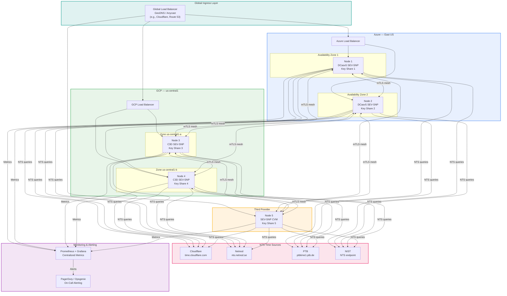
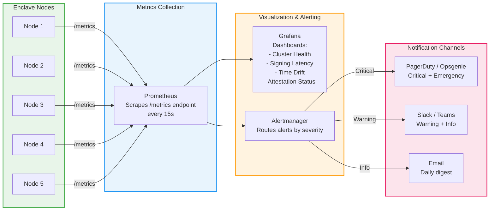
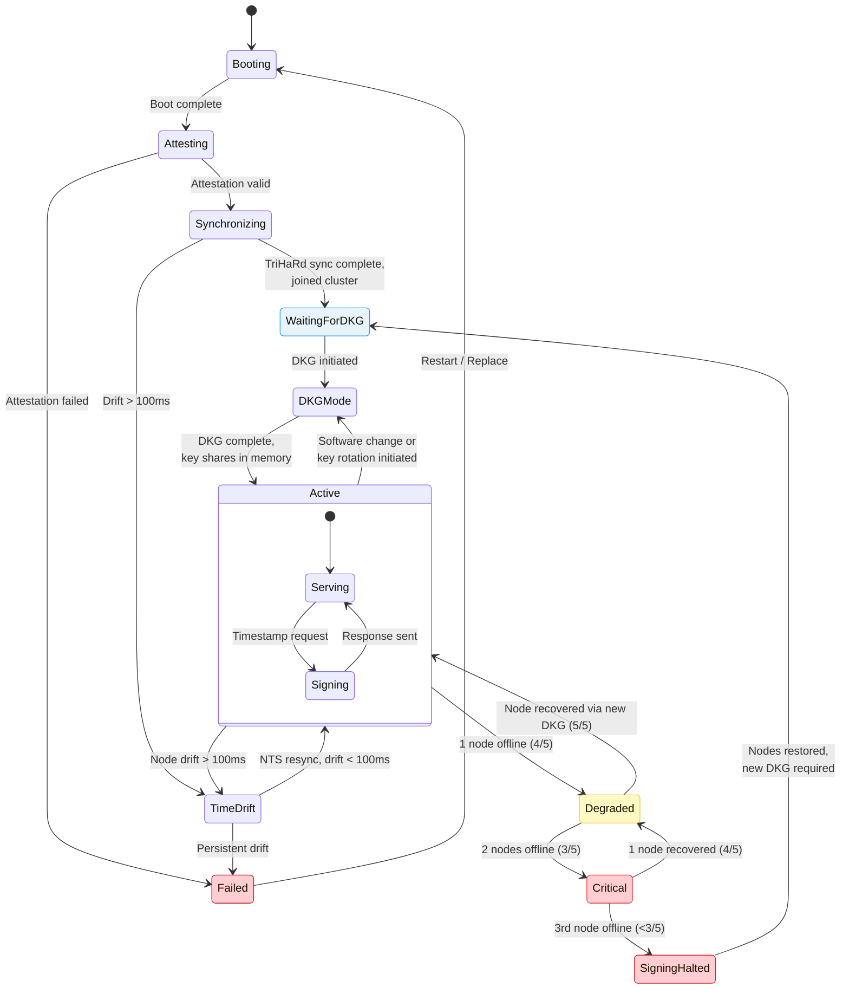
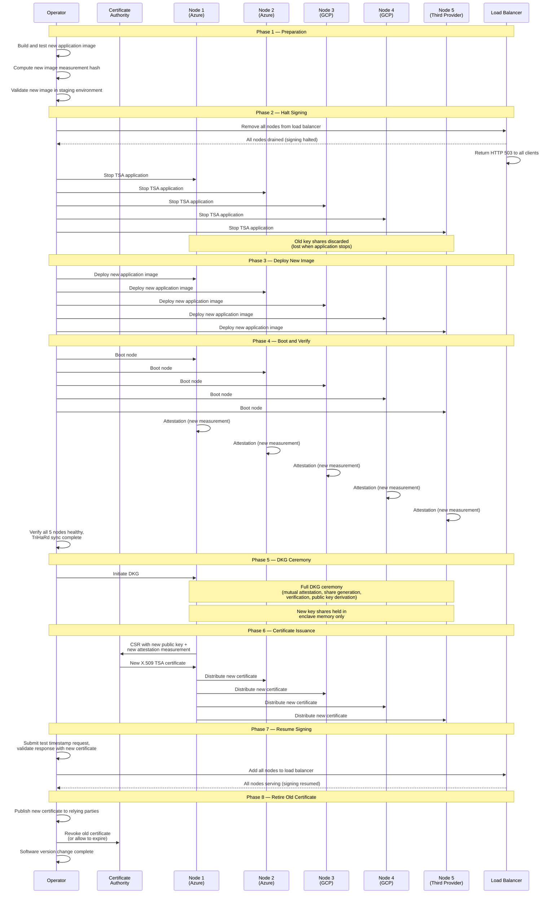
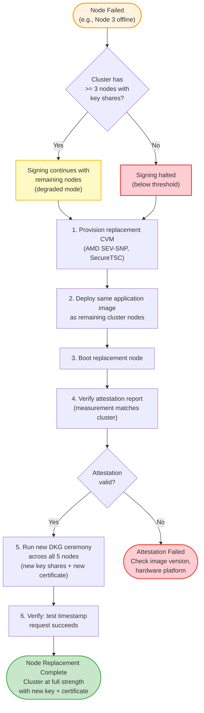
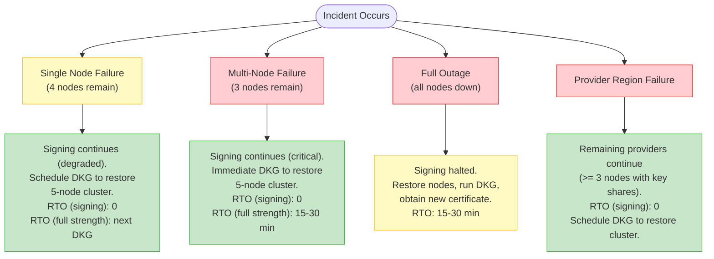

# Operations & Deployment Guide

> **CC-TSA Design Document 05** | Audience: Platform Engineers, SREs, Security Operations

This document provides the complete operational guide for deploying, operating, and maintaining a Confidential Computing Timestamp Authority (CC-TSA) cluster. It covers infrastructure requirements, deployment topologies, DKG ceremony procedures, day-to-day operations, software version changes, node replacement, incident response, backup and disaster recovery, and compliance mapping.

For the overall system architecture, see [Architecture Overview](01-architecture-overview.md). For failure scenarios and recovery procedures, see [Failure Modes and Recovery](04-failure-modes-and-recovery.md). For the threshold cryptography underpinning key management, see [Quantum-Safe Threshold Cryptography](03-quantum-safe-threshold-crypto.md).

---

## Table of Contents

1. [Infrastructure Requirements](#1-infrastructure-requirements)
2. [Deployment Topology Options](#2-deployment-topology-options)
3. [DKG Ceremony Procedure](#3-dkg-ceremony-procedure)
4. [Day-to-Day Operations](#4-day-to-day-operations)
5. [Software Version Change Procedure](#5-software-version-change-procedure)
6. [Node Replacement](#6-node-replacement)
7. [Incident Response Playbooks](#7-incident-response-playbooks)
8. [Backup & Disaster Recovery](#8-backup--disaster-recovery)
9. [Compliance Mapping](#9-compliance-mapping)

---

## 1. Infrastructure Requirements

This section specifies the hardware, key management, networking, and time source requirements for a production CC-TSA deployment.

### 1.1 Compute

| Component | Specification | Notes |
|---|---|---|
| Enclave Nodes (5) | AMD EPYC Genoa (9004+) with SEV-SNP + SecureTSC | Azure: DCasv5-series; GCP: C3D confidential VMs |
| vCPUs per node | 4-8 vCPUs | Threshold signing is not CPU-intensive |
| Memory per node | 16-32 GB | Key shares and signing operations fit in <1 GB; extra for OS and application |
| Disk per node | 64 GB SSD | OS, application, logs |

SecureTSC is a hard requirement. It is available only on AMD EPYC 9004 (Genoa) and later processors. Azure DCasv5/ECasv5 series and GCP C3D confidential VMs support SecureTSC. See [Confidential Computing & Time](02-confidential-computing-and-time.md) for SecureTSC details.

### 1.2 Key Management

Key shares exist **only in enclave memory**. There is no at-rest persistence, no KMS wrapping, and no sealed key share blobs. This is the fundamental design property of the CC-TSA key management model.

| Property | Detail |
|---|---|
| Key share location | Enclave memory only (hardware-encrypted by AMD SEV-SNP) |
| At-rest persistence | None — key shares are never written to disk or cloud storage |
| Survival across reboot | No — if a node reboots, its key share is irrecoverably lost |
| Recovery from quorum loss | New DKG ceremony + new certificate issuance |
| External key management dependencies | None — no cloud KMS, no wrapping keys, no attestation policy management |

This model eliminates the attack surface associated with at-rest key material: there are no sealed blobs to steal, no wrapping keys to compromise, and no KMS attestation policies that an operator could misconfigure or an attacker could subvert. Trust is rooted entirely in the hardware attestation of the running enclave and the software measurement bound to the TSA certificate.

See [Quantum-Safe Threshold Cryptography](03-quantum-safe-threshold-crypto.md) for the full key lifecycle and the rationale for the ephemeral model.

### 1.3 Networking

| Requirement | Details |
|---|---|
| Node-to-node | Mutual TLS (mTLS) with certificates attested during DKG; cross-provider latency is acceptable given the 1-second round-trip budget |
| Node-to-NTS | Outbound to 4+ NTS servers; UDP 123 (NTP) + TCP 4460 (NTS-KE) |
| Load balancer to nodes | HTTPS (TLS 1.3); health check endpoint on each node |
| Client-facing | HTTPS on port 443; RFC 3161 HTTP transport (POST to `/timestamp` endpoint) |

Cross-provider networking between enclave nodes uses mTLS with certificates that are attested to each node's enclave identity. An optional WireGuard tunnel provides an additional encryption layer for defense in depth. Firewall rules should restrict node-to-node communication to the specific ports used by the threshold signing protocol, TriHaRd time exchange, and health checks.

### 1.4 NTS Time Sources

| Source | Endpoint | Notes |
|---|---|---|
| Cloudflare | `time.cloudflare.com` | Global anycast, Stratum-1 |
| Netnod | `nts.netnod.se` | Swedish NTS service, Stratum-1, atomic clock reference |
| PTB | `ptbtime1.ptb.de` (NTS) | German national metrology institute, Stratum-1 |
| NIST | NTS endpoint (when available) | US national standard, Stratum-1, atomic clock reference |

A minimum of 4 NTS sources is required for Byzantine fault tolerance. With 4 sources and the requirement `n >= 3f + 1`, the system tolerates 1 faulty or malicious time source. Each enclave node independently queries all NTS sources -- there is no shared NTP proxy.

See [Confidential Computing & Time](02-confidential-computing-and-time.md) for NTS protocol details and the TriHaRd cross-node validation mechanism.

---

## 2. Deployment Topology Options

CC-TSA supports three deployment topologies. The multi-provider topology is **recommended for production** because it ensures that no single cloud provider hosts a threshold number of nodes (3 or more out of 5).

### 2.1 Option A: Single Provider (Azure)

| Region | AZ | Nodes |
|---|---|---|
| East US | AZ1 | Node 1, Node 2 |
| East US | AZ2 | Node 3 |
| West US | AZ1 | Node 4 |
| West US | AZ2 | Node 5 |

**Pros:**
- Simple operations: single provider relationship, single billing, unified tooling
- Lower cross-node latency (all nodes within Azure backbone)
- Simpler networking (Azure VNet peering across regions)

**Cons:**
- Single-provider trust: Azure hosts all 5 nodes, so an Azure-wide compromise yields all key shares
- Azure outage affecting both regions could cause full signing outage
- Does not satisfy the multi-provider trust property described in [Architecture Overview](01-architecture-overview.md)

### 2.2 Option B: Multi-Provider (Recommended)

| Provider | Region | Nodes |
|---|---|---|
| Azure | East US (2 AZs) | Node 1, Node 2 |
| GCP | us-central1 (2 zones) | Node 3, Node 4 |
| Third Provider | Provider region | Node 5 |

**Pros:**
- No single provider hosts 3 or more nodes (the threshold): maximum resilience against provider-level compromise
- Survives complete outage of any single provider (remaining providers hold 3+ nodes)
- Diverse hardware and infrastructure reduces correlated failure risk

**Cons:**
- Multi-provider operational complexity: multiple consoles, billing, IAM systems
- Cross-provider networking requires careful configuration (mTLS mesh, firewall rules)
- Cross-provider latency (typically 10-30ms) is negligible within the 1-second round-trip budget

### 2.3 Option C: Triple-Provider (Maximum Resilience)

| Provider | Nodes |
|---|---|
| Azure | Node 1, Node 2 |
| GCP | Node 3, Node 4 |
| OCI / IBM / other | Node 5 |

This is a specific case of Option B where the third provider is a full-capability confidential computing provider (e.g., Oracle Cloud Infrastructure with AMD SEV-SNP support). The distinction from Option B is that the third provider supplies its own native confidential computing infrastructure with AMD SEV-SNP attestation support.

### 2.4 Recommendation Matrix

| Factor | Single Provider | Multi-Provider | Triple-Provider |
|---|---|---|---|
| Resilience | Moderate | High | Highest |
| Operational complexity | Low | Moderate | High |
| Cost | Lower | Moderate | Higher |
| Trust model | Single provider trust | No provider >= threshold | No provider >= threshold, diverse infrastructure |
| Cross-provider latency | None (intra-provider) | 10-30ms (negligible) | 10-30ms (negligible) |
| **Recommendation** | Dev/staging only | **Production** | High-assurance use cases |

### 2.5 Multi-Provider Deployment Architecture

The following diagram shows the recommended multi-provider deployment with Azure (2 nodes), GCP (2 nodes), and a third provider (1 node).

**Key architectural properties:**

- **No single provider holds >= 3 nodes**: Azure has 2, GCP has 2, third provider has 1. A complete compromise of any single provider yields at most 2 key shares -- below the threshold of 3.
- **Cross-provider mesh**: All 5 nodes maintain mTLS connections to all peers for threshold signing, TriHaRd time exchange, and health checks.
- **Independent NTS queries**: Each node independently queries all 4 NTS sources. There is no shared NTP proxy or single point of failure for time.
- **Ephemeral key shares**: Key shares exist only in enclave memory. There is no at-rest key material, no KMS dependency, and no sealed blobs to manage. Trust is rooted in the hardware attestation of the running enclave.

---

## 3. DKG Ceremony Procedure

Distributed Key Generation (DKG) is the routine operation that creates a TSA signing key distributed across the 5 enclave nodes. Each node receives one key share; the complete signing key never exists in any single location.

Unlike traditional key ceremonies that occur once and produce long-lived keys, DKG in CC-TSA is a **routine operational procedure** that runs every time the cluster is constituted or reconstituted. Because key shares are ephemeral (memory-only), DKG is the mechanism by which the cluster transitions from "nodes running" to "nodes ready to sign."

See [Quantum-Safe Threshold Cryptography](03-quantum-safe-threshold-crypto.md) for the mathematical protocol. This section covers the operational procedure.

### 3.1 When DKG Runs

DKG is required in the following situations:

| Trigger | Description |
|---|---|
| **Initial deployment** | First-time cluster setup — no key material exists yet |
| **Software version change** | Any change to the application image produces a new attestation measurement, requiring a new key and certificate (see [Section 5](#5-software-version-change-procedure)) |
| **Quorum loss** | If fewer than 3 nodes remain running, all key shares are effectively lost and a new DKG is required after nodes are restored |
| **Certificate renewal** | When the TSA certificate approaches expiry, a new DKG produces a new key and certificate (rather than re-certifying an existing key, since the key exists only in memory) |
| **Planned key rotation** | Periodic key rotation per organizational policy (e.g., annually) |
| **Security incident** | If key compromise is suspected, a new DKG with a new key provides a clean start |

DKG is designed to be a **fast, automated, low-risk operation** — not a rare ceremony requiring exceptional preparation. Operators should be comfortable running DKG as part of routine maintenance.

### 3.2 Prerequisites

Before initiating DKG, all of the following must be in place:

- All 5 enclave nodes provisioned, booted, and passing health checks
- All nodes running the same software image (identical attestation measurement)
- Network connectivity between all nodes verified (mTLS handshake successful between every pair)
- Certificate Authority ready to issue the TSA certificate (CA operator available if manual approval required)
- At least 2 operators present for 4-eyes principle (dual authorization)
- DKG ceremony log initialized (append-only transcript for audit)

### 3.3 DKG Ceremony Flow

```mermaid
flowchart TD
    START(["DKG Ceremony Start<br/>2 operators present"])

    subgraph Preflight["Phase 1: Pre-Flight Checks"]
        PF1["Verify all 5 nodes healthy<br/>(health endpoint returns OK)"]
        PF2["Verify each node's SEV-SNP<br/>attestation report is valid"]
        PF3["Verify NTS time sync on all nodes<br/>(TriHaRd validation passes)"]
        PF4["Verify mTLS connectivity<br/>between all 10 node pairs"]
        PF_CHECK{"All pre-flight<br/>checks pass?"}
    end

    subgraph Initiate["Phase 2: DKG Initiation"]
        INIT1["Operator sends DKG initiation<br/>command to coordinator node"]
        INIT2["Coordinator sends DKG<br/>invitation to 4 peer nodes"]
        INIT3["All 5 nodes acknowledge<br/>DKG participation"]
    end

    subgraph Attest["Phase 3: Mutual Attestation"]
        ATT1["Each node obtains fresh<br/>SNP attestation report"]
        ATT2["Each node sends attestation<br/>report to all 4 peers"]
        ATT3["Each node verifies all 4<br/>peer attestation reports"]
        ATT_CHECK{"All attestation<br/>verifications pass?"}
    end

    subgraph Round1["Phase 4: Share Generation (Round 1)"]
        R1_1["Each node generates random<br/>polynomial of degree t-1 = 2"]
        R1_2["Each node evaluates polynomial<br/>at points 1 through 5"]
        R1_3["Each node sends sub-shares<br/>to peers (encrypted, attested TLS)"]
    end

    subgraph Round2["Phase 5: Verification (Round 2)"]
        R2_1["Each node combines received<br/>sub-shares into final key share"]
        R2_2["Each node broadcasts<br/>polynomial commitments"]
        R2_3["All nodes verify commitments<br/>against received sub-shares"]
        R2_CHECK{"All commitment<br/>verifications pass?"}
    end

    subgraph PubKey["Phase 6: Public Key Derivation"]
        PK1["All nodes compute public key<br/>from polynomial commitments"]
        PK2["Coordinator collects all 5<br/>computed public keys"]
        PK3["Coordinator verifies all 5<br/>public keys are identical"]
        PK_CHECK{"All public<br/>keys match?"}
    end

    subgraph Cert["Phase 7: Certificate Issuance"]
        CERT1["Coordinator generates CSR<br/>with derived public key"]
        CERT2["CSR includes id-kp-timeStamping<br/>EKU and policy OID"]
        CERT3["CSR submitted to CA<br/>(manual or automated)"]
        CERT4["CA issues X.509 certificate"]
        CERT5["Certificate distributed<br/>to all 5 nodes"]
    end

    subgraph Complete["Phase 8: Ceremony Completion"]
        COMP1["Coordinator broadcasts<br/>'DKG complete' to all nodes"]
        COMP2["All nodes transition to Active state<br/>(key shares held in memory only)"]
        COMP3["Operator verifies: test<br/>timestamp request succeeds"]
        COMP4["Archive ceremony transcript<br/>(attestation reports, commitments,<br/>certificate, measurement, operator signatures)"]
    end

    ABORT(["ABORT DKG<br/>Investigate and retry"])
    DONE(["DKG Complete<br/>Cluster operational"])

    START --> PF1
    PF1 --> PF2
    PF2 --> PF3
    PF3 --> PF4
    PF4 --> PF_CHECK
    PF_CHECK -->|"Yes"| INIT1
    PF_CHECK -->|"No"| ABORT

    INIT1 --> INIT2
    INIT2 --> INIT3
    INIT3 --> ATT1

    ATT1 --> ATT2
    ATT2 --> ATT3
    ATT3 --> ATT_CHECK
    ATT_CHECK -->|"Yes"| R1_1
    ATT_CHECK -->|"No"| ABORT

    R1_1 --> R1_2
    R1_2 --> R1_3
    R1_3 --> R2_1

    R2_1 --> R2_2
    R2_2 --> R2_3
    R2_3 --> R2_CHECK
    R2_CHECK -->|"Yes"| PK1
    R2_CHECK -->|"No"| ABORT

    PK1 --> PK2
    PK2 --> PK3
    PK3 --> PK_CHECK
    PK_CHECK -->|"Yes"| CERT1
    PK_CHECK -->|"No"| ABORT

    CERT1 --> CERT2
    CERT2 --> CERT3
    CERT3 --> CERT4
    CERT4 --> CERT5
    CERT5 --> COMP1

    COMP1 --> COMP2
    COMP2 --> COMP3
    COMP3 --> COMP4
    COMP4 --> DONE

    style Preflight fill:#e8f4fd,stroke:#2196f3,stroke-width:2px
    style Initiate fill:#e0f2f1,stroke:#009688,stroke-width:2px
    style Attest fill:#fff3e0,stroke:#ff9800,stroke-width:2px
    style Round1 fill:#f3e5f5,stroke:#9c27b0,stroke-width:2px
    style Round2 fill:#f3e5f5,stroke:#9c27b0,stroke-width:2px
    style PubKey fill:#e8f5e9,stroke:#4caf50,stroke-width:2px
    style Cert fill:#fce4ec,stroke:#e91e63,stroke-width:2px
    style Complete fill:#e8f5e9,stroke:#4caf50,stroke-width:2px
    style ABORT fill:#ffcdd2,stroke:#f44336,stroke-width:2px
    style DONE fill:#c8e6c9,stroke:#4caf50,stroke-width:2px
```

### 3.4 Phase Details

**Phase 1 -- Pre-Flight Checks.** The operator verifies that all infrastructure is ready. Each node's health endpoint must return OK, confirming the node is booted, attested, time-synchronized (TriHaRd validation passes), and able to communicate with all peers. If any check fails, the ceremony is postponed until the issue is resolved.

**Phase 2 -- DKG Initiation.** The operator sends a signed DKG initiation command to the coordinator node (any node can serve as coordinator). The coordinator invites all 4 peers. Each node acknowledges participation, locking itself into DKG mode (refusing timestamp requests until DKG completes or is aborted).

**Phase 3 -- Mutual Attestation.** Each node obtains a fresh SEV-SNP attestation report from the AMD-SP, including a nonce derived from the DKG session identifier for freshness. Each node sends its report to all peers. Each node verifies all 4 peer reports against the AMD certificate chain (ARK -> ASK -> VCEK) and checks that the measurement, VM policy, and platform version match the expected values. If any verification fails, DKG aborts -- a node with a different measurement or an invalid attestation cannot participate.

**Phase 4 -- Share Generation (Round 1).** Each node generates a random polynomial of degree `t-1 = 2` (for a 3-of-5 threshold). Each node evaluates its polynomial at points 1 through 5, producing 5 sub-shares. Each node sends the appropriate sub-share to each peer, encrypted over the attested mTLS channel. See [Quantum-Safe Threshold Cryptography](03-quantum-safe-threshold-crypto.md) for the Feldman VSS protocol details.

**Phase 5 -- Verification (Round 2).** Each node combines the sub-shares received from all peers (and its own) to compute its final key share. Each node broadcasts polynomial commitments (Feldman commitments). All nodes verify the commitments against the sub-shares they received -- if any commitment does not match, the offending node is identified and DKG aborts.

**Phase 6 -- Public Key Derivation.** All nodes independently compute the group public key from the polynomial commitments. The coordinator collects all 5 computed public keys and verifies they are identical. A mismatch indicates a protocol error or a malicious node.

**Phase 7 -- Certificate Issuance.** The coordinator generates a Certificate Signing Request (CSR) containing the derived group public key, the TSA's distinguished name, the `id-kp-timeStamping` Extended Key Usage (OID 1.3.6.1.5.5.7.3.8), and the TSA policy OID. The CSR also records the attestation measurement of the enclave nodes, binding the certificate to the specific software version that generated the key. The CSR is submitted to the Certificate Authority. Depending on the CA, this may be automated (ACME-like) or require manual approval. The issued X.509 certificate is distributed to all 5 nodes.

**Phase 8 -- Ceremony Completion.** The coordinator broadcasts "DKG complete" to all nodes. All nodes transition from DKG mode to Active mode and begin accepting timestamp requests. Key shares remain in enclave memory only — they are not persisted to any durable storage. The operator verifies end-to-end functionality by submitting a test timestamp request and validating the response. The ceremony transcript (attestation reports, commitments, certificate, attestation measurement, operator signatures, timestamps) is archived to immutable storage for audit purposes.

### 3.5 Certificate Issuance as Part of DKG

Certificate issuance is an integral part of every DKG ceremony, not a separate process. Because the signing key is ephemeral and unique to each DKG, every DKG produces a new public key that requires a new certificate. The certificate binds together:

- The **group public key** derived during DKG
- The **attestation measurement** of the software running in the enclaves
- The **TSA identity** (distinguished name, policy OID)

This binding means that the certificate serves as a permanent, verifiable record of what software produced the signing key. Relying parties can verify that a timestamp was produced by enclaves running a specific, known software version.

**Certificate lifecycle under the ephemeral model:**

1. Each DKG ceremony produces a new key and a new certificate.
2. The old certificate can be revoked or allowed to expire after the new one is active.
3. Previously issued timestamps remain valid — they were signed with the old key, which was valid at the time of signing, and verifiers can validate against the old certificate.
4. Certificate renewal without a software change still requires a new DKG, because the existing key shares cannot be exported from memory to produce a CSR.

### 3.6 Estimated Duration

| Phase | Duration | Notes |
|---|---|---|
| Pre-flight checks | 1-2 min | Automated, operator oversight |
| DKG initiation + mutual attestation | 1-2 min | Network round-trips between all nodes |
| Share generation + verification | 1-3 min | Two protocol rounds across 5 nodes |
| Public key derivation | <30 sec | Local computation + comparison |
| Certificate issuance | 1-5 min | Depends on CA (automated vs. manual) |
| Completion + test | <1 min | Test timestamp request |
| **Total** | **5-12 min** | Mostly automated, operator provides oversight and approval |

---

## 4. Day-to-Day Operations

### 4.1 Monitoring

The following table defines the key operational metrics, their healthy ranges, and the thresholds at which warnings and critical alerts are triggered.

| Metric | Healthy | Warning | Critical |
|---|---|---|---|
| Nodes online | 5 | 4 | <= 3 |
| TriHaRd max drift | <10 ms | <50 ms | >= 100 ms (node excluded) |
| NTS source agreement | 4/4 agree | 3/4 agree | <3/4 agree |
| Attestation status | All valid | 1 stale (>1h since last refresh) | Any invalid |
| Signing latency (p99) | <500 ms | <2s | >= 5s |
| Signing success rate | >99.9% | >99% | <99% |
| Key shares in memory | All 5 nodes hold shares | 4 nodes hold shares | <=3 nodes hold shares |
| Certificate validity | >30 days remaining | <30 days remaining | <7 days remaining |
| Disk usage per node | <50% | <80% | >=80% |

### 4.2 Alerting Thresholds

| Alert | Severity | Condition | Action |
|---|---|---|---|
| Node down | Warning | 4/5 nodes online | Auto-recovery attempt, notify on-call via Slack |
| Node down | Critical | 3/5 nodes online | Page on-call engineer, recover immediately |
| Signing halted | Emergency | <3 nodes online | Page all engineers, execute recovery playbook (see [Failure Modes](04-failure-modes-and-recovery.md)) |
| Clock drift | Warning | Any node >50 ms drift from TriHaRd median | Monitor; may self-correct after next NTS sync |
| Clock drift | Critical | Any node >100 ms drift from TriHaRd median | Node auto-excluded from signing, investigate root cause |
| Attestation stale | Warning | Any node's attestation report >1h old | Trigger attestation refresh |
| Attestation invalid | Critical | Any node's attestation verification fails | Node cannot participate in signing, investigate immediately |
| Certificate expiring | Warning | <30 days to certificate expiry | Plan certificate renewal (see [Playbook 7](#playbook-7-certificate-expiry)) |
| Certificate expiring | Critical | <7 days to certificate expiry | Emergency certificate renewal |
| NTS sources degraded | Warning | Only 3/4 NTS sources responding | Check network connectivity to missing source |
| NTS sources critical | Critical | <3/4 NTS sources responding | Cannot maintain Byzantine fault tolerance for time; investigate |
| Signing latency elevated | Warning | p99 signing latency >2s | Investigate network latency between nodes |
| Signing errors | Critical | Signing success rate <99% | Investigate failing nodes, check partial signature verification |

### 4.3 Operational State Machine

---

## 5. Software Version Change Procedure

Software version changes in CC-TSA are **coordinated key rotation procedures**, not rolling updates. Because the software measurement is bound to the TSA certificate (see [Architecture Overview](01-architecture-overview.md) Section 8), any change to the application image produces a new attestation measurement and requires a new DKG ceremony and new certificate.

This is a deliberate design choice: there is never ambiguity about which software version signed a given timestamp. Each certificate corresponds to exactly one software measurement.

### 5.1 Procedure Overview

A software version change follows this sequence:

1. **Prepare**: Build, test, and validate the new application image.
2. **Halt signing**: Stop accepting timestamp requests on the current cluster.
3. **Deploy**: Deploy the new image to all 5 nodes simultaneously.
4. **Boot and attest**: All nodes boot with the new image and generate fresh attestation reports with the new measurement.
5. **DKG**: Run a new DKG ceremony to generate new key shares and a new public key.
6. **Certificate**: Obtain a new TSA certificate from the CA for the new public key.
7. **Resume signing**: Begin accepting timestamp requests with the new key and certificate.
8. **Retire old certificate**: Revoke or allow the old certificate to expire.

### 5.2 Software Version Change Sequence

### 5.3 Signing Downtime

Unlike a rolling update, a software version change involves a **planned signing outage**. This is an inherent consequence of the immutable software + ephemeral key model: the old key shares are lost when the old software stops, and the new key shares do not exist until DKG completes on the new software.

| Phase | Duration | Signing Available |
|---|---|---|
| Preparation | 10-30 min | Yes (old cluster still serving) |
| Halt signing + deploy + boot | 5-10 min | **No** |
| DKG ceremony | 5-12 min | **No** |
| Certificate issuance | 1-5 min | **No** |
| Resume signing | <1 min | Yes (new cluster serving) |
| **Total downtime** | **~12-28 min** | |

**Mitigation strategies for downtime:**

- **Schedule during maintenance windows**: Coordinate with relying parties to minimize impact.
- **Pre-stage the new image**: Reduce deployment time by pre-uploading images to all providers.
- **Automate the DKG**: A fully automated DKG ceremony completes in 5-12 minutes with minimal operator interaction.
- **Use automated CA integration**: ACME-style certificate issuance reduces the certificate phase to under 1 minute.

### 5.4 Key Safety Rules

- **Deploy the same image to all nodes**: All 5 nodes must run identical software to produce the same attestation measurement. Mixed-version clusters are not supported.
- **No rollback to old key**: Once the old software is stopped, the old key shares are irrecoverably lost. If the new software has issues, the resolution is to fix the new software and run another DKG — not to restore the old key.
- **Verify before resuming**: Complete the full DKG ceremony and test signing before adding nodes back to the load balancer.
- **Communicate the certificate change**: Relying parties that pin to specific TSA certificates must be notified of the new certificate. Relying parties that validate via the CA chain are unaffected.

---

## 6. Node Replacement

### 6.1 When Node Replacement Is Needed

- Hardware failure that cannot be repaired (e.g., AMD-SP failure, memory corruption)
- Cloud provider discontinues the VM type or retires the underlying hardware
- Security incident requiring fresh hardware (e.g., suspected side-channel exposure)
- Geographic relocation of a node to a different region or provider

### 6.2 Impact of Node Loss

Under the ephemeral key model, a node failure means the loss of that node's key share. The impact depends on how many nodes remain:

| Nodes Remaining | Impact | Action |
|---|---|---|
| 4 of 5 | Signing continues; fault tolerance reduced | Replace node at next convenient DKG |
| 3 of 5 | Signing continues; zero fault tolerance margin | Schedule DKG promptly to restore 5-node cluster |
| < 3 of 5 | Signing halted; key effectively lost | Immediate DKG required to resume signing |

A failed node's key share cannot be recovered — it existed only in that node's enclave memory. The replacement procedure always involves a new DKG ceremony that produces new key shares for all nodes.

### 6.3 Replacement Procedure

### 6.4 Deferred vs. Immediate Replacement

If the cluster still has 3 or more nodes with key shares in memory, signing continues in degraded mode. The operator can choose when to perform the replacement and DKG:

- **Deferred replacement**: Continue signing with the reduced cluster. Provision the replacement node and schedule the DKG during a maintenance window. This minimizes disruption but leaves the cluster with reduced fault tolerance.
- **Immediate replacement**: Provision the replacement node as quickly as possible and run DKG immediately. This restores full fault tolerance but requires a brief signing outage during the DKG ceremony.

In either case, the DKG ceremony produces entirely new key shares and a new certificate. The old key shares held by the surviving nodes are discarded when they participate in the new DKG.

---

## 7. Incident Response Playbooks

This section provides structured incident response procedures for the most common CC-TSA operational scenarios. Each playbook follows a consistent format: trigger, severity, actions, escalation, and resolution criteria.

For a comprehensive analysis of failure modes and their cascading effects, see [Failure Modes and Recovery](04-failure-modes-and-recovery.md).

### Playbook 1: Single Node Failure

| Field | Detail |
|---|---|
| **Trigger** | 4/5 nodes online; 1 node health check failing |
| **Severity** | Warning |
| **Impact** | No signing impact; fault tolerance reduced from 2 to 1 |

**Actions:**

1. Check the failed node's VM status in the provider console (Azure Portal / GCP Console).
2. Check for provider-level incidents (Azure Status, GCP Status Dashboard).
3. Note: the failed node's key share is lost (it existed only in enclave memory). Signing continues with the remaining 4 nodes.
4. Assess urgency: signing is operational but fault tolerance is reduced from 2 to 1.
5. If the node can be restarted on the same hardware: restart, but the node will not have a key share — it will need to participate in a new DKG.
6. If the node cannot be restarted: provision a replacement CVM (see [Section 6.3](#63-replacement-procedure)).
7. Schedule a DKG ceremony to restore the cluster to full 5-node strength with new key shares.

**Escalation:** If not recovered within 30 minutes, page on-call engineer. If a second node fails before DKG, escalate to Critical (Playbook 2).

**Resolution criteria:** New DKG completed with all 5 nodes, new certificate issued, signing verified.

### Playbook 2: Multiple Node Failure (3/5 Online)

| Field | Detail |
|---|---|
| **Trigger** | 3/5 nodes online; 2 nodes offline |
| **Severity** | Critical |
| **Impact** | Signing continues but with ZERO fault tolerance margin; 2 key shares lost |

**Actions:**

1. Page on-call engineer immediately.
2. Identify root cause: provider outage, network partition, hardware failure, attestation issue.
3. Note: the 2 failed nodes' key shares are irrecoverably lost. Signing continues with 3 remaining nodes but any further failure halts signing.
4. If network partition: check cross-provider mesh, firewall rules, DNS resolution. Nodes may still be running with key shares intact — restoring connectivity restores the cluster.
5. If hardware failure: provision replacement nodes as quickly as possible.
6. If both failed nodes are in the same provider: investigate correlated failure (shared AZ, shared hardware rack).
7. Once replacement nodes are provisioned, run a new DKG ceremony to restore full 5-node strength.

**Escalation:** If not recovered within 15 minutes, escalate to incident commander.

**Resolution criteria:** New DKG completed with 5 nodes, new certificate issued, signing verified.

### Playbook 3: Signing Halted (<3 Nodes)

| Field | Detail |
|---|---|
| **Trigger** | <3/5 nodes online; threshold not met; signing halted |
| **Severity** | Emergency |
| **Impact** | All timestamp requests failing; relying parties affected |

**Actions:**

1. All-hands page: incident commander, on-call engineers, security team.
2. Load balancer returns HTTP 503 to all clients.
3. All key shares are effectively lost — a new DKG ceremony is required regardless of how many nodes are restored.
4. For each offline node: attempt restart or provision replacement CVM.
5. Once all 5 nodes are online and healthy: run a new DKG ceremony to generate new key shares and obtain a new certificate.
6. Verify signing with the new key by submitting test timestamp requests.

**Communication:** Notify relying parties of outage via status page. Provide ETA for recovery. Note that the TSA certificate will change — relying parties that pin to specific certificates must update.

**Escalation:** Immediate incident commander engagement. If not resolved within 30 minutes, escalate to executive leadership.

**Resolution criteria:** New DKG completed with 5 nodes, new certificate issued, signing resumed and verified.

### Playbook 4: Clock Drift Detected

| Field | Detail |
|---|---|
| **Trigger** | TriHaRd excludes a node due to >100 ms drift from median |
| **Severity** | Warning (single node) -> Critical (multiple nodes) |
| **Impact** | Excluded node cannot participate in signing; fault tolerance reduced |

**Actions:**

1. Check the excluded node's NTS synchronization status: are all 4 NTS sources responding?
2. Check SecureTSC health: is the hardware clock operating normally? (Compare TSC-derived time against NTS-only time.)
3. If NTS sources are unreachable from the node: investigate network connectivity (firewall rules, DNS, NTS server outage).
4. If NTS sources respond but SecureTSC diverges: the hardware crystal oscillator may be drifting excessively. Wait for NTS-driven correction (Kalman filter will adjust).
5. If drift persists after 5 minutes: restart the node (re-calibrates SecureTSC from AMD-SP on boot).
6. If drift persists after restart: replace the node (potential hardware defect).

**Escalation:** If multiple nodes show drift simultaneously, investigate a common cause (e.g., NTS source compromise, network-level time manipulation). Page security team.

**Resolution criteria:** Node passes TriHaRd validation (drift <100 ms for 3 consecutive rounds) and rejoins signing pool.

### Playbook 5: Attestation Failure

| Field | Detail |
|---|---|
| **Trigger** | Node's attestation report fails verification during DKG or peer validation |
| **Severity** | Critical |
| **Impact** | Node cannot participate in DKG or signing; cluster operates without this node |

**Actions:**

1. Verify the expected measurement matches the deployed application image. Recompute the measurement from the image and compare.
2. Check if the AMD-SP firmware was updated by the cloud provider (firmware updates change the platform TCB version, which changes the attestation report).
3. If the measurement changed due to a provider firmware update: verify the firmware update is legitimate, then redeploy the application image and re-attest. A new DKG will be needed to include this node.
4. If the measurement changed due to an unexpected image modification: **treat as a potential security incident**. Investigate whether the image was tampered with. Do not include this node in any DKG ceremony.
5. If the measurement matches but the attestation signature fails verification: check the AMD certificate chain (VCEK -> ASK -> ARK). The VCEK may have been rotated by AMD.

**Escalation:** If attestation failure cannot be explained by a legitimate firmware or VCEK update, escalate to the security team as a potential compromise.

**Resolution criteria:** Attestation succeeds, node can participate in DKG and signing.

### Playbook 6: Suspected Key Compromise

| Field | Detail |
|---|---|
| **Trigger** | Evidence that one or more key shares may have been exposed |
| **Severity** | Critical (1-2 shares) -> Emergency (>=3 shares) |
| **Impact** | If <3 shares: no immediate signing risk. If >=3 shares: signing key may be reconstructable. |

**Actions for <3 shares compromised:**

1. Initiate an emergency DKG ceremony to generate entirely new key shares and a new certificate. This invalidates all existing shares, including the compromised ones.
2. Halt signing on the current key immediately.
3. Isolate and investigate the compromised node(s). Do not include suspected-compromised hardware in the new DKG.
4. Provision replacement nodes if needed to maintain 5-node cluster.
5. Run DKG on clean nodes, obtain new certificate, resume signing.
6. Investigate the compromise: how were shares exposed? Enclave breach, side-channel attack, insider threat?
7. Remediate the root cause before returning to normal operations.

**Actions for >=3 shares compromised:**

1. **Revoke the TSA certificate immediately** (contact CA for emergency revocation).
2. Signing key must be considered fully compromised.
3. Initiate a **new DKG ceremony** on verified-clean hardware to generate an entirely new signing key.
4. CA issues a new certificate for the new key.
5. Notify relying parties: timestamps issued before the compromise are still valid (signed with the legitimate key at the time), but the old certificate is revoked.
6. Conduct a full forensic investigation.

**Escalation:** Immediate engagement of incident commander and security team. If >=3 shares: executive notification, legal review.

**Resolution criteria:** New DKG completed on clean hardware, new certificate issued, compromise contained, root cause identified and remediated.

### Playbook 7: Certificate Expiry

| Field | Detail |
|---|---|
| **Trigger** | TSA certificate approaching expiry (<30 days warning, <7 days critical) |
| **Severity** | Warning -> Critical |
| **Impact** | After expiry: timestamp tokens will fail validation by relying parties |

**Actions:**

1. Because key shares exist only in enclave memory and cannot be exported, certificate renewal requires a new DKG ceremony that produces new key shares and a new public key.
2. Schedule a DKG ceremony during a maintenance window (see [Section 3](#3-dkg-ceremony-procedure)).
3. The DKG ceremony includes certificate issuance as an integral step (see [Section 3.5](#35-certificate-issuance-as-part-of-dkg)).
4. Once the new certificate is issued and signing resumes: verify by submitting a test timestamp request.
5. Update monitoring to track the new certificate's expiry date.
6. Revoke or allow the old certificate to expire. Previously issued timestamps remain valid.

**Timeline:**

| Trigger | Action |
|---|---|
| 90 days before expiry | Begin renewal planning (verify CA availability, CSR process) |
| 30 days before expiry | Submit CSR, obtain new certificate |
| 14 days before expiry | New certificate must be deployed to all nodes |
| 7 days before expiry | **Critical**: if not renewed, page on-call and escalate |

**Resolution criteria:** New certificate deployed to all nodes, test timestamp validates successfully, monitoring updated.

---

## 8. Backup & Disaster Recovery

### 8.1 What Is Backed Up

Under the ephemeral key model, key shares are intentionally not persisted. The backup scope is limited to the artifacts needed to **reconstitute the cluster** (deploy software, run DKG, obtain certificate) — not to restore previous key material.

| Data | Backup Method | Location | Frequency |
|---|---|---|---|
| TSA certificate + chain | Certificate store on each node + backup storage | All 5 nodes + backup storage (cloud storage, offline archive) | After each DKG ceremony |
| Application image | Container registry or VM image gallery | Each provider's registry (ACR, Artifact Registry) | After each build |
| DKG ceremony transcript | Encrypted archive | Offline storage (air-gapped or cold storage) | After each DKG ceremony |
| Configuration (IaC) | Git repository | GitHub / GitLab (with access controls) | After each change (git commit) |
| Monitoring configuration | Git repository (Grafana dashboards, alert rules) | GitHub / GitLab | After each change |
| Previous certificates (for verification) | Certificate archive | Offline storage | After each certificate retirement |

### 8.2 What Is NOT Backed Up (By Design)

| Data | Reason |
|---|---|
| Key shares | Exist only in enclave memory; ephemeral by design. Backing up would undermine the security model. |
| Transient signing state | Partial commitments and partial signatures exist only during a signing round |

The absence of at-rest key material is a **security feature**, not a limitation. It eliminates the attack surface of sealed blobs, wrapping keys, and KMS attestation policy management. Recovery from any scenario that loses key shares follows the same simple procedure: run a new DKG ceremony.

### 8.3 Recovery Scenarios

Under the ephemeral model, **key loss is normal operation**. Any scenario that causes nodes to lose their key shares (reboot, failure, planned maintenance) is resolved by a new DKG ceremony. This is a routine procedure, not an emergency.

### 8.4 RTO / RPO Summary

| Scenario | RTO (signing) | RTO (full strength) | Notes |
|---|---|---|---|
| Single node failure | 0 (signing continues) | Next scheduled DKG | 4 nodes with key shares; degraded but operational |
| Multi-node failure (2 down) | 0 (signing continues) | 15-30 min (immediate DKG) | 3 nodes with key shares; critical, zero margin |
| Full outage (all nodes down) | 15-30 min | 15-30 min | All key shares lost; new DKG + new certificate required |
| Provider region failure | 0 (signing continues) | Next scheduled DKG | Remaining providers have >= 3 nodes with key shares |

**Key loss is expected and recoverable**: Every recovery path leads to the same procedure — run a new DKG ceremony. This produces new key shares, a new public key, and a new certificate. Previously issued timestamps remain valid (they were signed with the old key, which was valid at the time of signing, and verifiers can validate against the old certificate).

**No timestamp data is lost in any scenario**: The TSA does not store timestamp data — tokens are returned to clients in real-time. The only state that matters is the ability to sign, which is restored by DKG.

For detailed recovery procedures for each failure scenario, see [Failure Modes and Recovery](04-failure-modes-and-recovery.md).

### 8.5 Disaster Recovery Testing

| Test | Frequency | Procedure |
|---|---|---|
| Single node failure + DKG | Monthly | Intentionally stop 1 node, verify signing continues, run DKG to restore |
| Multi-node failure | Quarterly | Stop 2 nodes simultaneously, verify signing continues with 3 remaining |
| Full cluster DKG drill | **Quarterly** | Stop all 5 nodes, boot all, run DKG ceremony, obtain certificate, verify signing |
| Provider outage simulation | Semi-annually | Disable nodes in one provider, verify remaining providers sustain signing |
| Certificate issuance drill | Semi-annually | Run DKG on a staging cluster, verify CA issuance and certificate distribution |

---

## 9. Compliance Mapping

This section maps the CC-TSA design and operational procedures to the requirements of relevant standards and regulations.

| Requirement | Standard | CC-TSA Implementation |
|---|---|---|
| Timestamping policy | ETSI EN 319 421 Section 6.2 | Defined TSA policy OID, published policy document, policy OID included in every timestamp token |
| Key generation | ETSI EN 319 421 Section 7.2 | DKG ceremony with mutual attestation, 4-eyes principle (2 operators), ceremony transcript archived |
| Key protection | ETSI EN 319 421 Section 7.3 | Threshold shares (3-of-5) held exclusively in SEV-SNP enclave memory (hardware-encrypted, never persisted to durable storage); software immutability enforced by binding attestation measurement to TSA certificate; no at-rest key material to protect, steal, or manage |
| Time synchronization | ETSI EN 319 421 Section 7.4 | NTS-authenticated NTP (RFC 8915) with 4+ Stratum-1 sources; SecureTSC hardware clock; TriHaRd Byzantine cross-validation. See [Confidential Computing & Time](02-confidential-computing-and-time.md) |
| Timestamp accuracy | ETSI EN 319 421 Section 7.4 | 1-second accuracy field in token; conservative margin for degraded conditions |
| Audit logging | ETSI EN 319 421 Section 7.5 | Immutable audit log with attestation-bound entries; DKG ceremony transcripts; operational event logging |
| Disaster recovery | ETSI EN 319 421 Section 7.6 | Multi-provider deployment; recovery via DKG reconstitution (no external key material dependencies); documented procedures (this document); quarterly DKG drill testing |
| Qualified signatures | eIDAS Article 42 | Hybrid signatures: ECDSA P-384 (qualified today under current standards) + ML-DSA-65 (quantum-safe, future-ready). See [Quantum-Safe Threshold Cryptography](03-quantum-safe-threshold-crypto.md) |
| WebTrust for CAs | WebTrust Section 4 | Key lifecycle controls (DKG as routine operation, certificate issuance per DKG); ceremony procedures with 4-eyes principle; continuous monitoring and alerting |
| RFC 3161 compliance | IETF RFC 3161 | Full compliance with request/response protocol, TSTInfo format, hash algorithm support, nonce handling, policy OID. See [RFC 3161 Compliance](06-rfc3161-compliance.md) |
| Post-quantum readiness | NIST FIPS 204 | ML-DSA-65 threshold signing provides quantum resistance. Dual signature approach ensures backward compatibility. See [Quantum-Safe Threshold Cryptography](03-quantum-safe-threshold-crypto.md) |
| Hardware root of trust | Common Criteria (EAL) | AMD SEV-SNP attestation rooted in AMD-SP hardware; VCEK chain verifiable against AMD root certificates. See [Confidential Computing & Time](02-confidential-computing-and-time.md) |

### 9.1 Compliance Evidence Collection

| Evidence | Source | Collection Method |
|---|---|---|
| DKG ceremony transcript | Archived after each DKG | Automated: signed log of all ceremony steps, attestation reports, commitments |
| Attestation reports | Each node, on demand | Automated: periodic attestation report generation and archival |
| Monitoring records | Prometheus / Grafana | Automated: metric retention (minimum 1 year), alert history |
| DKG ceremony logs | Each DKG ceremony | Automated: logged with participant attestation reports, measurement, certificate |
| Certificate lifecycle | CA records + node certificates | Manual: CA audit trail + automated node certificate monitoring |
| Incident response records | Incident management system | Manual: post-incident reports filed after each playbook execution |
| DR test results | Test execution logs | Manual: test results documented and reviewed quarterly |

---

## Cross-Reference Index

| Topic | Document |
|---|---|
| AMD SEV-SNP, SecureTSC, Intel TDX, trusted time | [Confidential Computing & Time](02-confidential-computing-and-time.md) |
| ML-DSA-65 threshold signing, DKG, key lifecycle | [Quantum-Safe Threshold Cryptography](03-quantum-safe-threshold-crypto.md) |
| Failure scenarios, recovery procedures, resilience | [Failure Modes and Recovery](04-failure-modes-and-recovery.md) |
| RFC 3161 token format, hybrid signatures, compatibility | [RFC 3161 Compliance](06-rfc3161-compliance.md) |
| Threat model, STRIDE analysis, residual risks | [Threat Model](07-threat-model.md) |
| Throughput analysis, scaling strategy, cost estimates | [Throughput & Scaling](08-throughput-and-scaling.md) |
