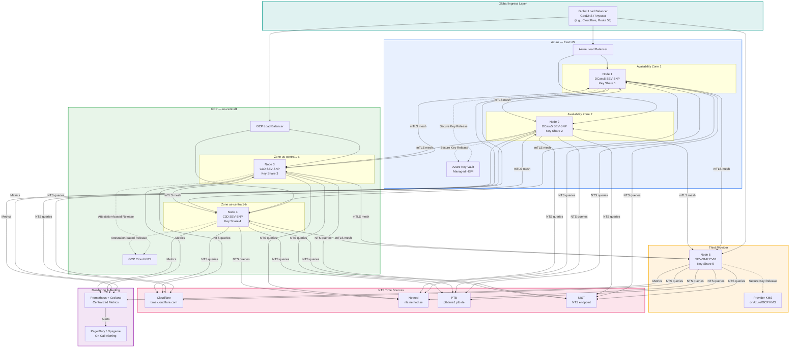
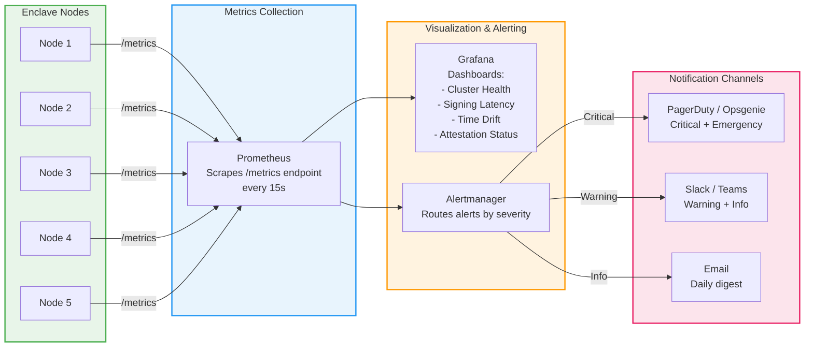
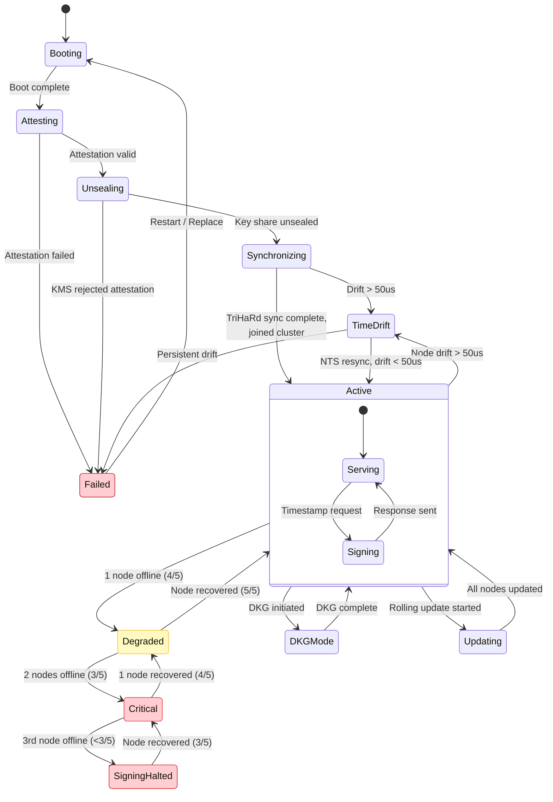
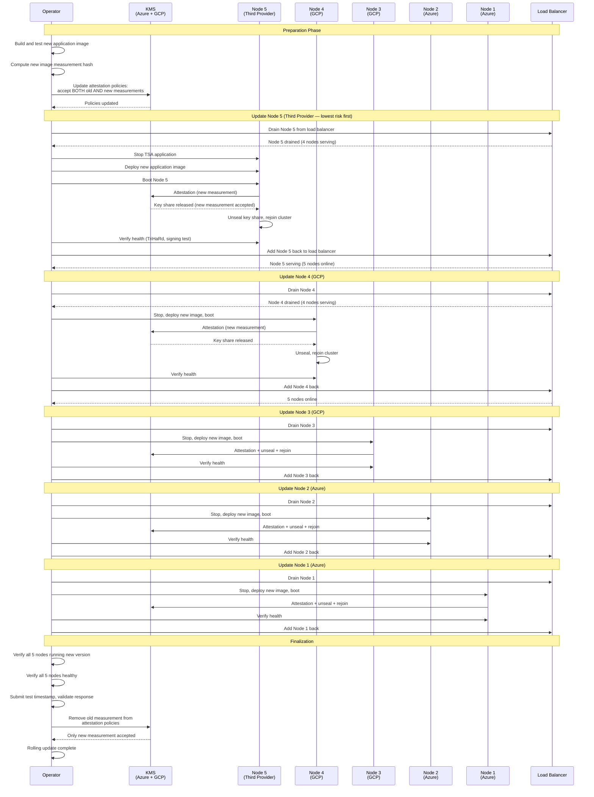
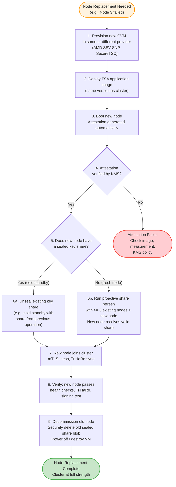
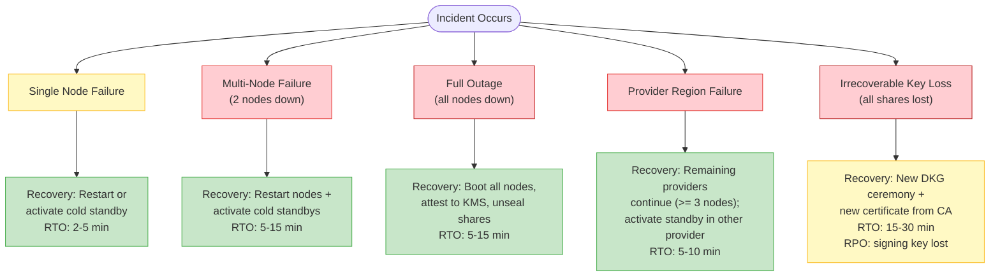

# Operations & Deployment Guide

> **CC-TSA Design Document 05** | Audience: Platform Engineers, SREs, Security Operations

This document provides the complete operational guide for deploying, operating, and maintaining a Confidential Computing Timestamp Authority (CC-TSA) cluster. It covers infrastructure requirements, deployment topologies, DKG ceremony procedures, day-to-day operations, rolling updates, node replacement, incident response, backup and disaster recovery, and compliance mapping.

For the overall system architecture, see [Architecture Overview](01-architecture-overview.md). For failure scenarios and recovery procedures, see [Failure Modes and Recovery](04-failure-modes-and-recovery.md). For the threshold cryptography underpinning key management, see [Quantum-Safe Threshold Cryptography](03-quantum-safe-threshold-crypto.md).

---

## Table of Contents

1. [Infrastructure Requirements](#1-infrastructure-requirements)
2. [Deployment Topology Options](#2-deployment-topology-options)
3. [DKG Ceremony Procedure](#3-dkg-ceremony-procedure)
4. [Day-to-Day Operations](#4-day-to-day-operations)
5. [Rolling Update Procedure](#5-rolling-update-procedure)
6. [Node Replacement](#6-node-replacement)
7. [Incident Response Playbooks](#7-incident-response-playbooks)
8. [Backup & Disaster Recovery](#8-backup--disaster-recovery)
9. [Compliance Mapping](#9-compliance-mapping)

---

## 1. Infrastructure Requirements

This section specifies the hardware, key management, networking, and time source requirements for a production CC-TSA deployment.

### 1.1 Compute

| Component | Specification | Notes |
|---|---|---|
| Enclave Nodes (5) | AMD EPYC Genoa (9004+) with SEV-SNP + SecureTSC | Azure: DCasv5-series; GCP: C3D confidential VMs |
| vCPUs per node | 4-8 vCPUs | Threshold signing is not CPU-intensive |
| Memory per node | 16-32 GB | Key shares and signing operations fit in <1 GB; extra for OS and application |
| Disk per node | 64 GB SSD | OS, application, sealed key share blobs, logs |
| Cold standby nodes | 2 (pre-provisioned, powered off) | One per primary provider (Azure, GCP) |

SecureTSC is a hard requirement. It is available only on AMD EPYC 9004 (Genoa) and later processors. Azure DCasv5/ECasv5 series and GCP C3D confidential VMs support SecureTSC. See [Confidential Computing & Time](02-confidential-computing-and-time.md) for SecureTSC details.

Cold standby nodes are pre-provisioned CVMs with the same application image, held powered off. They do not hold key shares until activated. Their purpose is to accelerate recovery from node failures -- see [Section 6](#6-node-replacement) for activation procedures.

### 1.2 Key Management

| Component | Service | Notes |
|---|---|---|
| Azure KMS | Azure Key Vault with Managed HSM (MHSM) | Supports Secure Key Release conditioned on SEV-SNP attestation |
| GCP KMS | GCP Cloud KMS (Confidential Key Management) | Supports Confidential Key Release conditioned on SEV-SNP attestation |
| Key type | RSA or AES wrapping key | Used to wrap/unwrap the outer envelope of sealed key shares |

Each enclave node's key share is sealed using a **double-envelope encryption** scheme:

1. **Inner envelope**: The key share is encrypted with a key derived from the enclave's hardware sealing identity (AMD-SP derived key, specific to the measurement and platform).
2. **Outer envelope**: The inner-sealed blob is further encrypted by the provider's KMS wrapping key, which is released only to enclaves passing attestation verification.

This means that unsealing requires both (a) running on the correct hardware with the correct measurement (inner envelope) and (b) the KMS releasing the wrapping key after verifying the attestation report (outer envelope). Neither the KMS operator nor a compromised enclave with a different measurement can unseal the share.

See [Quantum-Safe Threshold Cryptography](03-quantum-safe-threshold-crypto.md) for the full key lifecycle.

### 1.3 Networking

| Requirement | Details |
|---|---|
| Node-to-node | Mutual TLS (mTLS) with certificates attested during DKG; low latency (<5ms RTT recommended within a provider, <30ms RTT cross-provider) |
| Node-to-NTS | Outbound to 4+ NTS servers; UDP 123 (NTP) + TCP 4460 (NTS-KE) |
| Node-to-KMS | Outbound to Azure Key Vault / GCP Cloud KMS API endpoints (HTTPS 443) |
| Load balancer to nodes | HTTPS (TLS 1.3); health check endpoint on each node |
| Client-facing | HTTPS on port 443; RFC 3161 HTTP transport (POST to `/timestamp` endpoint) |

Cross-provider networking between enclave nodes uses mTLS with certificates that are attested to each node's enclave identity. An optional WireGuard tunnel provides an additional encryption layer for defense in depth. Firewall rules should restrict node-to-node communication to the specific ports used by the threshold signing protocol, TriHaRd time exchange, and health checks.

### 1.4 NTS Time Sources

| Source | Endpoint | Notes |
|---|---|---|
| Cloudflare | `time.cloudflare.com` | Global anycast, Stratum-1 |
| Netnod | `nts.netnod.se` | Swedish NTS service, Stratum-1, atomic clock reference |
| PTB | `ptbtime1.ptb.de` (NTS) | German national metrology institute, Stratum-1 |
| NIST | NTS endpoint (when available) | US national standard, Stratum-1, atomic clock reference |

A minimum of 4 NTS sources is required for Byzantine fault tolerance. With 4 sources and the requirement `n >= 3f + 1`, the system tolerates 1 faulty or malicious time source. Each enclave node independently queries all NTS sources -- there is no shared NTP proxy.

See [Confidential Computing & Time](02-confidential-computing-and-time.md) for NTS protocol details and the TriHaRd cross-node validation mechanism.

---

## 2. Deployment Topology Options

CC-TSA supports three deployment topologies. The multi-provider topology is **recommended for production** because it ensures that no single cloud provider hosts a threshold number of nodes (3 or more out of 5).

### 2.1 Option A: Single Provider (Azure)

| Region | AZ | Nodes | KMS |
|---|---|---|---|
| East US | AZ1 | Node 1, Node 2 | Key Vault MHSM (East US) |
| East US | AZ2 | Node 3 | -- |
| West US | AZ1 | Node 4 | Key Vault MHSM (West US) |
| West US | AZ2 | Node 5 | -- |

**Pros:**
- Simple operations: single provider relationship, single billing, unified tooling
- Lower cross-node latency (all nodes within Azure backbone)
- Simpler networking (Azure VNet peering across regions)

**Cons:**
- Single-provider trust: Azure hosts all 5 nodes, so an Azure-wide compromise yields all key shares
- Azure outage affecting both regions could cause full signing outage
- Does not satisfy the multi-provider trust property described in [Architecture Overview](01-architecture-overview.md)

### 2.2 Option B: Multi-Provider (Recommended)

| Provider | Region | Nodes | KMS |
|---|---|---|---|
| Azure | East US (2 AZs) | Node 1, Node 2 | Azure Key Vault MHSM |
| GCP | us-central1 (2 zones) | Node 3, Node 4 | GCP Cloud KMS |
| Third Provider | Provider region | Node 5 | Provider KMS or Azure/GCP KMS via cross-provider access |

**Pros:**
- No single provider hosts 3 or more nodes (the threshold): maximum resilience against provider-level compromise
- Survives complete outage of any single provider (remaining providers hold 3+ nodes)
- Diverse hardware and infrastructure reduces correlated failure risk

**Cons:**
- Multi-provider operational complexity: multiple consoles, billing, IAM systems
- Cross-provider networking requires careful configuration (mTLS mesh, firewall rules)
- Cross-provider latency adds 10-30ms to threshold signing round-trips

### 2.3 Option C: Triple-Provider (Maximum Resilience)

| Provider | Nodes | KMS |
|---|---|---|
| Azure | Node 1, Node 2 | Azure Key Vault MHSM |
| GCP | Node 3, Node 4 | GCP Cloud KMS |
| OCI / IBM / other | Node 5 | Provider KMS |

This is a specific case of Option B where the third provider is a full-capability confidential computing provider (e.g., Oracle Cloud Infrastructure with AMD SEV-SNP support). The distinction from Option B is that the third provider supplies its own native KMS with attestation-based key release, rather than relying on Azure or GCP KMS for the fifth node's key share.

### 2.4 Recommendation Matrix

| Factor | Single Provider | Multi-Provider | Triple-Provider |
|---|---|---|---|
| Resilience | Moderate | High | Highest |
| Operational complexity | Low | Moderate | High |
| Cost | Lower | Moderate | Higher |
| Trust model | Single provider trust | No provider >= threshold | No provider >= threshold, diverse KMS |
| Cross-provider latency | None (intra-provider) | 10-30ms for signing rounds | 10-30ms for signing rounds |
| **Recommendation** | Dev/staging only | **Production** | High-assurance use cases |

### 2.5 Multi-Provider Deployment Architecture

The following diagram shows the recommended multi-provider deployment with Azure (2 nodes), GCP (2 nodes), and a third provider (1 node).

**Key architectural properties:**

- **No single provider holds >= 3 nodes**: Azure has 2, GCP has 2, third provider has 1. A complete compromise of any single provider yields at most 2 key shares -- below the threshold of 3.
- **Cross-provider mesh**: All 5 nodes maintain mTLS connections to all peers for threshold signing, TriHaRd time exchange, and health checks.
- **Independent NTS queries**: Each node independently queries all 4 NTS sources. There is no shared NTP proxy or single point of failure for time.
- **Per-provider KMS**: Each node's key share is sealed by the KMS of the provider hosting that node. The KMS releases the wrapping key only after verifying the node's SEV-SNP attestation report.

---

## 3. DKG Ceremony Procedure

Distributed Key Generation (DKG) is the foundational ceremony that creates the TSA signing key distributed across the 5 enclave nodes. Each node receives one key share; the complete signing key never exists in any single location.

See [Quantum-Safe Threshold Cryptography](03-quantum-safe-threshold-crypto.md) for the mathematical protocol. This section covers the operational procedure.

### 3.1 Prerequisites

Before initiating DKG, all of the following must be in place:

- All 5 enclave nodes provisioned, booted, and passing health checks
- KMS configured with attestation policies (expected measurement, VM policy, minimum firmware version)
- Network connectivity between all nodes verified (mTLS handshake successful between every pair)
- Certificate Authority ready to issue the TSA certificate (CA operator available if manual approval required)
- At least 2 operators present for 4-eyes principle (dual authorization)
- DKG ceremony log initialized (append-only transcript for audit)

### 3.2 DKG Ceremony Flow

```mermaid
flowchart TD
    START(["DKG Ceremony Start<br/>2 operators present"])

    subgraph Preflight["Phase 1: Pre-Flight Checks"]
        PF1["Verify all 5 nodes healthy<br/>(health endpoint returns OK)"]
        PF2["Verify each node's SEV-SNP<br/>attestation report is valid"]
        PF3["Verify NTS time sync on all nodes<br/>(TriHaRd validation passes)"]
        PF4["Verify mTLS connectivity<br/>between all 10 node pairs"]
        PF_CHECK{"All pre-flight<br/>checks pass?"}
    end

    subgraph Initiate["Phase 2: DKG Initiation"]
        INIT1["Operator sends DKG initiation<br/>command to coordinator node"]
        INIT2["Coordinator sends DKG<br/>invitation to 4 peer nodes"]
        INIT3["All 5 nodes acknowledge<br/>DKG participation"]
    end

    subgraph Attest["Phase 3: Mutual Attestation"]
        ATT1["Each node obtains fresh<br/>SNP attestation report"]
        ATT2["Each node sends attestation<br/>report to all 4 peers"]
        ATT3["Each node verifies all 4<br/>peer attestation reports"]
        ATT_CHECK{"All attestation<br/>verifications pass?"}
    end

    subgraph Round1["Phase 4: Share Generation (Round 1)"]
        R1_1["Each node generates random<br/>polynomial of degree t-1 = 2"]
        R1_2["Each node evaluates polynomial<br/>at points 1 through 5"]
        R1_3["Each node sends sub-shares<br/>to peers (encrypted, attested TLS)"]
    end

    subgraph Round2["Phase 5: Verification (Round 2)"]
        R2_1["Each node combines received<br/>sub-shares into final key share"]
        R2_2["Each node broadcasts<br/>polynomial commitments"]
        R2_3["All nodes verify commitments<br/>against received sub-shares"]
        R2_CHECK{"All commitment<br/>verifications pass?"}
    end

    subgraph PubKey["Phase 6: Public Key Derivation"]
        PK1["All nodes compute public key<br/>from polynomial commitments"]
        PK2["Coordinator collects all 5<br/>computed public keys"]
        PK3["Coordinator verifies all 5<br/>public keys are identical"]
        PK_CHECK{"All public<br/>keys match?"}
    end

    subgraph Cert["Phase 7: Certificate Issuance"]
        CERT1["Coordinator generates CSR<br/>with derived public key"]
        CERT2["CSR includes id-kp-timeStamping<br/>EKU and policy OID"]
        CERT3["CSR submitted to CA<br/>(manual or automated)"]
        CERT4["CA issues X.509 certificate"]
        CERT5["Certificate distributed<br/>to all 5 nodes"]
    end

    subgraph Seal["Phase 8: Key Share Sealing"]
        SEAL1["Each node seals its key share<br/>using double-envelope encryption"]
        SEAL2["Inner: enclave hardware sealing key<br/>Outer: KMS wrapping key"]
        SEAL3["Sealed blobs stored on<br/>persistent durable storage"]
        SEAL4["Verify: each node can<br/>unseal its own share"]
    end

    subgraph Complete["Phase 9: Ceremony Completion"]
        COMP1["Coordinator broadcasts<br/>'DKG complete' to all nodes"]
        COMP2["All nodes transition<br/>to Active state"]
        COMP3["Operator verifies: test<br/>timestamp request succeeds"]
        COMP4["Archive ceremony transcript<br/>(attestation reports, commitments,<br/>certificate, operator signatures)"]
    end

    ABORT(["ABORT DKG<br/>Investigate and retry"])
    DONE(["DKG Complete<br/>Cluster operational"])

    START --> PF1
    PF1 --> PF2
    PF2 --> PF3
    PF3 --> PF4
    PF4 --> PF_CHECK
    PF_CHECK -->|"Yes"| INIT1
    PF_CHECK -->|"No"| ABORT

    INIT1 --> INIT2
    INIT2 --> INIT3
    INIT3 --> ATT1

    ATT1 --> ATT2
    ATT2 --> ATT3
    ATT3 --> ATT_CHECK
    ATT_CHECK -->|"Yes"| R1_1
    ATT_CHECK -->|"No"| ABORT

    R1_1 --> R1_2
    R1_2 --> R1_3
    R1_3 --> R2_1

    R2_1 --> R2_2
    R2_2 --> R2_3
    R2_3 --> R2_CHECK
    R2_CHECK -->|"Yes"| PK1
    R2_CHECK -->|"No"| ABORT

    PK1 --> PK2
    PK2 --> PK3
    PK3 --> PK_CHECK
    PK_CHECK -->|"Yes"| CERT1
    PK_CHECK -->|"No"| ABORT

    CERT1 --> CERT2
    CERT2 --> CERT3
    CERT3 --> CERT4
    CERT4 --> CERT5
    CERT5 --> SEAL1

    SEAL1 --> SEAL2
    SEAL2 --> SEAL3
    SEAL3 --> SEAL4
    SEAL4 --> COMP1

    COMP1 --> COMP2
    COMP2 --> COMP3
    COMP3 --> COMP4
    COMP4 --> DONE

    style Preflight fill:#e8f4fd,stroke:#2196f3,stroke-width:2px
    style Initiate fill:#e0f2f1,stroke:#009688,stroke-width:2px
    style Attest fill:#fff3e0,stroke:#ff9800,stroke-width:2px
    style Round1 fill:#f3e5f5,stroke:#9c27b0,stroke-width:2px
    style Round2 fill:#f3e5f5,stroke:#9c27b0,stroke-width:2px
    style PubKey fill:#e8f5e9,stroke:#4caf50,stroke-width:2px
    style Cert fill:#fce4ec,stroke:#e91e63,stroke-width:2px
    style Seal fill:#fff8e1,stroke:#ffc107,stroke-width:2px
    style Complete fill:#e8f5e9,stroke:#4caf50,stroke-width:2px
    style ABORT fill:#ffcdd2,stroke:#f44336,stroke-width:2px
    style DONE fill:#c8e6c9,stroke:#4caf50,stroke-width:2px
```

### 3.3 Phase Details

**Phase 1 -- Pre-Flight Checks.** The operator verifies that all infrastructure is ready. Each node's health endpoint must return OK, confirming the node is booted, attested, time-synchronized (TriHaRd validation passes), and able to communicate with all peers. If any check fails, the ceremony is postponed until the issue is resolved.

**Phase 2 -- DKG Initiation.** The operator sends a signed DKG initiation command to the coordinator node (any node can serve as coordinator). The coordinator invites all 4 peers. Each node acknowledges participation, locking itself into DKG mode (refusing timestamp requests until DKG completes or is aborted).

**Phase 3 -- Mutual Attestation.** Each node obtains a fresh SEV-SNP attestation report from the AMD-SP, including a nonce derived from the DKG session identifier for freshness. Each node sends its report to all peers. Each node verifies all 4 peer reports against the AMD certificate chain (ARK -> ASK -> VCEK) and checks that the measurement, VM policy, and platform version match the expected values. If any verification fails, DKG aborts -- a node with a different measurement or an invalid attestation cannot participate.

**Phase 4 -- Share Generation (Round 1).** Each node generates a random polynomial of degree `t-1 = 2` (for a 3-of-5 threshold). Each node evaluates its polynomial at points 1 through 5, producing 5 sub-shares. Each node sends the appropriate sub-share to each peer, encrypted over the attested mTLS channel. See [Quantum-Safe Threshold Cryptography](03-quantum-safe-threshold-crypto.md) for the Feldman VSS protocol details.

**Phase 5 -- Verification (Round 2).** Each node combines the sub-shares received from all peers (and its own) to compute its final key share. Each node broadcasts polynomial commitments (Feldman commitments). All nodes verify the commitments against the sub-shares they received -- if any commitment does not match, the offending node is identified and DKG aborts.

**Phase 6 -- Public Key Derivation.** All nodes independently compute the group public key from the polynomial commitments. The coordinator collects all 5 computed public keys and verifies they are identical. A mismatch indicates a protocol error or a malicious node.

**Phase 7 -- Certificate Issuance.** The coordinator generates a Certificate Signing Request (CSR) containing the derived group public key, the TSA's distinguished name, the `id-kp-timeStamping` Extended Key Usage (OID 1.3.6.1.5.5.7.3.8), and the TSA policy OID. The CSR is submitted to the Certificate Authority. Depending on the CA, this may be automated (ACME-like) or require manual approval. The issued X.509 certificate is distributed to all 5 nodes.

**Phase 8 -- Key Share Sealing.** Each node seals its key share using double-envelope encryption: the inner envelope uses the enclave's hardware sealing key (AMD-SP derived), and the outer envelope uses the provider KMS wrapping key. The sealed blob is written to persistent durable storage (Azure Blob Storage, GCS, or local SSD with backup). Each node verifies it can unseal its own share by performing a test unseal.

**Phase 9 -- Ceremony Completion.** The coordinator broadcasts "DKG complete" to all nodes. All nodes transition from DKG mode to Active mode and begin accepting timestamp requests. The operator verifies end-to-end functionality by submitting a test timestamp request and validating the response. The ceremony transcript (attestation reports, commitments, certificate, operator signatures, timestamps) is archived to immutable storage for audit purposes.

### 3.4 Estimated Duration

| Phase | Duration | Notes |
|---|---|---|
| Pre-flight checks | 1-2 min | Automated, operator oversight |
| DKG initiation + mutual attestation | 1-2 min | Network round-trips between all nodes |
| Share generation + verification | 1-3 min | Two protocol rounds across 5 nodes |
| Public key derivation | <30 sec | Local computation + comparison |
| Certificate issuance | 1-5 min | Depends on CA (automated vs. manual) |
| Key share sealing + verification | 1-2 min | KMS round-trips |
| Completion + test | <1 min | Test timestamp request |
| **Total** | **5-15 min** | Mostly automated, operator provides oversight and approval |

---

## 4. Day-to-Day Operations

### 4.1 Monitoring

The following table defines the key operational metrics, their healthy ranges, and the thresholds at which warnings and critical alerts are triggered.

| Metric | Healthy | Warning | Critical |
|---|---|---|---|
| Nodes online | 5 | 4 | <= 3 |
| TriHaRd max drift | <10 us | <50 us | >= 50 us (node excluded) |
| NTS source agreement | 4/4 agree | 3/4 agree | <3/4 agree |
| Attestation status | All valid | 1 stale (>1h since last refresh) | Any invalid |
| Signing latency (p99) | <50 ms | <200 ms | >= 200 ms |
| Signing success rate | >99.9% | >99% | <99% |
| Key share seal status | All sealed and verified | -- | Any seal verification failed |
| Certificate validity | >30 days remaining | <30 days remaining | <7 days remaining |
| KMS connectivity | All nodes connected | 1 node KMS timeout | >=2 nodes KMS unreachable |
| Disk usage per node | <50% | <80% | >=80% |

### 4.2 Alerting Thresholds

| Alert | Severity | Condition | Action |
|---|---|---|---|
| Node down | Warning | 4/5 nodes online | Auto-recovery attempt, notify on-call via Slack |
| Node down | Critical | 3/5 nodes online | Page on-call engineer, recover immediately |
| Signing halted | Emergency | <3 nodes online | Page all engineers, execute recovery playbook (see [Failure Modes](04-failure-modes-and-recovery.md)) |
| Clock drift | Warning | Any node >25 us drift from TriHaRd median | Monitor; may self-correct after next NTS sync |
| Clock drift | Critical | Any node >50 us drift from TriHaRd median | Node auto-excluded from signing, investigate root cause |
| Attestation stale | Warning | Any node's attestation report >1h old | Trigger attestation refresh |
| Attestation invalid | Critical | Any node's attestation verification fails | Node cannot participate in signing, investigate immediately |
| Certificate expiring | Warning | <30 days to certificate expiry | Plan certificate renewal (see [Playbook 7](#playbook-7-certificate-expiry)) |
| Certificate expiring | Critical | <7 days to certificate expiry | Emergency certificate renewal |
| NTS sources degraded | Warning | Only 3/4 NTS sources responding | Check network connectivity to missing source |
| NTS sources critical | Critical | <3/4 NTS sources responding | Cannot maintain Byzantine fault tolerance for time; investigate |
| Signing latency elevated | Warning | p99 signing latency >200 ms | Investigate network latency between nodes |
| Signing errors | Critical | Signing success rate <99% | Investigate failing nodes, check partial signature verification |

### 4.3 Operational State Machine

### 4.4 Proactive Share Refresh

Proactive share refresh is a periodic protocol that generates new key shares for the same underlying signing key, invalidating old shares. This limits the window of exposure if a key share is compromised.

| Parameter | Value |
|---|---|
| Schedule | Every 30 days (configurable) |
| Minimum participants | 3 nodes (threshold) |
| Preferred participants | All 5 nodes (optimal) |
| Signing downtime | None -- old shares remain valid until refresh completes |
| Duration | 2-5 minutes (automated) |

**Procedure:**

1. Coordinator initiates share refresh protocol with all online nodes (minimum 3).
2. Each participating node generates new random sub-shares (new polynomial, same degree).
3. Nodes exchange sub-shares over attested mTLS channels.
4. Each node combines new sub-shares to derive a new key share.
5. Each node seals the new share using double-envelope encryption.
6. Each node verifies: the new share produces valid partial signatures that combine to a valid signature under the existing public key.
7. Old sealed share blobs are securely deleted.

**Monitoring after refresh:**

- Verify all participating nodes hold new shares (check share version counter).
- Verify a test timestamp request succeeds.
- Verify sealed share blobs are updated in durable storage.

See [Quantum-Safe Threshold Cryptography](03-quantum-safe-threshold-crypto.md) for the proactive share refresh protocol details.

---

## 5. Rolling Update Procedure

Rolling updates allow upgrading the CC-TSA application across all 5 nodes without signing downtime. The key rule is: **never update more than 1 node at a time**, maintaining at least 4 nodes online throughout the process.

### 5.1 Rolling Update Sequence

### 5.2 Update Order Rationale

The update order (Node 5 first, Node 1 last) follows a least-risk-first strategy:

1. **Node 5 (third provider)**: Updated first because it is the single node on the least-tested provider. If the update causes issues, 4 nodes on the two primary providers remain healthy.
2. **Nodes 4, 3 (GCP)**: Updated next. After Node 5 succeeds, we have confidence in the new image. Updating GCP nodes leaves the 2 Azure nodes as a stable fallback.
3. **Nodes 2, 1 (Azure)**: Updated last. By this point, 3 nodes are already running the new image successfully.

### 5.3 Key Safety Rules

- **Never update more than 1 node simultaneously**: This maintains at least 4 nodes online, preserving the ability to tolerate 1 additional unexpected failure while still meeting the threshold of 3.
- **Accept both measurements during the update window**: The KMS must accept attestation reports with either the old or new measurement while nodes are running mixed versions. Remove the old measurement only after all nodes are updated.
- **Verify health before proceeding**: After each node update, verify that the node passes health checks (TriHaRd sync, signing test, attestation valid) before moving to the next node.
- **Rollback plan**: If a node fails to boot or attest with the new image, redeploy the old image to that node. The old measurement is still accepted by the KMS.

### 5.4 Estimated Duration

| Step | Duration | Notes |
|---|---|---|
| Preparation (build, test, policy update) | 10-30 min | Mostly pre-work |
| Per-node update cycle | 3-7 min | Drain + stop + deploy + boot + attest + verify |
| 5 nodes total | 15-35 min | Sequential, one at a time |
| Finalization | 5 min | Verify all, remove old measurement |
| **Total** | **30-70 min** | Fully rolling, no signing downtime |

---

## 6. Node Replacement

### 6.1 When Node Replacement Is Needed

- Hardware failure that cannot be repaired (e.g., AMD-SP failure, memory corruption)
- Cloud provider discontinues the VM type or retires the underlying hardware
- Security incident requiring fresh hardware (e.g., suspected side-channel exposure)
- Geographic relocation of a node to a different region or provider
- Scaling from 5 nodes to a larger cluster (future expansion)

### 6.2 Replacement Procedure

### 6.3 Proactive Share Refresh for New Nodes

When a fresh node (one that has never held a key share) joins the cluster, it must receive a valid key share through the proactive share refresh protocol:

1. The new node boots, attests, and joins the mTLS mesh.
2. The operator initiates a proactive share refresh with at least 3 existing nodes plus the new node.
3. During the refresh, new shares are generated for all participants, including the new node.
4. After the refresh, the old shares (including the old node's share) are invalidated.
5. The new node seals its share using double-envelope encryption.

This ensures that the old node's share (which may have been compromised in a security incident) is no longer valid after the refresh. See [Quantum-Safe Threshold Cryptography](03-quantum-safe-threshold-crypto.md) for protocol details.

### 6.4 Cold Standby Activation

Cold standby nodes are pre-provisioned CVMs, powered off, with the same application image as the active cluster. They are designed for rapid recovery.

| Property | Detail |
|---|---|
| State when powered off | No key share (shares are NOT pre-distributed to cold standbys) |
| Image | Same version as active cluster |
| Location | One cold standby per primary provider (Azure, GCP) |
| Activation time | 2-5 minutes (boot + attest + unseal or refresh) |

**Activation procedure:**

1. Power on the cold standby VM.
2. The node boots and generates a fresh attestation report.
3. **If the standby has a sealed share blob** (from a previous activation where the standby was part of the cluster): the node presents its attestation to the KMS, obtains the wrapping key, and unseals its share. Time to active: 2-3 minutes.
4. **If the standby has no sealed share blob** (first activation): run proactive share refresh with 3+ existing nodes to provision a share. Time to active: 3-5 minutes.
5. The standby node joins the cluster, syncs TriHaRd time, and begins serving requests.

---

## 7. Incident Response Playbooks

This section provides structured incident response procedures for the most common CC-TSA operational scenarios. Each playbook follows a consistent format: trigger, severity, actions, escalation, and resolution criteria.

For a comprehensive analysis of failure modes and their cascading effects, see [Failure Modes and Recovery](04-failure-modes-and-recovery.md).

### Playbook 1: Single Node Failure

| Field | Detail |
|---|---|
| **Trigger** | 4/5 nodes online; 1 node health check failing |
| **Severity** | Warning |
| **Impact** | No signing impact; fault tolerance reduced from 2 to 1 |

**Actions:**

1. Check the failed node's VM status in the provider console (Azure Portal / GCP Console).
2. Check for provider-level incidents (Azure Status, GCP Status Dashboard).
3. Attempt automatic restart of the node.
4. If restart succeeds: verify attestation, key share unseal, TriHaRd sync, and signing participation.
5. If restart fails: activate cold standby in the same provider (see [Section 6.4](#64-cold-standby-activation)).
6. If cold standby activation fails: provision a new CVM and run node replacement (see [Section 6.2](#62-replacement-procedure)).

**Escalation:** If not recovered within 30 minutes, page on-call engineer.

**Resolution criteria:** 5/5 nodes online and passing health checks.

### Playbook 2: Multiple Node Failure (3/5 Online)

| Field | Detail |
|---|---|
| **Trigger** | 3/5 nodes online; 2 nodes offline |
| **Severity** | Critical |
| **Impact** | Signing continues but with ZERO fault tolerance margin |

**Actions:**

1. Page on-call engineer immediately.
2. Identify root cause: provider outage, network partition, hardware failure, attestation issue.
3. If provider outage: activate cold standby in the OTHER provider (ensures 4 nodes across 2 providers).
4. If network partition: check cross-provider mesh, firewall rules, DNS resolution.
5. Prioritize recovering at least 1 node to restore fault tolerance margin (4/5).
6. If both failed nodes are in the same provider: investigate correlated failure (shared AZ, shared hardware rack).

**Escalation:** If not recovered within 15 minutes, escalate to incident commander.

**Resolution criteria:** At least 4/5 nodes online.

### Playbook 3: Signing Halted (<3 Nodes)

| Field | Detail |
|---|---|
| **Trigger** | <3/5 nodes online; threshold not met; signing halted |
| **Severity** | Emergency |
| **Impact** | All timestamp requests failing; relying parties affected |

**Actions:**

1. All-hands page: incident commander, on-call engineers, security team.
2. Load balancer returns HTTP 503 to all clients.
3. Execute all-node recovery procedure from [Failure Modes and Recovery](04-failure-modes-and-recovery.md).
4. For each offline node: attempt restart, if fails activate cold standby, if fails provision new CVM.
5. As soon as 3 nodes are online: verify signing resumes, test timestamp request.
6. Continue recovery until at least 4 nodes are online.

**Communication:** Notify relying parties of outage via status page. Provide ETA for recovery.

**Escalation:** Immediate incident commander engagement. If not resolved within 30 minutes, escalate to executive leadership.

**Resolution criteria:** At least 3/5 nodes online and signing resumed. Full resolution: 5/5 nodes online.

### Playbook 4: Clock Drift Detected

| Field | Detail |
|---|---|
| **Trigger** | TriHaRd excludes a node due to >50 us drift from median |
| **Severity** | Warning (single node) -> Critical (multiple nodes) |
| **Impact** | Excluded node cannot participate in signing; fault tolerance reduced |

**Actions:**

1. Check the excluded node's NTS synchronization status: are all 4 NTS sources responding?
2. Check SecureTSC health: is the hardware clock operating normally? (Compare TSC-derived time against NTS-only time.)
3. If NTS sources are unreachable from the node: investigate network connectivity (firewall rules, DNS, NTS server outage).
4. If NTS sources respond but SecureTSC diverges: the hardware crystal oscillator may be drifting excessively. Wait for NTS-driven correction (Kalman filter will adjust).
5. If drift persists after 5 minutes: restart the node (re-calibrates SecureTSC from AMD-SP on boot).
6. If drift persists after restart: replace the node (potential hardware defect).

**Escalation:** If multiple nodes show drift simultaneously, investigate a common cause (e.g., NTS source compromise, network-level time manipulation). Page security team.

**Resolution criteria:** Node passes TriHaRd validation (drift <50 us for 3 consecutive rounds) and rejoins signing pool.

### Playbook 5: Attestation Failure

| Field | Detail |
|---|---|
| **Trigger** | Node's attestation report fails verification, or KMS rejects attestation |
| **Severity** | Critical |
| **Impact** | Node cannot unseal key share; cannot participate in signing |

**Actions:**

1. Verify the expected measurement in the KMS attestation policy matches the deployed application image. Recompute the measurement from the image and compare.
2. Check if the AMD-SP firmware was updated by the cloud provider (firmware updates change the platform TCB version, which changes the attestation report).
3. If the measurement changed due to a provider firmware update: update the KMS attestation policy to accept the new platform TCB version (after verifying the firmware update is legitimate).
4. If the measurement changed due to an unexpected image modification: **do not update the policy**. Investigate whether the image was tampered with. Treat as a potential security incident.
5. If the measurement matches but the attestation signature fails verification: check the AMD certificate chain (VCEK -> ASK -> ARK). The VCEK may have been rotated by AMD.

**Escalation:** If attestation failure cannot be explained by a legitimate firmware or VCEK update, escalate to the security team as a potential compromise.

**Resolution criteria:** Attestation succeeds, key share unsealed, node participating in signing.

### Playbook 6: Suspected Key Compromise

| Field | Detail |
|---|---|
| **Trigger** | Evidence that one or more key shares may have been exposed |
| **Severity** | Critical (1-2 shares) -> Emergency (>=3 shares) |
| **Impact** | If <3 shares: no immediate signing risk. If >=3 shares: signing key may be reconstructable. |

**Actions for <3 shares compromised:**

1. Initiate emergency proactive share refresh immediately. This generates new shares for the same key, invalidating the compromised shares.
2. Ensure the refresh includes all 5 nodes (or at minimum, 3 healthy nodes + any node NOT believed to be compromised).
3. After refresh: verify all nodes hold new shares, test signing.
4. Investigate the compromise: how were shares exposed? Enclave breach, KMS compromise, insider threat?
5. Remediate the root cause before returning to normal operations.

**Actions for >=3 shares compromised:**

1. **Revoke the TSA certificate immediately** (contact CA for emergency revocation).
2. Signing key must be considered fully compromised.
3. Initiate a **new DKG ceremony** to generate an entirely new signing key.
4. CA issues a new certificate for the new key.
5. Notify relying parties: timestamps issued before the compromise are still valid (signed with the legitimate key at the time), but the old certificate is revoked.
6. Conduct a full forensic investigation.

**Escalation:** Immediate engagement of incident commander and security team. If >=3 shares: executive notification, legal review.

**Resolution criteria:** Shares refreshed (or new key generated), compromise contained, root cause identified and remediated.

### Playbook 7: Certificate Expiry

| Field | Detail |
|---|---|
| **Trigger** | TSA certificate approaching expiry (<30 days warning, <7 days critical) |
| **Severity** | Warning -> Critical |
| **Impact** | After expiry: timestamp tokens will fail validation by relying parties |

**Actions:**

1. Generate a new CSR from the existing group public key. No DKG is needed -- the signing key is unchanged.
2. Submit the CSR to the Certificate Authority for renewal.
3. If CA requires re-verification of the cluster's attestation status: provide current attestation reports from all nodes.
4. Once the new certificate is issued: distribute it to all 5 nodes.
5. Verify: submit a test timestamp request and validate the response contains the new certificate with the updated validity period.
6. Update monitoring to track the new certificate's expiry date.

**Timeline:**

| Trigger | Action |
|---|---|
| 90 days before expiry | Begin renewal planning (verify CA availability, CSR process) |
| 30 days before expiry | Submit CSR, obtain new certificate |
| 14 days before expiry | New certificate must be deployed to all nodes |
| 7 days before expiry | **Critical**: if not renewed, page on-call and escalate |

**Resolution criteria:** New certificate deployed to all nodes, test timestamp validates successfully, monitoring updated.

---

## 8. Backup & Disaster Recovery

### 8.1 What Is Backed Up

| Data | Backup Method | Location | Frequency |
|---|---|---|---|
| Sealed key share blobs | Geo-redundant storage (provider-native) | Azure Blob Storage (GRS), GCS (multi-region) | After each DKG or share refresh |
| KMS wrapping keys | KMS built-in geo-replication | Azure Key Vault (geo-replicated), GCP Cloud KMS (multi-region) | Automatic (provider-managed) |
| TSA certificate + chain | Certificate store on each node + backup storage | All 5 nodes + backup storage (Azure Blob, GCS) | After each issuance or renewal |
| Application image | Container registry or VM image gallery | Each provider's registry (ACR, Artifact Registry) | After each build |
| DKG ceremony transcript | Encrypted archive | Offline storage (air-gapped or cold storage) | After each DKG ceremony |
| Configuration (IaC) | Git repository | GitHub / GitLab (with access controls) | After each change (git commit) |
| Monitoring configuration | Git repository (Grafana dashboards, alert rules) | GitHub / GitLab | After each change |

### 8.2 What Is NOT Backed Up

| Data | Reason |
|---|---|
| Plaintext key shares | Never exist outside enclave memory; backing up would violate the security model |
| Enclave hardware sealing keys | Derived from the AMD-SP and the specific hardware; not exportable |
| Transient signing state | Partial commitments and partial signatures exist only during a signing round |

The sealed key share blobs in backup storage are doubly encrypted (inner: hardware sealing key, outer: KMS wrapping key). They are ciphertext at rest and cannot be decrypted without both the correct hardware platform (inner envelope) and the KMS wrapping key (outer envelope, released only after attestation verification).

### 8.3 Recovery Scenarios

### 8.4 RTO / RPO Summary

| Scenario | RTO | RPO | Notes |
|---|---|---|---|
| Single node failure | 2-5 min | 0 (no data loss) | Auto-restart or cold standby activation |
| Multi-node failure (2 down) | 5-15 min | 0 | Recovery procedure; signing continues if >=3 remain |
| Full outage (all 5 nodes down) | 5-15 min | 0 | All nodes boot, attest, unseal from KMS + durable storage |
| Provider region failure | 5-10 min | 0 | Remaining providers continue; activate standby |
| Irrecoverable key loss (all shares lost) | 15-30 min | Signing key lost | New DKG + new certificate; old timestamps remain valid |

**RPO is 0 for all scenarios except irrecoverable key loss** because:
- Key shares are persisted as sealed blobs in geo-redundant durable storage.
- KMS wrapping keys are geo-replicated by the provider.
- No timestamp data is stored by the TSA (timestamps are returned to clients in real-time).
- There is no database or state that can be "lost" -- the only persistent state is the sealed key shares and the certificate.

**Irrecoverable key loss** is the worst-case scenario where all 5 sealed share blobs are lost or corrupted AND the KMS wrapping keys are unavailable. In this case, the signing key cannot be reconstructed. A new DKG ceremony generates a new key, and a new certificate is issued. All previously issued timestamps remain valid (they were signed with the old key, which was valid at the time of signing, and verifiers can validate against the old certificate).

For detailed recovery procedures for each failure scenario, see [Failure Modes and Recovery](04-failure-modes-and-recovery.md).

### 8.5 Disaster Recovery Testing

| Test | Frequency | Procedure |
|---|---|---|
| Single node recovery | Monthly | Intentionally stop 1 node, verify auto-recovery or cold standby activation |
| Cold standby activation | Quarterly | Power on a cold standby, verify it attests and joins cluster |
| Multi-node recovery | Quarterly | Stop 2 nodes simultaneously, verify signing continues and nodes recover |
| Full cluster recovery | Semi-annually | Stop all 5 nodes, verify they all boot, attest, unseal, and resume signing |
| KMS failover | Semi-annually | Simulate KMS unavailability in one provider, verify nodes in other provider continue |
| DKG ceremony drill | Annually | Run a full DKG ceremony on a staging cluster |
| Certificate renewal drill | Annually | Renew the certificate on a staging cluster |

---

## 9. Compliance Mapping

This section maps the CC-TSA design and operational procedures to the requirements of relevant standards and regulations.

| Requirement | Standard | CC-TSA Implementation |
|---|---|---|
| Timestamping policy | ETSI EN 319 421 Section 6.2 | Defined TSA policy OID, published policy document, policy OID included in every timestamp token |
| Key generation | ETSI EN 319 421 Section 7.2 | DKG ceremony with mutual attestation, 4-eyes principle (2 operators), ceremony transcript archived |
| Key protection | ETSI EN 319 421 Section 7.3 | Threshold shares (3-of-5) in SEV-SNP enclaves; double-envelope encryption (hardware sealing + KMS wrapping); shares never plaintext outside enclave memory |
| Time synchronization | ETSI EN 319 421 Section 7.4 | NTS-authenticated NTP (RFC 8915) with 4+ Stratum-1 sources; SecureTSC hardware clock; TriHaRd Byzantine cross-validation. See [Confidential Computing & Time](02-confidential-computing-and-time.md) |
| Timestamp accuracy | ETSI EN 319 421 Section 7.4 | 50ms accuracy field in token (actual <2ms); conservative margin for degraded conditions |
| Audit logging | ETSI EN 319 421 Section 7.5 | Immutable audit log with attestation-bound entries; DKG ceremony transcripts; operational event logging |
| Disaster recovery | ETSI EN 319 421 Section 7.6 | Multi-provider deployment; KMS-backed recovery; documented procedures (this document); regular DR testing |
| Qualified signatures | eIDAS Article 42 | Hybrid signatures: ECDSA P-384 (qualified today under current standards) + ML-DSA-65 (quantum-safe, future-ready). See [Quantum-Safe Threshold Cryptography](03-quantum-safe-threshold-crypto.md) |
| WebTrust for CAs | WebTrust Section 4 | Key lifecycle controls (DKG, share refresh, certificate renewal); ceremony procedures with 4-eyes principle; continuous monitoring and alerting |
| RFC 3161 compliance | IETF RFC 3161 | Full compliance with request/response protocol, TSTInfo format, hash algorithm support, nonce handling, policy OID. See [RFC 3161 Compliance](06-rfc3161-compliance.md) |
| Post-quantum readiness | NIST FIPS 204 | ML-DSA-65 threshold signing provides quantum resistance. Dual signature approach ensures backward compatibility. See [Quantum-Safe Threshold Cryptography](03-quantum-safe-threshold-crypto.md) |
| Hardware root of trust | Common Criteria (EAL) | AMD SEV-SNP attestation rooted in AMD-SP hardware; VCEK chain verifiable against AMD root certificates. See [Confidential Computing & Time](02-confidential-computing-and-time.md) |

### 9.1 Compliance Evidence Collection

| Evidence | Source | Collection Method |
|---|---|---|
| DKG ceremony transcript | Archived after each DKG | Automated: signed log of all ceremony steps, attestation reports, commitments |
| Attestation reports | Each node, on demand | Automated: periodic attestation report generation and archival |
| Monitoring records | Prometheus / Grafana | Automated: metric retention (minimum 1 year), alert history |
| Key share refresh logs | Each share refresh event | Automated: logged with participant attestation reports |
| Certificate lifecycle | CA records + node certificates | Manual: CA audit trail + automated node certificate monitoring |
| Incident response records | Incident management system | Manual: post-incident reports filed after each playbook execution |
| DR test results | Test execution logs | Manual: test results documented and reviewed quarterly |

---

## Cross-Reference Index

| Topic | Document |
|---|---|
| AMD SEV-SNP, SecureTSC, Intel TDX, trusted time | [Confidential Computing & Time](02-confidential-computing-and-time.md) |
| ML-DSA-65 threshold signing, DKG, key lifecycle | [Quantum-Safe Threshold Cryptography](03-quantum-safe-threshold-crypto.md) |
| Failure scenarios, recovery procedures, resilience | [Failure Modes and Recovery](04-failure-modes-and-recovery.md) |
| RFC 3161 token format, hybrid signatures, compatibility | [RFC 3161 Compliance](06-rfc3161-compliance.md) |
| Threat model, STRIDE analysis, residual risks | [Threat Model](07-threat-model.md) |
| Throughput analysis, scaling strategy, cost estimates | [Throughput & Scaling](08-throughput-and-scaling.md) |
