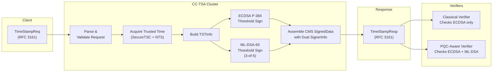
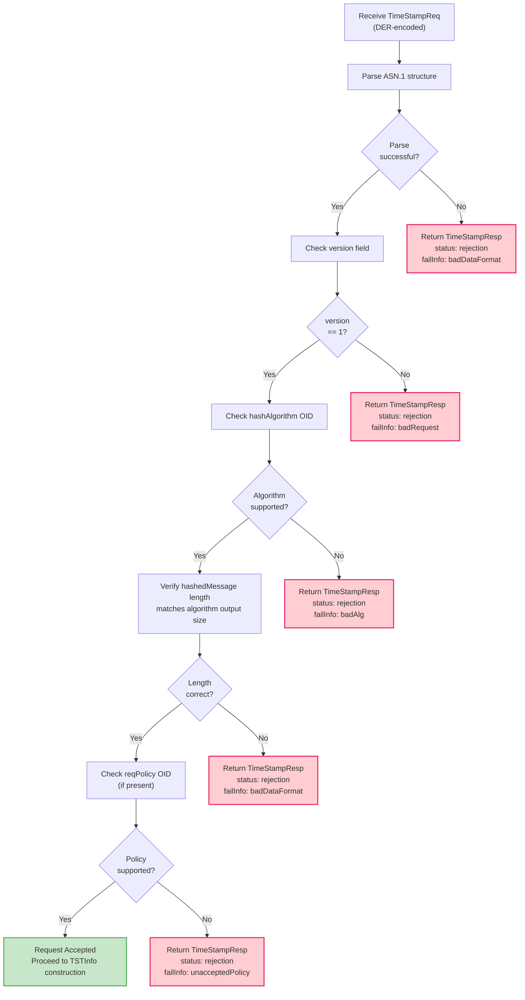
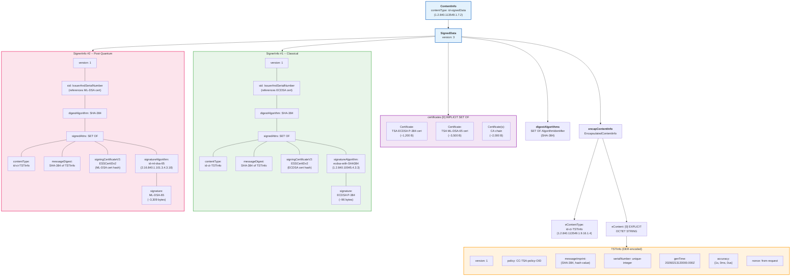
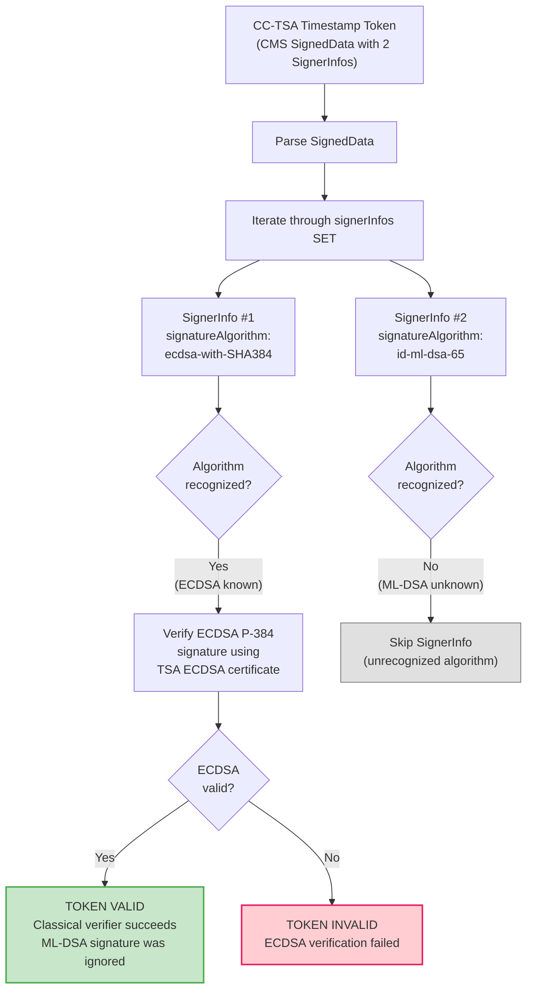
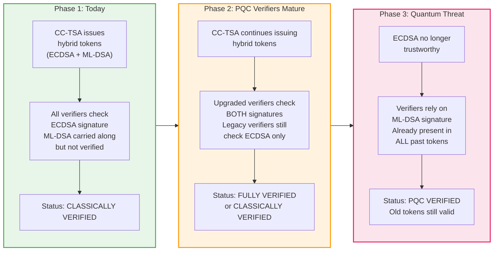
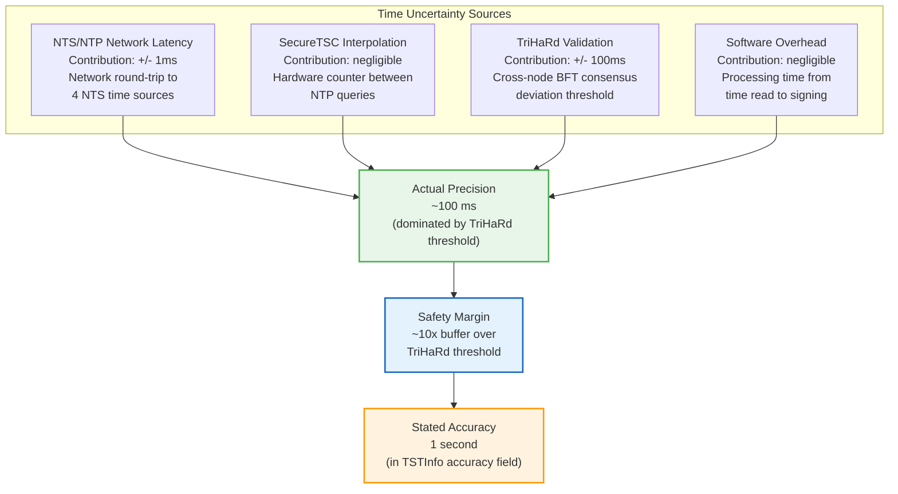
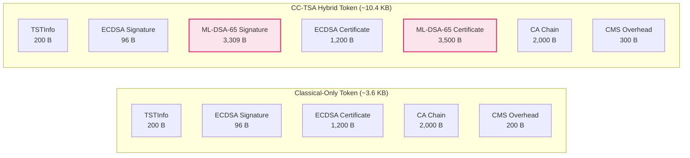
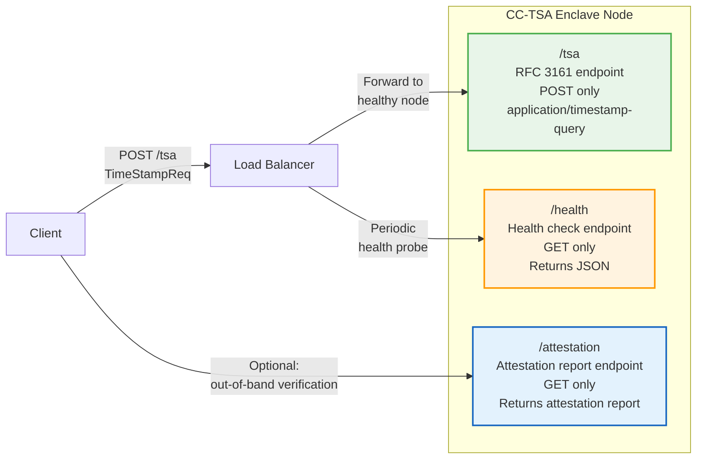

# RFC 3161 Protocol Compliance

> **CC-TSA Design Document 06** | Audience: Architects, Engineers, Security Reviewers, Integrators

This document provides a detailed analysis of how the Confidential Computing Timestamp Authority (CC-TSA) implements the RFC 3161 Time-Stamp Protocol.
It covers request processing, response structure, the CMS SignedData encoding with dual hybrid signatures (ECDSA P-384 + ML-DSA-65),
backward compatibility with classical verifiers, the verification decision tree, accuracy semantics, token size analysis, and HTTP transport.
CC-TSA is a fully RFC 3161-compliant Timestamp Authority that additionally provides post-quantum cryptographic assurance
through a second `SignerInfo` in the CMS `SignedData` structure.

The key distinguishing property of CC-TSA tokens is that each token carries **two signatures** (dual `SignerInfo` entries):
one classical ECDSA P-384 signature for backward compatibility with all existing verifiers,
and one ML-DSA-65 post-quantum signature produced via 3-of-5 threshold signing across hardware-attested enclaves.
The threshold signature is standard ML-DSA-65 output -- verifiers cannot distinguish it from a single-signer signature.

For the overall system architecture, see [Architecture Overview](01-architecture-overview.md).
For the threshold signing protocol and key management, see [Quantum-Safe Threshold Cryptography](03-quantum-safe-threshold-crypto.md).
For the trusted time mechanisms that produce the `genTime` value in each token,
see [Confidential Computing & Time](02-confidential-computing-and-time.md).

---

## Table of Contents

1. [Overview](#1-overview)
2. [Request Processing](#2-request-processing)
3. [Response Structure](#3-response-structure)
4. [CMS SignedData Structure](#4-cms-signeddata-structure)
5. [Verification Decision Tree](#5-verification-decision-tree)
6. [Backward Compatibility](#6-backward-compatibility)
7. [Accuracy Field](#7-accuracy-field)
8. [Token Size Analysis](#8-token-size-analysis)
9. [HTTP Transport](#9-http-transport)

---

## 1. Overview

CC-TSA is a fully RFC 3161-compliant Timestamp Authority.
It accepts `TimeStampReq` messages over HTTP (RFC 3161 Section 3.4) and returns `TimeStampResp` messages
containing CMS `SignedData` timestamp tokens (RFC 5652). Every aspect of the request/response protocol, token format,
hash algorithm negotiation, policy OID handling, nonce semantics, serial number generation,
and accuracy reporting conforms to RFC 3161 and its companion standards.

The single architectural difference from a traditional TSA is that each CC-TSA timestamp token carries **two signatures** encoded as two `SignerInfo` entries within the CMS `SignedData` structure:

- **SignerInfo #1 (Classical)**: ECDSA P-384 signature, verifiable by all existing RFC 3161 verification software.
- **SignerInfo #2 (Post-Quantum)**: ML-DSA-65 (FIPS 204) signature, produced via 3-of-5 threshold signing
across hardware-attested AMD SEV-SNP enclaves.
The threshold combination yields a standard ML-DSA-65 signature that is indistinguishable from a single-signer output.

This dual-signature approach is permitted by RFC 5652 (CMS), which explicitly allows multiple `SignerInfo` entries
in a `SignedData` structure. Classical verifiers process the ECDSA `SignerInfo` and skip the ML-DSA `SignerInfo`
(unrecognized algorithm OID). PQC-aware verifiers can verify both. No modification is required to existing verification software.



---

## 2. Request Processing

### TimeStampReq Structure (RFC 3161 Section 2.4.1)

Every timestamp request sent to CC-TSA must conform to the following ASN.1 structure:

```
TimeStampReq ::= SEQUENCE {
    version         INTEGER { v1(1) },
    messageImprint  MessageImprint,
    reqPolicy       TSAPolicyId      OPTIONAL,
    nonce           INTEGER          OPTIONAL,
    certReq         BOOLEAN          DEFAULT FALSE,
    extensions      [0] IMPLICIT Extensions OPTIONAL
}

MessageImprint ::= SEQUENCE {
    hashAlgorithm   AlgorithmIdentifier,
    hashedMessage   OCTET STRING
}
```

The `messageImprint` contains the hash of the data the client wishes to timestamp.
CC-TSA never sees the original data -- only the hash value. The `reqPolicy` allows the client to request a specific TSA policy.
The `nonce` provides replay protection (the TSA echoes it in the response, allowing the client to match responses to requests).
The `certReq` flag indicates whether the client wants the TSA certificate chain included in the response
(CC-TSA always includes certificates regardless, per best practice).

### Supported Hash Algorithms

CC-TSA supports the following hash algorithms for the `messageImprint` field. The hash algorithm OID in the request determines which algorithm the client used to hash the original data.

| Algorithm | OID | Output Length | Status |
|---|---|---|---|
| SHA-256 | 2.16.840.1.101.3.4.2.1 | 32 bytes | Supported |
| SHA-384 | 2.16.840.1.101.3.4.2.2 | 48 bytes | **Recommended** |
| SHA-512 | 2.16.840.1.101.3.4.2.3 | 64 bytes | Supported |
| SHA3-256 | 2.16.840.1.101.3.4.2.8 | 32 bytes | Supported |
| SHA3-384 | 2.16.840.1.101.3.4.2.9 | 48 bytes | Supported |

SHA-384 is the recommended algorithm because it aligns with the ECDSA P-384 signing algorithm (which uses SHA-384 for the digest)
and provides a comfortable security margin for long-lived timestamps.
SHA-1 and MD5 are explicitly **rejected** -- CC-TSA returns `badAlg` for these deprecated algorithms.

### Request Validation Flow

CC-TSA validates every incoming `TimeStampReq` through a strict sequence of checks before proceeding to timestamp construction:



**Validation steps in detail:**

1. **Parse ASN.1**: Decode the DER-encoded `TimeStampReq`. If the byte stream is malformed or does not conform to the ASN.1 schema, return `badDataFormat`.
2. **Verify version**: The `version` field must be `1` (the only version defined by RFC 3161). Any other value results in `badRequest`.
3. **Verify hash algorithm**: The `hashAlgorithm` OID in `messageImprint` must be in the supported set. SHA-1 (1.3.14.3.2.26) and MD5 (1.2.840.113549.2.5) are explicitly rejected with `badAlg`.
4. **Verify hash length**: The `hashedMessage` octet string length must match the expected output size for the declared algorithm
(e.g., 32 bytes for SHA-256, 48 bytes for SHA-384). A mismatch indicates a malformed request and results in `badDataFormat`.
5. **Verify policy**: If `reqPolicy` is present, it must match the CC-TSA policy OID or be in the set of policies the deployment supports.
If the client requests an unsupported policy, return `unacceptedPolicy`.

If all checks pass, the request proceeds to trusted time acquisition and TSTInfo construction.
See [Architecture Overview](01-architecture-overview.md) for the full request lifecycle including threshold signing.

---

## 3. Response Structure

### TimeStampResp Structure (RFC 3161 Section 2.4.2)

CC-TSA returns a `TimeStampResp` for every request, whether successful or not:

```
TimeStampResp ::= SEQUENCE {
    status          PKIStatusInfo,
    timeStampToken  TimeStampToken OPTIONAL
}

PKIStatusInfo ::= SEQUENCE {
    status        PKIStatus,
    statusString  PKIFreeText    OPTIONAL,
    failInfo      PKIFailureInfo OPTIONAL
}
```

For successful requests, `status` is `granted` (0) and `timeStampToken` contains the CMS `SignedData` structure.
For failed requests, `status` is `rejection` (2) and `failInfo` indicates the reason; `timeStampToken` is absent.

### PKIStatus Values

| Value | Name | Meaning |
|---|---|---|
| 0 | granted | Token issued successfully |
| 1 | grantedWithMods | Token issued with modifications (CC-TSA does not use this) |
| 2 | rejection | Request rejected; see failInfo |
| 3 | waiting | Not used by CC-TSA (synchronous operation) |
| 4 | revocationWarning | Not applicable to TSA |
| 5 | revocationNotification | Not applicable to TSA |

### PKIFailureInfo Bit Values

| Bit | Name | When CC-TSA Returns It |
|---|---|---|
| 0 | badAlg | Unsupported or deprecated hash algorithm (SHA-1, MD5) |
| 2 | badRequest | Malformed request, wrong version, or internal error |
| 5 | badDataFormat | ASN.1 parse failure or hash length mismatch |
| 15 | timeNotAvailable | Trusted time cannot be obtained (NTS failure + SecureTSC drift) |
| 16 | unacceptedPolicy | Requested policy OID not supported |
| 25 | unacceptedExtension | Unrecognized critical extension in request |

### TSTInfo Structure (RFC 3161 Section 2.4.2)

The core content of every timestamp token is the `TSTInfo` structure, which is DER-encoded and embedded in the CMS `SignedData` as `eContent`:

```
TSTInfo ::= SEQUENCE {
    version         INTEGER { v1(1) },
    policy          TSAPolicyId,
    messageImprint  MessageImprint,
    serialNumber    INTEGER,
    genTime         GeneralizedTime,
    accuracy        Accuracy        OPTIONAL,
    ordering        BOOLEAN         DEFAULT FALSE,
    nonce           INTEGER         OPTIONAL,
    tsa             [0] GeneralName OPTIONAL,
    extensions      [1] IMPLICIT Extensions OPTIONAL
}
```

### CC-TSA TSTInfo Field Values

| Field | Value | Notes |
|---|---|---|
| `version` | 1 | Per RFC 3161 |
| `policy` | CC-TSA policy OID (TBD) | Organization-specific; echoed from request if the client specified a supported policy |
| `messageImprint` | Copied from request | Hash algorithm OID + hash value, unchanged |
| `serialNumber` | Monotonically increasing, unique | Per-node counter + node ID to ensure global uniqueness across the cluster |
| `genTime` | UTC from SecureTSC + NTS | GeneralizedTime with fractional seconds (e.g., `20260213120000.000Z`) |
| `accuracy` | `{seconds: 1, millis: 0, micros: 0}` | 1 second conservative; timestamping is not latency-sensitive work (see [Section 7](#7-accuracy-field)) |
| `ordering` | FALSE | CC-TSA does not guarantee total ordering across all tokens |
| `nonce` | Copied from request (if present) | Echoed for replay protection; absent if not in request |
| `tsa` | CC-TSA GeneralName | DirectoryName with the TSA's distinguished name from the certificate |

**Serial number generation**: Each enclave node maintains a monotonically increasing counter.
The serial number is constructed as `(node_id << 48) | counter`, ensuring global uniqueness without cross-node coordination.
This allows each of the 5 nodes to generate serial numbers independently when serving as coordinator for a timestamp request.

**genTime precision**: The `genTime` field is encoded as `GeneralizedTime` with fractional seconds (e.g., `20260213120000.123Z`).
The time is derived from the trusted time chain described in [Confidential Computing & Time](02-confidential-computing-and-time.md):
SecureTSC provides sub-nanosecond resolution hardware time,
cross-validated against NTS-authenticated NTP sources via the TriHaRd Byzantine fault-tolerant protocol.

---

## 4. CMS SignedData Structure

This section provides a detailed breakdown of the complete CMS `ContentInfo` structure produced by CC-TSA for each timestamp token.
The structure follows RFC 5652 (CMS) with the timestamp-specific content type from RFC 3161.

### Annotated Structure Diagram

The following diagram shows the full hierarchy from the outer `ContentInfo` envelope down to individual fields of each `SignerInfo`.
This is the exact structure that a DER decoder produces when parsing a CC-TSA timestamp token.



### Field Details

**ContentInfo**: The outermost ASN.1 structure. The `contentType` is `id-signedData` (OID 1.2.840.113549.1.7.2),
indicating that the content is a CMS SignedData structure.

**SignedData version**: Set to `3` because the `encapContentInfo` uses a content type other than `id-data`
(it uses `id-ct-TSTInfo`), which requires version 3 per RFC 5652 Section 5.1.

**digestAlgorithms**: Contains `SHA-384` as a single entry. Both `SignerInfo` entries use SHA-384 as their digest algorithm,
so only one entry is needed in this SET.
Per RFC 5652, this field should contain the union of all digest algorithms used by all `SignerInfo` entries.

**encapContentInfo**: Contains the DER-encoded `TSTInfo`. The `eContentType` is `id-ct-TSTInfo` (OID 1.2.840.113549.1.9.16.1.4),
which identifies this as an RFC 3161 timestamp token.
The `eContent` is the DER encoding of the `TSTInfo` structure wrapped in an `[0] EXPLICIT OCTET STRING` tag.

**certificates**: Contains the full certificate chain needed for self-contained verification:
- The TSA's ECDSA P-384 certificate (for verifying SignerInfo #1)
- The TSA's ML-DSA-65 certificate (for verifying SignerInfo #2)
- The CA certificate(s) linking the TSA certificates to the trust root

Both TSA certificates contain the `id-kp-timeStamping` (OID 1.3.6.1.5.5.7.3.8) extended key usage, as required by RFC 3161 Section 2.3.

**SignerInfo #1 (Classical)**: The ECDSA P-384 signature over the `TSTInfo`. The `sid` field uses `IssuerAndSerialNumber`
to reference the ECDSA TSA certificate. The `signedAttrs` include the mandatory `contentType` and `messageDigest` attributes,
plus the `signingCertificateV2` attribute (RFC 5035) that binds this `SignerInfo` to a specific certificate,
preventing certificate substitution attacks. The signature algorithm is `ecdsa-with-SHA384` (OID 1.2.840.10045.4.3.3).

**SignerInfo #2 (Post-Quantum)**: The ML-DSA-65 signature over the same `TSTInfo`.
Structurally identical to SignerInfo #1 except that it references the ML-DSA TSA certificate
and uses `id-ml-dsa-65` (OID 2.16.840.1.101.3.4.3.18) as the signature algorithm.
The signature value is approximately 3,309 bytes -- the standard output of ML-DSA-65 signing.
Because the ML-DSA-65 signature is produced via 3-of-5 threshold signing
(see [Quantum-Safe Threshold Cryptography](03-quantum-safe-threshold-crypto.md)),
the output is indistinguishable from a single-signer ML-DSA-65 signature.

### 4.1 CVM/Wrapper Split for CMS Construction

In the two-layer architecture, the CMS `SignedData` construction is split between the CVM core and the wrapper:

**CVM core produces (inside attested enclave):**
- DER-encoded `TSTInfo` (template-based construction, no ASN.1 library)
- DER-encoded `signedAttrs` SET containing `contentType`, `messageDigest` (SHA-384 of TSTInfo), and `signingCertificateV2`
- ECDSA P-384 signature over the `signedAttrs` DER

**Wrapper assembles (outside CVM, updatable):**
- CMS `SignedData` structure: wraps TSTInfo as `encapContentInfo`, places signedAttrs and signature in `SignerInfo`, adds certificates
- `ContentInfo` envelope with `id-signedData` content type
- `TimeStampResp` with `PKIStatusInfo`

This split ensures that the security-critical operations (time reading, TSTInfo construction, signing)
occur inside the attested CVM, while the protocol complexity (ASN.1 parsing, CMS assembly, HTTP handling)
resides in the updatable wrapper. The wrapper holds no key material and cannot forge signatures.

The CVM and wrapper communicate over vsock using a fixed binary protocol
documented in [Enclave Interface](09-enclave-interface.md).
For the MVP, only ECDSA P-384 is produced by the CVM (single `SignerInfo`).
ML-DSA-65 threshold signing will be added in a future iteration,
producing a second `SignerInfo` in the CMS structure.

### Signed Attributes

Both `SignerInfo` entries contain the same set of signed attributes, which are DER-encoded, digested with SHA-384, and then signed. The signed attributes are:

| Attribute | OID | Value |
|---|---|---|
| `contentType` | 1.2.840.113549.1.9.3 | `id-ct-TSTInfo` (1.2.840.113549.1.9.16.1.4) |
| `messageDigest` | 1.2.840.113549.1.9.4 | SHA-384 hash of the DER-encoded `TSTInfo` |
| `signingCertificateV2` | 1.2.840.113549.1.9.16.2.47 | `ESSCertIDv2` containing the SHA-256 hash of the respective TSA certificate |

The `signingCertificateV2` attribute is critical: it binds each `SignerInfo` to a specific certificate,
ensuring that an attacker cannot substitute a different certificate with the same public key.
Each `SignerInfo` references a different certificate (ECDSA or ML-DSA), which is correct behavior for a dual-signature scheme.

---

## 5. Verification Decision Tree

The following flowchart shows the complete decision process for a verifier processing a CC-TSA timestamp token.
The flow supports three types of verifiers: classical-only, PQC-aware, and belt-and-suspenders (requiring both).

```mermaid
flowchart TD
    START["Receive TimeStampResp<br/>(DER-encoded)"]

    PARSE_RESP["Parse TimeStampResp"]
    CHECK_STATUS{"status ==<br/>granted (0)?"}
    ERR_STATUS["Token not granted<br/>Check failInfo for reason<br/>ABORT"]

    EXTRACT_SD["Extract SignedData<br/>from timeStampToken"]
    CHECK_VER{"SignedData<br/>version == 3?"}
    ERR_VER["Unexpected version<br/>ABORT"]

    EXTRACT_TST["Extract TSTInfo from<br/>encapContentInfo.eContent"]
    CHECK_TST_VER{"TSTInfo<br/>version == 1?"}
    ERR_TST_VER["Unexpected TSTInfo version<br/>ABORT"]

    CHECK_POLICY["Verify TSTInfo.policy<br/>matches expected policy OID"]
    POLICY_OK{"Policy<br/>acceptable?"}
    ERR_POLICY["Unacceptable policy<br/>REJECT"]

    EXTRACT_TIME["Extract genTime<br/>and accuracy"]

    CHECK_NONCE{"Nonce sent<br/>in request?"}
    VERIFY_NONCE{"TSTInfo.nonce<br/>matches request<br/>nonce?"}
    ERR_NONCE["Nonce mismatch<br/>Possible replay attack<br/>REJECT"]

    CHECK_ECDSA{"Found ECDSA<br/>SignerInfo?"}
    VERIFY_ECDSA["Verify ECDSA signature<br/>against TSA ECDSA certificate"]
    ECDSA_RESULT{"ECDSA<br/>signature<br/>valid?"}
    ECDSA_VALID["ECDSA_VALID"]
    ECDSA_INVALID["ECDSA_INVALID"]
    ECDSA_MISSING["ECDSA_MISSING"]

    CHECK_MLDSA{"Found ML-DSA<br/>SignerInfo?"}
    VERIFY_MLDSA["Verify ML-DSA-65 signature<br/>against TSA ML-DSA certificate"]
    MLDSA_RESULT{"ML-DSA<br/>signature<br/>valid?"}
    MLDSA_VALID["MLDSA_VALID"]
    MLDSA_INVALID["MLDSA_INVALID"]
    MLDSA_MISSING["MLDSA_MISSING<br/>(classical-only verifier:<br/>this is expected)"]

    VERIFY_CHAIN["Verify certificate chain(s)<br/>against trusted CA root"]
    CHAIN_OK{"Chain(s)<br/>valid?"}
    ERR_CHAIN["Certificate chain invalid<br/>REJECT"]

    CHECK_VALIDITY["Check certificate validity<br/>(not expired, not revoked)"]
    VALID_OK{"Certificate(s)<br/>valid?"}
    ERR_VALIDITY["Certificate expired or revoked<br/>REJECT"]

    CHECK_EKU["Verify EKU includes<br/>id-kp-timeStamping<br/>(1.3.6.1.5.5.7.3.8)"]
    EKU_OK{"EKU<br/>present?"}
    ERR_EKU["Missing timeStamping EKU<br/>REJECT"]

    DECISION{"Combine<br/>results"}

    FULL["FULLY VERIFIED<br/>ECDSA_VALID + MLDSA_VALID<br/>Classical + PQC assurance"]
    CLASSIC["CLASSICALLY VERIFIED<br/>ECDSA_VALID + MLDSA_MISSING<br/>Legacy verifier, PQC not checked"]
    WARN["WARNING<br/>ECDSA_VALID + MLDSA_INVALID<br/>PQC signature bad, investigate"]
    REJECT_FINAL["REJECT<br/>ECDSA_INVALID<br/>Classical signature failed"]

    START --> PARSE_RESP
    PARSE_RESP --> CHECK_STATUS
    CHECK_STATUS -->|Yes| EXTRACT_SD
    CHECK_STATUS -->|No| ERR_STATUS

    EXTRACT_SD --> CHECK_VER
    CHECK_VER -->|Yes| EXTRACT_TST
    CHECK_VER -->|No| ERR_VER

    EXTRACT_TST --> CHECK_TST_VER
    CHECK_TST_VER -->|Yes| CHECK_POLICY
    CHECK_TST_VER -->|No| ERR_TST_VER

    CHECK_POLICY --> POLICY_OK
    POLICY_OK -->|Yes| EXTRACT_TIME
    POLICY_OK -->|No| ERR_POLICY

    EXTRACT_TIME --> CHECK_NONCE
    CHECK_NONCE -->|Yes| VERIFY_NONCE
    CHECK_NONCE -->|No| CHECK_ECDSA
    VERIFY_NONCE -->|Yes| CHECK_ECDSA
    VERIFY_NONCE -->|No| ERR_NONCE

    CHECK_ECDSA -->|Yes| VERIFY_ECDSA
    CHECK_ECDSA -->|No| ECDSA_MISSING
    VERIFY_ECDSA --> ECDSA_RESULT
    ECDSA_RESULT -->|Yes| ECDSA_VALID
    ECDSA_RESULT -->|No| ECDSA_INVALID

    ECDSA_VALID --> CHECK_MLDSA
    ECDSA_INVALID --> REJECT_FINAL

    CHECK_MLDSA -->|Yes| VERIFY_MLDSA
    CHECK_MLDSA -->|No| MLDSA_MISSING
    VERIFY_MLDSA --> MLDSA_RESULT
    MLDSA_RESULT -->|Yes| MLDSA_VALID
    MLDSA_RESULT -->|No| MLDSA_INVALID

    MLDSA_VALID --> VERIFY_CHAIN
    MLDSA_INVALID --> VERIFY_CHAIN
    MLDSA_MISSING --> VERIFY_CHAIN
    ECDSA_MISSING --> VERIFY_CHAIN

    VERIFY_CHAIN --> CHAIN_OK
    CHAIN_OK -->|Yes| CHECK_VALIDITY
    CHAIN_OK -->|No| ERR_CHAIN

    CHECK_VALIDITY --> VALID_OK
    VALID_OK -->|Yes| CHECK_EKU
    VALID_OK -->|No| ERR_VALIDITY

    CHECK_EKU --> EKU_OK
    EKU_OK -->|Yes| DECISION
    EKU_OK -->|No| ERR_EKU

    DECISION -->|"ECDSA_VALID +<br/>MLDSA_VALID"| FULL
    DECISION -->|"ECDSA_VALID +<br/>MLDSA_MISSING"| CLASSIC
    DECISION -->|"ECDSA_VALID +<br/>MLDSA_INVALID"| WARN
    DECISION -->|"ECDSA_INVALID or<br/>ECDSA_MISSING"| REJECT_FINAL

    style FULL fill:#c8e6c9,stroke:#2E7D32,stroke-width:3px
    style CLASSIC fill:#fff9c4,stroke:#F9A825,stroke-width:2px
    style WARN fill:#ffe0b2,stroke:#E65100,stroke-width:2px
    style REJECT_FINAL fill:#ffcdd2,stroke:#C62828,stroke-width:3px
    style ERR_STATUS fill:#ffcdd2,stroke:#E91E63,stroke-width:1px
    style ERR_VER fill:#ffcdd2,stroke:#E91E63,stroke-width:1px
    style ERR_TST_VER fill:#ffcdd2,stroke:#E91E63,stroke-width:1px
    style ERR_POLICY fill:#ffcdd2,stroke:#E91E63,stroke-width:1px
    style ERR_NONCE fill:#ffcdd2,stroke:#E91E63,stroke-width:1px
    style ERR_CHAIN fill:#ffcdd2,stroke:#E91E63,stroke-width:1px
    style ERR_VALIDITY fill:#ffcdd2,stroke:#E91E63,stroke-width:1px
    style ERR_EKU fill:#ffcdd2,stroke:#E91E63,stroke-width:1px
```



### Verification Outcome Summary

| ECDSA Result | ML-DSA Result | Final Verdict | Interpretation |
|---|---|---|---|
| VALID | VALID | **FULLY VERIFIED** | Both classical and post-quantum signatures are correct. Highest assurance level. Token is valid even if ECDSA is broken by a quantum computer in the future. |
| VALID | MISSING | **CLASSICALLY VERIFIED** | Classical signature is correct; ML-DSA was not checked (verifier does not support ML-DSA). This is the expected behavior for legacy verifiers. The token is valid under current cryptographic assumptions. |
| VALID | INVALID | **WARNING** | Classical signature is correct, but the post-quantum signature fails verification. This is an anomalous condition that should be investigated -- it could indicate key compromise, a software bug, or certificate mismatch. The token should be treated with caution. |
| INVALID | (any) | **REJECT** | Classical signature verification failed. The token must be rejected regardless of the ML-DSA result. |
| MISSING | (any) | **REJECT** | No ECDSA SignerInfo found. CC-TSA always produces an ECDSA signature, so its absence indicates a malformed or tampered token. |

---

## 6. Backward Compatibility

Backward compatibility is a fundamental design requirement of the CC-TSA hybrid signature approach. Existing RFC 3161 verification software must be able to process CC-TSA tokens without any modifications.

### How Classical Verifiers Handle Hybrid Tokens

RFC 5652 (CMS) Section 5.1 defines `signerInfos` as a `SET OF SignerInfo`, explicitly permitting multiple entries. A classical verifier that encounters a CC-TSA token follows this standard processing:



The key behaviors that ensure backward compatibility:

1. **Multiple SignerInfos are standard CMS**: RFC 5652 Section 5.1 explicitly permits a `SET OF SignerInfo` with multiple entries.
This is not a CC-TSA extension -- it is a core CMS feature. Any compliant CMS implementation handles multiple `SignerInfo` entries.

2. **Unrecognized algorithms are skipped**: When a classical verifier encounters a `SignerInfo`
with `signatureAlgorithm: id-ml-dsa-65`, it does not recognize the OID.
Per standard CMS processing, it skips this `SignerInfo` and moves to the next. It does not fail or raise an error.

3. **ECDSA SignerInfo is fully standard**: SignerInfo #1 uses `ecdsa-with-SHA384`, a universally supported algorithm.
The signed attributes, certificate reference, and signature encoding are all standard.
A classical verifier processes this entry exactly as it would for any other ECDSA-signed timestamp.

4. **No modification needed**: Libraries such as OpenSSL, Bouncy Castle, Go `crypto/pkcs7`, and Python `asn1crypto`
all handle multiple `SignerInfo` entries and unrecognized algorithms correctly.
CC-TSA tokens are verified by these libraries without any patches or configuration changes.

5. **Token is slightly larger**: The ML-DSA-65 signature (~3.3 KB) and ML-DSA certificate (~3.5 KB) add approximately 6.8 KB to the token.
This does not affect ASN.1 parsing or CMS processing -- it simply means more bytes are read and skipped.
See [Section 8](#8-token-size-analysis) for a detailed size breakdown.

### PQC-Aware Verifiers

Future verifiers that recognize `id-ml-dsa-65` can verify **both** signatures in a CC-TSA token:

1. Verify SignerInfo #1 (ECDSA P-384) against the ECDSA TSA certificate -- confirms classical integrity.
2. Verify SignerInfo #2 (ML-DSA-65) against the ML-DSA TSA certificate -- confirms post-quantum integrity.
3. Verify that both `SignerInfo` entries cover the same `TSTInfo` content (same `messageDigest` in signed attributes).

The ML-DSA certificate is included in the `certificates` field of the `SignedData`, making the token self-contained for PQC verification. No external certificate retrieval is needed.

### Transition Strategy

The hybrid dual-signature approach supports a graceful transition from classical to quantum-safe timestamp verification over three phases:



**Phase 1 -- Today**: CC-TSA issues hybrid tokens with both ECDSA and ML-DSA signatures.
All existing verifiers validate the ECDSA signature and ignore the ML-DSA signature (unrecognized algorithm).
The ML-DSA signature is "future-proofing" -- it is present in the token but not yet relied upon.

**Phase 2 -- When PQC verifiers mature**: As verification libraries add ML-DSA-65 support,
verifiers begin checking both signatures. Critically, no re-stamping of existing documents is needed.
Tokens issued in Phase 1 already contain the ML-DSA signature, and verifiers in Phase 2 can retroactively verify it.
This is the key advantage of the dual-signature approach over a sequential "migrate later" strategy.

**Phase 3 -- When quantum computers threaten ECDSA**: If a cryptographically relevant quantum computer becomes available,
the ECDSA signature in old tokens becomes untrustworthy (an attacker could forge ECDSA signatures).
However, the ML-DSA-65 signature -- already present in every token issued since Phase 1 -- remains valid
and provides continued assurance that the timestamp was issued by the CC-TSA at the stated time.
No retroactive action is needed for the CC-TSA's timestamps to remain verifiable in a post-quantum world.

---

## 7. Accuracy Field

### RFC 3161 Accuracy Definition

The `accuracy` field in `TSTInfo` represents the maximum deviation of `genTime` from UTC:

```
Accuracy ::= SEQUENCE {
    seconds   INTEGER          OPTIONAL,
    millis    [0] INTEGER (1..999) OPTIONAL,
    micros    [1] INTEGER (1..999) OPTIONAL
}
```

Per RFC 3161 Section 2.4.2, the true time of the timestamp is guaranteed to be within
`[genTime - accuracy, genTime + accuracy]`. A verifier should interpret this as:
"The actual UTC time at which the TSA created this token is within 1 second of the stated `genTime`."

### CC-TSA Accuracy: 1 Second

CC-TSA sets the `accuracy` field to `{seconds: 1, millis: 0, micros: 0}`,
representing a maximum deviation of 1 second from UTC.
This conservative value reflects that timestamping is not latency-sensitive work
and provides generous margin for all operating conditions.



### Precision Budget

| Source | Contribution | Notes |
|---|---|---|
| NTS/NTP network latency | ±1ms | Network round-trip to NTS sources |
| SecureTSC interpolation | Negligible | Hardware counter between NTP queries |
| TriHaRd cross-node validation | ±100ms | BFT consensus threshold; nodes exceeding this are excluded |
| Software overhead | Negligible | Processing time from clock read to signature |
| **Actual precision** | **~100 ms** | **Dominated by TriHaRd consensus threshold** |
| **Stated accuracy** | **1 second** | **Conservative margin for safety** |

For a detailed breakdown of the time trust chain that produces this precision,
see [Confidential Computing & Time](02-confidential-computing-and-time.md), Sections 3 (Time Trust Chain) and 8 (Precision Budget).

### Why 1 Second?

The 1-second accuracy field provides approximately a 10x safety margin over the TriHaRd consensus threshold of 100ms. This conservatism is intentional:

1. **Timestamping is not latency-sensitive**: RFC 3161 timestamps prove that data existed before a certain time.
   For the vast majority of use cases — document signing, code signing, compliance logging —
   1-second accuracy is more than sufficient.

2. **Industry alignment**: Many production TSAs claim 1-second accuracy. The CC-TSA's 1-second claim aligns with industry norms, avoiding over-specification that could be invalidated under adverse conditions.

3. **Operational margin**: The generous margin absorbs rare NTP outliers, cross-provider network congestion spikes, and transient degradation without producing timestamps that violate the stated accuracy.

4. **Future tightening**: The accuracy field can be reduced in future deployments if tighter precision is required.
   Reducing the stated accuracy is a non-breaking change — it only improves the guarantee for verifiers.
   The underlying hardware (SecureTSC) provides sub-millisecond precision,
   so tightening is straightforward if a use case demands it.

---

## 8. Token Size Analysis

### Component Breakdown

| Component | Classical-Only TSA | CC-TSA (Hybrid) | Notes |
|---|---|---|---|
| TSTInfo (DER-encoded) | ~200 B | ~200 B | Same structure; no change |
| ECDSA P-384 signature | ~96 B | ~96 B | Standard ECDSA output |
| ML-DSA-65 signature | -- | ~3,309 B | Standard ML-DSA-65 output (threshold-produced, indistinguishable) |
| ECDSA P-384 certificate | ~1,200 B | ~1,200 B | Standard X.509 with P-384 public key |
| ML-DSA-65 certificate | -- | ~3,500 B | X.509 with ML-DSA-65 public key (~1,952 B) |
| CA chain certificates | ~2,000 B | ~2,000 B | Intermediate + root CA certificates |
| CMS SignedData overhead | ~200 B | ~300 B | ASN.1 tags, SET/SEQUENCE wrappers, attributes |
| **Total** | **~3,700 B (~3.6 KB)** | **~10,600 B (~10.4 KB)** | |

### Size Comparison



### Size Impact Assessment

CC-TSA hybrid tokens are approximately **2.8x larger** than classical-only tokens. The ML-DSA-65 signature (~3.3 KB) and ML-DSA-65 certificate (~3.5 KB) account for almost all of the size increase.

**For most use cases, 10.4 KB per timestamp is negligible:**

- A single HTTP response easily accommodates 10 KB of payload.
- Stored on disk, 1 million timestamps consume approximately 10 GB -- well within typical storage budgets.
- Transmitted over a network, even a modest 1 Mbps connection can deliver over 12,000 tokens per second.

**If size is critical**, two strategies can reduce the per-token overhead:

1. **Omit the ML-DSA certificate from individual tokens**: If the verifier has the ML-DSA TSA certificate cached or available
via a trust store, it does not need to be included in every token.
This reduces the per-token size to approximately **7.1 KB** (saving ~3.5 KB).
The `certificates` field in `SignedData` is optional per RFC 5652 --
omitting certain certificates is standard practice when the verifier is expected to obtain them out-of-band.

2. **Omit the CA chain from individual tokens**: Similarly, if the CA certificates are pre-distributed to verifiers,
they can be omitted from individual tokens, saving approximately 2 KB per token.
This reduces the total to approximately **5.1 KB** with both certificates omitted, or **8.4 KB** with only the CA chain omitted.

---

## 9. HTTP Transport

CC-TSA implements the HTTP transport protocol defined in RFC 3161 Section 3.4, with additional security requirements and operational endpoints.

### Request Format (RFC 3161 Section 3.4)

```
POST /tsa HTTP/1.1
Host: tsa.example.com
Content-Type: application/timestamp-query
Content-Length: <length>

<DER-encoded TimeStampReq>
```

The request body is the DER-encoded `TimeStampReq` structure. The `Content-Type` header must be `application/timestamp-query` as specified in RFC 3161. CC-TSA rejects requests with incorrect content types.

### Response Format

```
HTTP/1.1 200 OK
Content-Type: application/timestamp-reply
Content-Length: <length>

<DER-encoded TimeStampResp>
```

The response body is the DER-encoded `TimeStampResp`. The HTTP status code is `200 OK` for all RFC 3161 responses,
including rejected timestamp requests -- the rejection is communicated in the `PKIStatusInfo` within the response body,
not in the HTTP status code. This is per RFC 3161: the HTTP layer is a transport mechanism,
and the application-level status is in the RFC 3161 response structure.

Non-200 HTTP status codes are used only for transport-layer errors:

| HTTP Status | Meaning |
|---|---|
| 200 | RFC 3161 response (success or application-level rejection) |
| 400 | Request is not valid HTTP or content type is wrong |
| 413 | Request body exceeds maximum allowed size |
| 429 | Rate limit exceeded |
| 500 | Internal server error (unexpected failure) |
| 503 | Service unavailable (quorum lost, fewer than 3 nodes online) |

### CC-TSA Transport Requirements and Additions

**TLS 1.3 Required**: All connections to CC-TSA must use HTTPS with TLS 1.3. Plaintext HTTP connections are rejected.
The TLS certificate for the HTTPS endpoint is separate from the TSA signing certificates --
it is a standard web server certificate issued by a public CA for the TSA's domain name.

**Operational Endpoints**: In addition to the RFC 3161 `/tsa` endpoint, CC-TSA exposes optional operational endpoints for load balancer integration and transparency:



**`/health` endpoint**: Returns a JSON object indicating the node's operational status. Used by load balancers to determine whether to route traffic to this node.

```json
{
    "status": "healthy",
    "node_id": "node-1",
    "attested": true,
    "time_synced": true,
    "nts_sources_reachable": 4,
    "trihard_status": "valid",
    "quorum_available": true,
    "uptime_seconds": 86400
}
```

The load balancer removes nodes from rotation when `status` is not `healthy`, when `attested` is `false`,
when `time_synced` is `false`, or when `quorum_available` is `false`.
See [Architecture Overview](01-architecture-overview.md), Section 2.2 for load balancer configuration details.

**`/attestation` endpoint**: Returns the node's current AMD SEV-SNP attestation report in a structured format.
This allows clients or auditors to verify out-of-band that the node is running the expected CC-TSA code in a genuine confidential VM.
The attestation report can be verified independently against AMD's VCEK certificate chain without trusting the CC-TSA operator.
See [Confidential Computing & Time](02-confidential-computing-and-time.md), Section 7 for the attestation boot chain.

---

## Cross-Reference Index

| Topic | Document |
|---|---|
| System architecture, deployment topology, request lifecycle | [Architecture Overview](01-architecture-overview.md) |
| AMD SEV-SNP, SecureTSC, trusted time chain, NTS, TriHaRd | [Confidential Computing & Time](02-confidential-computing-and-time.md) |
| ML-DSA-65 threshold signing, DKG, key lifecycle, proactive refresh | [Quantum-Safe Threshold Cryptography](03-quantum-safe-threshold-crypto.md) |
| Failure scenarios, recovery procedures, SLH-DSA fallback | [Failure Modes and Recovery](04-failure-modes-and-recovery.md) |
| Deployment guide, monitoring, incident response, DKG ceremony ops | [Operations and Deployment](05-operations-and-deployment.md) |
| STRIDE analysis, attack scenarios, residual risks | [Threat Model](07-threat-model.md) |
| Enclave interface, binary protocol, CVM/wrapper split | [Enclave Interface](09-enclave-interface.md) |

---

## References

1. RFC 3161 -- Internet X.509 Public Key Infrastructure Time-Stamp Protocol (TSP): [https://www.rfc-editor.org/rfc/rfc3161](https://www.rfc-editor.org/rfc/rfc3161)
2. RFC 5652 -- Cryptographic Message Syntax (CMS): [https://www.rfc-editor.org/rfc/rfc5652](https://www.rfc-editor.org/rfc/rfc5652)
3. RFC 5035 -- Enhanced Security Services (ESS) Update: Adding CertID Algorithm Agility: [https://www.rfc-editor.org/rfc/rfc5035](https://www.rfc-editor.org/rfc/rfc5035)
4. RFC 5816 -- ESSCertIDv2 Update for RFC 3161: [https://www.rfc-editor.org/rfc/rfc5816](https://www.rfc-editor.org/rfc/rfc5816)
5. RFC 8915 -- Network Time Security for the Network Time Protocol: [https://www.rfc-editor.org/rfc/rfc8915](https://www.rfc-editor.org/rfc/rfc8915)
6. NIST FIPS 204 -- Module-Lattice-Based Digital Signature Standard (ML-DSA)
7. NIST FIPS 186-5 -- Digital Signature Standard (DSS), including ECDSA
8. AMD SEV-SNP -- Strengthening VM Isolation with Integrity Protection and More (AMD White Paper)
