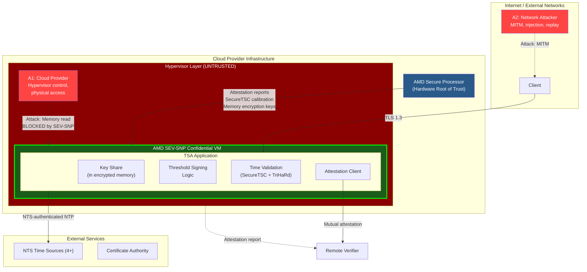
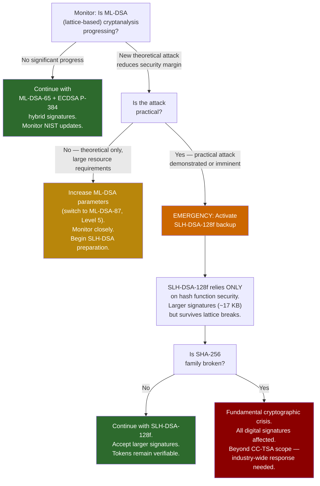

# Threat Model & Security Analysis

This document defines the adversary model, trust assumptions, and security analysis for the Confidential Computing Timestamp Authority (CC-TSA).
It applies STRIDE analysis to all components, evaluates the quantum threat timeline, and documents residual risks with acceptance rationale.

For system architecture and component descriptions, see [Architecture Overview](01-architecture-overview.md).
For cryptographic details, see [Quantum-Safe Threshold Crypto](03-quantum-safe-threshold-crypto.md).
For failure recovery, see [Failure Modes & Recovery](04-failure-modes-and-recovery.md).

---

## 1. Adversary Model

CC-TSA is designed to resist six classes of adversaries, each with distinct capabilities and goals.

### A1: Malicious Cloud Provider

| Property | Details |
|---|---|
| **Capability** | Full control over hypervisor, physical hardware access, network interception within their infrastructure, access to host OS and management plane |
| **Goal** | Read key shares, forge timestamps, manipulate time, or deny service |
| **CC-TSA defense** | AMD SEV-SNP excludes hypervisor from TCB; memory encrypted with per-VM AES-128-XEX key managed by AMD-SP; key shares exist only in encrypted enclave memory (ephemeral, never persisted); no single provider hosts ≥3 nodes (threshold); mutual attestation between nodes verifies correct software |

### A2: Network Attacker

| Property | Details |
|---|---|
| **Capability** | Man-in-the-middle on any network link, traffic analysis, packet injection, replay attacks |
| **Goal** | Forge timestamps, manipulate time sources, intercept key shares during DKG |
| **CC-TSA defense** | mTLS between all nodes (certificates bound to attestation); NTS (RFC 8915) authenticates all NTP traffic; TLS 1.3 for client connections; DKG sub-shares encrypted over attested TLS channels; key shares never traverse the network in plaintext |

### A3: Quantum Adversary

| Property | Details |
|---|---|
| **Capability** | Access to a large-scale fault-tolerant quantum computer (future, estimated 2035–2045) |
| **Goal** | Forge ECDSA signatures on past or future timestamps; break classical cryptographic protections |
| **CC-TSA defense** | Hybrid signatures — every token carries ML-DSA-65 (quantum-safe) alongside ECDSA P-384; tokens issued today are already protected; conservative SLH-DSA-128f backup available if lattice problems become tractable |

### A4: Malicious Insider

| Property | Details |
|---|---|
| **Capability** | Operator with administrative access to CC-TSA infrastructure, cloud consoles, deployment pipelines — but cannot access AMD-SP internals or enclave memory |
| **Goal** | Forge timestamps, extract key material, issue backdated tokens, or sabotage the system |
| **CC-TSA defense** | Key shares exist only in enclave memory (inaccessible to OS-level operators); software is immutable for key lifetime (operator cannot change software without triggering key rotation); DKG requires 4-eyes principle; all operations logged with attestation-bound audit entries; SecureTSC prevents time manipulation by operators |

### A5: Physical Attacker

| Property | Details |
|---|---|
| **Capability** | Physical access to server hardware (datacenter breach, evil maid, supply chain interception) |
| **Goal** | Extract key shares via cold boot attacks, DRAM probing, bus snooping, or hardware implants |
| **CC-TSA defense** | SEV-SNP encrypts memory on the DRAM bus (AES-128-XEX); cold boot recovery yields only ciphertext; encryption key resides in the AMD-SP (hardened against physical probing); multi-provider distribution means physical access to one datacenter is insufficient (need ≥3 shares) |

### A6: Supply Chain Attacker

| Property | Details |
|---|---|
| **Capability** | Compromise the software supply chain — OS packages, application dependencies, firmware updates, container base images |
| **Goal** | Introduce backdoor that leaks key material, manipulates signing, or weakens cryptographic operations |
| **CC-TSA defense** | Attestation measurement covers the full boot chain (OVMF firmware → kernel → application); any supply chain modification changes the launch measurement; mutual attestation between nodes rejects unexpected measurements; measurement is bound to the TSA certificate (supply chain compromise requires CA cooperation for a new certificate); reproducible builds enable independent verification |

---

## 2. Trust Assumptions

CC-TSA explicitly documents what it trusts and what it does not.

| Component | Trusted? | Justification |
|---|---|---|
| AMD silicon (CPU, AMD-SP) | **Yes** | Hardware root of trust. Provides memory encryption, attestation, SecureTSC. If AMD-SP is fundamentally compromised, the security model breaks. Mitigated by: Intel TDX as alternative, AMD's security response track record, wide deployment and scrutiny. |
| AMD-SP firmware | **Yes** | Provides attestation reports, SecureTSC calibration, memory encryption key management. Firmware is versioned and its version is included in attestation reports. |
| Hypervisor / cloud provider | **No** | Explicitly excluded from TCB by SEV-SNP. The hypervisor manages the VM lifecycle but cannot read or modify guest memory. This is the core trust advantage over traditional infrastructure. |
| Cloud provider KMS | **Not in critical path** | KMS is not used for key share storage or unsealing. Key shares are ephemeral (in-memory only). KMS may be used for ancillary purposes (e.g., TLS certificate storage), but it is not in the critical path for signing key management. A KMS outage does not affect signing operations. |
| NTS time sources | **Majority honest** | ≥3 of 4 sources must be honest (Byzantine fault tolerance). A single compromised NTS source cannot shift time beyond the TriHaRd detection threshold. Sources are selected from diverse, independent operators. |
| Other enclave nodes | **< threshold compromised** | At most 2 of 5 nodes may be compromised simultaneously. If ≥3 are compromised, the adversary can forge signatures. Multi-provider distribution makes coordinated compromise of ≥3 nodes extremely difficult. |
| Certificate Authority | **Yes** | The CA must correctly validate CSRs and issue certificates. CA compromise breaks the trust chain for new certificates. Mitigated by certificate transparency logs and short-lived certificates. |
| TSA application code | **Yes** | The application is measured at boot and its measurement is part of the attestation report. Under the immutable software model, the application code is **fixed for the lifetime of a signing key** — its measurement is published and cryptographically bound to the TSA certificate. Relying parties can independently verify the measurement against the published, reproducibly-built binary. Any software change triggers key rotation (new DKG + new certificate), making the measurement a verifiable part of the TSA's cryptographic identity. Bugs in the application are within the TCB. |
| Software immutability | **Yes (enforced)** | Operators cannot modify the running software without triggering key rotation (new DKG + new certificate). The attestation measurement is bound to the certificate — changing the software changes the measurement, which requires a new key and a new certificate. This removes the operator from the trust chain for signing operations: they can deploy new software, but doing so visibly changes the TSA's cryptographic identity. |
| TSA wrapper (outside CVM) | **No** | The wrapper runs outside the CVM and handles HTTP, ASN.1 parsing, and CMS assembly. It is explicitly **untrusted** for signing operations — it holds no key material and cannot produce valid signatures. A compromised wrapper can deny service or return malformed responses, but cannot forge timestamps. Malformed responses are detected by client-side signature verification. The wrapper is updatable without triggering key rotation. |

---

## 3. Trust Boundary Diagram with Attack Vectors

### Trust Boundary Summary

| Boundary | Enforced By | Protects Against |
|---|---|---|
| SEV-SNP CVM boundary | AMD hardware (memory encryption, RMP, VMPL) | Malicious hypervisor, cloud provider, physical attacker |
| TLS 1.3 (client-facing) | Software + certificates | Network eavesdropping, MITM |
| mTLS (node-to-node) | Software + attested certificates | Node impersonation, network attacker |
| NTS authentication | RFC 8915 (TLS-KE + AEAD) | Time source spoofing |
| Attestation verification | AMD-SP signature chain → AMD root | Fake enclaves, supply chain modification |
| vsock (CVM-wrapper) | CVM boundary + vsock protocol | Wrapper compromise, protocol injection (wrapper has no key material; cannot forge signatures) |

---

## 4. STRIDE Analysis

### Spoofing

| Threat | Target | Severity | Mitigation | Residual Risk |
|---|---|---|---|---|
| Spoofed timestamp request | TSA endpoint | Low | TLS 1.3; optional client certificates; nonce in request prevents replay | Minimal — unauthenticated clients can request timestamps (by design, per RFC 3161) |
| Spoofed node identity | Inter-node communication | High | Mutual remote attestation during DKG and signing; mTLS with attestation-bound certificates | Residual: if AMD-SP is compromised, fake attestation possible |
| Spoofed NTS response | Time synchronization | Medium | NTS authentication (RFC 8915); 4 sources with BFT; TriHaRd cross-validation | Residual: if ≥2 of 4 NTS sources AND SecureTSC are compromised |
| Spoofed attestation report | Mutual attestation / cluster join | Critical | AMD-SP-signed reports verified against AMD VCEK/VLEK certificate chain rooted in AMD's hardware root; nodes verify each other's attestation before sharing key material | Residual: if AMD-SP signing key is extracted (requires physical attack on the silicon) |

### Tampering

| Threat | Target | Severity | Mitigation | Residual Risk |
|---|---|---|---|---|
| Memory tampering (key shares) | Enclave memory | Critical | SEV-SNP AES-128-XEX memory encryption + RMP integrity protection | Residual: novel side-channel or microarchitectural attack on SEV-SNP |
| Timestamp manipulation (genTime) | TSTInfo | Critical | SecureTSC (AMD-SP calibrated, hardware-protected); TriHaRd cross-node validation; NTS for UTC reference | Residual: AMD-SP SecureTSC implementation bug |
| Application code tampering | TSA binary | High | Launch measurement in attestation report; dm-verity for runtime integrity; reproducible builds | Residual: compromised build pipeline producing a valid but backdoored measurement |
| DKG protocol tampering | Key generation | High | Attested TLS channels; Feldman VSS commitment verification; each node independently verifies all commitments | Residual: subtle protocol implementation bug |
| Wrapper request manipulation | CVM binary protocol | Medium | CVM independently validates all inputs (digest length, algorithm enum); wrapper cannot influence TSTInfo content beyond providing the client's hash; CVM constructs TSTInfo and signs it directly | Residual: wrapper could substitute a different digest, but the client detects this when verifying the timestamp against their original data |
| Key share persistence attack | Persistent storage | **Eliminated** | Key shares are ephemeral — they exist only in enclave memory and are never written to persistent storage. There is no at-rest key material to tamper with. | N/A — attack surface removed by ephemeral key model |

### Repudiation

| Threat | Target | Severity | Mitigation | Residual Risk |
|---|---|---|---|---|
| TSA denies issuing timestamp | Relying party | Medium | Unique serial numbers; attestation-bound audit log; TSA certificate in token identifies issuer; CMS SignedData is non-repudiable | Minimal |
| Node denies signing participation | Internal audit | Low | Threshold protocol produces verifiable partial signatures; coordinator logs all participants per signing round | Minimal |
| Operator denies performing action | Compliance | Medium | All operator commands logged with authentication; 4-eyes principle for ceremonies; immutable audit log | Residual: if audit log storage is compromised |

### Information Disclosure

| Threat | Target | Severity | Mitigation | Residual Risk |
|---|---|---|---|---|
| Key share extraction | Enclave memory | Critical | SEV-SNP memory encryption; shares exist only in hardware-encrypted enclave memory during operation (no at-rest copies); multi-provider means ≥3 enclaves must be breached | Residual: novel hardware attack on AMD-SP. Attack surface is runtime-only — no sealed blobs or persistent key material to target at rest. |
| Key share leakage via side-channel | CPU microarchitecture | High | SEV-SNP mitigates many side channels; VMPL isolation; monitor AMD security advisories | Residual: undiscovered side-channel (e.g., CacheWarp-like) |
| Timestamp content leakage | Network | Low | TLS 1.3 in transit; timestamps are typically public artifacts by nature | Minimal — timestamps are designed to be shared |
| Attestation report information | Node metadata | Low | Attestation reports are designed to be public; they contain platform info but no secrets | Minimal — by design |

### Denial of Service

| Threat | Target | Severity | Mitigation | Residual Risk |
|---|---|---|---|---|
| DDoS on TSA endpoint | Load balancer / nodes | Medium | Rate limiting at load balancer; CDN/anycast; signing capacity far exceeds expected load | Residual: sustained volumetric attack beyond CDN capacity |
| Cloud provider outage | Enclave nodes | Medium | Multi-provider deployment; no provider hosts ≥3 nodes; cold standbys | Residual: simultaneous outage of 2+ providers (very unlikely) |
| NTS source unavailability | Time synchronization | Medium | 4+ sources; tolerate 1 failure; SecureTSC continues interpolating between queries | Residual: if all 4 NTS sources fail, SecureTSC drift accumulates |
| Node unavailability | Key share loss on node failure | Medium | Multi-provider deployment; threshold tolerates up to 2 node losses; share redistribution to replacement nodes | Residual: loss of ≥3 nodes simultaneously requires key regeneration (new DKG + new certificate) — by design |
| Network partition | Node communication | Medium | Multi-provider/region deployment; threshold ensures at most one partition can sign | Residual: three-way partition halts signing (safe failure) |
| Wrapper compromise | Timestamp service | Medium | Wrapper is updatable independently of CVM; compromised wrapper can be replaced without key rotation; load balancer health checks detect wrapper failures; wrapper holds no key material | Residual: brief service interruption during wrapper replacement |

### Elevation of Privilege

| Threat | Target | Severity | Mitigation | Residual Risk |
|---|---|---|---|---|
| Hypervisor → enclave memory | Key shares | Critical | SEV-SNP hardware boundary; RMP enforces page ownership; hypervisor cannot map guest pages | Residual: AMD-SP firmware bug allowing hypervisor bypass |
| Operator → enclave secrets | Key shares | Critical | Enclave memory inaccessible to OS-level operators; software is immutable for key lifetime; no debug mode in production | Residual: operator cannot redeploy a backdoored image without triggering key rotation and new certificate issuance — the old certificate is bound to the old measurement, so a backdoored image requires a new DKG (producing a new public key and new certificate), which is visible to all relying parties and requires CA cooperation. This changes the threat from "detected" to **structurally prevented**. |
| Single node → full signing key | Threshold integrity | High | 3-of-5 threshold; each node holds only one share; need ≥3 shares to sign; shares distributed across providers | Residual: if attacker compromises 3+ independent enclaves |
| Client → TSA operations | Signing behavior | Low | RFC 3161 protocol limits client influence to request parameters; server validates all inputs | Minimal |

---

## 5. Quantum Threat Timeline

### Current State (2026)

| Factor | Assessment |
|---|---|
| Largest quantum computers | ~1,000–1,500 noisy qubits (not error-corrected) |
| Qubits needed to break ECDSA P-384 | ~5,000–10,000 logical qubits (millions of physical qubits with error correction) |
| Estimated ECDSA break timeline | 2035–2045 (wide uncertainty; depends on engineering progress) |
| ML-DSA-65 security basis | Module-LWE lattice problem |
| ML-DSA-65 quantum security | ~128-bit quantum security (NIST Level 3) |
| Best known lattice quantum algorithms | No significant quantum speedup over classical for Module-LWE |
| SLH-DSA-128f security basis | Hash functions (SHA-256 family) |
| Hash function quantum security | Grover's algorithm provides √ speedup; 128-bit classical → ~86-bit quantum, still secure |

### Why Hybrid Signatures Now?

Timestamps are **long-lived cryptographic artifacts**. A timestamp issued today may need to be verified in 2040, 2050, or beyond. This creates a "harvest now, verify later" risk:

1. An adversary records timestamp tokens issued today (public, easily obtainable)
2. In the future, a quantum computer breaks ECDSA P-384
3. The adversary can now forge the ECDSA signature on those old tokens
4. **Without PQC signature**: the timestamp's integrity is destroyed
5. **With PQC signature (CC-TSA)**: the ML-DSA-65 signature is still valid, proving the timestamp is genuine

CC-TSA's hybrid approach ensures tokens issued today are protected regardless of when quantum computers arrive.

### ML-DSA Security Margin

ML-DSA-65 (NIST Level 3) provides approximately 128-bit security against quantum attacks.
The best known quantum algorithms for the Module-LWE problem do not provide a meaningful speedup over classical algorithms.
For an adversary to break ML-DSA-65:

- They would need a fundamental algorithmic breakthrough, not just a bigger quantum computer
- The NIST standardization process included extensive cryptanalysis from the global research community
- No candidate attacks have reduced the security margin below acceptable levels

### Quantum Threat Decision Tree

### SLH-DSA-128f Activation Procedure

If lattice-based cryptography is broken:

1. Generate SLH-DSA-128f signing key pair (non-threshold — SLH-DSA is stateless hash-based and difficult to threshold)
2. Obtain new X.509 certificate from CA for SLH-DSA public key
3. Deploy SLH-DSA certificate and private key to enclave nodes (key stored in enclave memory only)
4. Switch signing to: SLH-DSA-128f (primary) + ML-DSA (deprecated, kept for continuity) or SLH-DSA-128f (primary) + ECDSA (classical, for backward compatibility)
5. Accept increased token size (~17 KB for SLH-DSA signature vs ~3.3 KB for ML-DSA)
6. Accept reduced signing throughput (~100 signs/sec for SLH-DSA vs ~100K for ML-DSA)

---

## 6. Residual Risks and Acceptance Rationale

| # | Risk | Likelihood | Impact | Mitigation | Acceptance Rationale |
|---|---|---|---|---|---|
| R1 | AMD-SP hardware vulnerability discovered | Low | Critical | Monitor AMD security advisories; apply microcode patches promptly; Intel TDX as alternative platform; attestation report includes microcode version | AMD-SP is deployed at massive scale and subject to extensive academic and industry security research. Known vulnerabilities (e.g., CacheWarp, SEVerity) have been patched. The risk of an unpatched 0-day is low but non-zero. |
| R2 | Novel lattice attack breaks ML-DSA | Very Low | High | SLH-DSA-128f backup ready for activation; hybrid ensures ECDSA still works in the near term; old tokens carry both signatures | ML-DSA is NIST-standardized after 8+ years of public cryptanalysis. No plausible near-term attack trajectory exists. SLH-DSA provides a conservative fallback. |
| R3 | ≥3 nodes simultaneously compromised | Very Low | Critical | Multi-provider (no provider hosts ≥3 nodes); each node in a separate SEV-SNP enclave; different cloud accounts and regions; proactive share refresh limits exposure window | Requires coordinated attack across 3 independent cloud providers, each targeting a different AMD-SP instance. No known attack achieves this. |
| R4 | All 4 NTS sources compromised | Very Low | Medium | SecureTSC provides independent hardware time reference; TriHaRd cross-validation detects inconsistency between NTS and peer clocks; diverse NTS providers | NTS sources are operated by independent national metrology institutes and major providers. Coordinated compromise would require attacking 4 separate organizations. |
| R5 | CA compromise | Low | High | Certificate transparency logs detect mis-issuance; short-lived TSA certificates limit exposure; OCSP stapling for real-time revocation; multiple CA options | CA trust is inherent to all PKI-based systems. Not unique to CC-TSA. Standard mitigations apply. |
| R6 | Side-channel attack on SEV-SNP | Low | High | Apply AMD patches promptly; attestation report includes microcode version (can enforce minimum versions); VMPL isolation reduces attack surface | Known side channels (CacheWarp, SEV-Step) have been patched. Ongoing academic research is actively finding and responsibly disclosing new attacks, which are being addressed. |
| R7 | Supply chain compromise of TSA application | Low | Critical | Reproducible builds; attestation measurement detects any binary change; code review; dependency pinning; SBOM generation | Supply chain compromise now requires **CA cooperation** to produce a valid certificate for the compromised binary. The measurement is bound to the certificate, so a compromised binary with a different measurement cannot reuse the existing certificate — it would require a new DKG (producing a new public key) and CA issuance of a new certificate for that key+measurement. This makes supply chain attacks visible to all relying parties. |
| R8 | Simultaneous loss of ≥3 nodes | Low | Medium | Multi-provider deployment (no provider hosts ≥3 nodes); geographic distribution across Azure, GCP, and a third provider; proactive node monitoring and replacement | Simultaneous loss of ≥3 nodes requires key regeneration (new DKG + new certificate). This is by design — the ephemeral key model accepts this tradeoff for stronger trust guarantees. Creates a brief service interruption (12–37 minutes). Mitigated by multi-provider deployment making simultaneous loss of ≥3 nodes across 2+ providers extremely unlikely. |

---

## 7. Attack Scenarios and Analysis

### Scenario 1: Malicious Cloud Admin Attempts Key Extraction

**Attack**: A cloud administrator with hypervisor access attempts to read enclave memory to extract a key share.

**Analysis**:
1. Admin accesses the hypervisor and attempts to read the VM's physical memory pages
2. SEV-SNP encrypts all guest memory with AES-128-XEX using a per-VM key managed by AMD-SP
3. The hypervisor sees only ciphertext — no plaintext key material is accessible
4. RMP (Reverse Map Table) prevents the hypervisor from remapping or replaying guest pages
5. Admin attempts to use debug interfaces — SEV-SNP policy disables debugging when configured correctly
6. Admin attempts cold boot attack — DRAM contents are encrypted; without the AMD-SP-held key, ciphertext is useless

**Result**: Attack fails. Even with full hypervisor control, the key share cannot be extracted.

### Scenario 2: Network Attacker Manipulates Time

**Attack**: An attacker performs MITM on NTP traffic to shift the enclave's clock, enabling backdated timestamps.

**Analysis**:
1. Attacker intercepts NTP packets between the enclave and NTS servers
2. NTS (RFC 8915) authenticates all NTP packets with AEAD — tampered packets are rejected
3. Even if one NTS source is compromised, Byzantine fault tolerance with 4 sources detects the outlier
4. SecureTSC provides an independent hardware time reference that the network attacker cannot influence
5. TriHaRd cross-validation compares the node's time against all peers — a time shift on one node is detected

**Result**: Attack fails unless ≥2 of 4 NTS sources AND SecureTSC AND ≥2 peer nodes are all compromised simultaneously.

### Scenario 3: Insider Attempts Backdated Timestamp

**Attack**: An operator with admin access attempts to issue a timestamp with a past date.

**Analysis**:
1. SecureTSC provides hardware-protected time calibrated by AMD-SP — the operator cannot set or adjust it
2. TriHaRd cross-validation confirms time consistency across all 5 nodes
3. Monotonic clock enforcement in the TSA application prevents any time reversal
4. The operator cannot access enclave memory to modify the time validation logic
5. Any attempt to deploy a modified binary changes the attestation measurement — peer nodes reject the modified node's attestation,
and a new DKG with the modified software would produce a different key requiring a new certificate (visible to all relying parties)

**Result**: Attack fails. The operator cannot influence the genTime value in any way.

**Note on traditional HSM-based TSAs**: FIPS 140-2 Level 4 HSMs (such as the IBM 4767 used by DigiStamp) also provide hardware protections
against clock manipulation — the HSM enforces limits on clock adjustments (e.g., no more than 120 seconds in any 24-hour period)
and cryptographically logs every adjustment. These protections are genuine hardware controls, not merely organizational policies.
CC-TSA's advantage in this scenario is the combination of distributed trust (no single device to target),
remotely verifiable attestation (any party can verify the enclave state),
and cross-node time validation (TriHaRd consensus across 5 independent nodes).

### Scenario 4: Quantum Computer Attacks Old Timestamps

**Attack**: In 2040, an adversary with a quantum computer forges the ECDSA P-384 signature on an old timestamp and attempts to pass it off as genuine.

**Analysis**:
1. The adversary can indeed break ECDSA P-384 with a sufficiently powerful quantum computer
2. The forged ECDSA signature would verify correctly against the TSA's ECDSA certificate
3. However, the old token also carries an ML-DSA-65 signature (included since day one)
4. The adversary cannot forge the ML-DSA-65 signature — no known quantum algorithm provides meaningful speedup for lattice problems
5. A PQC-aware verifier checks both signatures and detects the mismatch (valid ML-DSA, forged ECDSA = tampering detected)

**Result**: Attack fails for PQC-aware verifiers. Classical-only verifiers that only check ECDSA are vulnerable —
this is why the transition to PQC verification must complete before quantum computers arrive.

### Scenario 5: Compromised Node Attempts Solo Signing

**Attack**: An adversary compromises 1 enclave node (e.g., via an undiscovered AMD-SP vulnerability) and extracts its key share. They attempt to forge timestamps.

**Analysis**:
1. The adversary has 1 key share out of 5
2. The threshold is 3 — they need 2 more shares from independent enclaves on different cloud providers
3. With 1 share, they cannot produce a valid ML-DSA-65 signature (threshold property)
4. The compromised share can be invalidated via proactive share refresh (all shares change; old shares become useless)
5. If the compromise is detected, emergency share refresh is triggered immediately

**Result**: Attack fails. One share is mathematically insufficient to sign. Proactive refresh limits the window of exposure.

### Scenario 6: Coordinated Multi-Provider Attack

**Attack**: A nation-state adversary simultaneously compromises 3 cloud providers' hypervisors to attack 3 enclave nodes.

**Analysis**:
1. Each enclave is independently protected by AMD SEV-SNP on separate physical hardware
2. Compromising the hypervisor alone is insufficient (see Scenario 1) — must compromise AMD-SP
3. Would require 3 independent AMD-SP compromises on different hardware in different datacenters
4. This is the strongest attack CC-TSA considers — it is beyond the capability of all but the most resourced nation-state adversaries
5. If successful, the adversary could forge timestamps until detected and share refresh invalidates the old shares

**Result**: Theoretical risk accepted. The cost and coordination required make this impractical for all realistic adversaries. See Residual Risk R3.

### Scenario 7: Compromised Wrapper Attempts Timestamp Forgery

**Attack**: An attacker compromises the wrapper (outside the CVM) and attempts to forge timestamps or manipulate signed data.

**Analysis**:
1. The wrapper has no access to the ECDSA private key — it resides only in CVM enclave memory
2. The attacker cannot produce valid ECDSA P-384 signatures without the key
3. The attacker could substitute a different digest in the request to the CVM, causing the CVM to sign a TSTInfo with a different messageImprint
4. However, the client verifies the returned timestamp against their original data hash — a mismatched messageImprint is detected immediately
5. The attacker could return cached or replayed responses, but nonce verification (when used) prevents replay
6. The attacker could deny service by dropping requests or returning errors

**Result**: Forgery fails. The wrapper's position outside the trust boundary limits its attack surface to denial of service and detectable digest substitution. This is the intended security property of the two-layer architecture.

---

## 8. Security Properties Summary

| Property | Guarantee | Condition |
|---|---|---|
| **Key confidentiality** | No single entity can reconstruct the signing key | Fewer than 3 of 5 enclaves compromised |
| **Timestamp integrity** | Timestamps cannot be forged or backdated | Fewer than 3 of 5 enclaves compromised AND AMD-SP is trustworthy |
| **Time accuracy** | genTime is within 1 second of UTC | ≥3 of 4 NTS sources are honest AND SecureTSC is functioning |
| **Quantum safety** | Signatures remain secure against quantum computers | ML-DSA-65 (lattice) is secure OR SLH-DSA-128f (hash-based) is activated |
| **Availability** | Signing service is operational | ≥3 of 5 nodes are online and attested |
| **Non-repudiation** | TSA cannot deny issuing a timestamp | CMS SignedData with TSA certificate; audit log with attestation binding |
| **Forward security** | Compromised shares become useless after refresh | Proactive share refresh completed successfully |

---

## 9. AMD Hardware Dependency Analysis

CC-TSA's trust model is rooted in AMD SEV-SNP hardware,
with SecureTSC providing the critical trusted time source.
This section provides a dedicated analysis of the risks arising from this hardware dependency,
catalogues known vulnerability classes,
and evaluates their realistic exploitability against the CC-TSA architecture.

### The Vendor Dependency Concern

CC-TSA relies on AMD SEV-SNP for memory encryption, attestation,
and — critically — SecureTSC for trusted time.
This creates a hardware vendor dependency at the most sensitive layer of the trust model.
If a fundamental flaw were discovered in the AMD Secure Processor (AMD-SP)
that undermines memory isolation or attestation integrity,
the security guarantees of all CC-TSA nodes running on AMD hardware
would be affected simultaneously.

This concern is legitimate and well-understood.
It is the same class of risk faced by any system that relies on a hardware root of trust
— including HSM-based TSAs (which depend on the HSM vendor's silicon),
Intel SGX enclaves (which depend on Intel's microcode),
and TLS infrastructure (which depends on CPU correctness for private key protection).
The question is not whether the dependency exists,
but whether the mitigations are proportionate to the risk.

### Known AMD SEV Vulnerability History

The following table catalogues significant publicly disclosed vulnerabilities
affecting AMD SEV technologies.
This history demonstrates both the reality of ongoing vulnerability discovery
and AMD's track record of responsive patching.

| Vulnerability | Year | CVE | Severity | Targets SNP? | Type | Status |
|---|---|---|---|---|---|---|
| SEVerity | 2021 | — | High | No (SEV/SEV-ES) | Code injection via I/O | Mitigated by SNP design |
| CIPHERLEAKS | 2021 | — | Medium | Yes | Ciphertext side-channel | Mitigated on Zen 5 |
| CacheWarp | 2023 | CVE-2023-20592 | Medium (5.3) | Yes | Fault injection (cache) | Patched (microcode) |
| Firmware vulns | 2024 | — | Medium | Yes | Firmware logic errors | Patched (AMD-SB-3007) |
| RMP init race | 2024 | — | High | Yes | Race condition in RMP | Patched (AMD-SB-3020) |
| TsCupid | 2025 | — | Low | Yes (SecureTSC) | Co-location detection | Disclosed; mitigation proposed |
| Microcode bypass | 2025 | CVE-2024-56161 | High (7.2) | Yes | Hash flaw in verification | Patched (microcode) |
| CounterSEVeillance | 2025 | — | Medium | Yes | Perf counter side-channel | Ongoing research |
| Heracles | 2025 | — | Medium | Yes | Chosen plaintext attack | Mitigated on Zen 5 |
| StackWarp | 2026 | CVE-2025-29943 | Medium (4.6) | Yes | Pipeline manipulation | Patched (microcode) |

### The "Not So Secure TSC" Paper

The paper "Not So Secure TSC" (Juffinger, Neela, and Gruss; ACNS 2025)
is directly relevant to CC-TSA because it targets
the SecureTSC feature that underpins trusted time. The key findings are:

**What the paper demonstrates**:
The TsCupid protocol achieves 100% detection of co-located SEV-SNP confidential VMs
within 4 milliseconds.
It exploits the fact that SecureTSC exposes TSC frequency and offset metadata
that allows an attacker to determine whether two VMs share the same physical CPU.
The hypervisor's control over the `DESIRED_TSC_FREQ` field during `SNP_LAUNCH_START`
leaks enough information for co-location inference.

**What the paper does NOT demonstrate**:
TsCupid does not break SecureTSC's time integrity guarantees.
It does not allow an attacker to manipulate the guest's perception of time,
read enclave memory, or forge attestation reports.
The paper's authors explicitly note that SecureTSC
"is quite resilient to modification attempts,
thus making it a trustworthy hardware-based time source."

**Impact on CC-TSA**:
Co-location detection is a **prerequisite** for many cross-VM attacks,
not an attack in itself. For CC-TSA, the implications are:

1. **Workload identification**: An attacker could determine which VMs on a shared host
   are CC-TSA nodes. In the multi-provider deployment model, this requires the attacker
   to have VM placement capability on the same physical hosts as CC-TSA nodes
   across multiple cloud providers.
2. **Attack chain starting point**: Co-location detection would be the first step
   in a more complex attack (e.g., a cache side-channel attack against the enclave).
   The subsequent steps face the full set of SEV-SNP protections.
3. **Mitigation**: The paper proposes that hypervisors use randomly generated
   `DESIRED_TSC_FREQ` values per guest,
   which would eliminate the co-location signal.
   This is a hypervisor-level change that cloud providers can deploy
   independently of AMD silicon changes.

### Exploitability Analysis in the CC-TSA Context

The issue raises an important question:
given CC-TSA's distributed, multi-provider architecture,
how realistic are these vulnerabilities as actual attack vectors?
The analysis below evaluates each vulnerability class
against CC-TSA's specific defensive properties.

#### Barrier 1: Workload Identification

Before exploiting any AMD SEV vulnerability against CC-TSA,
an attacker must first identify which VMs are CC-TSA nodes.
In a cloud environment with millions of VMs, this is non-trivial:

- CC-TSA nodes do not advertise their identity on shared infrastructure.
  The TSA endpoint is behind a load balancer;
  the enclave nodes are not directly addressable by external clients.
- The TsCupid co-location technique requires the attacker to already have VMs
  on the same physical hosts.
  Cloud providers use placement algorithms that the attacker cannot directly control.
- In the multi-provider deployment, nodes are distributed across Azure, GCP,
  and a third provider. The attacker would need to identify and co-locate with
  target nodes on at least 3 independent cloud platforms.

#### Barrier 2: Threshold Requirement

Even if an attacker exploits an AMD SEV vulnerability to compromise a single node,
CC-TSA's 3-of-5 threshold means one compromised share is mathematically insufficient
to forge signatures.
The attacker must independently compromise 3 nodes across different cloud providers,
each requiring:

- Separate exploitation of AMD-SP on different physical hardware
- Separate co-location or privileged access on each cloud platform
- Simultaneous exploitation before proactive share refresh invalidates old shares

#### Barrier 3: Cloud Provider Collusion

The issue correctly identifies that exploiting CC-TSA would likely require
cooperation between cloud providers.
In the recommended multi-provider deployment (2 Azure + 2 GCP + 1 third provider),
compromising 3 nodes requires access to infrastructure at 2 or more providers.
This means either:

- **Nation-state coercion** of multiple cloud providers in different jurisdictions
  — a scenario where legal and geopolitical barriers are significant
- **Independent compromise** of hypervisor/management planes at multiple providers
  — each provider has distinct security architectures, access controls,
  and monitoring systems
- **Rogue employees** at multiple providers acting in coordination
  — each provider has its own insider threat programs, access logging,
  and separation of duties

Cloud provider collusion against a specific customer workload,
while not impossible, represents one of the highest-cost attack scenarios
in the threat landscape.
It is more realistic for nation-state adversaries targeting
high-value intelligence targets
than for attacks against timestamping infrastructure.

#### Barrier 4: Vulnerability Severity vs. Exploitability

Most known AMD SEV-SNP vulnerabilities require
**local administrator privilege** on the host (i.e., hypervisor-level access).
This means the attacker is effectively the cloud provider
or has already compromised the cloud provider's management plane.
In the CC-TSA threat model,
the cloud provider is already classified as an untrusted adversary (A1),
and SEV-SNP is the primary defense against this exact scenario.
The relevant question is whether SEV-SNP's defenses hold,
not whether the cloud provider has access.

For each major vulnerability class:

- **CacheWarp / StackWarp (fault injection)**: Requires hypervisor privileges.
  Demonstrated extraction of RSA keys from specific library implementations.
  CC-TSA mitigates by: (a) enforcing minimum microcode versions via attestation,
  rejecting nodes with unpatched firmware;
  (b) threshold distribution ensuring a single compromised node is insufficient;
  (c) proactive share refresh limiting the exploitation window.
- **Microcode injection (CVE-2024-56161)**: Requires local admin privilege
  to load malicious microcode. Patched.
  CC-TSA attestation reports include the platform TCB version,
  allowing nodes to reject peers running vulnerable firmware.
  A microcode injection on one host affects only that host's VMs
  — it does not propagate across the CC-TSA cluster.
- **Ciphertext side-channels (CIPHERLEAKS, Heracles)**:
  Allow a malicious hypervisor to infer information about guest memory contents
  through ciphertext observation.
  Mitigated on Zen 5 and later via hardware restrictions on ciphertext visibility.
  For older generations, firmware updates restrict page movement.
  CC-TSA's ephemeral key model (no persistent key material)
  limits the value of extracted information
  — key shares are useful only until the next proactive refresh.
- **Co-location detection (TsCupid)**: Low severity.
  Enables identification of co-located VMs
  but does not breach confidentiality or integrity.
  CC-TSA's multi-provider deployment means co-location with one node
  does not enable co-location with the threshold number of nodes.

### Vendor Lock-In Mitigation Strategy

CC-TSA acknowledges AMD hardware dependency
and employs the following mitigation strategy:

**Short-term (current design)**:

- **Multi-provider deployment**: Distributes risk across cloud providers
  even though all nodes use AMD SEV-SNP.
  Different providers may run different AMD EPYC generations
  with different firmware versions, reducing the likelihood
  that a single vulnerability affects all nodes simultaneously.
- **Attestation-enforced minimum versions**: Nodes reject peers that do not meet
  minimum microcode and firmware version requirements.
  When AMD patches a vulnerability, the minimum version policy is updated,
  and unpatched nodes are excluded from signing quorums.
- **Proactive share refresh**: Regularly rotates key shares so that exploitation
  of a transient vulnerability yields shares that expire before they can be combined
  with shares from other compromised nodes.

**Medium-term (planned)**:

- **Intel TDX integration**: As Intel TDX reaches general availability
  on multiple cloud providers, CC-TSA can deploy a mixed-hardware cluster
  where some nodes run on AMD SEV-SNP and others on Intel TDX.
  A 3-of-5 cluster with 3 AMD nodes and 2 Intel nodes (or vice versa)
  would require an attacker to compromise both AMD and Intel TEE implementations
  — a significantly harder proposition than compromising one vendor's hardware.
- **Abstraction layer**: The CC-TSA enclave interface is designed to abstract
  over the specific TEE technology.
  The threshold signing protocol, time validation logic,
  and attestation verification are platform-agnostic at the application layer,
  with platform-specific adapters for AMD SEV-SNP and Intel TDX
  attestation formats.

**Long-term (roadmap)**:

- **ARM CCA support**: ARM Confidential Compute Architecture (CCA) introduces Realms
  as a third TEE option, relevant for edge deployments
  and providers using ARM-based servers.
- **Cross-vendor attestation standards**: The Confidential Computing Consortium (CCC)
  is working on standardized attestation formats and verification procedures.
  Adoption of these standards would allow CC-TSA to treat TEE platforms
  as interchangeable trust anchors,
  reducing dependency on any single vendor.

### Systemic Risk Assessment

The following table assesses the AMD hardware dependency risk
considering CC-TSA's layered defenses:

| Factor | Assessment |
|---|---|
| **Single-vendor silicon dependency** | Real, but shared with every hardware-rooted trust system. No system avoids all hardware trust assumptions. |
| **Known vulnerability frequency** | Approximately 1-3 significant SEV-SNP vulnerabilities per year. Consistent with typical security research cadence. |
| **AMD patch responsiveness** | AMD has patched all reported vulnerabilities, typically within weeks to months of responsible disclosure. |
| **Simultaneous exploitation across providers** | Very low probability. Requires the same unpatched vulnerability at 3+ providers plus hypervisor access at each. |
| **Impact if AMD-SP fundamentally broken** | Critical — but requires a bypass of memory encryption or attestation that survives microcode patches. |
| **Comparison to alternatives** | Intel TDX has less security research scrutiny to date. Less scrutiny does not mean more secure. |
| **Overall risk rating** | **Low likelihood, Critical impact** — unchanged from R1. Multi-provider threshold reduces to coordinated multi-point attack. |

### Conclusion

AMD SEV-SNP hardware dependency is a legitimate concern
that CC-TSA explicitly acknowledges and actively mitigates.
The steady cadence of vulnerability discoveries demonstrates
that AMD's security boundary is imperfect
— but the same is true of every hardware security technology.
CC-TSA's architecture converts what would be a catastrophic single-point-of-failure
into a distributed problem requiring coordinated exploitation
across multiple independent cloud providers,
each running on separate physical hardware.

The practical barriers to exploitation
— workload identification across providers,
the 3-of-5 threshold requirement,
cloud provider collusion complexity,
and proactive share refresh —
mean that known AMD SEV vulnerabilities do not translate
into realistic attack vectors against a correctly deployed
multi-provider CC-TSA cluster.
The medium-term migration to mixed AMD/Intel hardware
will further reduce this risk
by eliminating single-vendor dependency at the hardware trust root.

---

*This document is part of the CC-TSA documentation suite. For the complete list of documents, see the [Document Map](../README.md#document-map) in the project README.*
