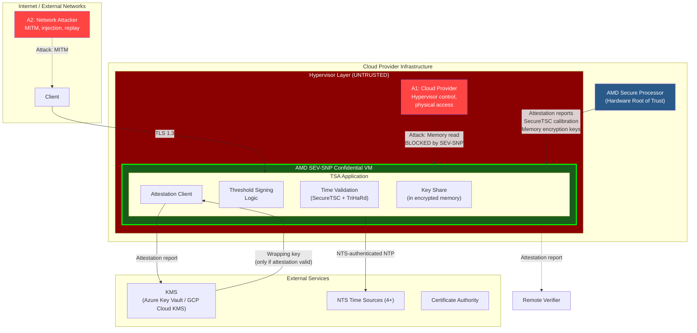
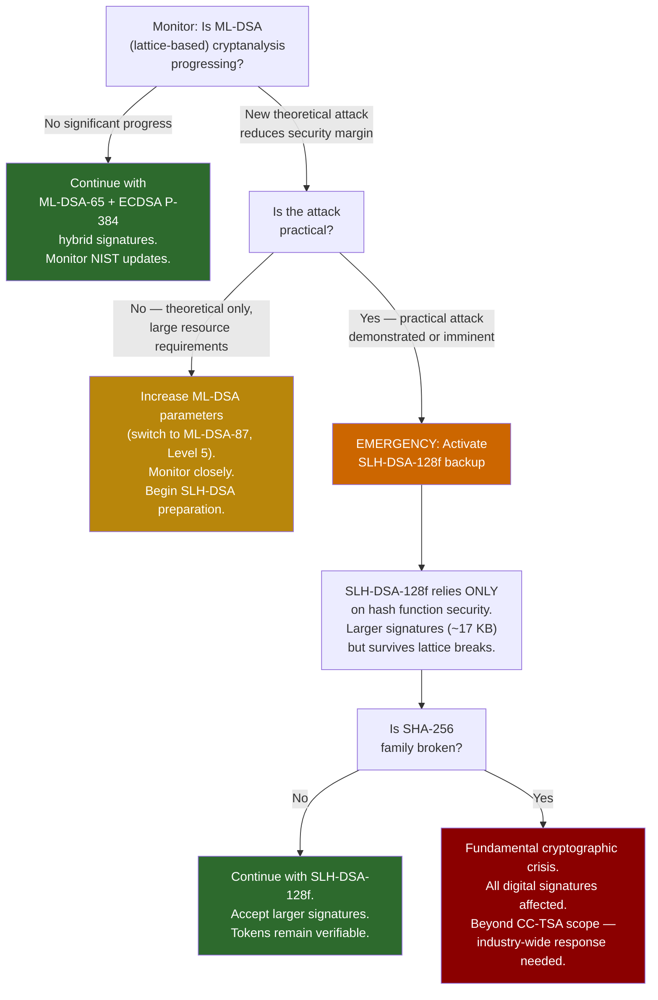

# Threat Model & Security Analysis

This document defines the adversary model, trust assumptions, and security analysis for the Confidential Computing Timestamp Authority (CC-TSA). It applies STRIDE analysis to all components, evaluates the quantum threat timeline, and documents residual risks with acceptance rationale.

For system architecture and component descriptions, see [Architecture Overview](01-architecture-overview.md). For cryptographic details, see [Quantum-Safe Threshold Crypto](03-quantum-safe-threshold-crypto.md). For failure recovery, see [Failure Modes & Recovery](04-failure-modes-and-recovery.md).

---

## 1. Adversary Model

CC-TSA is designed to resist six classes of adversaries, each with distinct capabilities and goals.

### A1: Malicious Cloud Provider

| Property | Details |
|---|---|
| **Capability** | Full control over hypervisor, physical hardware access, network interception within their infrastructure, access to host OS and management plane |
| **Goal** | Read key shares, forge timestamps, manipulate time, or deny service |
| **CC-TSA defense** | AMD SEV-SNP excludes hypervisor from TCB; memory encrypted with per-VM AES-128-XEX key managed by AMD-SP; key shares exist only in encrypted enclave memory; no single provider hosts ≥3 nodes (threshold); KMS releases keys only to attested enclaves |

### A2: Network Attacker

| Property | Details |
|---|---|
| **Capability** | Man-in-the-middle on any network link, traffic analysis, packet injection, replay attacks |
| **Goal** | Forge timestamps, manipulate time sources, intercept key shares during DKG |
| **CC-TSA defense** | mTLS between all nodes (certificates bound to attestation); NTS (RFC 8915) authenticates all NTP traffic; TLS 1.3 for client connections; DKG sub-shares encrypted over attested TLS channels; key shares never traverse the network in plaintext |

### A3: Quantum Adversary

| Property | Details |
|---|---|
| **Capability** | Access to a large-scale fault-tolerant quantum computer (future, estimated 2035–2045) |
| **Goal** | Forge ECDSA signatures on past or future timestamps; break classical cryptographic protections |
| **CC-TSA defense** | Hybrid signatures — every token carries ML-DSA-65 (quantum-safe) alongside ECDSA P-384; tokens issued today are already protected; conservative SLH-DSA-128f backup available if lattice problems become tractable |

### A4: Malicious Insider

| Property | Details |
|---|---|
| **Capability** | Operator with administrative access to CC-TSA infrastructure, cloud consoles, deployment pipelines — but cannot access AMD-SP internals or enclave memory |
| **Goal** | Forge timestamps, extract key material, issue backdated tokens, or sabotage the system |
| **CC-TSA defense** | Key shares exist only in enclave memory (inaccessible to OS-level operators); DKG requires 4-eyes principle; KMS key release requires valid attestation (cannot be faked by operator); all operations logged with attestation-bound audit entries; SecureTSC prevents time manipulation by operators |

### A5: Physical Attacker

| Property | Details |
|---|---|
| **Capability** | Physical access to server hardware (datacenter breach, evil maid, supply chain interception) |
| **Goal** | Extract key shares via cold boot attacks, DRAM probing, bus snooping, or hardware implants |
| **CC-TSA defense** | SEV-SNP encrypts memory on the DRAM bus (AES-128-XEX); cold boot recovery yields only ciphertext; encryption key resides in the AMD-SP (hardened against physical probing); multi-provider distribution means physical access to one datacenter is insufficient (need ≥3 shares) |

### A6: Supply Chain Attacker

| Property | Details |
|---|---|
| **Capability** | Compromise the software supply chain — OS packages, application dependencies, firmware updates, container base images |
| **Goal** | Introduce backdoor that leaks key material, manipulates signing, or weakens cryptographic operations |
| **CC-TSA defense** | Attestation measurement covers the full boot chain (OVMF firmware → kernel → application); any supply chain modification changes the launch measurement; KMS attestation policy rejects unexpected measurements; reproducible builds enable independent verification |

---

## 2. Trust Assumptions

CC-TSA explicitly documents what it trusts and what it does not.

| Component | Trusted? | Justification |
|---|---|---|
| AMD silicon (CPU, AMD-SP) | **Yes** | Hardware root of trust. Provides memory encryption, attestation, SecureTSC. If AMD-SP is fundamentally compromised, the security model breaks. Mitigated by: Intel TDX as alternative, AMD's security response track record, wide deployment and scrutiny. |
| AMD-SP firmware | **Yes** | Provides attestation reports, SecureTSC calibration, memory encryption key management. Firmware is versioned and its version is included in attestation reports. |
| Hypervisor / cloud provider | **No** | Explicitly excluded from TCB by SEV-SNP. The hypervisor manages the VM lifecycle but cannot read or modify guest memory. This is the core trust advantage over traditional infrastructure. |
| Cloud provider KMS | **Partially** | KMS **availability** is trusted — it must be online to release wrapping keys. KMS **confidentiality** relies on attestation gating — KMS only releases keys to enclaves with matching measurements. A provider could deny service (DoS) but cannot extract the wrapped key share without a valid enclave. |
| NTS time sources | **Majority honest** | ≥3 of 4 sources must be honest (Byzantine fault tolerance). A single compromised NTS source cannot shift time beyond the TriHaRd detection threshold. Sources are selected from diverse, independent operators. |
| Other enclave nodes | **< threshold compromised** | At most 2 of 5 nodes may be compromised simultaneously. If ≥3 are compromised, the adversary can forge signatures. Multi-provider distribution makes coordinated compromise of ≥3 nodes extremely difficult. |
| Certificate Authority | **Yes** | The CA must correctly validate CSRs and issue certificates. CA compromise breaks the trust chain for new certificates. Mitigated by certificate transparency logs and short-lived certificates. |
| TSA application code | **Yes** | The application is measured at boot and its measurement is part of the attestation report. It must be correct, audited, and built reproducibly. Bugs in the application are within the TCB. |

---

## 3. Trust Boundary Diagram with Attack Vectors

### Trust Boundary Summary

| Boundary | Enforced By | Protects Against |
|---|---|---|
| SEV-SNP CVM boundary | AMD hardware (memory encryption, RMP, VMPL) | Malicious hypervisor, cloud provider, physical attacker |
| TLS 1.3 (client-facing) | Software + certificates | Network eavesdropping, MITM |
| mTLS (node-to-node) | Software + attested certificates | Node impersonation, network attacker |
| NTS authentication | RFC 8915 (TLS-KE + AEAD) | Time source spoofing |
| Attestation verification | AMD-SP signature chain → AMD root | Fake enclaves, supply chain modification |

---

## 4. STRIDE Analysis

### Spoofing

| Threat | Target | Severity | Mitigation | Residual Risk |
|---|---|---|---|---|
| Spoofed timestamp request | TSA endpoint | Low | TLS 1.3; optional client certificates; nonce in request prevents replay | Minimal — unauthenticated clients can request timestamps (by design, per RFC 3161) |
| Spoofed node identity | Inter-node communication | High | Mutual remote attestation during DKG and signing; mTLS with attestation-bound certificates | Residual: if AMD-SP is compromised, fake attestation possible |
| Spoofed NTS response | Time synchronization | Medium | NTS authentication (RFC 8915); 4 sources with BFT; TriHaRd cross-validation | Residual: if ≥2 of 4 NTS sources AND SecureTSC are compromised |
| Spoofed attestation report | KMS key release | Critical | AMD-SP-signed reports verified against AMD VCEK/VLEK certificate chain rooted in AMD's hardware root | Residual: if AMD-SP signing key is extracted (requires physical attack on the silicon) |
| Spoofed KMS response | Key share unsealing | High | TLS to KMS endpoint; KMS authenticated via cloud provider certificate chain | Residual: if cloud provider's TLS infrastructure is compromised |

### Tampering

| Threat | Target | Severity | Mitigation | Residual Risk |
|---|---|---|---|---|
| Memory tampering (key shares) | Enclave memory | Critical | SEV-SNP AES-128-XEX memory encryption + RMP integrity protection | Residual: novel side-channel or microarchitectural attack on SEV-SNP |
| Timestamp manipulation (genTime) | TSTInfo | Critical | SecureTSC (AMD-SP calibrated, hardware-protected); TriHaRd cross-node validation; NTS for UTC reference | Residual: AMD-SP SecureTSC implementation bug |
| Application code tampering | TSA binary | High | Launch measurement in attestation report; dm-verity for runtime integrity; reproducible builds | Residual: compromised build pipeline producing a valid but backdoored measurement |
| DKG protocol tampering | Key generation | High | Attested TLS channels; Feldman VSS commitment verification; each node independently verifies all commitments | Residual: subtle protocol implementation bug |
| Sealed share tampering | Persistent storage | Medium | Double-envelope encryption; outer envelope integrity via KMS; inner envelope integrity via enclave sealing | Residual: corruption detected on unseal, share is unusable (triggers recovery, not forgery) |

### Repudiation

| Threat | Target | Severity | Mitigation | Residual Risk |
|---|---|---|---|---|
| TSA denies issuing timestamp | Relying party | Medium | Unique serial numbers; attestation-bound audit log; TSA certificate in token identifies issuer; CMS SignedData is non-repudiable | Minimal |
| Node denies signing participation | Internal audit | Low | Threshold protocol produces verifiable partial signatures; coordinator logs all participants per signing round | Minimal |
| Operator denies performing action | Compliance | Medium | All operator commands logged with authentication; 4-eyes principle for ceremonies; immutable audit log | Residual: if audit log storage is compromised |

### Information Disclosure

| Threat | Target | Severity | Mitigation | Residual Risk |
|---|---|---|---|---|
| Key share extraction | Enclave memory | Critical | SEV-SNP memory encryption; shares never leave enclave except double-encrypted; multi-provider means ≥3 enclaves must be breached | Residual: novel hardware attack on AMD-SP |
| Key share leakage via side-channel | CPU microarchitecture | High | SEV-SNP mitigates many side channels; VMPL isolation; monitor AMD security advisories | Residual: undiscovered side-channel (e.g., CacheWarp-like) |
| Timestamp content leakage | Network | Low | TLS 1.3 in transit; timestamps are typically public artifacts by nature | Minimal — timestamps are designed to be shared |
| Attestation report information | Node metadata | Low | Attestation reports are designed to be public; they contain platform info but no secrets | Minimal — by design |

### Denial of Service

| Threat | Target | Severity | Mitigation | Residual Risk |
|---|---|---|---|---|
| DDoS on TSA endpoint | Load balancer / nodes | Medium | Rate limiting at load balancer; CDN/anycast; signing capacity far exceeds expected load | Residual: sustained volumetric attack beyond CDN capacity |
| Cloud provider outage | Enclave nodes | Medium | Multi-provider deployment; no provider hosts ≥3 nodes; cold standbys | Residual: simultaneous outage of 2+ providers (very unlikely) |
| NTS source unavailability | Time synchronization | Medium | 4+ sources; tolerate 1 failure; SecureTSC continues interpolating between queries | Residual: if all 4 NTS sources fail, SecureTSC drift accumulates |
| KMS unavailability | Key unsealing on restart | Medium | KMS services have SLA (99.99%+); shares remain sealed but safe; retry on KMS recovery | Residual: extended KMS outage prevents node recovery |
| Network partition | Node communication | Medium | Multi-provider/region deployment; threshold ensures at most one partition can sign | Residual: three-way partition halts signing (safe failure) |

### Elevation of Privilege

| Threat | Target | Severity | Mitigation | Residual Risk |
|---|---|---|---|---|
| Hypervisor → enclave memory | Key shares | Critical | SEV-SNP hardware boundary; RMP enforces page ownership; hypervisor cannot map guest pages | Residual: AMD-SP firmware bug allowing hypervisor bypass |
| Operator → enclave secrets | Key shares | Critical | Enclave memory inaccessible to OS-level operators; KMS requires attestation (operator cannot fake); no debug mode in production | Residual: operator could redeploy a backdoored image (detected by measurement change) |
| Single node → full signing key | Threshold integrity | High | 3-of-5 threshold; each node holds only one share; need ≥3 shares to sign; shares distributed across providers | Residual: if attacker compromises 3+ independent enclaves |
| Client → TSA operations | Signing behavior | Low | RFC 3161 protocol limits client influence to request parameters; server validates all inputs | Minimal |

---

## 5. Quantum Threat Timeline

### Current State (2026)

| Factor | Assessment |
|---|---|
| Largest quantum computers | ~1,000–1,500 noisy qubits (not error-corrected) |
| Qubits needed to break ECDSA P-384 | ~5,000–10,000 logical qubits (millions of physical qubits with error correction) |
| Estimated ECDSA break timeline | 2035–2045 (wide uncertainty; depends on engineering progress) |
| ML-DSA-65 security basis | Module-LWE lattice problem |
| ML-DSA-65 quantum security | ~128-bit quantum security (NIST Level 3) |
| Best known lattice quantum algorithms | No significant quantum speedup over classical for Module-LWE |
| SLH-DSA-128f security basis | Hash functions (SHA-256 family) |
| Hash function quantum security | Grover's algorithm provides √ speedup; 128-bit classical → ~86-bit quantum, still secure |

### Why Hybrid Signatures Now?

Timestamps are **long-lived cryptographic artifacts**. A timestamp issued today may need to be verified in 2040, 2050, or beyond. This creates a "harvest now, verify later" risk:

1. An adversary records timestamp tokens issued today (public, easily obtainable)
2. In the future, a quantum computer breaks ECDSA P-384
3. The adversary can now forge the ECDSA signature on those old tokens
4. **Without PQC signature**: the timestamp's integrity is destroyed
5. **With PQC signature (CC-TSA)**: the ML-DSA-65 signature is still valid, proving the timestamp is genuine

CC-TSA's hybrid approach ensures tokens issued today are protected regardless of when quantum computers arrive.

### ML-DSA Security Margin

ML-DSA-65 (NIST Level 3) provides approximately 128-bit security against quantum attacks. The best known quantum algorithms for the Module-LWE problem do not provide a meaningful speedup over classical algorithms. For an adversary to break ML-DSA-65:

- They would need a fundamental algorithmic breakthrough, not just a bigger quantum computer
- The NIST standardization process included extensive cryptanalysis from the global research community
- No candidate attacks have reduced the security margin below acceptable levels

### Quantum Threat Decision Tree

### SLH-DSA-128f Activation Procedure

If lattice-based cryptography is broken:

1. Generate SLH-DSA-128f signing key pair (non-threshold — SLH-DSA is stateless hash-based and difficult to threshold)
2. Obtain new X.509 certificate from CA for SLH-DSA public key
3. Deploy SLH-DSA certificate and private key to enclave nodes (key stored in enclave memory with double-envelope encryption)
4. Switch signing to: SLH-DSA-128f (primary) + ML-DSA (deprecated, kept for continuity) or SLH-DSA-128f (primary) + ECDSA (classical, for backward compatibility)
5. Accept increased token size (~17 KB for SLH-DSA signature vs ~3.3 KB for ML-DSA)
6. Accept reduced signing throughput (~100 signs/sec for SLH-DSA vs ~100K for ML-DSA)

---

## 6. Residual Risks and Acceptance Rationale

| # | Risk | Likelihood | Impact | Mitigation | Acceptance Rationale |
|---|---|---|---|---|---|
| R1 | AMD-SP hardware vulnerability discovered | Low | Critical | Monitor AMD security advisories; apply microcode patches promptly; Intel TDX as alternative platform; attestation report includes microcode version | AMD-SP is deployed at massive scale and subject to extensive academic and industry security research. Known vulnerabilities (e.g., CacheWarp, SEVerity) have been patched. The risk of an unpatched 0-day is low but non-zero. |
| R2 | Novel lattice attack breaks ML-DSA | Very Low | High | SLH-DSA-128f backup ready for activation; hybrid ensures ECDSA still works in the near term; old tokens carry both signatures | ML-DSA is NIST-standardized after 8+ years of public cryptanalysis. No plausible near-term attack trajectory exists. SLH-DSA provides a conservative fallback. |
| R3 | ≥3 nodes simultaneously compromised | Very Low | Critical | Multi-provider (no provider hosts ≥3 nodes); each node in a separate SEV-SNP enclave; different cloud accounts and regions; proactive share refresh limits exposure window | Requires coordinated attack across 3 independent cloud providers, each targeting a different AMD-SP instance. No known attack achieves this. |
| R4 | All 4 NTS sources compromised | Very Low | Medium | SecureTSC provides independent hardware time reference; TriHaRd cross-validation detects inconsistency between NTS and peer clocks; diverse NTS providers | NTS sources are operated by independent national metrology institutes and major providers. Coordinated compromise would require attacking 4 separate organizations. |
| R5 | CA compromise | Low | High | Certificate transparency logs detect mis-issuance; short-lived TSA certificates limit exposure; OCSP stapling for real-time revocation; multiple CA options | CA trust is inherent to all PKI-based systems. Not unique to CC-TSA. Standard mitigations apply. |
| R6 | Side-channel attack on SEV-SNP | Low | High | Apply AMD patches promptly; attestation report includes microcode version (can enforce minimum versions); VMPL isolation reduces attack surface | Known side channels (CacheWarp, SEV-Step) have been patched. Ongoing academic research is actively finding and responsibly disclosing new attacks, which are being addressed. |
| R7 | Supply chain compromise of TSA application | Low | Critical | Reproducible builds; attestation measurement detects any binary change; code review; dependency pinning; SBOM generation | Attestation provides strong detection — any supply chain modification changes the measurement and is immediately visible. This reduces the risk from "undetectable" to "detectable." |
| R8 | KMS provider collusion | Very Low | High | Double-envelope encryption (KMS alone is insufficient — also need enclave sealing key); multi-provider KMS; KMS cannot decrypt without presenting a valid enclave to unseal the inner envelope | KMS providers are major cloud companies with strong security programs. Even if a KMS provider extracts the outer-encrypted blob, they cannot decrypt the inner envelope without the enclave sealing key. |

---

## 7. Attack Scenarios and Analysis

### Scenario 1: Malicious Cloud Admin Attempts Key Extraction

**Attack**: A cloud administrator with hypervisor access attempts to read enclave memory to extract a key share.

**Analysis**:
1. Admin accesses the hypervisor and attempts to read the VM's physical memory pages
2. SEV-SNP encrypts all guest memory with AES-128-XEX using a per-VM key managed by AMD-SP
3. The hypervisor sees only ciphertext — no plaintext key material is accessible
4. RMP (Reverse Map Table) prevents the hypervisor from remapping or replaying guest pages
5. Admin attempts to use debug interfaces — SEV-SNP policy disables debugging when configured correctly
6. Admin attempts cold boot attack — DRAM contents are encrypted; without the AMD-SP-held key, ciphertext is useless

**Result**: Attack fails. Even with full hypervisor control, the key share cannot be extracted.

### Scenario 2: Network Attacker Manipulates Time

**Attack**: An attacker performs MITM on NTP traffic to shift the enclave's clock, enabling backdated timestamps.

**Analysis**:
1. Attacker intercepts NTP packets between the enclave and NTS servers
2. NTS (RFC 8915) authenticates all NTP packets with AEAD — tampered packets are rejected
3. Even if one NTS source is compromised, Byzantine fault tolerance with 4 sources detects the outlier
4. SecureTSC provides an independent hardware time reference that the network attacker cannot influence
5. TriHaRd cross-validation compares the node's time against all peers — a time shift on one node is detected

**Result**: Attack fails unless ≥2 of 4 NTS sources AND SecureTSC AND ≥2 peer nodes are all compromised simultaneously.

### Scenario 3: Insider Attempts Backdated Timestamp

**Attack**: An operator with admin access attempts to issue a timestamp with a past date.

**Analysis**:
1. SecureTSC provides hardware-protected time calibrated by AMD-SP — the operator cannot set or adjust it
2. TriHaRd cross-validation confirms time consistency across all 5 nodes
3. Monotonic clock enforcement in the TSA application prevents any time reversal
4. The operator cannot access enclave memory to modify the time validation logic
5. Any attempt to deploy a modified binary changes the attestation measurement, and KMS rejects the attestation

**Result**: Attack fails. The operator cannot influence the genTime value in any way.

### Scenario 4: Quantum Computer Attacks Old Timestamps

**Attack**: In 2040, an adversary with a quantum computer forges the ECDSA P-384 signature on an old timestamp and attempts to pass it off as genuine.

**Analysis**:
1. The adversary can indeed break ECDSA P-384 with a sufficiently powerful quantum computer
2. The forged ECDSA signature would verify correctly against the TSA's ECDSA certificate
3. However, the old token also carries an ML-DSA-65 signature (included since day one)
4. The adversary cannot forge the ML-DSA-65 signature — no known quantum algorithm provides meaningful speedup for lattice problems
5. A PQC-aware verifier checks both signatures and detects the mismatch (valid ML-DSA, forged ECDSA = tampering detected)

**Result**: Attack fails for PQC-aware verifiers. Classical-only verifiers that only check ECDSA are vulnerable — this is why the transition to PQC verification must complete before quantum computers arrive.

### Scenario 5: Compromised Node Attempts Solo Signing

**Attack**: An adversary compromises 1 enclave node (e.g., via an undiscovered AMD-SP vulnerability) and extracts its key share. They attempt to forge timestamps.

**Analysis**:
1. The adversary has 1 key share out of 5
2. The threshold is 3 — they need 2 more shares from independent enclaves on different cloud providers
3. With 1 share, they cannot produce a valid ML-DSA-65 signature (threshold property)
4. The compromised share can be invalidated via proactive share refresh (all shares change; old shares become useless)
5. If the compromise is detected, emergency share refresh is triggered immediately

**Result**: Attack fails. One share is mathematically insufficient to sign. Proactive refresh limits the window of exposure.

### Scenario 6: Coordinated Multi-Provider Attack

**Attack**: A nation-state adversary simultaneously compromises 3 cloud providers' hypervisors to attack 3 enclave nodes.

**Analysis**:
1. Each enclave is independently protected by AMD SEV-SNP on separate physical hardware
2. Compromising the hypervisor alone is insufficient (see Scenario 1) — must compromise AMD-SP
3. Would require 3 independent AMD-SP compromises on different hardware in different datacenters
4. This is the strongest attack CC-TSA considers — it is beyond the capability of all but the most resourced nation-state adversaries
5. If successful, the adversary could forge timestamps until detected and share refresh invalidates the old shares

**Result**: Theoretical risk accepted. The cost and coordination required make this impractical for all realistic adversaries. See Residual Risk R3.

---

## 8. Security Properties Summary

| Property | Guarantee | Condition |
|---|---|---|
| **Key confidentiality** | No single entity can reconstruct the signing key | Fewer than 3 of 5 enclaves compromised |
| **Timestamp integrity** | Timestamps cannot be forged or backdated | Fewer than 3 of 5 enclaves compromised AND AMD-SP is trustworthy |
| **Time accuracy** | genTime is within 50ms of UTC | ≥3 of 4 NTS sources are honest AND SecureTSC is functioning |
| **Quantum safety** | Signatures remain secure against quantum computers | ML-DSA-65 (lattice) is secure OR SLH-DSA-128f (hash-based) is activated |
| **Availability** | Signing service is operational | ≥3 of 5 nodes are online and attested |
| **Non-repudiation** | TSA cannot deny issuing a timestamp | CMS SignedData with TSA certificate; audit log with attestation binding |
| **Forward security** | Compromised shares become useless after refresh | Proactive share refresh completed successfully |

---

*This document is part of the CC-TSA documentation suite. For the complete list of documents, see the [Document Map](../README.md#document-map) in the project README.*
