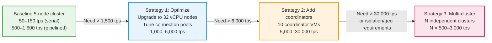

# Throughput Analysis & Scaling Strategy

> **CC-TSA Design Document 08** | Audience: Architects, Engineers, Product Managers, Finance

This document analyzes the timestamp throughput capacity of the CC-TSA system, compares it with DigiStamp's traditional HSM-based approach,
and presents a scaling strategy with cost estimates for reaching higher volumes.

For the system architecture underpinning this analysis, see [Architecture Overview](01-architecture-overview.md).
For the threshold signing protocol that determines per-request latency, see [Quantum-Safe Threshold Cryptography](03-quantum-safe-threshold-crypto.md).

---

## Table of Contents

1. [Throughput Fundamentals](#1-throughput-fundamentals)
2. [Baseline CC-TSA Throughput](#2-baseline-cc-tsa-throughput)
3. [Comparison with DigiStamp](#3-comparison-with-digistamp)
4. [Volume Capacity of the Baseline System](#4-volume-capacity-of-the-baseline-system)
5. [Scaling Strategy](#5-scaling-strategy)
6. [Cost Estimates](#6-cost-estimates)
7. [Scaling Tiers Summary](#7-scaling-tiers-summary)

---

## 1. Throughput Fundamentals

Timestamp throughput in any TSA is bounded by the **slowest step** in the signing pipeline.
CC-TSA is designed for a **< 1 second end-to-end** round-trip budget,
reflecting that timestamping is not latency-sensitive work.
The actual per-request latency is dominated by threshold signing coordination
(network round-trips between enclave nodes) and is typically well below the 1-second budget.

The raw cryptographic operations are not the bottleneck:

| Algorithm | Single-node throughput | Notes |
|---|---|---|
| ML-DSA-65 signing | ~100,000 ops/sec | Lattice-based, highly parallelizable |
| ECDSA P-384 signing | ~50,000 ops/sec | Elliptic curve, well-optimized |

The bottleneck is **threshold signing coordination** — the two network round-trips required
between the coordinator and 2 participant nodes.
This latency varies by deployment topology but is well within the 1-second budget for all configurations:

| Topology | Round-trip latency | Per-request signing latency (2 rounds) |
|---|---|---|
| Single-provider (intra-AZ) | < 1 ms | Tens of ms |
| Single-provider (cross-AZ) | 1–2 ms | Tens of ms |
| Multi-provider (Azure ↔ GCP) | 10–30 ms | Tens to low hundreds of ms |

---

## 2. Baseline CC-TSA Throughput

### 2.1 Serial Throughput (Single Coordinator, No Pipelining)

If a single coordinator node processes one timestamp request at a time (no concurrency),
throughput is simply `1 / per-request latency`.
Actual per-request latency is dominated by threshold signing network round-trips,
not the 1-second round-trip budget:

| Deployment | Typical per-request latency | Serial throughput |
|---|---|---|
| Single-provider (Azure, cross-AZ) | Tens of ms | ~30–70 timestamps/sec |
| Multi-provider (recommended) | Tens to low hundreds of ms | ~10–30 timestamps/sec |

### 2.2 Parallel Throughput (Multiple Coordinators)

Any enclave node can serve as coordinator. The load balancer distributes requests across nodes.
Each signing session requires 3 of 5 nodes (1 coordinator + 2 participants),
so **multiple independent signing sessions can execute concurrently** as long as no node is overloaded.

With 5 nodes and a 3-of-5 threshold, the maximum number of fully independent concurrent signing sessions depends on node capacity. In practice, each node can participate in many concurrent sessions because:

- The cryptographic operations (partial commitment, partial signature) take < 1 ms of CPU time per session.
- The dominant cost is network I/O wait, during which the node is free to process other sessions.

**Effective parallel throughput with 5 coordinator nodes (no pipelining within a coordinator):**

| Deployment | Per-coordinator throughput | 5-coordinator throughput |
|---|---|---|
| Single-provider | ~30–70 tps | ~150–350 tps |
| Multi-provider (typical) | ~10–30 tps | ~50–150 tps |

### 2.3 Pipelined Throughput

With request pipelining (each coordinator handles multiple in-flight signing sessions concurrently), throughput scales further. The limiting factors become:

- **CPU**: ML-DSA-65 partial signing at ~100K ops/sec per node leaves substantial headroom.
- **Network bandwidth**: Each signing round exchanges commitments and partial signatures (~4–8 KB per round per participant).
At 1,000 concurrent sessions, this is ~8–16 MB/sec — well within typical cloud VM network capacity.
- **Connection handling**: mTLS connection pooling between nodes handles thousands of concurrent requests.

**Estimated pipelined throughput (5-node cluster):**

| Deployment | Estimated throughput | Limiting factor |
|---|---|---|
| Single-provider | 1,000–3,000 tps | CPU (partial signing across concurrent sessions) |
| Multi-provider (typical) | 500–1,500 tps | Cross-provider network bandwidth and connection handling |
| Multi-provider (worst case) | 200–800 tps | Network latency × concurrency limits |

These estimates assume 4–8 vCPU nodes as specified in [Operations & Deployment](05-operations-and-deployment.md). Higher vCPU counts would increase the CPU-bound ceiling.

---

## 3. Comparison with DigiStamp

DigiStamp operates HSM-based Timestamp Authorities using IBM 4769 cryptographic coprocessors (FIPS 140-2 Level 4).
These HSMs provide genuine hardware protections: keys are generated in no-export mode,
tamper-response mechanisms destroy key material upon physical intrusion,
and the internal clock enforces hardware limits on adjustments (no more than 120 seconds per 24-hour period)
with every adjustment cryptographically logged.
The stated figure of **at least 40 timestamps per HSM per second** provides a useful benchmark.

### 3.1 Architecture Differences

| Dimension | DigiStamp (HSM-based) | CC-TSA (Confidential Computing) |
|---|---|---|
| **Trust model** | Certified HSM hardware (FIPS 140-2 Level 4) + organizational procedures (audits, ceremonies) | Remotely verifiable hardware attestation + threshold cryptography |
| **Signing hardware** | IBM 4769 dedicated HSM | AMD EPYC CPU inside SEV-SNP enclave |
| **Key protection** | No-export keys inside tamper-responsive HSM; physical intrusion destroys key material | Key split into 5 shares across 3 providers; key never exists in any single location |
| **Clock integrity** | HSM-internal clock with hardware-enforced adjustment limits and cryptographic audit log | AMD SecureTSC + NTS-authenticated NTP + TriHaRd cross-node validation |
| **Signing algorithm** | RSA-2048/4096 or ECC-256/512 | ML-DSA-65 (quantum-safe) + ECDSA P-384 (dual signature) |
| **Quantum resistance** | No (RSA/ECC vulnerable to quantum) | Yes (ML-DSA-65 is post-quantum) |
| **Verifiability** | Trust the HSM certification and audit reports | Any party can verify the AMD SEV-SNP attestation report independently |
| **Single-device risk** | Single HSM is a single point of failure | 3-of-5 threshold; survives 2 simultaneous node failures |
| **Throughput bottleneck** | HSM signing speed (hardware-limited) | Network round-trips for threshold coordination |
| **Scaling mechanism** | Add more HSMs (physical hardware) | Add more enclave nodes (virtual machines) |
| **Geographic distribution** | DigiStamp operates 3 locations with AWS Global Accelerator | Multi-provider by design (Azure + GCP + third) |

### 3.2 Throughput Comparison

| Configuration | Throughput | Annual volume (continuous) |
|---|---|---|
| **DigiStamp: 1 HSM** | ~40 tps | ~1.26 billion/year |
| **DigiStamp: 3 HSMs (3 locations)** | ~120 tps | ~3.78 billion/year |
| **CC-TSA: 5-node serial (multi-provider)** | ~50–150 tps | ~1.6–4.7 billion/year |
| **CC-TSA: 5-node pipelined (multi-provider)** | ~500–1,500 tps | ~15.8–47.3 billion/year |
| **CC-TSA: 5-node pipelined (single-provider)** | ~1,000–3,000 tps | ~31.5–94.6 billion/year |

The CC-TSA baseline (multi-provider, serial mode) approaches or exceeds DigiStamp's per-HSM throughput.
With pipelining enabled, CC-TSA significantly exceeds DigiStamp's capacity
because the cryptographic operations run on general-purpose CPUs
that are faster for ML-DSA/ECDSA signing than a dedicated HSM is for RSA signing.
Note that DigiStamp's HSM-based approach prioritizes certified hardware security (FIPS 140-2 Level 4)
and operational simplicity over raw throughput — these are different architectural trade-offs.

### 3.3 Throughput-per-Dollar Comparison

| Configuration | Throughput | Annual cost (est.) | Cost per million timestamps |
|---|---|---|---|
| DigiStamp cloud (100K/month tier) | ~0.04 tps avg | $7,500 | $6.25 |
| DigiStamp SecureTime Server (1 tps) | 1 tps | $2,000 + $1,000 setup | $0.063 |
| DigiStamp SecureTime Server (40 tps) | 40 tps | ~$80,000 (40 × $2,000) | $0.063 |
| CC-TSA 5-node (multi-provider, pipelined) | ~500–1,500 tps | ~$75,000–$110,000 | $0.002–$0.007 |

CC-TSA achieves a lower cost per timestamp at scale because general-purpose CPUs in cloud VMs perform ML-DSA and ECDSA signing
faster than dedicated HSMs perform RSA signing, and the system scales via software concurrency rather than physical HSM procurement.
DigiStamp's cost includes the certified HSM hardware and audited operational procedures that provide its trust model.

---

## 4. Volume Capacity of the Baseline System

The following table translates throughput into practical volume capacity for the baseline 5-node CC-TSA cluster.

### 4.1 Sustained Volume (24/7 operation)

| Mode | Throughput | Per hour | Per day | Per month (30d) | Per year |
|---|---|---|---|---|---|
| Serial, multi-provider (conservative) | 50 tps | 180,000 | 4.3M | 130M | 1.6B |
| Serial, multi-provider (typical) | 150 tps | 540,000 | 13.0M | 389M | 4.7B |
| Pipelined, multi-provider (conservative) | 500 tps | 1.8M | 43.2M | 1.3B | 15.8B |
| Pipelined, multi-provider (typical) | 1,000 tps | 3.6M | 86.4M | 2.6B | 31.5B |
| Pipelined, single-provider | 3,000 tps | 10.8M | 259.2M | 7.8B | 94.6B |

### 4.2 Business-Hours Volume (12 hours/day, 250 business days/year)

Many timestamp use cases (document signing, code signing, compliance logging) are concentrated during business hours:

| Mode | Throughput | Per business day (12h) | Per year (250 days) |
|---|---|---|---|
| Serial, multi-provider (typical) | 150 tps | 6.5M | 1.6B |
| Pipelined, multi-provider (conservative) | 500 tps | 21.6M | 5.4B |
| Pipelined, multi-provider (typical) | 1,000 tps | 43.2M | 10.8B |

### 4.3 Context: Who Needs This Much Throughput?

| Use case | Typical volume | CC-TSA coverage |
|---|---|---|
| Enterprise document signing | 10K–1M timestamps/day | Baseline serial mode is sufficient |
| Code signing (CI/CD pipelines) | 100K–10M timestamps/day | Serial or light pipelining |
| Supply chain / e-invoicing (national scale) | 10M–100M timestamps/day | Pipelining required |
| Qualified electronic signatures (eIDAS, EU-wide) | 100M–1B timestamps/day | Pipelining + scaling (see Section 5) |
| IoT device attestation | 1B+ timestamps/day | Full scaling strategy required |

For the vast majority of enterprise and government use cases, the **baseline 5-node CC-TSA cluster in serial or light-pipelining mode provides sufficient capacity** without any scaling modifications.

---

## 5. Scaling Strategy

For use cases requiring throughput beyond the baseline 5-node cluster, the following scaling strategies are available, ordered from simplest to most complex.

### 5.1 Strategy 1: Optimize Pipelining and Concurrency (No Infrastructure Change)

**What**: Tune the application to maximize concurrent signing sessions per coordinator node.

**How**:
- Increase per-node vCPU count from 4–8 to 16–32 vCPUs to handle more concurrent partial signing operations.
- Tune mTLS connection pool sizes for inter-node communication.
- Implement request batching: group multiple timestamp requests into a single signing session where the TSTInfo contains
a Merkle root of multiple message imprints, with individual proofs returned to each client.

**Throughput gain**: 2–4x over baseline pipelined mode.

**Result**: 1,000–6,000 tps (multi-provider) or 3,000–12,000 tps (single-provider).

**Cost impact**: Minimal — upgrading from 8 vCPU to 32 vCPU VMs adds ~$0.50–$1.00/hour per node (~$22,000–$44,000/year for 5 nodes).

### 5.2 Strategy 2: Add Coordinator Nodes (Horizontal Scaling)

**What**: Add stateless "coordinator-only" nodes that handle request processing and drive threshold signing, but do not hold key shares.
Key-share-holding nodes (the original 5) serve only as signing participants.

**How**:
- Deploy N additional coordinator nodes behind the load balancer.
- Coordinators receive timestamp requests, construct TSTInfo, then select 3 of the 5 key-share nodes for threshold signing.
- Coordinators do not need SEV-SNP enclaves (they never see key material). They can run on standard VMs.
- Key-share nodes are dedicated to threshold signing participation.

**Throughput gain**: Linear with the number of coordinators, up to the point where the 5 key-share nodes are saturated with signing requests.

**Bottleneck shift**: Each key-share node must handle partial signing requests from all coordinators.
With ML-DSA-65 at ~100K ops/sec per node and each signing session requiring one partial commitment + one partial signature,
a single key-share node can serve ~50,000 signing sessions/sec.
With 3 participants per session, the cluster supports ~50,000 / 3 x 5 = ~83,000 tps before key-share nodes become CPU-bound.

In practice, network handling limits this to ~10,000–30,000 tps before connection management becomes the bottleneck.

**Result**: 5,000–30,000 tps depending on coordinator count and network optimization.

**Cost impact**: Each coordinator is a standard (non-confidential) VM: ~$200–$400/month. Adding 10 coordinators: ~$2,000–$4,000/month ($24,000–$48,000/year).

### 5.3 Strategy 3: Independent Clusters (Horizontal Partitioning)

**What**: Deploy multiple independent CC-TSA clusters, each with its own 5 enclave nodes, key, and certificate. Route requests to clusters via a global load balancer.

**How**:
- Each cluster runs its own DKG, producing an independent signing key.
- A CA issues separate TSA certificates to each cluster, or a single certificate with SAN entries for all clusters.
- A global load balancer (GeoDNS, Anycast, or application-level routing) distributes requests across clusters.
- Clusters operate fully independently — no inter-cluster threshold signing.

**Throughput gain**: Linear with the number of clusters. Each cluster provides the full baseline throughput.

**Result**: N clusters × 500–3,000 tps = arbitrary scale.

| Clusters | Multi-provider pipelined (tps) | Annual volume |
|---|---|---|
| 1 | 500–1,500 | 15.8–47.3B |
| 2 | 1,000–3,000 | 31.5–94.6B |
| 5 | 2,500–7,500 | 78.8–236.5B |
| 10 | 5,000–15,000 | 157.7–473.0B |

**Cost impact**: Linear — each additional cluster costs approximately the same as the first (~$75,000–$110,000/year for a multi-provider cluster). See Section 6 for detailed cost breakdowns.

**Trade-offs**:
- Multiple certificates/keys to manage (more DKG ceremonies, more share refreshes).
- Relying parties must trust multiple TSA certificates.
- Operationally more complex but architecturally simple — no changes to the threshold signing protocol.

### 5.4 Strategy 4: Increase Threshold Group Size

**What**: Expand from 3-of-5 to a larger threshold group (e.g., 5-of-9 or 7-of-13) to add more parallel signing capacity within a single cluster.

**How**:
- A new DKG ceremony generates shares for more nodes (e.g., 9 nodes with a 5-of-9 threshold).
- More nodes means more potential coordinators and participants.
- With 9 nodes, up to 3 independent signing sessions can run with fully non-overlapping participant sets (each session uses 5 of 9 nodes).

**Throughput gain**: Moderate (1.5–3x over 5-node cluster for the same pipelining level). The gain comes from more coordinator options and better load distribution.

**Result**: 750–4,500 tps (multi-provider pipelined) for a 9-node cluster.

**Cost impact**: ~$60,000–$80,000/year additional (4 more enclave nodes + KMS).

**Trade-offs**:
- New DKG ceremony required (existing key cannot be expanded; a new key and certificate are generated).
- Higher threshold (5-of-9) means more network round-trips per signing session (5 participants instead of 3).
- More complex operations (9 nodes to maintain, update, monitor).
- Stronger security (attacker needs 5 nodes instead of 3).

### 5.5 Strategy Comparison

| Strategy | Throughput (multi-provider) | Infrastructure change | Operational complexity | Best for |
|---|---|---|---|---|
| **1. Optimize pipelining** | 1,000–6,000 tps | VM size upgrade only | None | Quick wins, moderate scale |
| **2. Add coordinators** | 5,000–30,000 tps | Add standard VMs | Low–moderate | High throughput, single key |
| **3. Independent clusters** | Linear with cluster count | Full cluster replication | Moderate–high | Very high scale, isolation |
| **4. Larger threshold group** | 750–4,500 tps | More enclave VMs + new DKG | Moderate | Balanced security + throughput |

### 5.6 Recommended Scaling Path

Most deployments will not need to go beyond Strategy 1. Strategy 2 (coordinator nodes) covers the next order of magnitude. Strategy 3 (independent clusters) provides effectively unlimited scale.

---

## 6. Cost Estimates

All costs are estimated based on publicly available cloud pricing as of 2025. Actual costs vary by region, reserved instance commitments, and negotiated rates.

### 6.1 Baseline 5-Node Multi-Provider Cluster

| Component | Unit cost | Quantity | Monthly cost | Annual cost |
|---|---|---|---|---|
| **Azure DCasv5 (8 vCPU, 32 GB)** | ~$0.72/hr | 2 nodes × 730 hrs | $1,051 | $12,614 |
| **GCP C3D Confidential VM (8 vCPU, 32 GB)** | ~$0.68/hr | 2 nodes × 730 hrs | $993 | $11,914 |
| **Third provider SEV-SNP VM (8 vCPU, 32 GB)** | ~$0.70/hr (est.) | 1 node × 730 hrs | $511 | $6,132 |
| **Azure Key Vault Managed HSM** | ~$5,769/mo | 1 pool | $5,769 | $69,228 |
| **GCP Cloud KMS** | ~$1.00/key-version/mo + $0.03/10K ops | 1 key + ops | ~$50 | ~$600 |
| **Cross-provider networking (egress)** | ~$0.08–$0.12/GB | ~100 GB/mo | ~$10 | ~$120 |
| **Cold standby VMs (stopped)** | ~$0.02/hr (disk only) | 2 nodes | ~$29 | ~$350 |
| **Monitoring (Prometheus/Grafana)** | ~$200/mo (hosted) | 1 | $200 | $2,400 |
| **Load balancer** | ~$25/mo + traffic | 1 | ~$50 | ~$600 |
| | | | **~$8,663/mo** | **~$103,958/yr** |

**Note**: Azure Key Vault Managed HSM is the single largest cost item.
If the deployment uses standard Azure Key Vault (non-MHSM) with software-protected keys and relies on SEV-SNP attestation for security
(acceptable in some threat models), this cost drops to ~$5/mo, reducing the annual total to ~$35,000–$40,000/year.

### 6.2 Strategy 1: Optimize Pipelining (32 vCPU Nodes)

| Change from baseline | Cost delta |
|---|---|
| Upgrade 5 nodes from 8 vCPU to 32 vCPU | +$2,400–$3,600/mo |
| **Additional annual cost** | **+$29,000–$43,000/yr** |
| **Total annual cost** | **~$133,000–$147,000/yr** |
| **Throughput** | 1,000–6,000 tps |

### 6.3 Strategy 2: Add Coordinator Nodes

| Change from Strategy 1 | Cost delta |
|---|---|
| 10 standard VMs (8 vCPU, non-confidential) at ~$0.35/hr | +$2,555/mo |
| Additional load balancer capacity | +$50/mo |
| **Additional annual cost** | **+$31,000/yr** |
| **Total annual cost** | **~$164,000–$178,000/yr** |
| **Throughput** | 5,000–30,000 tps |

### 6.4 Strategy 3: Independent Clusters

| Configuration | Annual cost per cluster | Total annual cost | Throughput |
|---|---|---|---|
| 1 cluster (baseline) | ~$104,000 | ~$104,000 | 500–1,500 tps |
| 2 clusters | ~$104,000 | ~$208,000 | 1,000–3,000 tps |
| 5 clusters | ~$104,000 | ~$520,000 | 2,500–7,500 tps |
| 10 clusters | ~$104,000 | ~$1,040,000 | 5,000–15,000 tps |

### 6.5 Cost per Million Timestamps

| Configuration | Throughput | Annual cost | Cost / 1M timestamps (at 50% utilization) |
|---|---|---|---|
| **DigiStamp cloud (100K/mo)** | 0.04 tps avg | $7,500 | $6.25 |
| **DigiStamp SecureTime (40 tps)** | 40 tps | ~$81,000 | $0.13 |
| **CC-TSA baseline (serial)** | 150 tps | ~$104,000 | $0.04 |
| **CC-TSA baseline (pipelined)** | 1,000 tps | ~$104,000 | $0.007 |
| **CC-TSA optimized (Strategy 1)** | 3,000 tps | ~$140,000 | $0.003 |
| **CC-TSA + coordinators (Strategy 2)** | 15,000 tps | ~$171,000 | $0.0007 |

At scale, CC-TSA's cost per timestamp is 1–2 orders of magnitude lower than DigiStamp's on-premises offering.
CC-TSA additionally provides quantum-safe signatures, remotely verifiable attestation, and distributed trust across multiple providers.
DigiStamp provides FIPS 140-2 Level 4 certified hardware protections and a 20+ year operational track record —
these are different trust models serving different requirements.

---

## 7. Scaling Tiers Summary

The following table provides a quick-reference guide for selecting the appropriate CC-TSA configuration based on volume requirements.

| Tier | Configuration | Throughput | Annual volume (50% util.) | Annual cost (est.) | Cost / 1M timestamps |
|---|---|---|---|---|---|
| **Small** | Baseline 5-node, serial | 50–150 tps | 0.8–2.4B | ~$104,000 | $0.04–$0.13 |
| **Medium** | Baseline 5-node, pipelined | 500–1,500 tps | 7.9–23.7B | ~$104,000 | $0.004–$0.013 |
| **Large** | Strategy 1 (32 vCPU + tuning) | 1,000–6,000 tps | 15.8–94.6B | ~$140,000 | $0.001–$0.009 |
| **Enterprise** | Strategy 2 (+ coordinator nodes) | 5,000–30,000 tps | 78.8–473B | ~$171,000 | $0.0004–$0.002 |
| **National-scale** | Strategy 3 (5 clusters) | 2,500–7,500 tps per cluster | 394–1,183B | ~$520,000 | $0.0004–$0.001 |

### Key Takeaways

1. **The baseline CC-TSA cluster already exceeds DigiStamp's per-HSM throughput.**
Even in serial mode with multi-provider deployment, 5 coordinator nodes produce 50–150 tps versus DigiStamp's ~40 tps per HSM.

2. **Pipelining unlocks an order of magnitude more throughput at zero additional infrastructure cost.** Enabling concurrent signing sessions on the existing 5-node cluster reaches 500–1,500 tps.

3. **CC-TSA's cost per timestamp at scale is 10–100x lower than DigiStamp's.** This is because general-purpose CPUs perform ML-DSA
and ECDSA signing faster than dedicated HSMs perform RSA signing, and cloud VMs scale more cheaply than physical HSM hardware.
DigiStamp's cost reflects its FIPS 140-2 Level 4 certified hardware and audited operational procedures —
different trust models carry different cost structures.

4. **The scaling path is incremental.** Each strategy builds on the previous one without requiring changes to the threshold signing protocol
or re-issuance of the TSA certificate (except Strategy 4, which is optional and not recommended for most deployments).

5. **For most enterprise and government use cases, the baseline cluster with pipelining is sufficient.**
Scaling beyond that is needed only for national-scale e-invoicing, IoT attestation, or similarly high-volume applications.

---

## Cross-Reference Index

| Topic | Document |
|---|---|
| System architecture, latency budget, deployment topology | [Architecture Overview](01-architecture-overview.md) |
| AMD SEV-SNP, SecureTSC, trusted time | [Confidential Computing & Time](02-confidential-computing-and-time.md) |
| ML-DSA-65 threshold signing, DKG protocol | [Quantum-Safe Threshold Cryptography](03-quantum-safe-threshold-crypto.md) |
| Failure scenarios, recovery procedures | [Failure Modes and Recovery](04-failure-modes-and-recovery.md) |
| Infrastructure requirements, deployment guide | [Operations and Deployment](05-operations-and-deployment.md) |
| RFC 3161 token format, dual signatures | [RFC 3161 Compliance](06-rfc3161-compliance.md) |
| Threat model, STRIDE analysis | [Threat Model](07-threat-model.md) |
