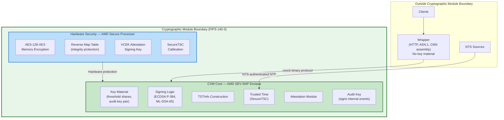
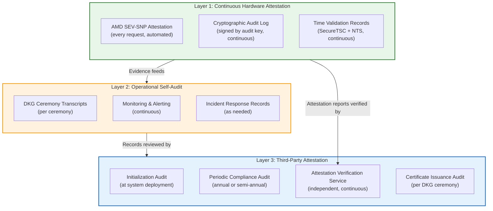
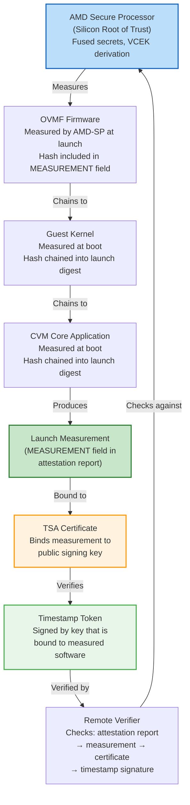
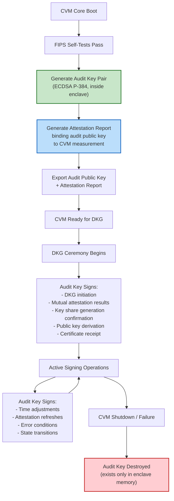
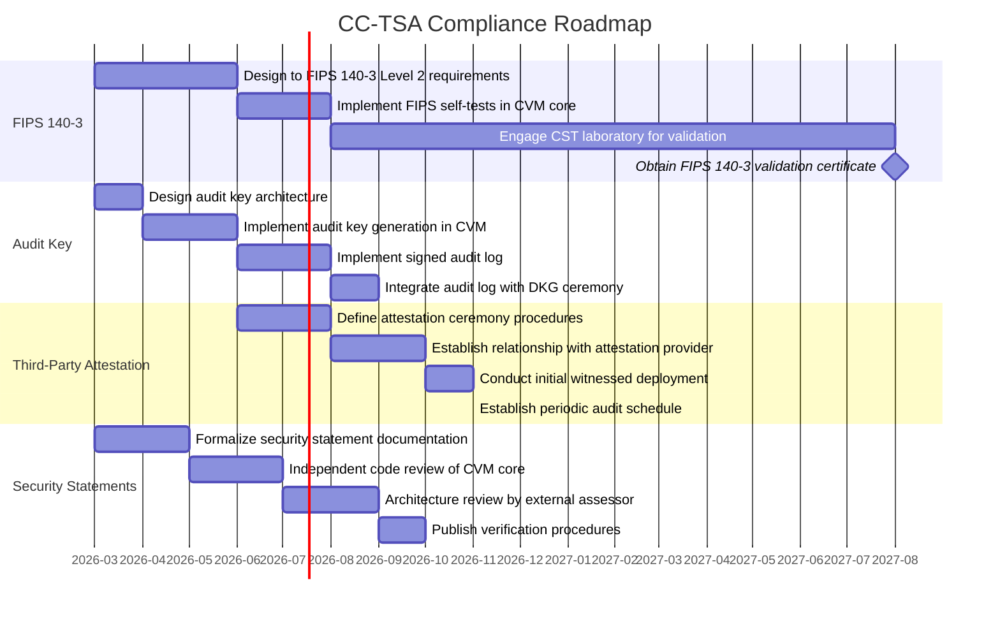

# Platform Integrity, Third-Party Attestation, and Compliance

> **CC-TSA Design Document 10** | Audience: Security Auditors, Compliance Officers, Architects

This document addresses platform integrity verification, FIPS 140-3 compliance considerations,
third-party attestation requirements, and the formal mapping of security statements to the CC-TSA architecture.
It responds to the need for external audit readiness and evaluates whether a disinterested third party
is required to attest to CC-TSA's security properties.

The analysis references NIST IR 8320 (Hardware-Enabled Security: Enabling a Layered Approach to Platform Integrity)
and maps its platform integrity verification framework to the CC-TSA design.

For the overall system architecture, see [Architecture Overview](01-architecture-overview.md).
For the threat model and security analysis, see [Threat Model](07-threat-model.md).
For operational procedures and existing compliance mapping, see [Operations and Deployment](05-operations-and-deployment.md).

> **Implementation status**: This document defines design targets for compliance and third-party
> attestation. The PoC validates AMD SEV-SNP attestation and the CVM/wrapper trust boundary.
> FIPS validation, formal third-party attestation ceremonies, and audit key implementation
> are design targets not yet built.

---

## Table of Contents

1. [FIPS 140-3 Compliance Considerations](#1-fips-140-3-compliance-considerations)
2. [Third-Party Attestation and Evidence Quality](#2-third-party-attestation-and-evidence-quality)
3. [NIST IR 8320 Platform Integrity Mapping](#3-nist-ir-8320-platform-integrity-mapping)
4. [Security Statements for External Audit](#4-security-statements-for-external-audit)
5. [Audit Key Architecture](#5-audit-key-architecture)
6. [Initialization and Operational Constraints](#6-initialization-and-operational-constraints)
7. [Comparison with Traditional HSM-Based TSAs](#7-comparison-with-traditional-hsm-based-tsas)
8. [Compliance Roadmap](#8-compliance-roadmap)

---

## 1. FIPS 140-3 Compliance Considerations

FIPS 140-3 (Cryptographic Module Validation Program) defines four security levels for cryptographic modules.
Traditional TSAs typically achieve compliance through certified HSMs (e.g., the IBM 4767 at FIPS 140-2 Level 4).
CC-TSA's distributed enclave architecture raises the question of whether FIPS 140-3 validation should be a design goal
and what form it should take.

### 1.1 FIPS 140-3 Relevance to CC-TSA

| Factor | Assessment |
|---|---|
| **Marketplace adoption** | Many enterprise and government procurement policies require FIPS 140-2/140-3 validated cryptographic modules. Without validation, CC-TSA may be excluded from certain deployments. |
| **Legal and evidentiary requirements** | In legal proceedings, FIPS-validated timestamps carry stronger evidentiary weight. Courts and regulatory bodies may question the reliability of timestamps from non-validated systems. |
| **Standards alignment** | ETSI EN 319 421 (TSA policy) references "trustworthy systems" for key management. FIPS 140-3 validation is one recognized path to demonstrating trustworthiness. |
| **Competitive positioning** | Incumbent TSAs (e.g., DigiStamp, Entrust) hold FIPS validations. CC-TSA should match or exceed this baseline for market credibility. |

### 1.2 FIPS 140-3 Compliance vs. Validation

There is a meaningful distinction between FIPS 140-3 **compliance** (designing to the standard's requirements)
and FIPS 140-3 **validation** (completing the formal CMVP testing process with an accredited lab).

| Approach | Description | Cost | Timeline | Market Acceptance |
|---|---|---|---|---|
| **Compliance statement** | Self-assertion that the system meets FIPS 140-3 requirements at a specified security level. Documented design rationale demonstrating adherence to each requirement. | Low | Weeks | Moderate — acceptable for some enterprises; insufficient for US federal procurement |
| **Validation (CMVP)** | Formal testing by an accredited Cryptographic and Security Testing (CST) laboratory, resulting in a NIST-issued validation certificate. | $100K-$500K+ | 12-24 months | High — required for US federal agencies (FISMA), and broadly recognized |
| **Modules In Process (MIP)** | Interim status while validation is in progress. Listed on the NIST MIP list. | Part of validation | After lab engagement | Moderate — accepted by some agencies as interim |

### 1.3 Recommended Approach

CC-TSA should pursue a **phased FIPS 140-3 strategy**:

**Phase 1 (Current)**: Design to FIPS 140-3 Level 2 requirements. Document the cryptographic boundary,
key management procedures, self-tests, and physical security mechanisms (provided by AMD SEV-SNP hardware)
in a format that aligns with FIPS 140-3 documentation requirements. This produces a compliance statement
that can support initial deployments.

**Phase 2 (Production)**: Engage a CST laboratory for formal FIPS 140-3 Level 2 validation.
The CC-TSA cryptographic module boundary would encompass the CVM core (the signing oracle running inside AMD SEV-SNP).
The wrapper, being outside the trust boundary and holding no key material, is excluded from the cryptographic module boundary.

**Phase 3 (Aspirational)**: Evaluate FIPS 140-3 Level 3 applicability.
Level 3 requires identity-based authentication, physical tamper-evidence, and environmental protections.
AMD SEV-SNP provides some of these properties (memory encryption, attestation), but not all
(physical tamper-evidence is a property of the AMD silicon packaging, not the CC-TSA software).

### 1.4 Cryptographic Module Boundary

For FIPS 140-3 purposes, the CC-TSA cryptographic module boundary is defined as the CVM core
running inside the AMD SEV-SNP confidential VM:

**Module components within the boundary:**

| Component | FIPS 140-3 Role |
|---|---|
| CVM core application | Cryptographic module firmware |
| Threshold key shares | Critical Security Parameters (CSPs) |
| Audit key pair | CSPs |
| ECDSA P-384 signing | Approved security function |
| ML-DSA-65 signing | Approved security function (FIPS 204) |
| SHA-384 hashing | Approved security function (FIPS 180-4) |
| AMD SEV-SNP memory encryption | Physical security mechanism (Level 2) |
| AMD-SP (SecureTSC, VCEK) | Hardware security backing |

### 1.5 FIPS 140-3 Self-Tests

The CVM core should implement the following self-tests at startup (power-on self-tests)
and periodically during operation (conditional self-tests), per FIPS 140-3 Section 9:

| Test Type | Test | When |
|---|---|---|
| Power-on | ECDSA P-384 known-answer test (KAT) | Every CVM boot |
| Power-on | SHA-384 known-answer test | Every CVM boot |
| Power-on | ML-DSA-65 known-answer test | Every CVM boot |
| Power-on | Software integrity check (compare measurement against expected value) | Every CVM boot |
| Conditional | Pairwise consistency test for ECDSA key generation | After each DKG ceremony |
| Conditional | Continuous random number generator test | On each RNG invocation |
| Conditional | ML-DSA-65 pairwise consistency test | After each DKG ceremony |

If any self-test fails, the CVM core must enter an error state and refuse all signing requests.
This aligns with FIPS 140-3 Section 9.4 requirements for error handling.

---

## 2. Third-Party Attestation and Evidence Quality

This section evaluates whether a disinterested third party is required to attest to CC-TSA's security statements,
and how such attestation elevates the evidentiary quality of timestamps.

### 2.1 The Evidence Quality Problem

Timestamps serve as evidence that data existed at a particular point in time.
The evidentiary quality of a timestamp depends on the trustworthiness of the chain of evidence:

| Evidence Layer | Question | Without Third-Party Attestation | With Third-Party Attestation |
|---|---|---|---|
| **Key generation** | Were keys generated securely? | Self-asserted via DKG ceremony transcript | Third party witnesses DKG, signs ceremony transcript |
| **Software integrity** | Is the correct software running? | AMD SEV-SNP attestation (hardware-verified) | Third party independently verifies attestation reports and publishes verification results |
| **Clock integrity** | Is the time accurate? | SecureTSC + NTS cross-validation (internal) | Third party audits time accuracy records; signs periodic time-accuracy attestation |
| **Key containment** | Can keys be extracted? | Structural argument (ephemeral, SEV-SNP protected) | Third party reviews architecture, issues formal opinion |
| **Operational integrity** | Are procedures followed? | Internal audit logs | Third party performs periodic operational audit |

### 2.2 NIST IR 8320 Framework

NIST IR 8320 (Hardware-Enabled Security: Enabling a Layered Approach to Platform Integrity)
defines a framework for platform integrity verification.
Section 3 specifically addresses how platform integrity can be established and verified
using hardware roots of trust.

The framework identifies three key principles relevant to CC-TSA:

1. **Hardware root of trust**: Platform integrity starts with a hardware component
   that is inherently trusted (e.g., TPM, AMD-SP). CC-TSA uses the AMD Secure Processor
   as its hardware root of trust.

2. **Layered measurements**: Each layer of the platform (firmware, OS, application) is measured
   and the measurements are chained. CC-TSA's attestation measurement covers the full boot chain
   (OVMF firmware, kernel, CVM core application).

3. **Remote attestation**: A remote verifier can validate the platform's integrity
   by checking the measurement chain against expected values. CC-TSA supports this
   via the `/attestation` endpoint on each enclave node.

### 2.3 Third-Party Attestation: Necessary or Sufficient?

The question is whether CC-TSA's built-in attestation mechanisms
(AMD SEV-SNP hardware attestation, DKG ceremony transcripts, audit logs)
provide sufficient evidence quality, or whether an independent third party is needed.

**Arguments for third-party attestation:**

| Argument | Detail |
|---|---|
| **Regulatory expectation** | Many compliance frameworks (eIDAS, WebTrust, ETSI EN 319 421) expect or require independent audits of TSA operations. A self-attesting system, however technically sound, may not satisfy regulatory requirements. |
| **Evidentiary weight** | In legal proceedings, evidence attested by a disinterested third party carries greater weight than self-asserted evidence. A third-party attestation converts technical proof into legal proof. |
| **Trust bootstrapping** | Relying parties who are not technically equipped to verify AMD SEV-SNP attestation reports need a trusted intermediary who has verified the platform and can vouch for it. |
| **Gap detection** | An independent auditor may identify gaps between the documented security model and the actual implementation that internal teams overlook. |

**Arguments that internal mechanisms may suffice:**

| Argument | Detail |
|---|---|
| **Cryptographic verifiability** | AMD SEV-SNP attestation is cryptographically verifiable by anyone against AMD's published certificate chain. The attestation is not a subjective assessment — it is a mathematical proof of platform state. |
| **Continuous vs. periodic** | Hardware attestation is available continuously (on every request if desired), while third-party audits are periodic snapshots. Continuous cryptographic attestation may provide stronger ongoing assurance than annual audits. |
| **Cost and complexity** | Third-party attestation adds operational cost and introduces a dependency on the auditor's availability and competence. |

### 2.4 Recommended Approach: Layered Attestation

CC-TSA should implement a **layered attestation model** that combines continuous hardware attestation
with periodic third-party verification:

**Layer 1 — Continuous Hardware Attestation** (always active):

- AMD SEV-SNP attestation reports generated on demand, verifiable by any party
- Cryptographic audit log signed by the internal audit key (see [Section 5](#5-audit-key-architecture))
- Time validation records documenting SecureTSC and NTS cross-validation results

**Layer 2 — Operational Self-Audit** (continuous):

- DKG ceremony transcripts archived with attestation reports and operator signatures
- Monitoring and alerting providing real-time visibility into cluster health
- Incident response records documented per playbook execution

**Layer 3 — Third-Party Attestation** (periodic):

- **Initialization audit**: A disinterested third party witnesses the initial system deployment,
  verifies the software content and compilation, and documents the initialization procedure.
  This satisfies the NIST IR 8320 requirement for witnessed platform initialization.
- **Periodic compliance audit**: An independent auditor reviews operational records,
  verifies attestation reports, and issues a formal compliance opinion (semi-annual or annual).
- **Independent attestation verification**: An independent service continuously verifies
  AMD SEV-SNP attestation reports from CC-TSA nodes and publishes verification results,
  providing ongoing third-party confirmation of platform integrity.
- **Certificate issuance audit**: The CA's issuance of the TSA certificate serves as
  an implicit third-party attestation that the public key and associated identity are valid.

---

## 3. NIST IR 8320 Platform Integrity Mapping

This section maps NIST IR 8320's platform integrity verification requirements
to the CC-TSA architecture.

### 3.1 Platform Integrity Verification Components

NIST IR 8320 Section 3 identifies three phases of platform integrity:
establishment, verification, and remediation.

| Phase | NIST IR 8320 Requirement | CC-TSA Implementation |
|---|---|---|
| **Establishment** | Platform must be initialized to a known-good state using a hardware root of trust | AMD SEV-SNP provides the hardware root of trust. The CVM core is measured at boot by the AMD-SP. The measurement is bound to the TSA certificate during DKG. Initial deployment is witnessed by multiple parties (4-eyes principle). |
| **Verification** | Platform state must be verifiable by remote parties using attestation | AMD SEV-SNP attestation reports are available via the `/attestation` endpoint. Reports are signed by the AMD-SP using VCEK, verifiable against AMD's published certificate chain. Any party can verify platform integrity without trusting the CC-TSA operator. |
| **Remediation** | When platform integrity is violated, the system must detect and respond | Mutual attestation between nodes rejects peers with unexpected measurements. Attestation failures trigger alerts and exclude the node from signing. Key shares are ephemeral — a compromised node's share is lost when the node is replaced, and a new DKG restores integrity. |

### 3.2 Hardware Root of Trust Mapping

| NIST IR 8320 Concept | CC-TSA Implementation |
|---|---|
| Root of Trust for Measurement (RTM) | AMD Secure Processor measures OVMF firmware, guest kernel, and CVM core at launch |
| Root of Trust for Storage (RTS) | Not applicable — CC-TSA uses ephemeral keys only (no sealed storage). This eliminates the RTS attack surface entirely. |
| Root of Trust for Reporting (RTR) | AMD-SP signs attestation reports using VCEK. The report binds measurement, platform configuration, and application-provided data to the hardware root. |
| Root of Trust for Compute | AMD SEV-SNP encrypts CVM memory with AES-128-XEX managed by AMD-SP. RMP enforces page ownership. SecureTSC provides trusted time. |

### 3.3 Integrity Measurement Chain

The integrity measurement chain traces trust from the AMD silicon root
through each software layer to the application:

---

## 4. Security Statements for External Audit

This section defines formal security statements that can be independently verified
by external auditors. Each statement maps to specific architectural properties
and identifies the verification mechanism.

These statements are derived from the security properties that traditional HSM-based TSAs
(such as those built on FIPS 140-2 Level 4 devices) provide through hardware certification,
adapted to CC-TSA's distributed enclave architecture.

### 4.1 Security Statement Registry

#### SS-1: System Configuration and Initialization

> **Statement**: The CC-TSA is configured and initialized to a specific set of limited functions.
> Multiple parties witness and document the software content, compilation, and initialization.

| Aspect | Detail |
|---|---|
| **Architectural basis** | The CVM core is a minimal signing oracle (~670 LOC Rust) with a fixed set of functions: parse timestamp requests, read trusted time, construct TSTInfo, sign, generate attestation reports. The application binary is measured at boot by AMD-SP. |
| **Verification mechanism** | (1) Reproducible builds allow independent verification that the binary matches the published source code. (2) The attestation measurement (hash of firmware + kernel + application) is recorded during DKG and published alongside the TSA certificate. (3) The DKG ceremony requires 4-eyes principle (2 operators). |
| **Third-party role** | A third party witnesses the initial deployment, independently reproduces the build, and verifies the attestation measurement. The witness signs the ceremony transcript. |
| **Evidence artifacts** | DKG ceremony transcript, build reproducibility report, attestation measurement record, witness signatures |

#### SS-2: Audit Key Creation and Containment

> **Statement**: An audit key pair is created inside the CC-TSA. The private key portion
> of the audit key pair cannot be extracted from the enclave hardware.
> Timestamp public-key certificates are signed by this audit key to prove that timestamp keys
> are reliably created and contained within the CC-TSA.

| Aspect | Detail |
|---|---|
| **Architectural basis** | The audit key pair is generated inside the CVM during initialization, before the CVM accepts any external requests. The private key exists only in SEV-SNP encrypted memory. AMD SEV-SNP prevents the hypervisor or cloud provider from reading enclave memory. The audit key signs all DKG-related events, including the binding of the timestamp public key to the attestation measurement. |
| **Verification mechanism** | (1) The audit public key is exported and published. (2) All internal events (DKG steps, key generation confirmations, time adjustments) are signed by the audit key. (3) The attestation report binds the CVM measurement to the AMD hardware root. (4) The audit key's containment is a structural property of SEV-SNP memory encryption — extraction would require breaking AES-128-XEX or compromising the AMD-SP. |
| **Third-party role** | A third party verifies that the audit public key was generated inside an attested enclave (by checking the attestation report at the time of key generation) and that all subsequent signed events chain back to this key. |
| **Evidence artifacts** | Audit public key certificate, attestation report at audit key generation, signed event log |

#### SS-3: Timestamp Key Usage Restriction

> **Statement**: The timestamp private key can be used only to create timestamps.
> This is an RFC 3161 requirement.

| Aspect | Detail |
|---|---|
| **Architectural basis** | The CVM core code is the only software that can access the key share. The CVM core's only interface is the binary vsock protocol, which accepts timestamp requests and returns TSTInfo + signedAttrs + signature. There is no command in the protocol to export keys, sign arbitrary data, or perform any operation other than timestamping. The software is measured and immutable for the key's lifetime. |
| **Verification mechanism** | (1) Code review of the CVM core (~670 LOC) confirms no key export or arbitrary signing capability. (2) Reproducible builds verify the code matches the published source. (3) The attestation measurement confirms the reviewed code is what is running. (4) The X.509 certificate includes `extKeyUsage: id-kp-timeStamping`, further constraining key usage in the PKI layer. |
| **Third-party role** | A third party reviews the CVM core source code and confirms that the key can only be used for timestamp signing. The reviewer signs a code review attestation. |
| **Evidence artifacts** | Code review report, reproducible build verification, attestation measurement, TSA certificate with EKU |

#### SS-4: Key Non-Exportability

> **Statement**: Private keys cannot be exported or extracted from the CC-TSA.

| Aspect | Detail |
|---|---|
| **Architectural basis** | Key shares exist only in AMD SEV-SNP encrypted memory. The CVM core code contains no key export functionality. The binary vsock protocol has no command for key retrieval. AMD SEV-SNP prevents the hypervisor from reading guest memory. Key shares are ephemeral — they are never written to persistent storage, sealed, or wrapped. There is no mechanism (software or hardware) by which a key share can leave the enclave. |
| **Verification mechanism** | (1) AMD SEV-SNP memory encryption (hardware-enforced). (2) Code review confirms no export paths. (3) Attestation measurement confirms the reviewed code is running. (4) Ephemeral key model means there is no at-rest key material to extract. |
| **Third-party role** | A third party reviews the architecture and code, verifies the attestation, and issues a formal opinion that key extraction would require breaking AMD SEV-SNP's hardware protections. |
| **Evidence artifacts** | Architecture review report, code audit report, AMD SEV-SNP security analysis |

#### SS-5: Clock Integrity and Adjustment Limits

> **Statement**: The clock in the CC-TSA cannot be adjusted more than the configured tolerance
> in any validation period. All adjustments are recorded and signed by the internal audit key.

| Aspect | Detail |
|---|---|
| **Architectural basis** | SecureTSC provides a hardware-protected time source calibrated by the AMD-SP. The hypervisor cannot intercept or modify TSC reads. NTS-authenticated NTP (RFC 8915) provides external UTC reference. The TriHaRd Byzantine fault-tolerant protocol validates time across all cluster nodes, detecting outliers. The CVM core enforces monotonic time (genTime never goes backward). Time adjustments (NTS-driven corrections) are logged and signed by the audit key. |
| **Verification mechanism** | (1) SecureTSC is hardware-protected (AMD-SP calibrated). (2) Time adjustment log entries are signed by the audit key. (3) TriHaRd cross-validation records are maintained. (4) The time drift tolerance is configurable and enforced — nodes exceeding 100ms drift are excluded from signing. |
| **Third-party role** | A third party audits the time adjustment logs, verifies audit key signatures on log entries, and confirms that no adjustment exceeded the configured tolerance. The auditor can independently query NTS sources to validate historical time accuracy. |
| **Evidence artifacts** | Signed time adjustment log, TriHaRd validation records, NTS query results |

#### SS-6: Tamper Response

> **Statement**: No person can modify the system's security state without disabling timestamp creation.
> Attempts to access private keys or the clock will reliably destroy both the timestamp
> and audit private keys.

| Aspect | Detail |
|---|---|
| **Architectural basis** | Software immutability: any change to the CVM core changes the attestation measurement, which invalidates the TSA certificate binding. The old key shares become unusable because peer nodes reject the modified measurement during mutual attestation. A new DKG is required, producing new keys and a new certificate — the old keys are irrecoverably lost. Ephemeral keys: key shares exist only in enclave memory. Any action that restarts or replaces the CVM (including deploying modified software) destroys the key shares in memory. There is no recovery path for the old keys. |
| **Verification mechanism** | (1) Attestation measurement is bound to the TSA certificate. (2) Mutual attestation between nodes enforces measurement consistency. (3) Ephemeral key model means any disruption destroys key material. (4) The combination of these properties means that tampering either produces a detectable measurement change or destroys key material — both outcomes halt timestamp creation with the existing key. |
| **Third-party role** | A third party reviews the architectural design and confirms that the combination of attestation binding, mutual attestation, and ephemeral keys creates a tamper-response property equivalent to the physical tamper-response mechanisms in HSMs. |
| **Evidence artifacts** | Architecture review report, attestation binding documentation, measurement change detection records |

### 4.2 Security Statement Verification Matrix

The following matrix maps each security statement to its primary and secondary verification mechanisms:

| Statement | Hardware Verification | Software Verification | Operational Verification | Third-Party Verification |
|---|---|---|---|---|
| **SS-1** (Configuration) | Attestation measurement | Reproducible builds, code review | DKG ceremony transcript, 4-eyes | Witness at initialization |
| **SS-2** (Audit key) | SEV-SNP memory encryption | No export code path | Audit key generation log | Attestation verification at key gen |
| **SS-3** (Key usage) | SEV-SNP isolation | Code review (~670 LOC), EKU | Protocol analysis (vsock only) | Code review attestation |
| **SS-4** (Non-export) | SEV-SNP memory encryption | No export code path | Ephemeral key model | Architecture review opinion |
| **SS-5** (Clock) | SecureTSC (AMD-SP) | Monotonic enforcement, NTS | Signed time adjustment logs | Log audit, NTS cross-check |
| **SS-6** (Tamper response) | SEV-SNP attestation | Measurement binding | Mutual attestation enforcement | Architecture review |

---

## 5. Audit Key Architecture

The audit key provides a cryptographic chain of accountability for all events
within the CC-TSA. It is analogous to the internal audit mechanism in HSM-based TSAs
(e.g., the IBM 4767's internal audit log signed by an HSM-resident key).

### 5.1 Audit Key Lifecycle

### 5.2 Audit Key Properties

| Property | Detail |
|---|---|
| **Algorithm** | ECDSA P-384 (same as timestamp signing key for the PoC; may be upgraded to ML-DSA-65 for quantum resistance) |
| **Generation** | Generated inside the CVM at boot, before any external communication |
| **Storage** | Exists only in AMD SEV-SNP encrypted memory — never persisted |
| **Exportability** | Private key cannot be exported. Public key is exported with an attestation report binding it to the CVM measurement. |
| **Lifetime** | Same as the CVM instance. Destroyed when the CVM shuts down or fails. |
| **Purpose** | Signs all internal events to create a tamper-evident audit trail |
| **Independence** | Separate from the timestamp signing key. The audit key exists before the timestamp key (created at boot vs. created during DKG). |

### 5.3 Events Signed by the Audit Key

| Event Category | Specific Events |
|---|---|
| **Initialization** | CVM boot, self-test results, audit key generation, attestation report generation |
| **DKG** | DKG initiation, mutual attestation verification results, share generation confirmation, public key derivation, certificate receipt and installation |
| **Time management** | NTS synchronization results, time adjustment applied, TriHaRd validation results, drift alerts |
| **Signing operations** | Timestamp signing request received, signing completed (serial number, genTime), signing error |
| **State transitions** | State changes (Booting, TimeSync, Ready, Signing, Error), node health status changes |
| **Security events** | Attestation refresh, peer attestation verification failure, invalid request rejected, threshold signing participant selection |

### 5.4 Audit Log Format

Each audit log entry is structured as:

| Field | Type | Description |
|---|---|---|
| `sequence_number` | u64 | Monotonically increasing, gapless |
| `timestamp` | GeneralizedTime | Time of event (from SecureTSC) |
| `event_type` | enum | Category and specific event |
| `event_data` | bytes | Event-specific structured data |
| `previous_hash` | SHA-384 | Hash of the previous log entry (hash chain) |
| `signature` | ECDSA P-384 | Audit key signature over all preceding fields |

The hash chain ensures that audit log entries cannot be deleted or reordered
without detection. The audit key signature ensures that entries cannot be forged.
Together, these properties create a tamper-evident log analogous to the internal
audit trail in FIPS 140-2 Level 4 HSMs.

---

## 6. Initialization and Operational Constraints

This section documents the constraints that the CC-TSA enforces during and after initialization,
mapping to the security statements in [Section 4](#4-security-statements-for-external-audit).

### 6.1 Initialization Sequence

Upon system initialization:

1. **Audit key creation**: An audit key pair (ECDSA P-384) is generated inside the CVM.
   The audit key signs all subsequent events. The private key cannot be changed or extracted.

2. **Self-tests**: FIPS 140-3 power-on self-tests execute. If any test fails,
   the CVM enters an error state and refuses all operations.

3. **Attestation**: The CVM generates an AMD SEV-SNP attestation report binding
   the audit public key and CVM measurement to the hardware root of trust.

4. **Time synchronization**: The CVM reads SecureTSC and synchronizes with NTS sources.
   All time-related events are signed by the audit key.

5. **DKG readiness**: The CVM signals readiness for a DKG ceremony.
   No timestamp operations are possible until DKG completes.

### 6.2 Operational Constraints After Initialization

Once initialized and operational, the CC-TSA accepts only two categories of input:

1. **Clock adjustments**: NTS-driven time corrections are applied automatically
   by the time validation engine. All adjustments are logged and signed by the audit key.
   No external party can directly set or adjust the clock.

2. **Timestamp requests**: Clients submit RFC 3161 `TimeStampReq` messages
   via the wrapper. The CVM processes these and returns signed TSTInfo + signature.
   No other operations are accepted via the binary vsock protocol.

### 6.3 Tamper Halting Behavior

Any tampering attempt halts the CC-TSA:

| Tampering Scenario | Detection Mechanism | Response |
|---|---|---|
| Modified CVM core binary | Attestation measurement changes; peer nodes reject during mutual attestation | CVM cannot participate in signing. Existing timestamps remain valid (signed with old key). New DKG required with new software. |
| Attempt to export key shares | No export code path exists in CVM core; SEV-SNP prevents memory access from outside | Structurally prevented. No response needed. |
| Hypervisor memory access | SEV-SNP AES-128-XEX memory encryption; RMP integrity protection | Hardware-blocked. Hypervisor sees only ciphertext. |
| Clock manipulation | SecureTSC is AMD-SP calibrated; hypervisor cannot intercept RDTSC when SecureTSC enabled | Hardware-blocked. NTS cross-validation detects software-level time attacks. |
| CVM restart (intentional or crash) | Key shares exist only in memory | Key shares destroyed. CVM must undergo new DKG to receive new shares. Old shares irrecoverable. |

---

## 7. Comparison with Traditional HSM-Based TSAs

This section maps the security statements to equivalent properties in traditional
HSM-based TSAs (e.g., DigiStamp's IBM 4767 FIPS 140-2 Level 4 implementation)
to demonstrate functional equivalence.

| Security Statement | Traditional HSM (IBM 4767) | CC-TSA |
|---|---|---|
| **SS-1**: Limited function initialization | HSM firmware is loaded and verified by the HSM's internal processor. Physical key ceremonies with witnesses. | CVM core measured by AMD-SP at boot. Attestation measurement published. DKG ceremony with 4-eyes principle. |
| **SS-2**: Audit key containment | Audit key generated inside HSM. Tamper-detecting hardware destroys keys if enclosure is opened. | Audit key generated inside CVM. AMD SEV-SNP encrypts memory. Ephemeral model — key destroyed on any CVM restart. |
| **SS-3**: Key usage restriction | HSM firmware enforces that the signing key can only perform timestamp signing operations. | CVM core code (~670 LOC) implements only timestamp signing. No other operations exposed via vsock protocol. Verified by code review + attestation. |
| **SS-4**: Key non-exportability | HSM generates keys in no-export mode. Hardware prevents extraction. | Keys exist only in SEV-SNP encrypted memory. No export code path. Ephemeral model — no at-rest copies. |
| **SS-5**: Clock adjustment limits | HSM-internal clock with hardware-enforced limit of <=120s adjustment per 24h period. All adjustments logged and signed. | SecureTSC hardware clock (AMD-SP calibrated). NTS cross-validation with configurable drift tolerance (default 100ms). All adjustments signed by audit key. |
| **SS-6**: Tamper response | Physical tamper-detection circuits. Opening the enclosure destroys keys with battery-backed zeroization. | Software measurement binding + ephemeral keys. Any software modification changes measurement, invalidating certificate binding. Any CVM disruption destroys key material. |

### 7.1 Key Differences

| Dimension | Traditional HSM | CC-TSA | Implication |
|---|---|---|---|
| **Trust model** | Physical hardware certification (FIPS 140-2 Level 4) | Cryptographic attestation (AMD SEV-SNP) | HSM trust is certified once; CC-TSA trust is continuously verifiable |
| **Single point of failure** | Single HSM holds entire key | 3-of-5 threshold across enclaves | CC-TSA eliminates single-device compromise risk |
| **Tamper response** | Physical destruction of key material | Structural: measurement invalidation + ephemeral keys | HSM is more immediate; CC-TSA is more distributed |
| **Verifiability** | Relying parties trust the FIPS certification and audit report | Relying parties can verify attestation independently | CC-TSA provides cryptographic proof rather than delegated trust |
| **Key persistence** | Keys persist in HSM across reboots (battery-backed) | Keys are ephemeral — lost on any restart | CC-TSA eliminates at-rest key risk but requires DKG for recovery |
| **FIPS certification** | Formally validated (FIPS 140-2 Level 4 certificate exists) | Design target — not yet validated | HSM has stronger compliance posture today |

---

## 8. Compliance Roadmap

This section outlines the path from the current PoC to full compliance readiness,
addressing FIPS 140-3, third-party attestation, and audit key implementation.

### 8.1 Phased Implementation

### 8.2 Compliance Milestones

| Milestone | Description | Dependencies |
|---|---|---|
| **M1: FIPS 140-3 compliance statement** | Documented design alignment with FIPS 140-3 Level 2, including cryptographic boundary definition, self-test specification, and key management procedures | Audit key implementation, self-test implementation |
| **M2: Audit key operational** | Audit key generated at CVM boot, signing all internal events, with hash-chained tamper-evident log | CVM core implementation |
| **M3: Third-party initialization audit** | First witnessed deployment with third-party attestation of software content, compilation, and initialization | Audit key operational, attestation ceremony procedures defined |
| **M4: Independent code review** | External security firm reviews CVM core source and issues formal opinion on security statements SS-1 through SS-6 | Finalized CVM core code, reproducible builds |
| **M5: FIPS 140-3 validation** | NIST-issued FIPS 140-3 validation certificate for the CC-TSA cryptographic module | CST lab engagement, completed testing |
| **M6: Periodic audit established** | Regular (semi-annual) third-party compliance audits with published reports | All preceding milestones |

### 8.3 Standards and References

| Standard | Relevance to CC-TSA |
|---|---|
| [NIST IR 8320](https://csrc.nist.gov/pubs/ir/8320/final) | Hardware-Enabled Security: Enabling a Layered Approach to Platform Integrity. Defines the framework for platform integrity verification that CC-TSA implements via AMD SEV-SNP attestation. |
| [FIPS 140-3](https://csrc.nist.gov/publications/detail/fips/140/3/final) | Security Requirements for Cryptographic Modules. Defines the validation framework for the CC-TSA cryptographic module boundary. |
| [FIPS 204](https://csrc.nist.gov/publications/detail/fips/204/final) | Module-Lattice-Based Digital Signature Standard (ML-DSA). Standardizes the post-quantum signature algorithm used by CC-TSA. |
| [ETSI EN 319 421](https://www.etsi.org/deliver/etsi_en/319400_319499/319421/01.01.01_60/en_319421v010101p.pdf) | Policy and Security Requirements for Trust Service Providers issuing Time-Stamps. Defines operational requirements that CC-TSA's third-party attestation model addresses. |
| [RFC 3161](https://www.rfc-editor.org/rfc/rfc3161) | Time-Stamp Protocol. The protocol that CC-TSA implements. |
| [RFC 3628](https://www.rfc-editor.org/rfc/rfc3628) | Policy Requirements for Time-Stamping Authorities. Defines TSA policy requirements including key management and audit. |

---

## Cross-Reference Index

| Topic | Document |
|---|---|
| System architecture, components, deployment topology | [Architecture Overview](01-architecture-overview.md) |
| AMD SEV-SNP, SecureTSC, Intel TDX, trusted time | [Confidential Computing & Time](02-confidential-computing-and-time.md) |
| ML-DSA-65 threshold signing, DKG, key lifecycle | [Quantum-Safe Threshold Cryptography](03-quantum-safe-threshold-crypto.md) |
| Failure scenarios, recovery procedures, resilience | [Failure Modes and Recovery](04-failure-modes-and-recovery.md) |
| Deployment guide, monitoring, incident response | [Operations and Deployment](05-operations-and-deployment.md) |
| RFC 3161 token format, hybrid signatures, compatibility | [RFC 3161 Compliance](06-rfc3161-compliance.md) |
| Threat model, STRIDE analysis, residual risks | [Threat Model](07-threat-model.md) |
| Throughput analysis, scaling strategy, cost estimates | [Throughput & Scaling](08-throughput-and-scaling.md) |
| Enclave interface, binary protocol, CVM core specification | [Enclave Interface](09-enclave-interface.md) |
